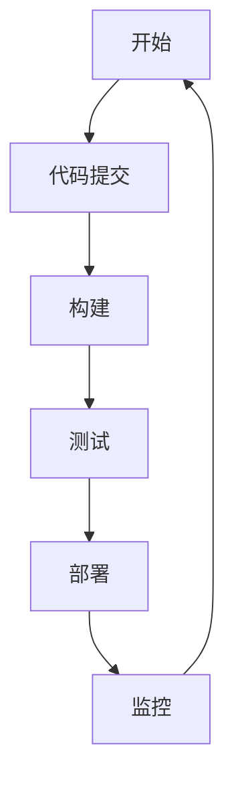
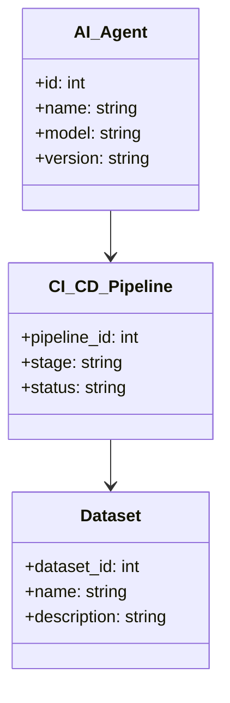
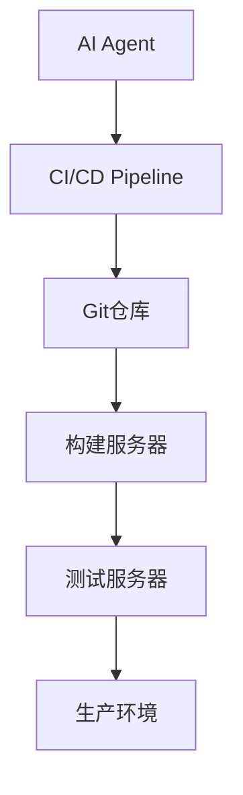
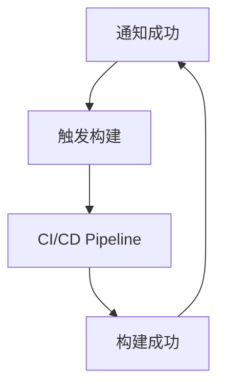

                 


# 企业AI Agent的持续集成与持续部署(CI/CD)实践

---

## 关键词

- 企业AI Agent
- 持续集成
- 持续部署
- CI/CD
- AI开发流程

---

## 摘要

企业AI Agent的持续集成与持续部署(CI/CD)实践是一篇专注于AI Agent开发中CI/CD流程的技术博客文章。文章从AI Agent的基本概念、CI/CD的核心原理、系统架构设计到实际项目实现，详细阐述了如何在企业环境中高效实施AI Agent的CI/CD流程。通过结合理论与实践，文章为读者提供了从背景知识到实战操作的全面指导，帮助企业在AI开发中实现快速迭代和高效部署。

---

## 第一部分: 企业AI Agent的持续集成与持续部署概述

### 第1章: 引言

#### 1.1 问题背景

**AI Agent的定义与分类**  
AI Agent（人工智能代理）是指能够感知环境、自主决策并执行任务的智能实体。AI Agent可以分为基于规则的代理、基于模型的代理、基于学习的代理等类型，广泛应用于推荐系统、自动驾驶、智能助手等领域。

**AI Agent在企业中的应用需求**  
随着企业数字化转型的推进，AI Agent在企业中的应用越来越广泛。例如，在金融行业，AI Agent可以用于智能投资顾问；在制造业，AI Agent可以用于智能监控和预测维护。

**CI/CD在AI开发中的重要性**  
CI/CD（持续集成与持续部署）是一种软件开发实践，通过自动化构建、测试和部署流程，确保代码的高质量交付。在AI开发中，CI/CD可以帮助团队快速验证模型变更，减少人工干预，提高开发效率。

#### 1.2 问题描述

**AI Agent开发的复杂性**  
AI Agent的开发涉及数据处理、模型训练、算法优化等多个环节，开发周期长，复杂性高。团队协作和版本管理的难度较大。

**CI/CD在AI项目中的独特挑战**  
与传统软件开发不同，AI开发中数据和模型的变更可能会影响系统的性能和结果。因此，如何在CI/CD流程中处理数据依赖、模型版本控制等问题是一个挑战。

#### 1.3 问题解决

**引入CI/CD的必要性**  
通过引入CI/CD，AI Agent的开发可以实现自动化测试、快速迭代和持续部署，从而提高开发效率和代码质量。

**AI Agent CI/CD的目标与价值**  
目标包括实现自动化测试、确保模型的稳定性和可重复性、快速交付价值。价值在于提高开发效率、降低错误率、增强团队协作。

#### 1.4 边界与外延

**AI Agent CI/CD的边界**  
AI Agent CI/CD主要关注模型开发、测试和部署，不涉及数据采集和预处理阶段。

**与其他技术的关联与区别**  
与传统CI/CD的区别在于，AI Agent需要处理模型权重、数据依赖等特殊问题。

#### 1.5 概念结构与核心要素组成

**AI Agent CI/CD的核心要素**  
包括自动化构建、自动化测试、模型版本管理、持续部署等。

**关键流程与组件的关系**  
CI/CD流程中的各个阶段（如训练、测试、部署）需要与AI Agent的开发流程无缝对接。

---

## 第二部分: AI Agent与CI/CD的核心概念

### 第2章: AI Agent的定义与特点

#### 2.1 AI Agent的定义

**AI Agent的核心功能与能力**  
AI Agent具备感知环境、自主决策、执行任务的能力。例如，智能助手可以根据用户的查询提供个性化建议。

#### 2.2 CI/CD的定义与特点

**CI/CD的定义与流程**  
CI（持续集成）是指频繁地将代码合并到主分支，并自动化执行构建和测试。CD（持续部署）是指在CI的基础上，自动将代码部署到生产环境。

**CI/CD在传统开发中的应用**  
在传统软件开发中，CI/CD通过自动化流程确保代码的高质量交付。

#### 2.3 AI Agent与CI/CD的关系

**AI Agent对CI/CD的需求**  
AI Agent的开发需要频繁的模型迭代和实验，CI/CD可以提供高效的开发和部署流程。

**CI/CD对AI Agent的支持**  
通过CI/CD，AI Agent的开发可以实现快速验证和部署，降低手动操作的风险。

---

## 第三部分: AI Agent CI/CD的算法原理

### 第3章: 算法原理

#### 3.1 算法流程概述

**CI/CD流程的总体结构**  
从代码提交、构建、测试、部署到监控，CI/CD流程贯穿AI Agent的整个生命周期。

#### 3.2 具体算法步骤

**训练阶段**  
- 数据预处理
- 模型训练
- 模型评估

**测试阶段**  
- 单元测试
- 集成测试
- 性能测试

**部署阶段**  
- 模型打包
- 部署到目标环境
- 监控和回滚

#### 3.3 算法流程图



---

## 第四部分: 系统分析与架构设计

### 第4章: 系统分析与架构设计

#### 4.1 问题场景介绍

**AI Agent CI/CD的系统场景**  
一个典型的AI Agent CI/CD系统需要处理模型训练、测试、部署等多个环节。

#### 4.2 项目介绍

**项目名称**  
企业AI Agent CI/CD平台

**项目目标**  
实现AI Agent的自动化开发和部署流程。

#### 4.3 系统功能设计

**领域模型**  


#### 4.4 系统架构设计

**系统架构图**  


#### 4.5 系统接口设计

**主要接口**  
- `/api/training`: 提交训练任务
- `/api/deployment`: 提交部署任务
- `/api/monitoring`: 获取监控数据

#### 4.6 系统交互流程

**系统交互流程图**  


---

## 第五部分: 项目实战

### 第5章: 项目实战

#### 5.1 环境安装

**安装Docker**  
```bash
sudo apt-get update && sudo apt-get install docker.io
```

**安装Jenkins**  
```bash
sudo docker run -p 8080:8080 jenkinsci/jenkins
```

#### 5.2 核心代码实现

**训练阶段代码**  
```python
import torch
class AI_Agent:
    def __init__(self):
        self.model = torch.nn.Sequential(
            torch.nn.Linear(2, 1),
            torch.nn.Sigmoid()
        )
    
    def forward(self, x):
        return self.model(x)
    
    def train(self, inputs, labels, epochs=100):
        criterion = torch.nn.BCELoss()
        optimizer = torch.optim.Adam(self.model.parameters())
        for epoch in range(epochs):
            outputs = self.forward(inputs)
            loss = criterion(outputs, labels)
            optimizer.zero_grad()
            loss.backward()
            optimizer.step()
        return self.model
```

**测试阶段代码**  
```python
def test_model(model, test_inputs, test_labels):
    with torch.no_grad():
        outputs = model.forward(test_inputs)
        correct = (outputs.round() == test_labels).sum().item()
        accuracy = correct / len(test_labels)
        return accuracy
```

#### 5.3 代码解读与分析

**训练代码解读**  
训练代码定义了一个简单的神经网络，并通过Adam优化器进行训练。代码通过多次迭代优化模型参数，以最小化损失函数。

**测试代码解读**  
测试代码在训练完成后，使用测试数据评估模型的准确性。通过比较预测结果和真实标签，计算模型的准确率。

#### 5.4 实际案例分析

**案例背景**  
假设我们正在开发一个智能客服AI Agent，用于自动回复客户的问题。

**案例实现**  
通过CI/CD管道，每次提交代码后自动触发训练和测试流程。如果测试通过，则部署到生产环境。

#### 5.5 项目小结

**项目总结**  
通过该项目，我们实现了AI Agent的自动化训练、测试和部署流程。CI/CD管道帮助我们快速验证和部署模型，提高了开发效率。

---

## 第六部分: 最佳实践

### 第6章: 最佳实践

#### 6.1 小结

**总结与回顾**  
通过本文的介绍，我们了解了AI Agent CI/CD的核心概念、算法原理和系统架构设计。同时，通过项目实战，我们掌握了如何在实际项目中应用这些技术。

#### 6.2 注意事项

**注意事项与常见问题**  
- 数据依赖管理：确保数据版本与模型版本一致
- 模型版本控制：合理管理模型的版本，避免冲突
- 环境一致性：确保开发环境和生产环境一致，避免环境偏差

#### 6.3 tips

**技巧与建议**  
- 使用容器化技术（如Docker）管理环境
- 配置自动化测试，确保模型的稳定性和可重复性
- 定期监控模型性能，及时发现和解决问题

#### 6.4 拓展阅读

**推荐阅读书籍与文章**  
- 《Continuous Delivery: Reliable Software through
[此处省略具体书籍信息，具体书籍信息请根据实际需求填写]

---

## 作者：AI天才研究院/AI Genius Institute & 禅与计算机程序设计艺术 /Zen And The Art of Computer Programming

---

本文通过系统地介绍企业AI Agent的持续集成与持续部署(CI/CD)实践，为读者提供了一个从理论到实践的完整指南。希望本文能帮助企业在AI Agent的开发中实现高效迭代和部署，推动AI技术的广泛应用。

