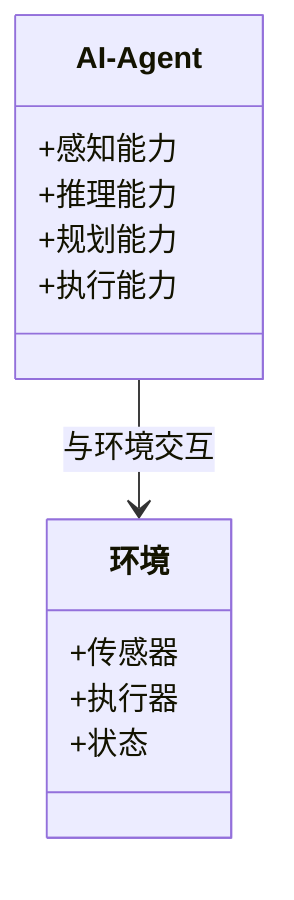
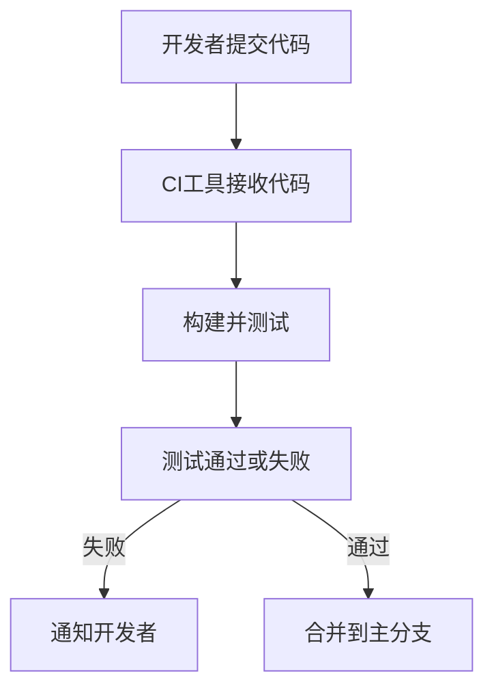
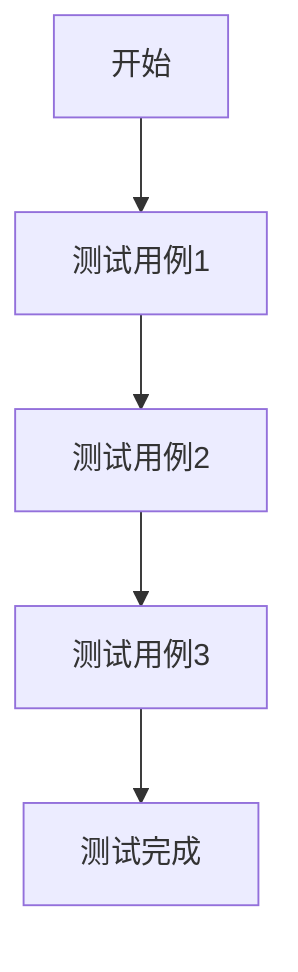
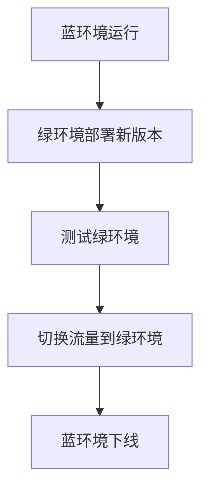

                 


# 企业AI Agent的持续集成与持续部署(CI/CD)最佳实践

## 关键词：企业AI Agent, 持续集成, 持续部署, CI/CD, AI开发, 自动化测试

## 摘要：本文详细探讨了企业AI Agent在持续集成与持续部署（CI/CD）过程中的最佳实践。从AI Agent的基本概念到CI/CD的具体实施，结合实际案例和技术细节，系统性地分析了如何高效地进行AI Agent的开发、测试和部署。文章内容包括背景介绍、核心概念与联系、算法原理讲解、系统架构设计、项目实战以及最佳实践，旨在为企业的AI开发提供指导和参考。

---

# 第一章: 企业AI Agent与CI/CD概述

## 1.1 企业AI Agent的基本概念

### 1.1.1 什么是AI Agent

AI Agent（人工智能代理）是指能够感知环境、执行任务并做出决策的智能实体。它可以是一个软件程序，也可以是嵌入硬件设备中的智能系统。AI Agent的核心功能包括感知、推理、规划和执行。

**领域模型（Mermaid）：**



### 1.1.2 AI Agent的核心功能

AI Agent的核心功能可以分为以下几个方面：

1. **感知能力**：通过传感器或数据输入接口获取环境信息。
2. **推理能力**：基于感知的信息进行逻辑推理和知识表示。
3. **规划能力**：根据推理结果制定行动计划。
4. **执行能力**：通过执行器或API将计划转化为具体操作。

### 1.1.3 AI Agent在企业中的应用场景

企业中的AI Agent应用场景广泛，包括：

1. **智能客服**：通过自然语言处理技术为用户提供24/7的在线支持。
2. **自动化运维**：利用AI Agent监控系统状态并自动修复问题。
3. **智能决策支持**：基于历史数据和实时信息为企业提供决策建议。
4. **机器人流程自动化（RPA）**：通过AI Agent实现业务流程的自动化执行。

---

## 1.2 持续集成与持续部署（CI/CD）的基本概念

### 1.2.1 CI/CD的定义

CI（持续集成）是指频繁地将代码合并到主代码库，并通过自动化构建和测试确保代码的稳定性。CD（持续部署）则是指将代码从测试环境逐步部署到生产环境，通过自动化流程确保每次部署的可靠性。

### 1.2.2 CI与CD的区别与联系

| 特性 | CI（持续集成） | CD（持续部署） |
|------|----------------|----------------|
| 目标 | 确保代码的稳定性 | 确保代码的可部署性 |
| 对象 | 代码库 | 部署环境 |
| 工具 | Git、Jenkins、GitHub Actions | Docker、Kubernetes、Terraform |

### 1.2.3 CI/CD在企业开发中的重要性

CI/CD在企业开发中的重要性体现在以下几个方面：

1. **加快开发速度**：通过自动化流程减少人工干预，加快开发周期。
2. **提高代码质量**：通过持续测试确保代码的稳定性和可靠性。
3. **降低部署风险**：通过逐步部署和回滚机制减少生产环境的故障风险。
4. **支持敏捷开发**：CI/CD流程与敏捷开发理念高度契合，支持频繁迭代和交付。

---

## 1.3 企业AI Agent与CI/CD的结合

### 1.3.1 AI Agent开发的复杂性

AI Agent的开发涉及多个复杂环节，包括数据预处理、模型训练、推理优化等。这些环节的复杂性使得传统的CI/CD流程需要进行调整和优化。

### 1.3.2 CI/CD在AI Agent开发中的作用

CI/CD在AI Agent开发中的作用主要体现在以下几个方面：

1. **自动化构建与测试**：通过CI/CD工具确保每次代码提交都能快速构建和测试，减少集成风险。
2. **版本控制与回滚**：通过版本控制确保每次部署都是可追溯的，并通过回滚机制快速修复问题。
3. **环境一致性**：通过统一的CI/CD管道确保不同环境（开发、测试、生产）之间的一致性，减少环境依赖问题。

### 1.3.3 企业级AI Agent CI/CD的挑战

企业级AI Agent CI/CD面临以下挑战：

1. **数据依赖性**：AI Agent的开发通常依赖大量数据，数据的获取和处理可能会影响CI/CD流程。
2. **模型迭代**：AI模型需要频繁迭代优化，如何将模型迭代集成到CI/CD流程中是一个挑战。
3. **资源消耗**：AI Agent的构建和测试通常需要大量计算资源，如何优化资源使用是关键。

---

## 1.4 本章小结

本章介绍了企业AI Agent的基本概念、核心功能以及应用场景，并详细探讨了CI/CD的基本概念和在AI Agent开发中的作用。同时，分析了企业级AI Agent CI/CD的挑战，为后续章节的深入讨论奠定了基础。

---

# 第二章: AI Agent的持续集成实践

## 2.1 AI Agent开发的CI流程

### 2.1.1 代码提交与版本控制

AI Agent的开发需要使用版本控制工具（如Git）进行代码管理。开发者需要将代码提交到代码库，并确保每次提交都通过CI工具进行自动化构建和测试。

**代码提交流程（Mermaid）：**



### 2.1.2 自动化构建与测试

CI流程的核心是自动化构建和测试。构建阶段需要将代码编译成可执行的程序，测试阶段需要运行自动化测试用例，确保代码的正确性。

**测试流程示例（Python代码）：**

```python
def test_ai_agent():
    agent = AI-Agent()
    assert agent.inference("test input") == "expected output"
```

### 2.1.3 CI工具的选择与配置

选择合适的CI工具是实现AI Agent CI流程的关键。常用的CI工具包括Jenkins、GitHub Actions和CircleCI。选择时需要考虑工具的功能、集成能力和扩展性。

---

## 2.2 AI Agent的自动化测试

### 2.2.1 单元测试与集成测试

自动化测试是CI流程的重要组成部分。单元测试用于验证单个模块的功能，集成测试用于验证多个模块之间的协作。

**测试类型对比表：**

| 测试类型 | 目的 | 范围 | 工具 |
|----------|------|------|------|
| 单元测试 | 验证单个模块的功能 | 单个模块 | pytest、unittest |
| 集成测试 | 验证模块之间的协作 | 多个模块 | pytest、unittest |

### 2.2.2 测试用例的设计与实现

设计测试用例时需要考虑不同的场景，包括正常情况、边界情况和异常情况。测试用例的实现需要确保覆盖所有关键路径。

**测试用例示例（Mermaid）：**



### 2.2.3 测试报告的生成与分析

CI工具可以生成详细的测试报告，包括测试结果、错误日志和性能指标。分析测试报告可以帮助开发者快速定位问题并优化代码。

---

## 2.3 CI/CD管道的构建

### 2.3.1 管道设计的基本原则

CI/CD管道设计需要遵循以下原则：

1. **可重复性**：确保每次运行的环境和步骤一致。
2. **可扩展性**：支持不同环境和不同阶段的部署。
3. **可追溯性**：记录每次运行的结果和日志，便于问题排查。

### 2.3.2 管道工具的选择与配置

选择管道工具时需要考虑其功能、集成能力和扩展性。常用的管道工具包括Jenkins、GitHub Actions和CircleCI。

### 2.3.3 管道的配置与优化

管道的配置需要考虑资源分配、步骤顺序和依赖关系。优化管道可以减少构建和测试的时间，提高效率。

**管道配置示例（YAML）：**

```yaml
jobs:
  build_and_test:
    runs-on: ubuntu-latest
    steps:
      - uses: actions/checkout@v2
      - run: pip install -r requirements.txt
      - run: pytest tests/
```

---

## 2.4 本章小结

本章详细探讨了AI Agent的持续集成实践，包括代码提交与版本控制、自动化构建与测试以及CI/CD管道的构建。通过合理的工具选择和流程设计，可以显著提高AI Agent开发的效率和质量。

---

# 第三章: AI Agent的持续部署与交付

## 3.1 持续部署的核心流程

### 3.1.1 部署环境的管理

持续部署需要管理多个环境，包括开发、测试、预发布和生产环境。每个环境的配置需要一致，并通过版本控制工具进行管理。

### 3.1.2 部署策略的选择

常用的部署策略包括蓝绿部署、滚动部署和 Canary 部署。选择合适的策略需要考虑系统的可用性、风险承受能力和业务需求。

**部署策略对比表：**

| 部署策略 | 特点 | 适用场景 |
|----------|------|----------|
| 蓝绿部署 | 风险低，回滚快 | 高风险系统 |
| 滚动部署 | 逐步替换，风险可控 | 中等风险系统 |
| Canary 部署 | 部分用户先体验，逐步推广 | 低风险系统 |

### 3.1.3 部署过程的自动化

持续部署的核心是自动化。通过工具实现从测试环境到生产环境的自动化部署，确保每次部署的可靠性。

---

## 3.2 AI Agent的蓝绿部署

### 3.2.1 蓝绿部署的原理

蓝绿部署是一种零停机部署策略。通过维护两套完全相同的环境（蓝环境和绿环境），将流量从一个环境切换到另一个环境，实现平滑过渡。

**蓝绿部署流程（Mermaid）：**



### 3.2.2 蓝绿部署的实施步骤

1. **准备绿环境**：将新版本部署到绿环境，并进行测试。
2. **切换流量**：将用户流量从蓝环境切换到绿环境。
3. **监控和回滚**：监控绿环境的运行状态，如有问题立即回滚到蓝环境。

### 3.2.3 蓝绿部署的风险与应对

蓝绿部署的主要风险包括资源消耗和环境切换的复杂性。应对措施包括：

1. **资源优化**：合理规划资源使用，避免浪费。
2. **自动化监控**：通过自动化工具实时监控部署状态，快速发现问题。
3. **回滚机制**：确保在出现问题时能够快速回滚到稳定版本。

---

## 3.3 部署监控与回滚机制

### 3.3.1 监控指标的定义

监控指标需要涵盖系统的可用性、性能和安全性。常用的监控指标包括响应时间、错误率和资源使用率。

### 3.3.2 监控工具的选择与配置

常用的监控工具包括Prometheus、Grafana和ELK（Elasticsearch, Logstash, Kibana）。选择工具时需要考虑其功能、扩展性和易用性。

### 3.3.3 回滚机制的实现

回滚机制需要确保在出现问题时能够快速恢复到稳定版本。实现回滚机制需要依赖版本控制和部署工具。

---

## 3.4 本章小结

本章详细探讨了AI Agent的持续部署与交付，包括部署环境的管理、部署策略的选择以及蓝绿部署的实施。通过自动化部署和监控机制，可以显著提高部署的效率和可靠性。

---

# 第四章: AI Agent的自动化测试框架

## 4.1 自动化测试框架的设计

### 4.1.1 测试框架的组成

自动化测试框架通常包括测试用例管理、测试执行和测试报告生成三个部分。设计测试框架时需要考虑其可扩展性和可维护性。

### 4.1.2 测试框架的选择与实现

选择测试框架时需要考虑其功能、集成能力和扩展性。常用的测试框架包括pytest和unittest。

### 4.1.3 测试框架的扩展性设计

测试框架的扩展性设计需要确保能够支持不同类型的测试用例和不同的测试环境。

---

## 4.2 测试用例的管理与执行

### 4.2.1 测试用例的分类与管理

测试用例需要按照功能模块和测试场景进行分类管理。可以通过配置文件或数据库实现测试用例的动态加载。

### 4.2.2 测试用例的执行

测试用例的执行需要通过自动化工具实现。执行过程中需要记录测试结果和错误信息，便于后续分析。

### 4.2.3 测试报告的生成与分析

测试报告需要包含测试结果、错误日志和性能指标。通过分析测试报告可以快速定位问题并优化测试用例。

---

## 4.3 本章小结

本章详细探讨了AI Agent的自动化测试框架设计与实现，包括测试框架的组成、测试用例的管理和测试报告的生成。通过合理的测试框架设计，可以显著提高测试效率和质量。

---

# 作者：AI天才研究院 & 禅与计算机程序设计艺术

---

以上是《企业AI Agent的持续集成与持续部署(CI/CD)最佳实践》的技术博客文章的目录和内容概要。通过系统性的分析和详细的技术讲解，本文旨在为企业AI Agent的开发和部署提供实践指导和参考。

