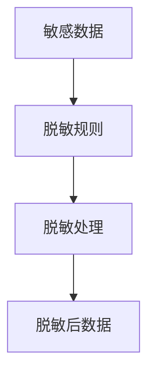
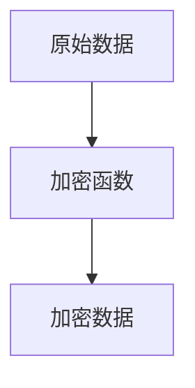
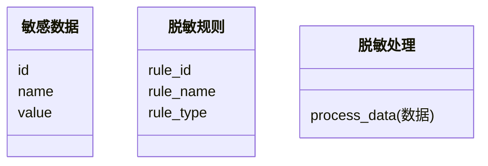
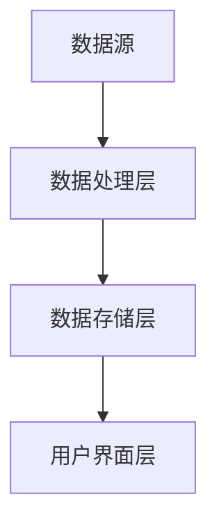

                 


# 企业AI Agent的敏感信息处理：脱敏技术与实践

## 关键词：
企业AI Agent, 敏感信息处理, 数据脱敏, AI技术, 数据安全, 信息处理, 脱敏技术

## 摘要：
随着企业AI Agent的广泛应用，敏感信息的保护变得尤为重要。本文深入探讨了企业AI Agent在处理敏感信息时所面临的挑战，重点介绍了脱敏技术的核心原理、算法实现、系统架构设计以及实际应用案例。通过详细分析脱敏技术的关键点，本文为读者提供了一套完整的解决方案，帮助企业在保障数据安全的同时，充分利用AI技术的优势。

---

# 第一章：企业AI Agent与敏感信息处理概述

## 1.1 问题背景
### 1.1.1 数据泄露的现状与挑战
近年来，数据泄露事件频发，给企业和个人带来了巨大的损失。企业AI Agent在处理大量敏感数据时，如何确保数据安全成为亟待解决的问题。

### 1.1.2 AI Agent在企业中的广泛应用
AI Agent作为企业智能化转型的重要工具，广泛应用于客服、推荐系统等领域。然而，其对敏感信息的处理也带来了安全隐患。

### 1.1.3 敏感信息处理的重要性
敏感信息的泄露可能导致企业声誉受损、法律风险增加。因此，如何有效处理敏感信息成为企业的重要课题。

## 1.2 问题描述
### 1.2.1 敏感信息的定义与分类
敏感信息包括个人信息、财务数据等，其泄露可能导致严重后果。

### 1.2.2 AI Agent处理敏感信息的场景
AI Agent在客户服务、数据分析等场景中处理大量敏感信息，增加了数据泄露的风险。

### 1.2.3 数据脱敏的必要性
数据脱敏是保护敏感信息的关键技术，通过脱敏处理，可以有效降低数据泄露的风险。

## 1.3 问题解决
### 1.3.1 数据脱敏的目标与原则
数据脱敏的目标是保留数据的可用性，同时消除敏感信息。其原则包括可逆性、不可逆性等。

### 1.3.2 AI Agent在脱敏中的作用
AI Agent通过自动化处理，可以提高数据脱敏的效率和准确性。

### 1.3.3 脱敏技术的核心方法
包括数据加密、数据替换、数据变形等方法。

## 1.4 边界与外延
### 1.4.1 脱敏技术的适用范围
适用于保护敏感数据，但不适用于需要保留原始数据的场景。

### 1.4.2 脱敏与匿名化的区别
脱敏技术注重数据的可用性，而匿名化注重数据的不可识别性。

### 1.4.3 脱敏技术的未来发展
随着技术的进步，脱敏技术将更加智能化和多样化。

---

# 第二章：脱敏技术的核心概念与联系

## 2.1 脱敏技术的原理
### 2.1.1 数据加密脱敏
通过加密算法对敏感数据进行处理，确保数据在传输和存储过程中的安全性。

### 2.1.2 数据替换脱敏
用虚拟数据替换敏感信息，如用虚拟姓名替换真实姓名。

### 2.1.3 数据变形脱敏
对数据进行格式化处理，如将日期格式化为特定格式。

## 2.2 核心概念对比表
| 概念 | 描述 |
|------|------|
| 数据分类 | 根据敏感程度对数据进行分类 |
| 脱敏方法 | 数据加密、数据替换、数据变形 |
| 保留数据特性 | 脱敏后数据的可用性、一致性 |

## 2.3 ER实体关系图


---

# 第三章：脱敏算法原理

## 3.1 数据加密脱敏算法
### 3.1.1 加密脱敏流程


### 3.1.2 加密函数实现
```python
def encrypt(data):
    # 加密算法实现
    return encrypted_data
```

### 3.1.3 加密函数的数学模型
$$ encrypted\_data = f(data) $$

### 3.1.4 解密函数的实现
```python
def decrypt(encrypted_data):
    # 解密算法实现
    return original_data
```

### 3.1.5 解密函数的数学模型
$$ original\_data = f^{-1}(encrypted\_data) $$

---

# 第四章：系统分析与架构设计

## 4.1 系统功能设计
### 4.1.1 领域模型


### 4.1.2 系统架构设计


### 4.1.3 系统交互设计
```mermaid
sequenceDiagram
    User -> 数据源: 请求数据
    数据源 -> 数据处理层: 提供原始数据
    数据处理层 -> 数据存储层: 存储脱敏数据
    数据存储层 -> 用户界面层: 返回脱敏数据
    User <- 用户界面层: 显示脱敏数据
```

---

# 第五章：项目实战

## 5.1 环境安装
安装Python和相关库，如pandas、numpy等。

## 5.2 核心代码实现
### 5.2.1 数据脱敏实现
```python
def data_obfuscation(df, columns):
    for col in columns:
        # 加密处理
        df[col] = df[col].apply(encrypt)
    return df
```

### 5.2.2 数据恢复实现
```python
def data_recovery(df, columns):
    for col in columns:
        # 解密处理
        df[col] = df[col].apply(decrypt)
    return df
```

## 5.3 实际案例分析
通过一个客户数据脱敏的案例，展示脱敏前后的数据变化。

---

# 第六章：最佳实践

## 6.1 关键点总结
### 6.1.1 技术选型
根据需求选择合适的脱敏技术。

### 6.1.2 数据分类
根据数据敏感程度制定分类策略。

### 6.1.3 脱敏规则设计
制定合理的脱敏规则，确保数据可用性。

### 6.1.4 系统安全性
确保系统设计的安全性，防止脱敏数据被逆向恢复。

## 6.2 注意事项
### 6.2.1 数据恢复的难度
脱敏后的数据恢复需要特定的规则和算法。

### 6.2.2 脱敏规则变更的复杂性
规则的变更可能影响系统的整体处理流程。

## 6.3 拓展阅读
推荐相关书籍和文献，供读者深入学习。

---

# 结论

企业AI Agent的敏感信息处理是一个复杂的系统工程，脱敏技术在其中扮演着关键角色。通过本文的分析和实践，读者可以全面了解脱敏技术的核心原理和应用方法，为企业构建安全的数据处理系统提供参考。

---

作者：AI天才研究院 & 禅与计算机程序设计艺术

