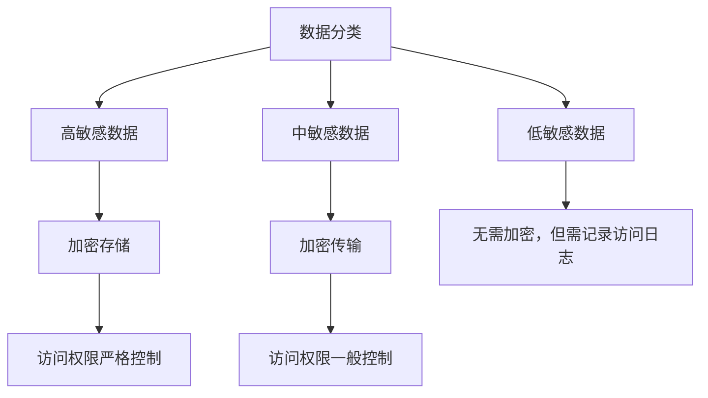
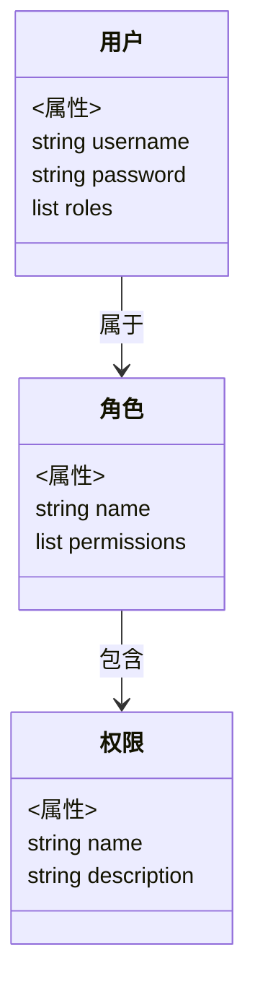
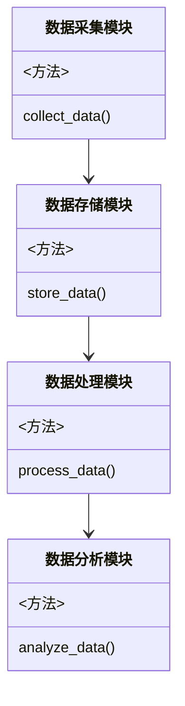
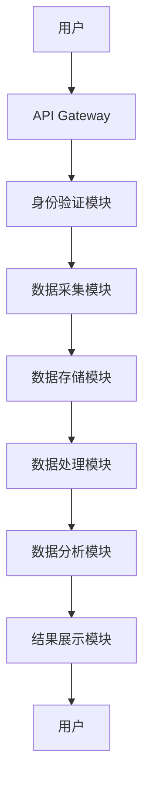

                 


# 企业AI Agent的数据安全策略

## 关键词
企业AI Agent, 数据安全, 加密技术, 访问控制, 隐私保护

## 摘要
随着企业越来越依赖AI Agent来处理和分析数据，数据安全问题变得至关重要。本文详细探讨了企业AI Agent在数据安全方面的策略，涵盖了数据安全的核心概念、技术实现、系统架构设计以及实战案例分析。通过深入分析数据加密、访问控制和隐私保护等关键领域，本文为企业AI Agent的安全策略提供了全面的指导和实践建议。

---

# 第一部分: 企业AI Agent的数据安全背景与挑战

## 第1章: 企业AI Agent概述

### 1.1 什么是AI Agent
#### 1.1.1 AI Agent的定义
AI Agent（人工智能代理）是指一种能够感知环境、自主决策并执行任务的智能系统。它通常通过传感器或API接口获取数据，并利用机器学习算法进行分析和推理，从而实现特定目标。

#### 1.1.2 AI Agent的核心特征
- **自主性**：能够在没有外部干预的情况下完成任务。
- **反应性**：能够实时感知环境变化并做出响应。
- **学习能力**：通过数据和反馈不断优化自身的性能。
- **可扩展性**：能够处理不同类型和规模的数据。

#### 1.1.3 企业AI Agent的独特性
企业AI Agent通常用于内部业务流程优化、客户交互和服务自动化。与通用AI Agent相比，企业AI Agent更加注重数据的隐私性和安全性。

---

## 第2章: 数据安全的重要性与挑战

### 2.1 数据安全的基本概念
#### 2.1.1 数据安全的定义
数据安全是指通过技术手段保护数据的机密性、完整性和可用性，防止未经授权的访问、泄露或篡改。

#### 2.1.2 数据安全的关键要素
- **机密性**：确保只有授权人员能够访问敏感数据。
- **完整性**：保证数据在存储和传输过程中不被篡改。
- **可用性**：确保合法用户能够正常访问数据。

#### 2.1.3 数据安全的分类
- **物理安全**：保护数据的物理载体（如服务器、存储设备）不被破坏或盗窃。
- **网络安全**：防止网络攻击和数据泄露。
- **应用安全**：确保应用程序的安全性，防止漏洞被利用。

### 2.2 企业AI Agent中的数据安全挑战
#### 2.2.1 数据泄露风险
企业AI Agent通常处理大量敏感数据，如客户信息、交易记录等。如果这些数据被未经授权的第三方访问，可能导致严重的经济损失和声誉损害。

#### 2.2.2 数据隐私保护
随着《通用数据保护条例》（GDPR）等法律法规的出台，企业必须确保AI Agent在处理个人数据时符合隐私保护要求。

#### 2.2.3 第三方数据源的安全性
企业AI Agent often relies on external data sources, such as third-party APIs or cloud services. These sources may introduce vulnerabilities if they are not properly secured.

---

# 第二部分: 企业AI Agent数据安全的核心概念与联系

## 第3章: 数据安全与AI Agent的关系

### 3.1 数据安全对AI Agent的影响
#### 3.1.1 数据安全如何影响AI Agent的性能
- 数据安全措施可能会增加AI Agent的处理延迟。
- 过度的安全措施可能导致AI Agent无法正常获取所需的数据。

#### 3.1.2 数据安全对AI Agent的依赖性
- AI Agent通常依赖数据来进行决策，因此数据安全直接影响其性能。
- 数据安全措施需要与AI Agent的设计紧密结合，而不是事后补丁。

#### 3.1.3 数据安全与AI Agent的交互模式
- **数据加密**：AI Agent在处理数据之前需要对数据进行加密或解密。
- **访问控制**：AI Agent需要根据用户的权限来决定数据的访问权限。
- **数据隐私保护**：AI Agent需要在处理数据时保护用户的隐私。

### 3.2 数据安全与企业AI Agent的实体关系图
```mermaid
erDiagram
    actor 用户
    actor 第三方服务
    actor 系统管理员
    database 数据库
    boundary AI Agent
    actor 政策制定者
    用户 --> 政策制定者 : 遵守数据安全政策
    用户 --> AI Agent : 提供数据
    AI Agent --> 数据库 : 存储数据
    第三方服务 --> 数据库 : 提供数据
    系统管理员 --> 数据库 : 管理数据
    政策制定者 --> 系统管理员 : 制定数据安全政策
```

---

## 第4章: 数据安全的核心概念与原理

### 4.1 数据安全的核心原理
#### 4.1.1 数据加密原理
数据加密通过将明文转换为密文，防止未经授权的人员读取数据。常见的加密算法包括AES（高级加密标准）和RSA（公钥加密算法）。

#### 4.1.2 数据访问控制原理
数据访问控制通过身份验证、授权和审计等手段，确保只有授权用户能够访问特定数据。

#### 4.1.3 数据完整性保障
数据完整性通过校验码、哈希函数等技术，确保数据在存储和传输过程中不被篡改。

### 4.2 数据分类与安全策略
企业需要根据数据的重要性、敏感性和法律法规的要求，对数据进行分类，并制定相应的安全策略。以下是一个数据分类的决策树示例：



---

# 第三部分: 企业AI Agent数据安全的技术实现

## 第5章: 数据加密技术

### 5.1 常见加密算法
#### 5.1.1 AES加密
AES（高级加密标准）是一种常用的块加密算法，支持128、192和256位密钥长度。以下是一个AES加密的Python代码示例：

```python
from cryptography.hazmat.primitives.ciphers import Cipher, algorithms, modes
from cryptography.hazmat.primitives.asymmetric import padding
import os

# 生成随机密钥
key = os.urandom(16)
cipher = Cipher(algorithms.AES(key), modes.ECB())
encryptor = cipher.encryptor()

# 加密明文
plaintext = b"Hello, World!"
ciphertext = encryptor.update(plaintext) + encryptor.finalize()
print("加密后的数据:", ciphertext)

# 解密
decryptor = cipher.decryptor()
decrypted = decryptor.update(ciphertext) + decryptor.finalize()
print("解密后的数据:", decrypted.decode())
```

#### 5.1.2 RSA加密
RSA是一种公钥加密算法，常用于数字签名和公钥交换。以下是一个RSA加密的Python代码示例：

```python
from cryptography.hazmat.primitives.asymmetric import rsa, padding
from cryptography.hazmat.primitives import hashes

# 生成RSA密钥对
private_key = rsa.generate_private_key(
    public_exponent=65537,
    key_size=2048,
)
public_key = private_key.public_key()

# 加密数据
message = b"Hello, World!"
cipher_text = public_key.encrypt(
    message,
    padding.PaddingScheme.PKCS1v1_5(),
)
print("加密后的数据:", cipher_text)

# 解密数据
original_message = private_key.decrypt(cipher_text)
print("解密后的数据:", original_message.decode())
```

---

## 第6章: 数据访问控制策略

### 6.1 基于角色的访问控制（RBAC）
RBAC是一种常见的访问控制模型，通过角色和权限的分配来控制用户对资源的访问。以下是一个RBAC模型的类图示例：



以下是一个RBAC的Python代码示例：

```python
class Role:
    def __init__(self, name, permissions):
        self.name = name
        self.permissions = permissions

class Permission:
    def __init__(self, name, description):
        self.name = name
        self.description = description

class User:
    def __init__(self, username, password, roles):
        self.username = username
        self.password = password
        self.roles = roles

    def has_permission(self, permission_name):
        for role in self.roles:
            if permission_name in role.permissions:
                return True
        return False
```

---

## 第7章: 数据隐私保护技术

### 7.1 数据脱敏技术
数据脱敏是指在不影响数据使用的情况下，对敏感数据进行变形处理，使其无法还原出真实数据。以下是一个数据脱敏的Python代码示例：

```python
def mask_credit_card_number(card_number):
    # 脱敏处理，保留前4位和最后4位，中间用星号替换
    masked = card_number[:4] + "****" + card_number[-4:]
    return masked

print(mask_credit_card_number("1234567890123456"))  # 输出: 1234****56
```

### 7.2 数据匿名化技术
数据匿名化是指通过技术手段去除或修改数据中的个人信息，使其无法重新识别特定个人。以下是一个数据匿名化的Python代码示例：

```python
import pandas as pd
import numpy as np

def anonymize_data(df):
    # 删除敏感列
    df = df.drop(columns=['name', 'email', 'phone'])
    # 修改剩余列的值，使其无法还原
    df['age'] = np.random.randint(18, 100, df.shape[0])
    df['income'] = np.random.uniform(30000, 150000, df.shape[0]).round(0)
    return df

# 示例数据
data = {
    'name': ['Alice', 'Bob', 'Charlie'],
    'email': ['alice@example.com', 'bob@example.com', 'charlie@example.com'],
    'phone': ['123-456-7890', '234-567-8901', '345-678-9012'],
    'age': [25, 30, 35],
    'income': [60000, 80000, 70000]
}

df = pd.DataFrame(data)
anonymized_df = anonymize_data(df)
print(anonymized_df)
```

---

# 第四部分: 企业AI Agent数据安全的系统设计与实战

## 第8章: 企业AI Agent系统架构设计

### 8.1 系统功能设计
企业AI Agent系统通常包括以下几个功能模块：



### 8.2 系统架构设计
以下是一个企业AI Agent系统的总体架构图：



---

## 第9章: 项目实战

### 9.1 环境安装
为了实现企业AI Agent的数据安全策略，我们需要以下环境：

- Python 3.8+
- pip
- cryptography库
- pandas库
- mermaid图生成工具

安装命令：
```bash
pip install cryptography pandas
```

### 9.2 核心代码实现

#### 9.2.1 数据加密模块
```python
from cryptography.hazmat.primitives.ciphers import Cipher, algorithms, modes
from cryptography.hazmat.primitives.asymmetric import padding
import os

# 生成随机密钥
key = os.urandom(16)
cipher = Cipher(algorithms.AES(key), modes.ECB())
encryptor = cipher.encryptor()

# 加密明文
plaintext = b"Hello, World!"
ciphertext = encryptor.update(plaintext) + encryptor.finalize()
print("加密后的数据:", ciphertext)

# 解密
decryptor = cipher.decryptor()
decrypted = decryptor.update(ciphertext) + decryptor.finalize()
print("解密后的数据:", decrypted.decode())
```

#### 9.2.2 数据访问控制模块
```python
class Role:
    def __init__(self, name, permissions):
        self.name = name
        self.permissions = permissions

class Permission:
    def __init__(self, name, description):
        self.name = name
        self.description = description

class User:
    def __init__(self, username, password, roles):
        self.username = username
        self.password = password
        self.roles = roles

    def has_permission(self, permission_name):
        for role in self.roles:
            if permission_name in role.permissions:
                return True
        return False
```

### 9.3 案例分析

#### 9.3.1 数据分类与安全策略
以下是一个数据分类与安全策略的案例分析：


#### 9.3.2 数据脱敏与匿名化
以下是一个数据脱敏与匿名化的案例分析：

```python
def mask_credit_card_number(card_number):
    # 脱敏处理，保留前4位和最后4位，中间用星号替换
    masked = card_number[:4] + "****" + card_number[-4:]
    return masked

print(mask_credit_card_number("1234567890123456"))  # 输出: 1234****56
```

---

# 第五部分: 总结与展望

## 第10章: 总结与展望

### 10.1 总结
企业AI Agent的数据安全策略是一个复杂而重要的任务，需要从数据加密、访问控制、隐私保护等多个方面进行综合考虑。通过合理的设计和实现，企业可以有效保护数据的安全性，同时确保AI Agent的正常运行。

### 10.2 未来展望
随着AI技术的不断发展，企业AI Agent的数据安全策略也将面临新的挑战。未来的研究方向包括：
- **AI安全治理**：如何在AI Agent中实现更加智能化的安全治理。
- **零信任架构**：如何在AI Agent中实现零信任模型，确保数据的安全访问。
- **隐私计算**：如何在AI Agent中实现更加严格的隐私保护，如联邦学习和多方计算。

---

# 作者：AI天才研究院 & 禅与计算机程序设计艺术

---

希望这篇文章能够为您提供关于企业AI Agent数据安全策略的深入见解，并为您的实践提供有价值的参考！

