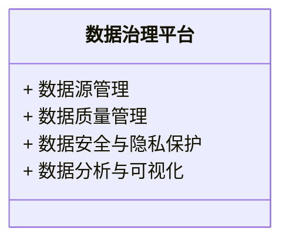
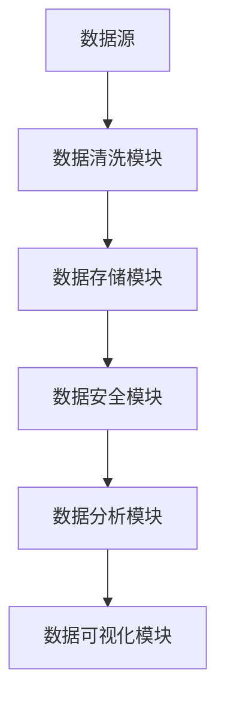
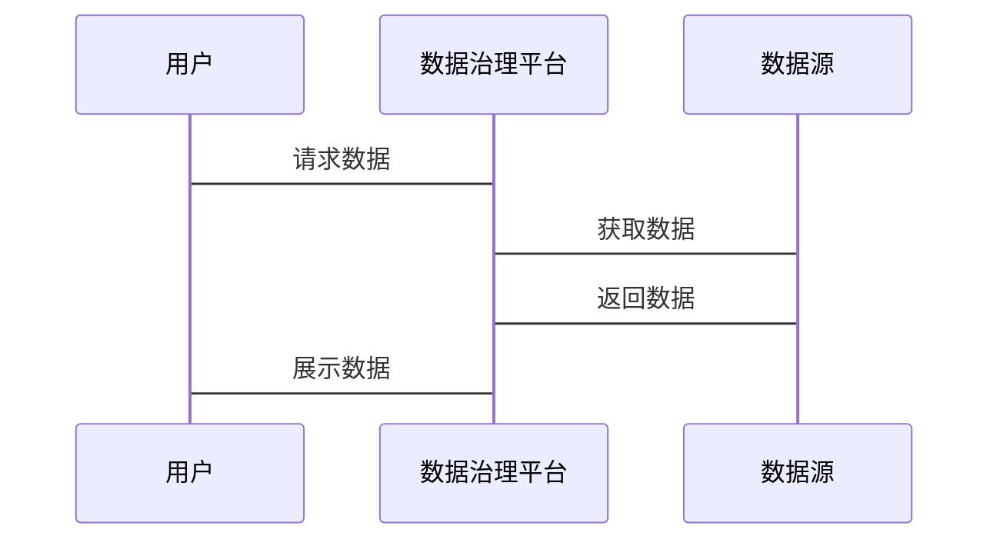

                 


# 企业AI Agent的数据治理框架

> 关键词：企业AI Agent、数据治理、数据分类、数据质量管理、数据安全、隐私保护

> 摘要：随着人工智能技术的快速发展，企业AI Agent在各个行业的应用越来越广泛。然而，AI Agent的有效运行离不开高质量的数据支持。本文将详细探讨企业AI Agent在数据治理方面的框架，包括数据分类与分级、数据质量管理、数据安全与隐私保护等方面。通过实际案例分析和系统架构设计，本文将为企业在AI Agent时代提供一份完整的数据治理解决方案。

---

# 第一部分: 企业AI Agent与数据治理概述

## 第1章: 企业AI Agent的概述

### 1.1 什么是企业AI Agent

企业AI Agent（Artificial Intelligence Agent）是一种能够感知环境、执行任务并做出决策的智能体。它通过数据输入、模型推理和输出结果来完成特定任务。企业AI Agent广泛应用于金融、医疗、物流等领域，帮助企业在自动化、智能化方面取得突破。

**AI Agent的核心特征：**
1. **自主性**：能够在没有人工干预的情况下运行。
2. **反应性**：能够根据环境变化调整行为。
3. **目标导向**：通过目标驱动执行任务。

### 1.2 企业AI Agent的应用场景

企业AI Agent的应用场景可以分为以下几类：
1. **客户服务**：智能客服机器人通过自然语言处理技术为用户提供支持。
2. **风险管理**：在金融领域，AI Agent可以实时监控市场波动，识别潜在风险。
3. **供应链管理**：通过AI Agent优化物流路径，降低运营成本。
4. **决策支持**：AI Agent可以分析数据，为管理层提供决策依据。

### 1.3 数据在企业AI Agent中的重要性

数据是AI Agent的核心资源，数据的质量直接影响AI Agent的性能和决策能力。高质量的数据能够帮助AI Agent做出更准确的预测和决策，而低质量的数据可能导致错误的结果。

---

## 第2章: 数据治理的背景与重要性

### 2.1 数据治理的基本概念

数据治理是指对数据的全生命周期进行管理，包括数据的采集、存储、处理、分析和应用。数据治理的目标是确保数据的完整性、一致性、准确性和安全性。

### 2.2 数据治理的核心目标

数据治理的核心目标包括：
1. **数据质量管理**：确保数据的准确性、完整性和一致性。
2. **数据安全与隐私保护**：防止数据泄露和未经授权的访问。
3. **数据可用性**：确保数据在需要时可以被访问和使用。

### 2.3 数据治理在企业AI Agent中的重要性

在企业AI Agent中，数据治理的重要性体现在以下几个方面：
1. **数据质量**：高质量的数据是AI模型准确预测的基础。
2. **数据安全**：防止数据泄露和滥用，保护企业核心资产。
3. **数据合规性**：确保数据的使用符合相关法律法规。

---

## 第3章: 企业AI Agent与数据治理的关系

### 3.1 AI Agent与数据治理的结合点

企业AI Agent与数据治理的结合点主要体现在数据的采集、处理和应用阶段。例如，在数据采集阶段，数据治理可以确保数据的来源可靠；在数据处理阶段，数据治理可以确保数据的清洗和预处理符合要求；在数据应用阶段，数据治理可以确保AI模型的输出结果合规。

### 3.2 数据治理在AI Agent中的作用

数据治理在企业AI Agent中的作用主要体现在以下几个方面：
1. **数据质量管理**：确保AI Agent使用的数据准确无误。
2. **数据安全与隐私保护**：防止数据泄露和滥用。
3. **数据标准化**：确保不同数据源的数据格式一致，便于AI Agent处理。

### 3.3 企业AI Agent数据治理的必要性

随着企业AI Agent的应用越来越广泛，数据治理的必要性也日益凸显。企业AI Agent的决策依赖于数据，而数据的质量和安全性直接影响到AI Agent的性能和企业的声誉。因此，建立有效的数据治理框架是企业AI Agent成功应用的前提。

---

# 第二部分: 数据治理的核心概念与框架

## 第4章: 数据分类与分级

### 4.1 数据分类的定义与方法

数据分类是将数据按照特定的属性或特征进行分组的过程。常见的数据分类方法包括基于数据类型、数据来源、数据用途等。

**数据分类的步骤：**
1. **确定分类标准**：根据企业的需求选择分类标准。
2. **数据分组**：将数据按照分类标准进行分组。
3. **验证分类结果**：确保分类结果符合预期。

### 4.2 数据分级的标准与流程

数据分级是根据数据的重要性和敏感性对数据进行分类的过程。数据分级的标准通常包括数据的价值、数据的敏感性、数据的使用范围等。

**数据分级的流程：**
1. **确定分级标准**：根据企业的数据策略制定分级标准。
2. **数据评估**：对数据进行评估，确定数据的级别。
3. **数据标记**：为数据添加标记，便于后续管理和使用。

### 4.3 数据分类与分级的实际案例

以金融行业为例，企业可以通过数据分类与分级来管理客户数据。例如，将客户分为普通客户、VIP客户和高风险客户，并根据客户类型制定不同的数据访问权限和处理流程。

---

## 第5章: 数据质量管理

### 5.1 数据质量评估指标

数据质量评估指标是衡量数据质量的重要依据，常见的数据质量评估指标包括完整性、准确性、一致性、及时性和唯一性。

### 5.2 数据清洗与预处理

数据清洗是通过去除或修正数据中的错误和不一致部分，确保数据质量的过程。数据预处理是将数据转换为适合AI模型处理的形式。

**数据清洗的步骤：**
1. **数据去重**：去除重复数据。
2. **数据标准化**：将数据转换为统一的格式。
3. **数据转换**：将数据转换为适合模型输入的形式。

### 5.3 数据清洗的实际案例

以电商行业为例，企业可以通过数据清洗来处理订单数据中的重复订单和无效订单，确保数据的准确性和完整性。

---

## 第6章: 数据安全与隐私保护

### 6.1 数据安全的基本原则

数据安全的基本原则包括数据的机密性、完整性和可用性。企业需要通过技术手段和管理措施来确保数据的安全。

### 6.2 数据隐私保护的法律与规范

数据隐私保护的法律和规范包括《通用数据保护条例》（GDPR）等，企业需要遵守相关法律法规，保护用户隐私。

### 6.3 数据安全与隐私保护的技术措施

企业可以通过加密技术、访问控制、数据脱敏等技术措施来保护数据的安全和隐私。

---

# 第三部分: 数据治理的算法与数学模型

## 第7章: 数据清洗算法

### 7.1 数据清洗的流程

数据清洗的流程包括数据去重、数据标准化、数据转换等步骤。

**数据去重的算法实现：**
```python
import pandas as pd

# 读取数据
data = pd.read_csv('data.csv')

# 去除重复数据
data.drop_duplicates(inplace=True)

# 保存清洗后的数据
data.to_csv('clean_data.csv', index=False)
```

### 7.2 数据清洗的数学模型

数据清洗的数学模型可以通过数据去重、数据标准化等过程进行建模。

**数据标准化的公式：**
$$
\text{标准化公式} = \frac{x - \mu}{\sigma}
$$
其中，$\mu$是数据的均值，$\sigma$是数据的标准差。

---

## 第8章: 数据特征工程

### 8.1 数据特征工程的定义

数据特征工程是通过提取、创建和选择特征，提高模型性能的过程。

### 8.2 数据特征工程的步骤

数据特征工程的步骤包括特征提取、特征创建、特征选择等。

**特征提取的实现：**
```python
import pandas as pd
from sklearn.decomposition import PCA

# 读取数据
data = pd.read_csv('data.csv')

# 提取特征
pca = PCA(n_components=2)
principal_components = pca.fit_transform(data)
```

### 8.3 数据特征工程的实际案例

以金融领域的欺诈检测为例，企业可以通过数据特征工程提取交易金额、交易时间等特征，提高欺诈检测模型的准确性。

---

# 第四部分: 系统分析与架构设计方案

## 第9章: 企业AI Agent数据治理平台的设计

### 9.1 项目介绍

企业AI Agent数据治理平台是一个用于管理和治理企业AI Agent所需数据的平台，旨在提高数据质量，确保数据安全。

### 9.2 系统功能设计

**领域模型：**


### 9.3 系统架构设计

**系统架构图：**


### 9.4 系统接口设计

企业AI Agent数据治理平台需要与企业现有的系统进行对接，例如与企业的CRM系统、ERP系统等进行数据集成。

### 9.5 系统交互设计

**系统交互流程图：**


---

## 第10章: 项目实战

### 10.1 环境配置

企业AI Agent数据治理平台的环境配置包括安装Python、安装相关库（如pandas、numpy、scikit-learn等）。

### 10.2 系统核心实现源代码

```python
import pandas as pd
from sklearn.decomposition import PCA

# 数据清洗模块
def data_cleaning(data):
    data.drop_duplicates(inplace=True)
    return data

# 数据特征工程模块
def feature_engineering(data):
    pca = PCA(n_components=2)
    principal_components = pca.fit_transform(data)
    return principal_components

# 数据治理平台主程序
if __name__ == "__main__":
    data = pd.read_csv('data.csv')
    cleaned_data = data_cleaning(data)
    features = feature_engineering(cleaned_data)
    print("数据清洗完成，特征工程完成。")
```

### 10.3 代码应用解读与分析

上述代码实现了数据清洗和特征工程的功能，数据清洗模块去除了数据中的重复值，特征工程模块使用PCA算法提取数据的主要成分，提高了模型的性能。

### 10.4 案例分析与详细讲解

以金融领域的欺诈检测为例，企业可以使用上述代码进行数据清洗和特征工程，构建欺诈检测模型，提高检测的准确率。

### 10.5 项目小结

通过上述项目实战，我们可以看到数据治理在企业AI Agent中的重要性，以及如何通过数据清洗和特征工程提高模型的性能。

---

## 第11章: 最佳实践与注意事项

### 11.1 数据治理的最佳实践

1. **制定数据治理策略**：根据企业需求制定数据治理策略。
2. **建立数据治理团队**：组建专业的数据治理团队，负责数据的全生命周期管理。
3. **数据安全与隐私保护**：确保数据的安全和隐私，遵守相关法律法规。

### 11.2 数据治理的注意事项

1. **数据治理的持续性**：数据治理是一个持续的过程，需要不断优化和改进。
2. **数据治理的合规性**：确保数据的使用符合相关法律法规。
3. **数据治理的透明性**：数据治理的过程和结果需要透明，便于监督和审计。

### 11.3 拓展阅读

1. **《数据治理：从战略到实践》**：这本书详细讲解了数据治理的策略和实施方法。
2. **《企业数据架构：设计与实现》**：这本书介绍了企业数据架构的设计和实现方法。

---

# 第五部分: 总结与展望

## 第12章: 总结

企业AI Agent的数据治理框架是一个复杂的系统工程，需要从数据分类与分级、数据质量管理、数据安全与隐私保护等多个方面进行综合考虑。通过数据清洗、特征工程等技术手段，可以提高数据的质量和模型的性能。

## 第13章: 展望

随着人工智能技术的不断发展，企业AI Agent的数据治理框架将更加智能化和自动化。未来，数据治理将与AI技术更加深度融合，为企业带来更大的价值。

---

# 作者

作者：AI天才研究院/AI Genius Institute & 禅与计算机程序设计艺术 /Zen And The Art of Computer Programming

---

以上是《企业AI Agent的数据治理框架》的完整目录大纲和文章内容。希望这篇文章能够为企业在AI Agent时代的数据治理提供有价值的参考和指导。

