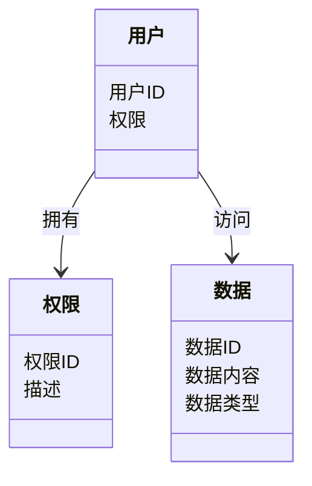
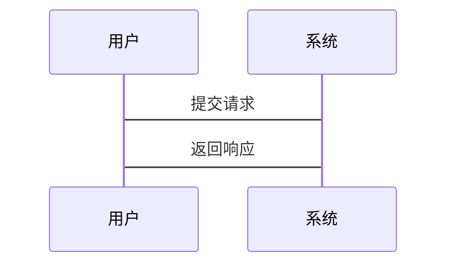

                 


# 企业AI Agent的数据治理策略

## 关键词：数据治理，AI Agent，数据安全，隐私保护，数据质量管理

## 摘要：本文深入探讨了在企业中使用AI Agent时的数据治理策略，涵盖了数据安全、隐私保护、质量管理等方面，结合实际案例和系统架构，为企业制定有效的数据治理方案提供了指导。

---

## 第1章：企业AI Agent概述

### 1.1 AI Agent的基本概念

#### 1.1.1 AI Agent的定义与分类

AI Agent（人工智能代理）是指能够感知环境并采取行动以实现目标的智能实体。AI Agent可以分为以下几类：

- **反应式Agent**：根据当前感知做出反应，不依赖历史信息。
- **基于模型的规划Agent**：利用内部模型和目标进行规划。
- **学习型Agent**：通过机器学习不断优化自身行为。
- **协作型Agent**：与其他Agent或人类协同工作。

### 1.1.2 AI Agent在企业中的应用领域

AI Agent在企业中的应用包括：

- **智能客服**：通过自然语言处理提供24/7客户支持。
- **自动化决策系统**：在金融、医疗等领域辅助决策。
- **供应链优化**：通过实时数据优化库存和物流。

### 1.1.3 AI Agent的核心功能与特点

AI Agent的核心功能包括感知、推理、规划和执行。其特点包括：

- **自主性**：无需人类干预。
- **反应性**：实时响应环境变化。
- **学习能力**：通过数据优化性能。

---

## 第2章：数据治理框架

### 2.1 数据治理框架的组成部分

数据治理框架通常包括：

- **数据战略与政策**：定义数据治理的目标和原则。
- **数据所有权**：明确数据的拥有者和责任。
- **数据生命周期管理**：从生成到归档的全生命周期管理。

### 2.2 数据治理的原则

数据治理应遵循以下原则：

- **完整性**：确保数据准确无误。
- **隐私保护**：防止数据泄露和滥用。
- **透明性**：数据的使用过程公开透明。

---

## 第3章：数据安全与隐私保护

### 3.1 数据安全威胁与风险

数据安全威胁包括：

- **网络攻击**：如DDoS和钓鱼攻击。
- **内部威胁**：员工误操作或恶意行为。
- **数据泄露**：未经授权的数据访问。

### 3.2 数据加密与访问控制

- **数据加密技术**：如AES加密用于保护数据在传输和存储中的安全性。
- **基于角色的访问控制（RBAC）**：确保用户只能访问其权限范围内的数据。

---

## 第4章：数据质量管理

### 4.1 数据质量评估指标

数据质量评估指标包括：

- **准确性**：数据反映真实情况。
- **完整性**：数据无缺失。
- **一致性**：数据格式和含义统一。

### 4.2 数据清洗与预处理

- **数据清洗方法**：如去除重复数据、填补缺失值。
- **数据预处理流程**：如标准化、归一化处理。

---

## 第5章：数据访问与共享控制

### 5.1 数据访问权限管理

- **基于RBAC的访问控制模型**：通过角色和权限管理数据访问。
- **数据访问策略**：如最小权限原则，确保用户仅获得必要的访问权限。

### 5.2 数据共享与隐私保护

- **数据共享的挑战**：如何在共享数据的同时保护隐私。
- **数据脱敏技术**：如替换敏感信息为匿名化数据。

---

## 第6章：数据治理的伦理与合规

### 6.1 数据治理中的伦理问题

- **数据偏见**：算法可能因为训练数据的偏见而产生不公平的结果。
- **数据隐私**：如何在数据使用和隐私保护之间取得平衡。

### 6.2 数据治理的合规要求

- **相关法律法规**：如欧盟的GDPR（通用数据保护条例）。
- **合规性评估**：定期检查数据治理策略是否符合法规要求。

---

## 第7章：案例分析

### 7.1 案例介绍

- **案例背景**：某金融机构使用AI Agent进行客户服务。
- **数据治理挑战**：确保客户数据的安全和合规性。

### 7.2 案例分析

- **数据安全措施**：实施AES加密和基于RBAC的访问控制。
- **数据质量管理**：通过数据清洗和预处理确保数据准确。

---

## 第8章：系统架构设计

### 8.1 问题场景介绍

- **问题背景**：企业需要高效、安全地管理AI Agent的数据。
- **系统介绍**：设计一个支持AI Agent的数据治理系统。

### 8.2 系统功能设计

- **领域模型**：定义数据实体及其关系（如用户、数据、权限）。



### 8.3 系统架构设计

- **系统架构**：采用分层架构，包括数据层、业务逻辑层和表现层。


### 8.4 系统接口设计

- **API接口**：如RESTful API，用于数据访问和管理。

### 8.5 系统交互设计

- **交互流程**：用户通过界面提交请求，系统处理并返回结果。



---

## 第9章：项目实战

### 9.1 环境安装

- **工具安装**：如Python、Flask框架、数据库安装。

### 9.2 系统核心实现源代码

```python
# 数据加密函数
def encrypt_data(data):
    key = b'secretkey123'
    cipher = AES.new(key, AES.MODE_ECB)
    encrypted_data = cipher.encrypt(data.encode())
    return encrypted_data

# 数据访问控制
def access_control(user, data):
    if user.has_permission(data):
        return True
    else:
        return False
```

### 9.3 代码应用解读

- **数据加密函数**：使用AES加密算法保护数据。
- **访问控制函数**：基于用户权限判断数据访问权限。

### 9.4 实际案例分析

- **案例分析**：如何通过上述代码实现数据的安全访问和加密存储。

### 9.5 项目小结

- **总结经验**：数据治理需要综合考虑技术、管理和合规性。

---

## 第10章：最佳实践与小结

### 10.1 最佳实践 tips

- **数据安全**：定期进行安全 audits。
- **数据隐私**：遵循相关法律法规。
- **数据质量管理**：建立数据清洗流程。

### 10.2 小结

企业AI Agent的数据治理需要全面考虑数据安全、隐私保护和质量管理，通过科学的策略和系统的架构设计，确保数据的合规性和安全性。

### 10.3 注意事项

- **持续监控**：定期检查数据治理策略的有效性。
- **员工培训**：提高员工的数据安全意识。

### 10.4 拓展阅读

- 推荐书籍：《数据治理：从战略到操作》、《人工智能：一种现代的方法》。

---

## 作者：AI天才研究院/AI Genius Institute & 禅与计算机程序设计艺术 /Zen And The Art of Computer Programming

---

**本文通过详细分析企业AI Agent的数据治理策略，结合实际案例和系统架构设计，为企业提供了全面的数据治理解决方案。**

