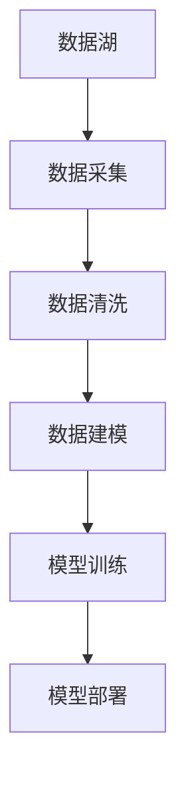
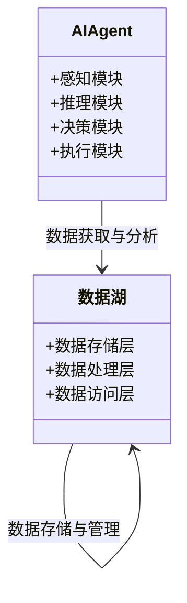
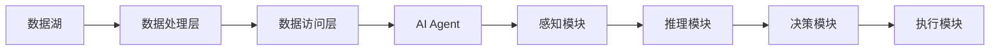

                 


# 企业AI Agent的数据湖架构设计

> 关键词：数据湖，AI Agent，企业架构，系统设计，算法原理，项目实战

> 摘要：  
本文详细探讨了企业AI Agent与数据湖架构的结合，从背景概念、核心原理、算法设计到系统架构、项目实战，全面解析了数据湖在AI Agent中的关键作用。文章通过丰富的图表、详细的代码实现和实际案例，帮助读者理解如何在企业环境中构建高效、智能的AI Agent数据湖架构。

---

# 目录大纲

1. **企业AI Agent与数据湖架构的背景与概念**  
   - 数据湖的基本概念与特点  
   - AI Agent的基本概念与特点  
   - 数据湖与AI Agent的结合  
   - 本章小结  

2. **数据湖架构的核心概念与原理**  
   - 数据湖的架构组成  
   - 数据湖的存储与管理  
   - 数据湖的处理与分析  
   - 数据湖与AI Agent的交互流程  
   - 本章小结  

3. **AI Agent的算法原理与数学模型**  
   - AI Agent的核心算法  
   - 数据湖中的数据处理算法  
   - 数据湖与AI Agent的数学模型  
   - 算法流程图（Mermaid）  
   - 本章小结  

4. **数据湖与AI Agent的系统架构设计**  
   - 系统架构概述  
   - 系统功能设计（领域模型Mermaid类图）  
   - 系统架构设计（Mermaid架构图）  
   - 系统接口设计  
   - 系统交互流程（Mermaid序列图）  
   - 本章小结  

5. **企业AI Agent数据湖架构的项目实战**  
   - 项目背景与目标  
   - 环境安装与配置  
   - 核心代码实现  
   - 代码应用解读与分析  
   - 实际案例分析与详细讲解  
   - 本章小结  

6. **最佳实践、小结与注意事项**  
   - 最佳实践  
   - 本章总结  
   - 注意事项  
   - 拓展阅读  
   - 作者信息  

---

## 第一部分: 企业AI Agent与数据湖架构的背景与概念

### 第1章: 企业AI Agent与数据湖架构的背景与概念

#### 1.1 数据湖的基本概念与特点
- **数据湖的定义与特点**  
  数据湖是一个存储企业中所有类型数据的 centralized repository，包括结构化数据、半结构化数据和非结构化数据。其特点包括：数据多样性、灵活性高、存储成本低等。  

- **数据湖与数据仓库的区别**  
  数据仓库主要用于支持决策型查询（OLAP），而数据湖则是一个通用的数据存储平台，支持多种数据类型和存储方式。  

- **数据湖的优势与挑战**  
  优势：支持多种数据类型、灵活性高、成本低；挑战：数据质量管理、存储规模、安全性等。  

#### 1.2 AI Agent的基本概念与特点
- **AI Agent的定义与核心功能**  
  AI Agent是一种智能代理系统，能够感知环境、理解需求、自主决策并执行任务。其核心功能包括感知、推理、规划和执行。  

- **AI Agent与传统软件的区别**  
  传统软件基于规则运行，而AI Agent具备自主学习和决策能力。  

- **AI Agent在企业中的应用场景**  
  例如智能客服、智能推荐、智能监控等。  

#### 1.3 数据湖与AI Agent的结合
- **数据湖作为AI Agent的数据源**  
  数据湖存储了企业中的所有数据，AI Agent可以通过数据湖获取所需的数据进行分析和决策。  

- **AI Agent如何利用数据湖进行决策**  
  AI Agent通过数据湖中的数据进行建模、分析和预测，从而做出最优决策。  

- **数据湖与AI Agent结合的优势**  
  通过数据湖的支持，AI Agent能够处理海量数据，提高决策的准确性和效率。  

#### 1.4 本章小结
本章介绍了数据湖和AI Agent的基本概念、特点以及它们的结合方式，为后续内容奠定了基础。

---

## 第二部分: 数据湖架构的核心概念与原理

### 第2章: 数据湖架构的核心概念与原理

#### 2.1 数据湖的架构组成
- **数据存储层**  
  包括文件存储、数据库存储等多种方式，用于存储原始数据。  

- **数据处理层**  
  包括数据清洗、转换、建模等处理逻辑，用于将原始数据转化为可用信息。  

- **数据访问层**  
  提供API或其他接口，供AI Agent或其他系统访问数据。  

#### 2.2 数据湖的存储与管理
- **数据湖的存储方式**  
  包括文件系统存储、分布式存储（如Hadoop HDFS）等。  

- **数据湖的元数据管理**  
  元数据包括数据的结构、来源、时间戳等信息，用于数据的组织和检索。  

- **数据湖的访问控制**  
  通过权限管理确保数据的安全性和隐私性。  

#### 2.3 数据湖的处理与分析
- **数据清洗与预处理**  
  通过去重、填充缺失值等方式提高数据质量。  

- **数据转换与集成**  
  将不同数据源的数据进行转换和集成，形成统一的数据视图。  

- **数据分析与建模**  
  使用机器学习、统计分析等方法对数据进行建模，提取有用的信息。  

#### 2.4 数据湖与AI Agent的交互流程
- **数据湖的数据采集**  
  AI Agent通过数据湖获取所需数据。  

- **数据湖的数据处理**  
  数据湖对原始数据进行清洗和转换，供AI Agent使用。  

- **数据湖的数据分析与反馈**  
  AI Agent利用数据湖中的数据进行分析，并将结果反馈到数据湖中。  

#### 2.5 本章小结
本章详细介绍了数据湖的架构组成、存储与管理、处理与分析，以及与AI Agent的交互流程，为后续的算法设计和系统架构奠定了基础。

---

## 第三部分: AI Agent的算法原理与数学模型

### 第3章: AI Agent的算法原理与数学模型

#### 3.1 AI Agent的核心算法
- **机器学习算法**  
  包括监督学习、无监督学习、强化学习等，用于数据建模和预测。  

- **自然语言处理算法**  
  用于处理文本数据，实现文本分类、实体识别等功能。  

- **决策树与规则引擎**  
  用于生成决策规则，帮助AI Agent做出决策。  

#### 3.2 数据湖中的数据处理算法
- **数据清洗算法**  
  通过去除噪声数据，提高数据质量。  

- **数据归约算法**  
  通过降维等方法减少数据量，提高处理效率。  

- **数据增强算法**  
  通过增加数据多样性，提高模型的泛化能力。  

#### 3.3 数据湖与AI Agent的数学模型
- **数据湖的特征表示**  
  使用向量或矩阵表示数据，便于AI Agent进行分析。  

- **AI Agent的决策模型**  
  包括概率模型、逻辑回归模型等，用于决策和预测。  

- **数据湖与AI Agent的联合优化模型**  
  综合考虑数据湖和AI Agent的特点，构建联合优化模型。  

#### 3.4 算法流程图（Mermaid）


#### 3.5 本章小结
本章通过数学模型和算法流程图，详细介绍了AI Agent的核心算法和数据湖中的数据处理算法，为后续的系统设计提供了理论基础。

---

## 第四部分: 数据湖与AI Agent的系统架构设计

### 第4章: 数据湖与AI Agent的系统架构设计

#### 4.1 系统架构概述
- **系统组成模块**  
  包括数据存储模块、数据处理模块、AI Agent模块等。  

- **系统功能模块划分**  
  每个模块的功能描述和相互关系。  

#### 4.2 系统功能设计（领域模型Mermaid类图）


#### 4.3 系统架构设计（Mermaid架构图）


#### 4.4 系统接口设计
- **数据湖接口**  
  提供REST API或其他接口供AI Agent访问数据。  

- **AI Agent接口**  
  提供与外部系统的交互接口，如API网关。  

#### 4.5 系统交互流程（Mermaid序列图）
```mermaid
sequenceDiagram
参与者: AI Agent
系统: 数据湖
参与者 -> 系统: 获取数据
系统 -> 参与者: 返回数据
参与者 -> 系统: 提交分析结果
系统 -> 参与者: 确认接收
```

#### 4.6 本章小结
本章通过系统架构设计和交互流程图，详细描述了数据湖与AI Agent的系统架构，为后续的项目实战奠定了基础。

---

## 第五部分: 企业AI Agent数据湖架构的项目实战

### 第5章: 企业AI Agent数据湖架构的项目实战

#### 5.1 项目背景与目标
- **项目背景**  
  例如，某企业希望构建一个智能客服系统，利用数据湖和AI Agent实现自动化服务。  

- **项目目标**  
  实现智能客服系统的数据存储、处理和分析功能，提升客户服务质量。  

#### 5.2 环境安装与配置
- **数据湖环境**  
  安装Hadoop或阿里云OSS等分布式存储系统。  

- **AI Agent开发环境**  
  安装Python、TensorFlow、Spark等工具。  

#### 5.3 核心代码实现
```python
# 数据湖中的数据存储与访问代码
import os
from pyspark import SparkContext

sc = SparkContext()
data = sc.textFile("hdfs://data/lake/customers")
data.count()
```

#### 5.4 代码应用解读与分析
- **数据湖中的数据处理代码**  
  使用Spark进行数据清洗和转换。  

- **AI Agent的决策模型代码**  
  使用机器学习模型进行客户意图识别。  

#### 5.5 实际案例分析与详细讲解
- **案例分析**  
  以智能客服为例，详细讲解数据湖与AI Agent的结合过程。  

- **详细讲解**  
  包括数据采集、数据处理、模型训练和部署的全过程。  

#### 5.6 本章小结
本章通过实际案例的分析和代码实现，详细展示了企业AI Agent数据湖架构的实现过程。

---

## 第六部分: 最佳实践、小结与注意事项

### 第6章: 最佳实践、小结与注意事项

#### 6.1 最佳实践
- **数据质量管理**  
  确保数据湖中的数据质量和一致性。  

- **安全与隐私保护**  
  在数据存储和访问过程中，确保数据的安全性和隐私性。  

- **模型的可解释性**  
  在AI Agent的决策过程中，确保模型的可解释性，便于调试和优化。  

#### 6.2 本章总结
总结全文内容，强调数据湖与AI Agent结合的重要性，以及系统设计和实现的关键点。  

#### 6.3 注意事项
- **数据存储规模**  
  随着数据量的增加，需要考虑存储的扩展性和性能优化。  

- **算法的可扩展性**  
  在模型训练和部署过程中，确保算法的可扩展性。  

- **团队协作**  
  数据湖和AI Agent的开发需要多团队协作，确保系统的顺利运行。  

#### 6.4 拓展阅读
推荐相关书籍和论文，供读者深入学习。  

#### 6.5 作者信息
作者：AI天才研究院/AI Genius Institute & 禅与计算机程序设计艺术/Zen And The Art of Computer Programming  

---

以上是《企业AI Agent的数据湖架构设计》的完整目录大纲和文章内容。

