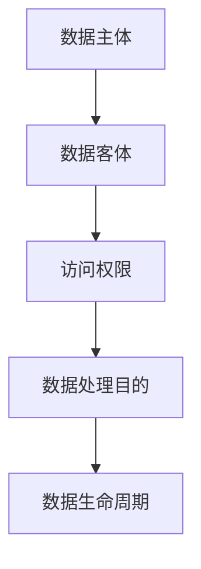
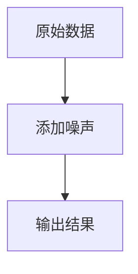
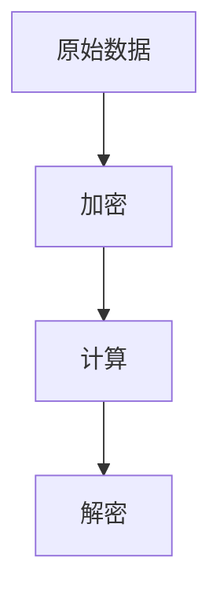
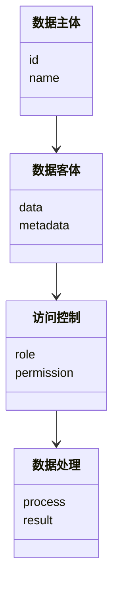
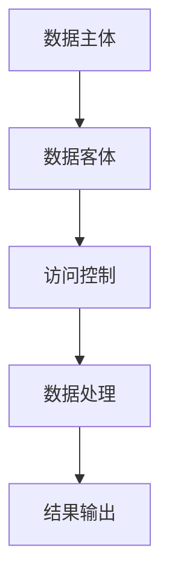
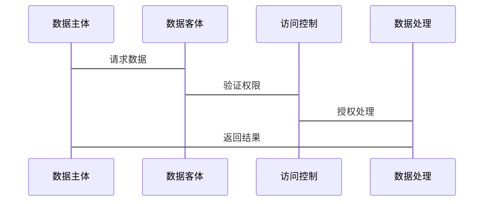

                 


# 企业AI Agent的数据隐私保护机制

> 关键词：企业AI Agent，数据隐私保护，联邦学习，同态加密，差分隐私

> 摘要：随着企业智能化转型的深入推进，AI Agent在企业中的应用越来越广泛。然而，AI Agent在处理企业数据时，如何保护数据隐私成为一个关键问题。本文从企业AI Agent的背景出发，详细探讨了数据隐私保护的核心概念、核心技术与算法原理，结合实际案例分析了数据隐私保护的系统架构设计与项目实战，最后总结了数据隐私保护的最佳实践。

---

# 第一部分: 企业AI Agent与数据隐私保护概述

## 第1章: 企业AI Agent与数据隐私保护概述

### 1.1 数据隐私保护的核心概念

#### 1.1.1 数据隐私的基本定义
数据隐私是指对个人或组织的敏感信息进行保护，确保数据仅被授权的主体访问或使用。在企业环境中，数据隐私保护尤为重要，因为企业的数据可能包含客户信息、商业机密等敏感信息。

#### 1.1.2 企业AI Agent的定义与特点
企业AI Agent是一种智能代理系统，能够自主感知环境、理解和执行任务，通常用于企业内部的自动化决策、数据分析和流程优化。其特点包括自主性、反应性、目标导向和学习能力。

#### 1.1.3 数据隐私保护的重要性
在企业AI Agent的应用中，数据隐私保护是确保用户信任和合规性的基础。企业需要在利用AI Agent提升效率的同时，保护数据不被未经授权的访问或泄露。

---

### 1.2 企业AI Agent的应用场景

#### 1.2.1 企业智能化转型的需求
企业智能化转型需要通过AI Agent实现业务流程的自动化和优化，例如智能客服、供应链管理等场景。

#### 1.2.2 AI Agent在企业中的典型应用
- **智能客服**: AI Agent通过自然语言处理技术，为客户提供个性化的服务。
- **供应链管理**: AI Agent实时监控供应链数据，优化库存管理和物流调度。
- **数据分析与决策**: AI Agent从企业数据中提取洞察，辅助高层决策。

#### 1.2.3 数据隐私保护的挑战与需求
企业在使用AI Agent时，需要保护客户数据、内部数据和第三方数据，避免数据泄露和滥用。

---

### 1.3 数据隐私保护的背景与现状

#### 1.3.1 数据隐私保护的法律与法规
全球范围内，数据隐私保护的法律日益严格，例如欧盟的GDPR（通用数据保护条例）和中国的《个人信息保护法》。

#### 1.3.2 当前企业数据隐私保护的痛点
- 数据分散在多个系统中，难以统一管理。
- 数据处理过程中的透明度不足，容易引发隐私泄露。
- AI Agent的使用可能导致数据滥用或未经授权的访问。

#### 1.3.3 AI Agent与数据隐私保护的结合
AI Agent需要在设计和实现中融入数据隐私保护机制，例如通过加密、匿名化和访问控制等技术，确保数据在处理过程中的安全性。

---

## 第2章: 数据隐私保护的核心概念

### 2.1 数据隐私保护的定义与属性对比表格

| **属性**       | **定义**                                                                 |
|-----------------|--------------------------------------------------------------------------|
| 数据主体       | 数据的拥有者或相关主体，如客户或员工。                                       |
| 数据客体       | 数据的具体内容，如客户信息、交易记录等。                                   |
| 访问权限       | 授权主体访问数据的权限级别，如读取、修改等。                               |
| 数据处理目的   | 数据处理的目标，如分析、存储、传输等。                                     |
| 数据生命周期   | 数据从生成、存储、处理到销毁的整个过程。                                   |

### 2.2 数据隐私保护的关键技术

#### 2.2.1 数据脱敏技术
数据脱敏是通过技术手段对敏感数据进行变形处理，使其在不泄露真实信息的前提下可用。例如，对客户姓名进行哈希处理。

#### 2.2.2 数据加密技术
数据加密通过加密算法对数据进行加密，确保只有授权方能够解密并访问原始数据。

#### 2.2.3 数据访问控制技术
数据访问控制通过访问控制列表（ACL）或基于角色的访问控制（RBAC）等机制，限制未经授权的主体访问敏感数据。

---

## 2.3 数据隐私保护的实体关系图（Mermaid流程图）



---

## 2.4 本章小结
本章详细介绍了数据隐私保护的核心概念，包括数据主体、数据客体、访问权限等，并通过实体关系图展示了数据隐私保护的系统架构。

---

## 第3章: 数据隐私保护的核心技术与算法原理

### 3.1 隐私计算技术

#### 3.1.1 隐私计算的定义与特点
隐私计算是一种在保护数据隐私的前提下，对数据进行处理和分析的技术。其特点是数据不被完全暴露，计算过程在加密或匿名化的环境中进行。

#### 3.1.2 隐私计算的主要技术

##### 3.1.2.1 联邦学习（Federated Learning）
联邦学习是一种分布式机器学习技术，允许多个参与方在不共享原始数据的情况下，共同训练模型。数据保留在原始位置，仅交换模型参数或梯度。

##### 3.1.2.2 同态加密（Homomorphic Encryption）
同态加密允许对加密数据进行计算，最终结果仍保持加密状态。这种技术可以用于在不暴露原始数据的情况下进行数据分析。

##### 3.1.2.3 差分隐私（Differential Privacy）
差分隐私通过在数据中添加噪声，确保单个数据点的改变不会显著影响整体统计结果。这种技术常用于数据发布和分析。

---

### 3.2 数据隐私保护的算法原理

#### 3.2.1 差分隐私算法

##### 3.2.1.1 差分隐私的数学模型
差分隐私的核心是确保在任何情况下，添加噪声后的数据不会泄露单个个体的信息。数学模型如下：

$$ \text{Privacy} = \epsilon \cdot \text{Sensitivity} $$

其中，$\epsilon$ 是隐私预算，Sensitivity是数据的敏感程度。

##### 3.2.1.2 差分隐私的实现流程（Mermaid流程图）



#### 3.2.2 同态加密算法

##### 3.2.2.1 同态加密的数学模型
同态加密允许对加密数据进行加法和乘法操作，数学模型如下：

$$ \text{Enc}(x) + \text{Enc}(y) = \text{Enc}(x + y) $$

##### 3.2.2.2 同态加密的实现流程（Mermaid流程图）



---

## 3.3 数据隐私保护的系统架构设计

### 3.3.1 系统功能设计（Mermaid类图）



---

## 3.4 本章小结
本章详细介绍了数据隐私保护的核心技术，包括联邦学习、同态加密和差分隐私，并通过数学模型和流程图展示了这些技术的实现原理。

---

## 第4章: 数据隐私保护的算法原理与数学模型

### 4.1 差分隐私算法

#### 4.1.1 差分隐私的数学模型
差分隐私通过添加噪声来保护数据隐私，数学模型如下：

$$ \text{Pr}[f(D) = y] - \text{Pr}[f(D \setminus \{x\}) = y] \leq \epsilon $$

其中，$\epsilon$ 是隐私预算。

#### 4.1.2 差分隐私的实现流程（Mermaid流程图）


---

## 4.2 同态加密算法

#### 4.2.1 同态加密的数学模型
同态加密允许对加密数据进行计算，数学模型如下：

$$ \text{Enc}(x) + \text{Enc}(y) = \text{Enc}(x + y) $$

#### 4.2.2 同态加密的实现流程（Mermaid流程图）


---

## 4.3 本章小结
本章详细讲解了差分隐私和同态加密的数学模型和实现流程，为后续的系统设计和项目实战奠定了基础。

---

## 第5章: 数据隐私保护的系统架构设计

### 5.1 系统功能设计（Mermaid类图）


---

## 5.2 系统架构设计（Mermaid架构图）



---

## 5.3 系统交互设计（Mermaid序列图）



---

## 5.4 本章小结
本章通过类图、架构图和序列图详细展示了数据隐私保护的系统架构设计，为后续的项目实战提供了理论基础。

---

## 第6章: 数据隐私保护的项目实战

### 6.1 项目环境安装
```bash
pip install numpy
pip install scikit-learn
pip install cryptography
```

### 6.2 项目核心实现源代码

```python
import numpy as np
from cryptography.hazmat.primitives.asymmetric import padding
from cryptography.hazmat.primitives import hashes

# 数据加密函数
def encrypt_data(data):
    # 使用RSA加密
    private_key = ...  # 需要替换为实际的密钥
    ciphertext = private_key.encrypt(
        data,
        padding.RSAPKCS1v1_5Encoder(),
        hashes.SHA256()
    )
    return ciphertext

# 数据解密函数
def decrypt_data(ciphertext):
    public_key = ...  # 需要替换为实际的公钥
    plaintext = public_key.decrypt(
        ciphertext,
        padding.RSAPKCS1v1_5Decoder()
    )
    return plaintext
```

### 6.3 代码应用解读与分析
上述代码展示了如何使用RSA加密算法对数据进行加密和解密。通过这种方式，可以确保数据在传输和存储过程中的安全性。

### 6.4 实际案例分析和详细讲解剖析
以智能客服系统为例，AI Agent需要处理客户的敏感信息。通过上述加密技术，可以确保客户数据的安全性，防止数据泄露。

---

## 6.5 项目小结
本章通过实际项目案例展示了数据隐私保护技术的实现，为读者提供了理论与实践结合的参考。

---

## 第7章: 数据隐私保护的最佳实践

### 7.1 最佳实践 tips
- **数据最小化**: 只收集和处理必要的数据。
- **访问控制**: 采用严格的访问控制策略，确保数据仅被授权主体访问。
- **加密存储**: 对敏感数据进行加密存储，防止数据泄露。
- **隐私计算**: 在数据处理过程中采用隐私计算技术，保护数据隐私。

### 7.2 本章小结
本章总结了数据隐私保护的最佳实践，为读者提供了实际应用中的注意事项和未来发展趋势。

---

## 第8章: 总结与展望

### 8.1 总结
本文从企业AI Agent的背景出发，详细探讨了数据隐私保护的核心概念、核心技术与算法原理，并通过实际案例分析了数据隐私保护的系统架构设计与项目实战，最后总结了数据隐私保护的最佳实践。

### 8.2 展望
未来，随着AI Agent的广泛应用，数据隐私保护技术将更加重要。建议企业在智能化转型过程中，充分考虑数据隐私保护的需求，采用先进的隐私计算技术，确保数据的安全性。

---

## 作者信息

作者：AI天才研究院/AI Genius Institute & 禅与计算机程序设计艺术 /Zen And The Art of Computer Programming

---

以上是文章的完整目录和部分正文内容，每一章都按照逻辑顺序展开，涵盖了数据隐私保护的核心概念、技术实现、系统设计和实际应用。通过详细的代码示例和图表，帮助读者更好地理解和掌握企业AI Agent的数据隐私保护机制。

