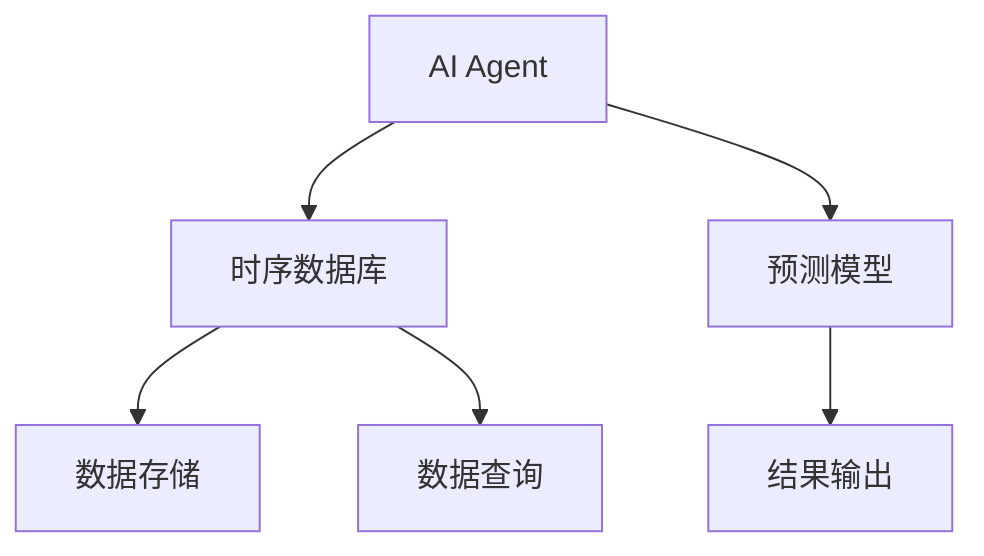

                 


# 企业AI Agent的时序数据库设计与应用

> 关键词：AI Agent、时序数据库、时间序列预测、系统架构、项目实战

> 摘要：本文探讨了在企业环境中设计和应用AI Agent结合时序数据库的解决方案。从背景介绍、核心概念到算法原理，再到系统架构和项目实战，全面分析了如何利用AI Agent优化时序数据的处理与分析。通过详细的技术博客内容，读者将深入了解AI Agent在时序数据库中的设计与应用，包括具体实现和最佳实践。

---

## 第1章：背景介绍

### 1.1 问题背景

#### 1.1.1 企业AI Agent的需求与挑战

随着企业数字化转型的推进，AI Agent（人工智能代理）在企业中的应用越来越广泛。AI Agent能够自动执行任务、优化流程并提供决策支持，尤其是在处理大量时序数据时，AI Agent展现了其独特的优势。然而，企业在利用AI Agent处理时序数据时也面临诸多挑战，例如数据的实时性、复杂性以及系统的可扩展性。

#### 1.1.2 时序数据的重要性与应用场景

时序数据是指按时间顺序记录的数据，广泛应用于金融、物联网、 healthcare等领域。例如，股票价格波动分析、设备状态监控、患者健康状况追踪等场景都需要处理大量时序数据。时序数据的特性（如连续性、趋势性）使得AI Agent能够发挥其预测和优化能力。

#### 1.1.3 当前企业级时序数据库的痛点

传统的数据库在处理时序数据时存在以下问题：存储效率低、查询性能差、难以处理大规模数据等。这些问题限制了企业在实时监控、预测分析等场景中的应用效果。引入AI Agent可以有效优化这些问题，但同时也带来了新的挑战，例如如何设计高效的时序数据库架构。

### 1.2 问题描述

#### 1.2.1 AI Agent在企业中的角色与功能

AI Agent在企业中扮演着多重角色，包括数据采集、分析、预测和决策支持。例如，在物联网系统中，AI Agent可以实时采集设备数据，通过分析预测设备故障，从而实现预防性维护。

#### 1.2.2 时序数据的特点与复杂性

时序数据具有以下特点：时间戳顺序性、数据连续性、周期性与趋势性、数据量大等。这些特点使得时序数据的处理需要高效的算法和优化的数据库设计。

#### 1.2.3 传统数据库的局限性与改进方向

传统数据库在处理时序数据时存在存储空间浪费、查询效率低等问题。改进方向包括优化存储结构、提升查询性能、引入分布式架构等。

### 1.3 问题解决

#### 1.3.1 引入AI Agent优化时序数据库的思路

通过AI Agent实现时序数据的智能采集、分析与预测，可以显著提升数据库的性能和效率。例如，AI Agent可以自动识别数据模式，优化数据存储结构。

#### 1.3.2 时序数据库设计的关键问题

时序数据库设计需要考虑数据压缩、高效查询、可扩展性等问题。AI Agent可以帮助解决这些问题，例如通过预测模型优化数据存储。

#### 1.3.3 AI Agent在时序数据处理中的具体应用

AI Agent可以应用于时间序列预测、异常检测、数据清洗等场景。例如，使用ARIMA模型预测未来股票价格。

### 1.4 边界与外延

#### 1.4.1 时序数据库的边界定义

时序数据库专注于处理按时间顺序记录的数据，其边界包括数据的生成、存储、查询和分析。

#### 1.4.2 AI Agent的适用范围与限制

AI Agent适用于需要智能处理和决策的场景，但其在处理非时序数据或需要实时性极高的场景中可能受限。

#### 1.4.3 相关技术的对比与区分

对比传统数据库和时序数据库，时序数据库在数据模型、存储结构和查询优化上有所不同。AI Agent则是一种智能处理技术，与数据库技术相辅相成。

### 1.5 概念结构与核心要素

#### 1.5.1 时序数据库的核心要素

时序数据库的核心要素包括时间戳、数据点、数据源、存储结构和查询接口。

#### 1.5.2 AI Agent的功能模块与交互流程

AI Agent的功能模块包括数据采集、数据处理、预测分析和决策反馈。交互流程涉及数据输入、处理、分析和输出。

#### 1.5.3 核心概念之间的关系

时序数据库为AI Agent提供数据支持，AI Agent优化时序数据库的性能，两者相辅相成，共同提升企业数据处理能力。

---

## 第2章：核心概念与联系

### 2.1 AI Agent的基本原理

#### 2.1.1 AI Agent的定义与分类

AI Agent是一种能够感知环境并采取行动以实现目标的智能实体。根据智能水平，AI Agent可以分为简单反射式Agent和基于模型的反射式Agent。

#### 2.1.2 AI Agent的核心功能模块

AI Agent的核心功能模块包括感知环境、目标设定、规划与推理、行动执行和学习优化。

#### 2.1.3 AI Agent与传统数据库的对比

AI Agent具备智能性和自主性，而传统数据库不具备这些特性。AI Agent可以与数据库集成，提升数据处理能力。

### 2.2 时序数据库的特点

#### 2.2.1 时序数据库的特点

时序数据库的特点包括高时间分辨率、数据一致性、高效查询性能等。

#### 2.2.2 时序数据与传统数据的对比

时序数据具有时间依赖性，而传统数据可能不具备这一特性。时序数据库在数据建模和查询优化上有其独特性。

#### 2.2.3 AI Agent与时序数据库的联系

AI Agent可以通过时序数据库获取数据，进行分析和预测，优化数据库性能。

---

### 2.3 核心概念的联系

#### 2.3.1 AI Agent与时序数据的交互流程

AI Agent通过时序数据库获取数据，进行分析和预测，输出结果并优化数据库结构。

#### 2.3.2 核心概念属性特征对比表格

以下是AI Agent和时序数据库的核心概念属性对比：

| **属性**       | **AI Agent**                          | **时序数据库**                          |
|-----------------|--------------------------------------|------------------------------------------|
| 核心功能         | 数据处理与智能决策                   | 数据存储与查询                         |
| 数据类型         | 结构化数据、非结构化数据             | 时间戳、数值型数据                     |
| 优化目标         | 提高数据处理效率与准确性             | 提高查询效率与存储效率                   |
| 依赖技术         | 机器学习、自然语言处理               | 数据压缩、分布式存储                   |

#### 2.3.3 ER实体关系图架构的Mermaid流程图



---

## 第3章：算法原理讲解

### 3.1 时间序列预测算法

#### 3.1.1 时间序列预测的基本原理

时间序列预测是通过历史数据预测未来趋势的技术。常用算法包括ARIMA、LSTM等。

#### 3.1.2 ARIMA模型的数学模型与公式

ARIMA（自回归积分滑动平均模型）的数学模型如下：

$$ ARIMA(p, d, q) $$

其中，p为自回归阶数，d为差分阶数，q为移动平均阶数。

#### 3.1.3 时间序列预测算法的实现步骤

1. 数据预处理：包括数据清洗、平移等。
2. 模型训练：使用训练数据训练ARIMA模型。
3. 模型预测：基于训练好的模型进行未来数据的预测。
4. 模型评估：通过均方误差等指标评估模型性能。

#### 3.1.4 时间序列预测算法的Python实现

```python
from statsmodels.tsa.arima.model import ARIMA

# 数据预处理
data = ...  # 时间序列数据

# 模型训练
model = ARIMA(data, order=(5, 1, 0))
model_fit = model.fit()

# 模型预测
forecast = model_fit.forecast(steps=5)
```

---

## 第4章：系统分析与架构设计

### 4.1 项目场景介绍

#### 4.1.1 项目背景

本项目旨在设计一个结合AI Agent的时序数据库系统，用于企业级数据处理和分析。

#### 4.1.2 项目目标

目标包括优化时序数据存储效率、提升预测准确性、实现系统可扩展性等。

### 4.2 系统功能设计

#### 4.2.1 领域模型设计

领域模型设计包括数据采集、数据存储、数据分析和数据输出四个模块。

#### 4.2.2 系统架构设计

系统架构采用分层设计，包括数据层、业务逻辑层和表现层。

#### 4.2.3 系统接口设计

系统接口包括数据采集接口、数据查询接口和预测结果接口。

#### 4.2.4 系统交互流程设计

系统交互流程包括数据采集、数据存储、数据分析和结果输出。

---

## 第5章：项目实战

### 5.1 环境安装与配置

#### 5.1.1 开发环境搭建

需要安装Python、相关库（如pandas、statsmodels）和数据库系统（如InfluxDB）。

#### 5.1.2 数据集准备

准备一个时间序列数据集，例如股票价格数据。

### 5.2 核心代码实现

#### 5.2.1 数据采集与存储

```python
import pandas as pd
from influxdb import InfluxDBClient

# 数据采集
data = pd.read_csv('stock.csv')

# 数据存储
client = InfluxDBClient('localhost', 8086)
client.write_points(data)
```

#### 5.2.2 数据分析与预测

```python
from statsmodels.tsa.arima.model import ARIMA

# 模型训练
model = ARIMA(data['price'], order=(5, 1, 0))
model_fit = model.fit()

# 模型预测
forecast = model_fit.forecast(steps=5)
```

#### 5.2.3 结果展示

```python
print(forecast)
```

### 5.3 案例分析与总结

#### 5.3.1 案例分析

以股票价格预测为例，展示模型的预测结果和准确性评估。

#### 5.3.2 项目总结

总结项目实施过程中的经验教训，提出改进建议。

---

## 第6章：最佳实践

### 6.1 小结

本章通过实际案例展示了AI Agent在时序数据库中的应用，详细讲解了系统设计、实现和优化过程。

### 6.2 注意事项

在实际应用中，需要注意数据质量、模型选择和系统性能优化等问题。

### 6.3 拓展阅读

推荐进一步阅读相关书籍和文献，深入学习AI Agent和时序数据库的知识。

---

## 作者

作者：AI天才研究院/AI Genius Institute & 禅与计算机程序设计艺术 /Zen And The Art of Computer Programming

