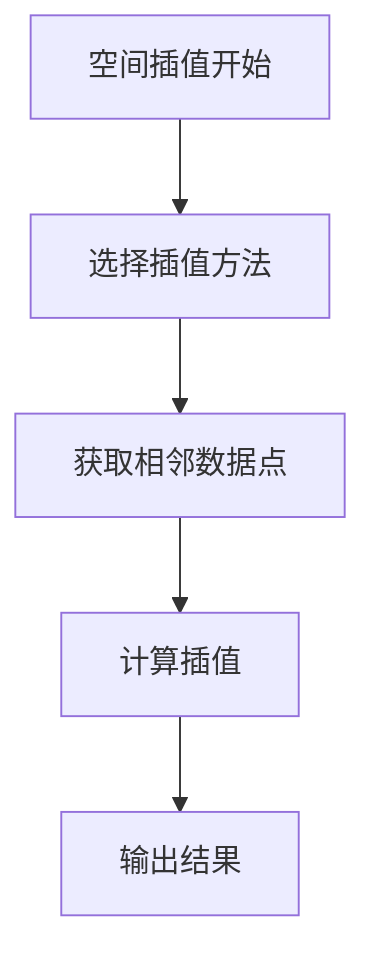
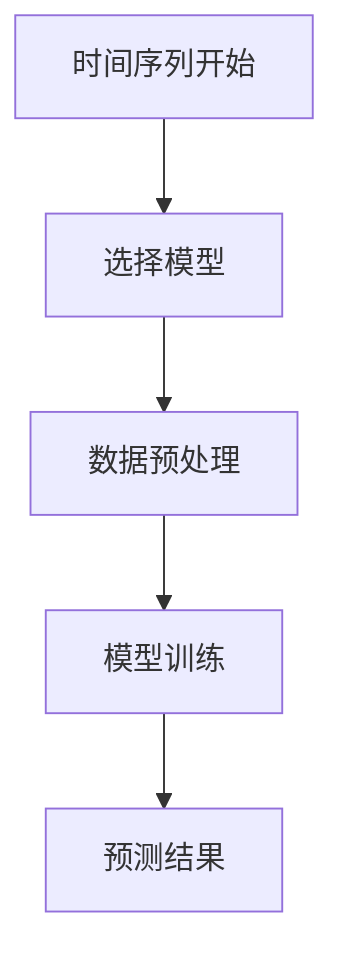
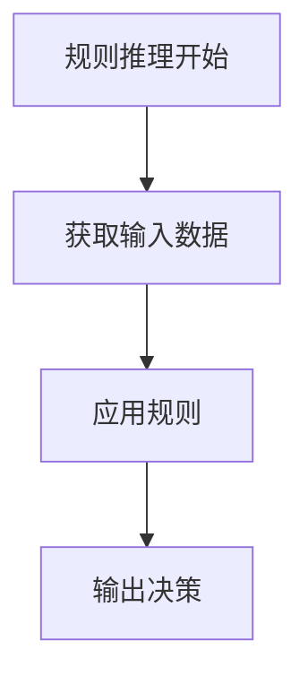
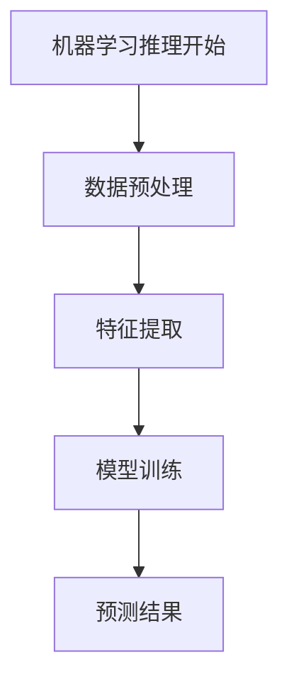
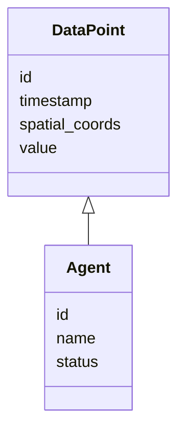
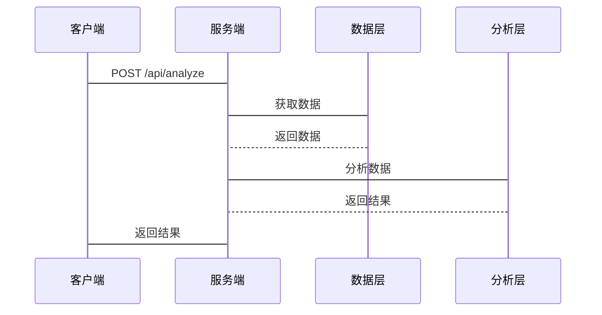

                 


# 《企业AI Agent的时空大数据分析平台》

## 关键词：企业、AI Agent、时空大数据、数据分析平台、算法、系统架构、项目实战

## 摘要：
本文深入探讨企业AI Agent在时空大数据分析平台中的应用，从背景介绍、核心概念、算法原理、系统架构到项目实战，全面解析时空大数据分析的关键技术与实现方法。通过详细的技术分析和实际案例，帮助读者理解如何利用AI Agent提升企业时空数据处理能力。

---

# 第1章: 企业AI Agent的时空大数据分析平台背景介绍

## 1.1 问题背景
### 1.1.1 企业数字化转型的现状与挑战
随着数字化转型的深入推进，企业面临着数据爆炸性增长的挑战。时空大数据作为企业决策的关键资产，其高效处理和分析能力直接影响企业的竞争力。

### 1.1.2 时空大数据在企业中的重要性
时空大数据涵盖了时间序列数据和空间数据，广泛应用于物流、交通、金融等领域，为企业提供精准的决策支持。

### 1.1.3 AI Agent在企业中的应用趋势
AI Agent通过自动化处理和智能决策，帮助企业提高效率，降低成本，成为企业数字化转型的重要推动力。

## 1.2 问题描述
### 1.2.1 时空大数据分析的复杂性
时空数据的多维性和动态性增加了分析的复杂性，传统方法难以满足实时性和准确性要求。

### 1.2.2 AI Agent在时空大数据分析中的作用
AI Agent能够实时处理和分析时空数据，提供智能化的决策支持，解决传统方法的局限性。

### 1.2.3 企业对时空大数据分析的需求
企业需要高效的时空数据分析平台，以应对复杂多变的市场环境和客户需求。

## 1.3 问题解决
通过构建企业AI Agent的时空大数据分析平台，企业能够实现数据的实时处理、智能分析和精准决策。

## 1.4 边界与外延
### 1.4.1 系统边界
平台仅处理时空数据，不涉及其他类型的数据处理。

### 1.4.2 外延
平台可能扩展到其他数据类型，但核心功能专注于时空数据分析。

## 1.5 核心概念与结构
### 1.5.1 核心概念
AI Agent、时空数据、大数据分析平台。

### 1.5.2 结构组成
数据采集、数据处理、数据分析、结果展示。

---

# 第2章: 核心概念与联系

## 2.1 核心概念原理
### 2.1.1 AI Agent
AI Agent通过感知环境、推理和执行动作，实现智能化决策。

### 2.1.2 时空大数据分析
时空大数据分析涉及时间序列分析和空间数据分析，提供多维度的数据洞察。

## 2.2 概念属性特征对比
| 概念 | 属性 | 特征 |
|------|------|------|
| AI Agent | 智能性 | 自动化决策 |
| 时空大数据分析 | 多维性 | 时间和空间维度分析 |

## 2.3 ER实体关系图
```mermaid
erd
  id: "企业AI Agent的时空大数据分析平台"
  pkey: id
  table = {
    id: {
      type: primary key
      properties: { id: string }
    },
    name: {
      type: text
      properties: { name: string }
    },
    timestamp: {
      type: datetime
      properties: { timestamp: datetime }
    }
  }
  relationships: {
    id: {
      ref: belongsTo
      table: "data_point"
    }
  }
}
```

---

# 第3章: 算法原理讲解

## 3.1 时空数据处理算法
### 3.1.1 空间插值算法


### 3.1.2 时间序列分析算法


## 3.2 AI Agent算法
### 3.2.1 基于规则的推理


### 3.2.2 基于机器学习的推理


## 3.3 大数据分析算法
### 3.3.1 MapReduce算法
```python
def map(f, key_value_pairs):
    for key, value in key_value_pairs:
        yield (f(key), f(value))

def reduce(f, key, values):
    pass

# 示例代码
from mrjob.job import MRJob
from mrjob.step import Step

class WordCount(MRJob):
    def steps(self):
        return [
            Step(mapper=map_func, reducer=reducer_func)
        ]

    def map_func(self, _, line):
        for word in line.split():
            yield ('word', word)
```

### 3.3.2 时间序列预测模型
```latex
$$
\hat{y}_{t} = a + bt + c_{t}
$$
```

---

# 第4章: 系统分析与架构设计方案

## 4.1 问题场景介绍
企业需要实时分析时空数据，优化业务流程。

## 4.2 系统功能设计
### 4.2.1 领域模型


### 4.2.2 系统架构


## 4.3 接口设计
### 4.3.1 API定义
使用RESTful API，支持GET和POST请求。

### 4.3.2 接口交互


---

# 第5章: 项目实战

## 5.1 环境安装
安装Python、Jupyter Notebook、Flask框架。

## 5.2 核心代码实现
### 5.2.1 数据采集
```python
import requests

def fetch_data(api_url):
    response = requests.get(api_url)
    return response.json()
```

### 5.2.2 数据处理
```python
import pandas as pd

def preprocess(data):
    df = pd.DataFrame(data)
    df['timestamp'] = pd.to_datetime(df['timestamp'])
    return df
```

### 5.2.3 数据分析
```python
from sklearn.linear_model import LinearRegression

def analyze(data):
    model = LinearRegression()
    model.fit(X, y)
    return model.predict(X_new)
```

## 5.3 案例分析
### 5.3.1 案例背景
某物流企业需要优化配送路线。

### 5.3.2 实施步骤
1. 数据采集：获取配送点和时间数据。
2. 数据处理：清洗和转换数据。
3. 数据分析：应用空间插值算法优化路线。
4. 结果展示：生成可视化报告。

## 5.4 小结
通过项目实战，验证了AI Agent在时空大数据分析中的有效性。

---

# 第6章: 最佳实践

## 6.1 关键点总结
AI Agent和时空大数据分析的结合能够提升企业的决策效率。

## 6.2 小结
本文详细探讨了企业AI Agent在时空大数据分析平台中的应用，通过理论分析和实践案例，展示了其在企业中的重要性。

## 6.3 注意事项
确保数据安全和隐私保护。

## 6.4 拓展阅读
建议读者深入学习时空数据分析和AI Agent的相关技术。

---

# 作者：AI天才研究院 & 禅与计算机程序设计艺术

---

这篇文章系统地介绍了企业AI Agent的时空大数据分析平台，从背景、核心概念、算法原理到系统架构和项目实战，为读者提供了全面的技术解析。希望对您有所帮助！

