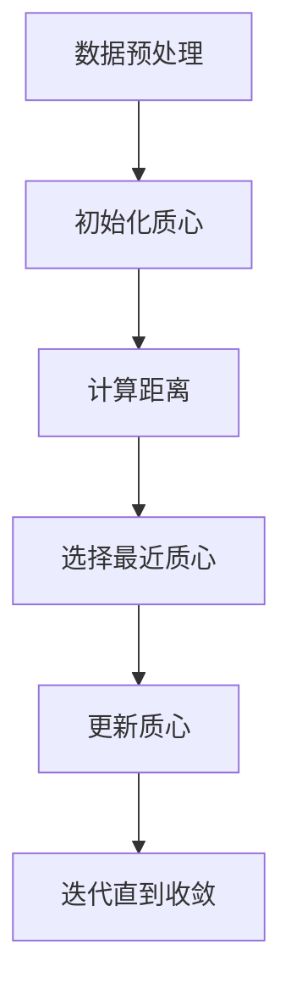
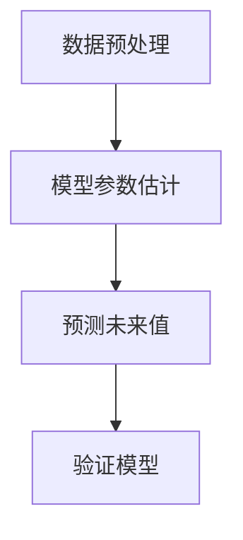
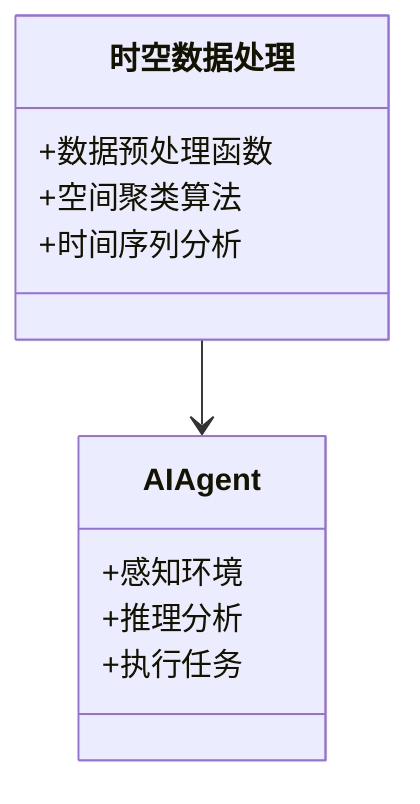
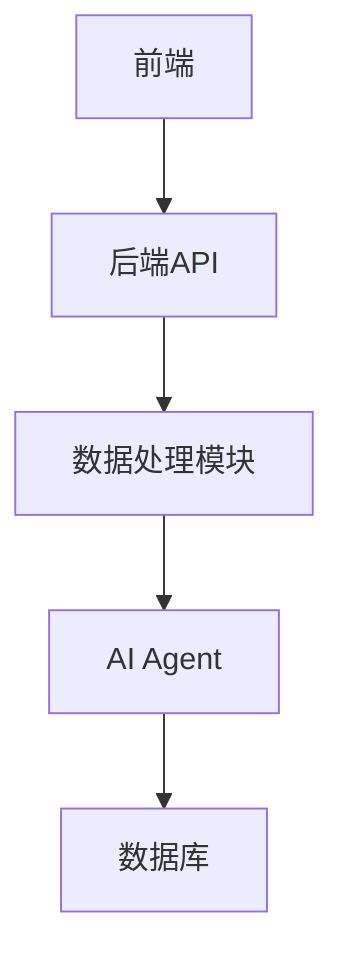

                 


# 《企业AI Agent的时空大数据挖掘平台》

## 关键词：企业AI Agent、时空大数据、大数据挖掘、平台架构、算法原理、系统设计

## 摘要：本文详细探讨了企业AI Agent与时空大数据挖掘平台的构建，从背景、核心概念、算法原理到系统架构和项目实战，全面解析了如何利用AI Agent高效处理和分析时空大数据，为企业提供智能化解决方案。

---

## 第一部分: 企业AI Agent与时空大数据挖掘平台的背景介绍

### 第1章: 企业AI Agent的定义与背景

#### 1.1 问题背景

企业数字化转型的挑战  
在当前数字经济时代，企业面临着前所未有的数据爆炸挑战。企业需要处理海量的时空数据，包括地理位置信息、时间序列数据等，传统的数据分析方法已难以满足需求。  

时空大数据的兴起  
随着物联网、5G和云计算技术的快速发展，企业收集的时空数据种类和数量急剧增加。例如，物流企业的实时货物追踪数据、城市交通系统的车辆位置和速度数据等。  

AI Agent在企业中的应用需求  
企业需要智能化系统来实时处理和分析这些数据，以优化业务流程、提高决策效率。AI Agent（人工智能代理）作为一种能够自主感知、推理和执行任务的智能体，成为企业处理时空大数据的理想选择。

---

#### 1.2 问题描述

时空大数据的特点与难点  
- **多维性**：时空数据通常包含地理位置、时间戳等多个维度，数据结构复杂。  
- **高维性**：数据维度高，难以直接分析和处理。  
- **实时性**：需要实时处理和响应，对系统性能要求高。  

AI Agent的核心功能与目标  
- **自主性**：AI Agent能够独立感知环境并执行任务。  
- **反应性**：能够实时响应数据变化和用户需求。  
- **学习能力**：通过机器学习算法不断优化自身的处理能力。  

平台构建的必要性与可行性  
- **必要性**：企业需要一个高效的平台来整合和分析时空大数据，AI Agent能够提供智能化的解决方案。  
- **可行性**：随着AI技术的成熟和云计算资源的普及，构建这样的平台已成为可能。

---

#### 1.3 问题解决

AI Agent如何处理时空大数据  
- **数据预处理**：AI Agent首先对时空数据进行清洗、归一化和特征提取。  
- **模型训练**：利用机器学习算法对数据进行建模和预测。  
- **任务执行**：根据分析结果执行相应的业务逻辑，例如优化物流路径或调整资源分配。  

平台构建的关键技术与方法  
- **分布式计算**：利用分布式计算框架（如Spark）处理大规模数据。  
- **实时处理**：采用流处理技术（如Flink）实现数据的实时分析。  
- **模型部署**：将训练好的模型部署到生产环境中，实现自动化处理。  

解决方案的创新点与优势  
- **创新点**：结合AI Agent和时空大数据，提供智能化、自动化的解决方案。  
- **优势**：提高数据分析效率，降低成本，增强企业的竞争力。

---

#### 1.4 边界与外延

时空大数据的边界定义  
- **数据范围**：限定在特定领域（如物流、交通）内的时空数据。  
- **数据粒度**：根据业务需求确定数据的细化程度。  

AI Agent的功能边界  
- **核心功能**：数据处理、模型训练和任务执行。  
- **辅助功能**：提供可视化界面和日志管理。  

平台的适用范围与限制  
- **适用范围**：适用于需要处理时空数据的企业，如物流、交通、零售等。  
- **限制**：受限于数据质量和模型精度，目前主要适用于特定场景。

---

## 第二部分: 核心概念与联系

### 第2章: 核心概念与联系

#### 2.1 时空大数据的定义与属性

时空大数据的定义  
时空大数据是指包含地理位置信息和时间信息的大数据，通常涉及多维数据和复杂的空间关系。

时空数据的特征对比表  
| 特征 | 描述 |
|------|------|
| 多维性 | 包含地理位置、时间戳等多个维度 |
| 高维性 | 数据维度高，难以直接分析 |
| 实时性 | 数据实时生成，需要快速处理 |

时空数据的ER实体关系图  
```mermaid
erd
title 时空数据模型
entity 时空数据 {
  key id
  name
  location
  timestamp
}
```

---

#### 2.2 AI Agent的定义与属性

AI Agent的定义  
AI Agent是一种能够自主感知环境、推理并执行任务的智能体。

AI Agent的核心特征对比表  
| 特征 | 描述 |
|------|------|
| 自主性 | 能够独立执行任务 |
| 反应性 | 能够实时响应环境变化 |
| 学习能力 | 能够通过数据优化自身 |

AI Agent的ER实体关系图  
```mermaid
erd
title AI Agent模型
entity AI Agent {
  key id
  name
  functionality
  state
}
```

---

## 第三部分: 算法原理

### 第3章: 算法原理

#### 3.1 空间聚类算法

空间聚类算法概述  
空间聚类算法用于将地理位置相近的数据点聚类，常用于物流路径优化和区域划分。

K-means算法  


Python代码示例  
```python
import numpy as np
from sklearn.cluster import KMeans

# 示例数据
data = np.array([[1, 2], [3, 4], [5, 6], [7, 8]])

# 初始化模型
model = KMeans(n_clusters=2)

# 训练模型
model.fit(data)

# 获取聚类结果
labels = model.labels_
print(labels)
```

数学模型与公式  
$$\text{目标函数} = \sum_{i=1}^{n} \sum_{j=1}^{k} (x_i - c_j)^2$$  
其中，$x_i$是数据点，$c_j$是质心。

---

#### 3.2 时间序列分析

时间序列分析概述  
时间序列分析用于分析随时间变化的数据，常用于预测和趋势分析。

ARIMA模型  


Python代码示例  
```python
from statsmodels.tsa.arima_model import ARIMA

# 示例数据
data = [1, 3, 5, 7, 9, 11, 13]

# 初始化模型
model = ARIMA(data, order=(1, 1, 0))

# 训练模型
model_fit = model.fit()

# 预测未来值
forecast = model_fit.forecast(steps=3)
print(forecast)
```

数学模型与公式  
$$\text{ARIMA模型} = \phi(B)X_t = \theta(B)\epsilon_t$$  
其中，$B$是延迟算子，$\epsilon_t$是白噪声。

---

## 第四部分: 系统分析与架构设计

### 第4章: 系统分析与架构设计

#### 4.1 项目背景

项目背景介绍  
本项目旨在构建一个企业级的时空大数据挖掘平台，利用AI Agent实现数据的智能化处理和分析。

系统功能设计  


系统架构图  


---

## 第五部分: 项目实战

### 第5章: 项目实战

#### 5.1 环境安装

安装必要的库  
```bash
pip install numpy pandas scikit-learn statsmodels
```

#### 5.2 核心代码实现

时空数据预处理代码  
```python
import pandas as pd

# 示例数据
data = {
    'latitude': [37.7749, 37.7750, 37.7751],
    'longitude': [-122.4194, -122.4195, -122.4196],
    'timestamp': ['2023-01-01', '2023-01-02', '2023-01-03']
}

df = pd.DataFrame(data)
print(df)
```

AI Agent实现代码  
```python
from sklearn.cluster import KMeans

# 示例数据
X = [[1, 2], [3, 4], [5, 6], [7, 8]]

# 初始化模型
model = KMeans(n_clusters=2)

# 训练模型
model.fit(X)

# 获取聚类结果
labels = model.labels_
print(labels)
```

---

## 第六部分: 最佳实践

### 第6章: 最佳实践

#### 6.1 小结

本文详细介绍了企业AI Agent与时空大数据挖掘平台的构建过程，涵盖了背景、核心概念、算法原理和系统设计等方面。

---

#### 6.2 注意事项

- **数据质量**：确保数据的准确性和完整性。  
- **模型优化**：定期更新模型，提高预测精度。  
- **系统维护**：及时修复漏洞，保障系统稳定运行。

---

#### 6.3 拓展阅读

- **推荐书籍**：《Python机器学习实战》、《时间序列分析与应用》  
- **在线资源**：[=scrapy教程](https://scrapy.org/)、[Keras官方文档](https://keras.io/)

---

## 附录

附录A: 相关工具与资源  
- **数据处理工具**：Pandas、NumPy  
- **机器学习框架**：Scikit-learn、TensorFlow  
- **时间序列分析工具**：Statsmodels  

附录B: 代码示例汇总  
- [时空数据预处理代码](#)  
- [AI Agent实现代码](#)

---

## 作者

作者：AI天才研究院/AI Genius Institute  
联系邮箱：contact@ai-genius.com  

---

感谢您的阅读！如果对内容有任何疑问或建议，请随时与我们联系。

