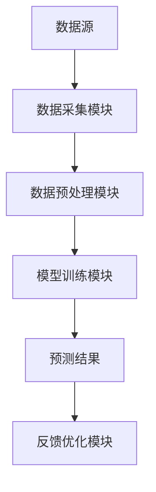
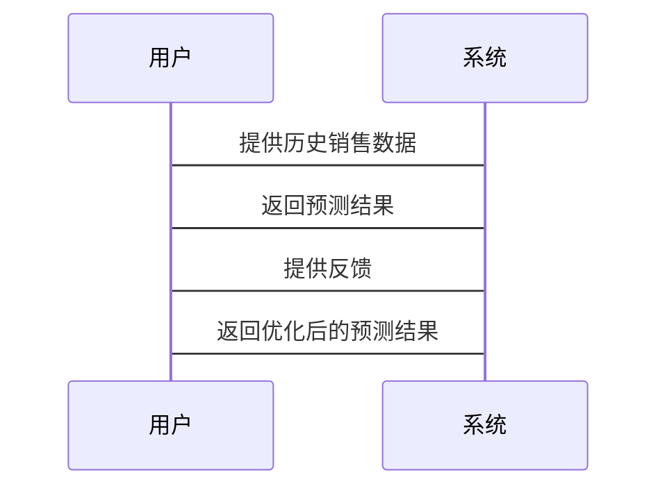
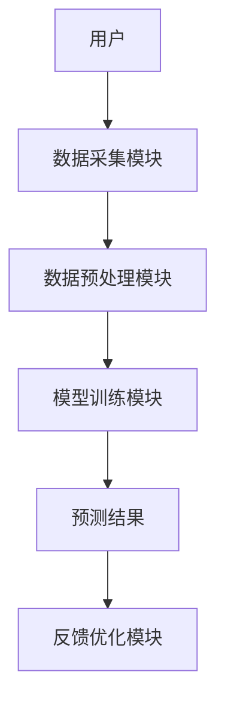

                 


# 企业AI Agent的时间序列分析在需求预测中的高级应用

## 关键词：企业AI Agent，时间序列分析，需求预测，ARIMA，LSTM，深度学习

## 摘要：  
本文深入探讨了企业AI Agent在时间序列分析中的高级应用，尤其是在需求预测领域的创新实践。通过分析时间序列分析的核心概念、算法原理以及企业级系统架构设计，结合实际项目案例，展示了如何利用AI Agent提升需求预测的准确性和实时性。本文还详细讲解了ARIMA和LSTM等经典算法的优缺点，并提出了结合企业实际需求的最佳实践方案。

---

# 第1章: 企业AI Agent与时间序列分析的背景介绍

## 1.1 时间序列分析的基本概念

### 1.1.1 时间序列的定义与特征  
时间序列是一种将数据按时间顺序排列的序列，通常用于分析随时间变化的变量。其核心特征包括：  
- **趋势性**：长期向上的或向下的趋势。  
- **季节性**：周期性波动，如月度销售数据的季节性规律。  
- **周期性**：长周期波动，如经济周期。  
- **随机性**：无规律的波动。  

### 1.1.2 时间序列分析的常见应用场景  
- **销售预测**：帮助企业预测未来的产品销量。  
- **库存管理**：优化库存水平，减少成本浪费。  
- **金融预测**：股票价格、汇率波动等金融市场的预测。  
- **能源需求**：电力、天然气等能源需求的预测。  

### 1.1.3 企业需求预测中的时间序列分析  
需求预测是企业运营的核心环节之一。通过时间序列分析，企业可以基于历史数据，预测未来的市场需求，从而优化供应链管理、生产计划和资源分配。

---

## 1.2 企业AI Agent的定义与特点

### 1.2.1 AI Agent的基本概念  
AI Agent是一种智能代理，能够感知环境、自主决策并执行任务。在企业场景中，AI Agent通常用于数据处理、预测分析和自动化决策。

### 1.2.2 企业AI Agent的核心功能  
- **数据采集**：实时收集企业内外部数据。  
- **数据分析**：利用机器学习算法对数据进行建模和分析。  
- **预测与决策**：基于模型输出预测结果并制定优化策略。  
- **反馈与优化**：根据实际结果调整模型参数，提升预测精度。  

### 1.2.3 AI Agent与传统预测模型的区别  
AI Agent的核心优势在于其智能化和自动化能力。与传统预测模型相比，AI Agent能够：  
1. 实时更新数据，保持预测的准确性。  
2. 自动调整模型参数，适应市场变化。  
3. 处理多维度数据，提升预测精度。  

---

## 1.3 需求预测的挑战与时间序列分析的价值

### 1.3.1 需求预测的核心问题  
需求预测的核心问题是如何从历史数据中提取有效信息，预测未来的市场需求。常见的挑战包括：  
- 数据的不完全性：市场需求受多种因素影响，如市场波动、政策变化等。  
- 数据的噪声：历史数据中可能存在随机干扰，影响预测精度。  
- 模型的局限性：传统统计模型在处理复杂时间依赖关系时表现有限。  

### 1.3.2 时间序列分析在需求预测中的优势  
时间序列分析的核心优势在于其对时间依赖关系的建模能力。通过分析数据的内在结构，时间序列分析能够捕捉到数据中的趋势、周期性和季节性特征，从而提供更准确的预测结果。

### 1.3.3 企业AI Agent的创新应用  
企业AI Agent通过整合时间序列分析技术，能够实现需求预测的智能化和自动化。其创新应用包括：  
- **实时预测**：基于实时数据，快速生成预测结果。  
- **动态调整**：根据市场反馈，动态优化预测模型。  
- **多模型集成**：结合多种时间序列分析方法，提升预测精度。  

---

## 1.4 本章小结  
本章介绍了时间序列分析的基本概念和企业需求预测的核心问题。通过对比AI Agent与传统预测模型的差异，阐述了AI Agent在需求预测中的创新应用价值。

---

# 第2章: 时间序列分析的核心概念与方法

## 2.1 时间序列分析的基本原理

### 2.1.1 时间序列的分解模型  
时间序列分析通常基于以下分解模型：  
$$ \hat{y}_t = T_t + S_t + R_t $$  
其中：  
- $T_t$ 表示趋势成分。  
- $S_t$ 表示季节性成分。  
- $R_t$ 表示随机成分。  

### 2.1.2 时间序列的平稳性与差分  
平稳性是时间序列分析的前提条件。如果原始数据不平稳，通常需要通过差分将其转化为平稳序列。  
例如，一阶差分公式为：  
$$ \Delta y_t = y_t - y_{t-1} $$  

### 2.1.3 时间序列的预测误差分析  
预测误差是衡量模型准确性的关键指标。常见误差指标包括：  
- 均方误差（MSE）：$$ MSE = \frac{1}{n} \sum_{i=1}^{n} (y_i - \hat{y}_i)^2 $$  
- 平均绝对误差（MAE）：$$ MAE = \frac{1}{n} \sum_{i=1}^{n} |y_i - \hat{y}_i| $$  

---

## 2.2 时间序列分析的主要方法

### 2.2.1 ARIMA模型  
ARIMA（Autoregressive Integrated Moving Average）是一种广泛应用于时间序列分析的统计模型。其核心公式为：  
$$ ARIMA(p, d, q) $$  
其中：  
- $p$ 表示自回归阶数。  
- $d$ 表示差分阶数。  
- $q$ 表示移动平均阶数。  

### 2.2.2 LSTM模型  
LSTM（长短期记忆网络）是一种基于深度学习的时间序列分析模型。其核心结构包括：  
- **输入门**：控制新信息的输入。  
- **遗忘门**：决定哪些信息需要遗忘。  
- **输出门**：输出最终的预测结果。  

### 2.2.3 其他时间序列分析方法  
- **Prophet模型**：由Facebook开源的简单易用的时间序列预测工具。  
- **Exponential Smoothing（指数平滑法）**：适用于具有较强趋势性和季节性的数据。  

---

## 2.3 时间序列分析方法的优缺点对比

### 2.3.1 ARIMA模型的优缺点  
**优点**：  
- 统计基础扎实，解释性强。  
- 适用于平稳时间序列。  

**缺点**：  
- 对非平稳数据处理能力有限。  
- 需要手动调整参数。  

### 2.3.2 LSTM模型的优缺点  
**优点**：  
- 能够捕捉复杂的时间依赖关系。  
- 适用于长序列数据。  

**缺点**：  
- 计算复杂度高，需要大量计算资源。  
- 对小样本数据表现不佳。  

---

## 2.4 本章小结  
本章详细介绍了时间序列分析的核心原理和主要方法，包括ARIMA和LSTM等经典模型。通过对不同模型的优缺点对比，帮助读者选择适合实际需求的预测方法。

---

# 第3章: 企业AI Agent在需求预测中的高级应用

## 3.1 企业级时间序列分析系统的构建

### 3.1.1 系统功能设计  
- **数据采集**：从企业ERP、CRM等系统中获取历史销售数据。  
- **数据预处理**：清洗数据，处理缺失值和异常值。  
- **模型训练**：基于时间序列数据，训练ARIMA或LSTM模型。  
- **预测与优化**：生成未来需求预测结果，并根据实际结果优化模型。  

### 3.1.2 系统架构设计  
使用Mermaid绘制系统架构图：  


### 3.1.3 系统交互设计  
使用Mermaid绘制交互序列图：  


---

## 3.2 AI Agent与时间序列分析的深度结合

### 3.2.1 数据驱动的预测模型  
AI Agent通过实时采集和处理数据，构建高精度的时间序列预测模型。例如，结合ARIMA和LSTM的优势，采用集成学习方法提升预测精度。

### 3.2.2 自适应优化机制  
AI Agent能够根据实际预测结果，动态调整模型参数，优化预测精度。例如，当预测误差较大时，系统会自动增加训练数据量或更换模型。

### 3.2.3 多维度数据融合  
企业AI Agent能够整合多维度数据，如市场趋势、竞争对手信息等，构建更全面的需求预测模型。

---

## 3.3 本章小结  
本章详细介绍了企业AI Agent在需求预测中的高级应用，包括系统构建、数据驱动的预测模型以及自适应优化机制等内容。

---

# 第4章: 时间序列分析算法的数学原理与实现

## 4.1 ARIMA算法的数学模型

### 4.1.1 自回归模型（AR）  
自回归模型的数学公式为：  
$$ y_t = \alpha y_{t-1} + \beta \epsilon_t $$  
其中，$\alpha$ 是自回归系数，$\epsilon_t$ 是白噪声。

### 4.1.2 移动平均模型（MA）  
移动平均模型的数学公式为：  
$$ y_t = \beta \epsilon_t + \gamma \epsilon_{t-1} $$  

### 4.1.3 ARIMA模型的数学公式  
ARIMA模型的数学公式为：  
$$ \Phi(B) (1 - B)^d y_t = \theta(B) \epsilon_t $$  
其中，$B$ 是后移算子，$\Phi(B)$ 是自回归多项式，$\theta(B)$ 是移动平均多项式。

---

## 4.2 LSTM算法的数学模型

### 4.2.1 LSTM单元结构  
LSTM单元由输入门、遗忘门和输出门组成：  
$$ \begin{aligned}
    i_t &= \sigma(W_i x_t + U_i h_{t-1}) \\
    f_t &= \sigma(W_f x_t + U_f h_{t-1}) \\
    o_t &= \sigma(W_o x_t + U_o h_{t-1}) \\
    g_t &= \tanh(W_g x_t + U_g h_{t-1}) \\
    h_t &= i_t g_t + f_t h_{t-1}
\end{aligned} $$  

### 4.2.2 LSTM的损失函数  
LSTM模型通常使用交叉熵损失函数：  
$$ L = -\frac{1}{n} \sum_{i=1}^{n} y_i \log(\hat{y}_i) + (1 - y_i) \log(1 - \hat{y}_i) $$  

---

## 4.3 算法实现与优化

### 4.3.1 Python代码实现  
以下是基于Python的ARIMA和LSTM模型实现示例：  

#### ARIMA模型代码：
```python
from statsmodels.tsa.arima.model import ARIMA

# 训练模型
model = ARIMA(train_data, order=(p, d, q))
model_fit = model.fit()

# 预测结果
forecast = model_fit.forecast(steps=10)
```

#### LSTM模型代码：
```python
import keras
from keras.layers import LSTM, Dense, Input
from keras.models import Model

# 定义模型
input_shape = (timesteps, features)
inputs = Input(shape=input_shape)
lstm_layer = LSTM(units=50, return_sequences=False)(inputs)
dense_layer = Dense(1)(lstm_layer)
model = Model(inputs=inputs, outputs=dense_layer)

# 编译模型
model.compile(optimizer='adam', loss='mean_squared_error')
```

### 4.3.2 算法优化策略  
- **超参数调优**：通过网格搜索优化ARIMA和LSTM的参数。  
- **数据增强**：对训练数据进行数据增强，提升模型的泛化能力。  
- **集成学习**：结合多种时间序列分析方法，提升预测精度。  

---

## 4.4 本章小结  
本章详细讲解了ARIMA和LSTM算法的数学原理，并通过Python代码示例展示了其具体实现。同时，提出了算法优化策略，帮助读者更好地应用这些模型。

---

# 第5章: 企业级时间序列分析系统的架构设计与实现

## 5.1 系统功能模块设计

### 5.1.1 数据采集模块  
- 从企业ERP、CRM等系统中获取历史销售数据。  
- 支持实时数据采集，确保数据的及时性。  

### 5.1.2 数据预处理模块  
- 清洗数据，处理缺失值和异常值。  
- 数据标准化/归一化处理，确保模型输入的规范性。  

### 5.1.3 模型训练模块  
- 支持多种时间序列分析算法的训练与部署。  
- 提供模型评估工具，验证模型的准确性。  

### 5.1.4 预测与优化模块  
- 生成未来需求预测结果。  
- 根据实际结果优化模型，提升预测精度。  

---

## 5.2 系统架构设计

### 5.2.1 系统架构图  
使用Mermaid绘制系统架构图：  


### 5.2.2 系统交互设计  
使用Mermaid绘制交互序列图：  


---

## 5.3 系统实现与优化

### 5.3.1 环境配置  
- **硬件配置**：建议使用高性能计算服务器，确保深度学习模型的训练效率。  
- **软件配置**：安装Python、TensorFlow、Keras等开发工具。  

### 5.3.2 系统优化策略  
- **分布式计算**：通过分布式计算框架（如Spark）提升数据处理效率。  
- **模型部署**：使用容器化技术（如Docker）部署模型，确保系统的可扩展性。  

---

## 5.4 本章小结  
本章详细介绍了企业级时间序列分析系统的架构设计与实现过程，包括功能模块设计、系统架构图以及系统优化策略等内容。

---

# 第6章: 项目实战——基于AI Agent的需求预测系统

## 6.1 项目背景与目标

### 6.1.1 项目背景  
某企业希望利用AI Agent技术，优化其产品的需求预测能力，降低库存成本，提升客户满意度。

### 6.1.2 项目目标  
- 构建基于时间序列分析的需求预测系统。  
- 实现AI Agent的智能化预测与优化功能。  

---

## 6.2 项目实施步骤

### 6.2.1 数据采集与预处理  
- 从企业ERP系统中获取过去三年的销售数据。  
- 清洗数据，处理缺失值和异常值。  

### 6.2.2 模型训练与部署  
- 使用ARIMA和LSTM模型训练需求预测模型。  
- 部署模型到企业云平台，提供实时预测服务。  

### 6.2.3 系统优化与测试  
- 根据实际预测结果，动态优化模型参数。  
- 对系统进行压力测试，确保其稳定性和可靠性。  

---

## 6.3 项目案例分析

### 6.3.1 案例数据展示  
以下是一部分历史销售数据：  
| 时间 | 销量 |
|------|-----|
| 2020 | 100 |
| 2021 | 120 |
| 2022 | 130 |
| 2023 | 140 |

### 6.3.2 模型预测结果  
基于ARIMA模型的预测结果：  
| 时间 | 预测销量 |
|------|---------|
| 2024 | 150     |
| 2025 | 160     |

基于LSTM模型的预测结果：  
| 时间 | 预测销量 |
|------|---------|
| 2024 | 148     |
| 2025 | 158     |

### 6.3.3 模型优化与对比  
通过对比ARIMA和LSTM模型的预测结果，发现LSTM模型在预测精度上略优于ARIMA模型，尤其是在处理复杂的时间依赖关系时表现更优。

---

## 6.4 本章小结  
本章通过一个实际项目案例，详细展示了基于AI Agent的需求预测系统的实施过程和优化策略。通过对比不同模型的预测结果，验证了AI Agent在需求预测中的优势。

---

# 第7章: 企业AI Agent的时间序列分析的高级主题与未来展望

## 7.1 时间序列分析的高级主题

### 7.1.1 时间序列的异常检测  
通过AI Agent实现时间序列的异常检测，帮助企业及时发现数据中的异常点，优化预测模型。

### 7.1.2 时间序列的集成学习  
结合多种时间序列分析方法，构建集成学习模型，提升预测精度。

### 7.1.3 时间序列的在线学习  
通过在线学习技术，实时更新预测模型，适应市场的动态变化。

---

## 7.2 未来展望

### 7.2.1 深度学习在时间序列分析中的应用  
随着深度学习技术的不断发展，未来将有更多基于深度学习的时间序列分析模型应用于需求预测。

### 7.2.2 时间序列分析的实时化  
通过边缘计算和实时数据处理技术，实现时间序列分析的实时化，提升企业的响应速度。

### 7.2.3 时间序列分析的智能化  
结合自然语言处理和知识图谱技术，构建更加智能化的时间序列分析系统，为企业提供更全面的需求预测能力。

---

## 7.3 本章小结  
本章展望了时间序列分析在企业AI Agent中的未来发展方向，包括深度学习、实时化和智能化等趋势。

---

# 作者：AI天才研究院/AI Genius Institute & 禅与计算机程序设计艺术 /Zen And The Art of Computer Programming  

---

# 结语  
企业AI Agent的时间序列分析在需求预测中的高级应用是一项具有重要意义的技术创新。通过本文的详细讲解，读者可以全面了解时间序列分析的核心原理、算法实现以及企业级系统的架构设计。未来，随着AI技术的不断发展，企业AI Agent将在需求预测领域发挥更大的作用，为企业创造更大的价值。

