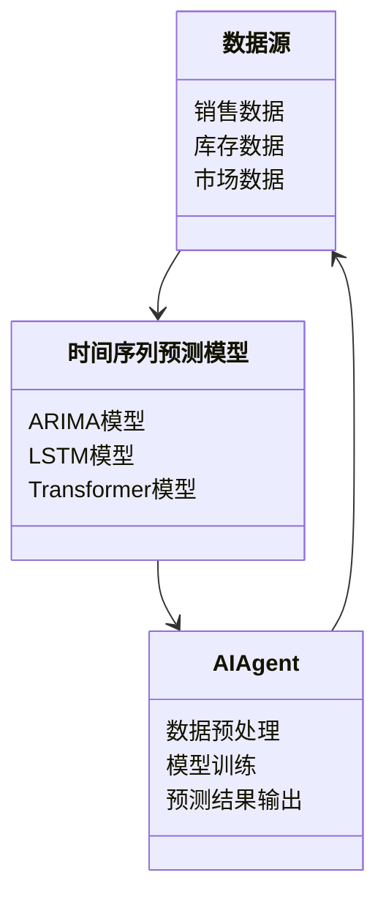

                 


# 企业AI Agent的时间序列预测在需求规划中的应用

> 关键词：企业AI Agent，时间序列预测，需求规划，深度学习，LSTM，ARIMA，强化学习

> 摘要：  
本文系统地探讨了企业AI Agent在时间序列预测中的应用，特别是在需求规划领域。通过分析时间序列预测的核心算法、AI Agent的技术原理以及实际应用场景，本文为读者提供了从理论到实践的全面指导。内容涵盖经典时间序列预测模型、深度学习算法、AI Agent驱动的预测方法，以及系统架构设计与项目实战，旨在帮助企业利用AI技术优化需求规划流程。

---

# 第一部分: 企业AI Agent的时间序列预测基础

## 第1章: 时间序列预测的定义与应用

### 1.1 时间序列预测的定义
- **1.1.1 时间序列的基本概念**  
  时间序列是指按时间顺序排列的数据点，通常用于分析数据的变化趋势和周期性特征。企业中的时间序列数据可以是销售额、库存量、用户活跃度等。

- **1.1.2 时间序列预测的定义与特点**  
  时间序列预测是通过历史数据预测未来值的统计方法，具有以下特点：  
  - 数据的时间依赖性；  
  - 需要考虑趋势、周期性和随机性；  
  - 预测结果的不确定性。

- **1.1.3 企业需求规划中的时间序列预测作用**  
  在需求规划中，时间序列预测可以帮助企业优化库存管理、生产计划和资源分配，从而降低成本、提高效率。

---

## 第2章: AI Agent在时间序列预测中的应用

### 2.1 AI Agent的基本概念
- **2.1.1 AI Agent的定义**  
  AI Agent是一种智能体，能够感知环境、执行任务并做出决策。它在企业中可以用于自动化数据处理、预测分析和决策支持。

- **2.1.2 AI Agent的应用场景**  
  包括需求预测、供应链优化、风险评估等。

- **2.1.3 时间序列预测在需求规划中的具体应用**  
  AI Agent可以通过分析历史销售数据，预测未来的销售趋势，帮助企业制定更精准的需求计划。

---

# 第二部分: 时间序列预测的核心算法与实现

## 第3章: 时间序列预测的主流算法

### 3.1 经典时间序列预测模型
- **3.1.1 ARIMA模型**  
  ARIMA（Auto-Regressive Integrated Moving Average）是一种广泛应用于时间序列预测的统计模型。它通过考虑数据的自回归关系和移动平均效应来预测未来值。

### 3.2 深度学习驱动的时间序列预测
- **3.2.1 LSTM网络**  
  长短期记忆网络（LSTM）是一种特殊的RNN结构，能够有效捕捉时间序列中的长期依赖关系。其核心在于引入门控机制，控制信息的流动。

### 3.3 AI Agent驱动的时间序列预测算法
- **3.3.1 基于强化学习的预测模型**  
  强化学习通过模拟器与环境的交互，优化预测策略。在需求规划中，AI Agent可以通过强化学习不断优化预测模型。

---

## 第4章: 时间序列预测的数学模型与公式

### 4.1 ARIMA模型的数学公式
$$ARIMA(p, d, q) = y_t - \phi_1 y_{t-1} - \dots - \phi_p y_{t-p} = \theta_1 \epsilon_{t-1} + \dots + \theta_q \epsilon_{t-q}$$

### 4.2 LSTM网络的数学模型
$$f_t = \text{LSTM}(h_{t-1}, x_t)$$

### 4.3 Transformer模型的注意力机制
$$\text{Attention}(Q, K, V) = \text{softmax}\left(\frac{QK^T}{\sqrt{d_k}}\right)V$$

---

## 第5章: 时间序列预测的系统架构与设计

### 5.1 系统功能设计
- **5.1.1 领域模型设计**  
  使用Mermaid类图展示系统中各实体之间的关系。



### 5.2 系统架构设计
- **5.2.1 系统架构图**  
  使用Mermaid架构图展示系统的主要组件及其交互关系。


---

## 第6章: 项目实战与案例分析

### 6.1 环境安装
- **6.1.1 安装Python环境**  
  使用Anaconda或虚拟环境安装Python 3.8及以上版本。

### 6.2 系统核心实现源代码
- **6.2.1 LSTM模型实现**  
  ```python
  import torch
  import torch.nn as nn

  class LSTMModel(nn.Module):
      def __init__(self, input_size, hidden_size):
          super(LSTMModel, self).__init__()
          self.lstm = nn.LSTM(input_size, hidden_size)
          self.linear = nn.Linear(hidden_size, 1)

      def forward(self, x):
          out, _ = self.lstm(x)
          out = self.linear(out[-1])
          return out
  ```

### 6.3 实际案例分析
- **6.3.1 案例背景**  
  某电子产品企业的销售数据，希望通过时间序列预测优化库存管理。

- **6.3.2 数据预处理与特征提取**  
  包括数据清洗、缺失值处理、特征工程等步骤。

- **6.3.3 模型训练与优化**  
  使用LSTM模型进行训练，并通过交叉验证优化超参数。

---

## 第7章: 总结与展望

### 7.1 本章小结
本文系统地探讨了企业AI Agent在时间序列预测中的应用，从理论到实践，详细介绍了相关算法、系统架构和项目实现。

### 7.2 未来展望
未来，随着AI技术的不断发展，时间序列预测在需求规划中的应用将更加广泛，AI Agent也将更加智能化和自动化。

### 7.3 注意事项与建议
- 数据质量是预测准确性的重要保障；  
- 模型选择应结合实际业务需求；  
- 需要结合领域知识进行特征工程。

### 7.4 拓展阅读
推荐阅读《时间序列分析》（Shumway & Stoffer, 2017）和《深度学习》（LeCun et al., 2015）。

---

## 作者：AI天才研究院/AI Genius Institute & 禅与计算机程序设计艺术 /Zen And The Art of Computer Programming

---

**备注**：本文仅为目录和部分关键内容的展示，完整文章将包含每个章节的详细讲解、代码实现和案例分析。

