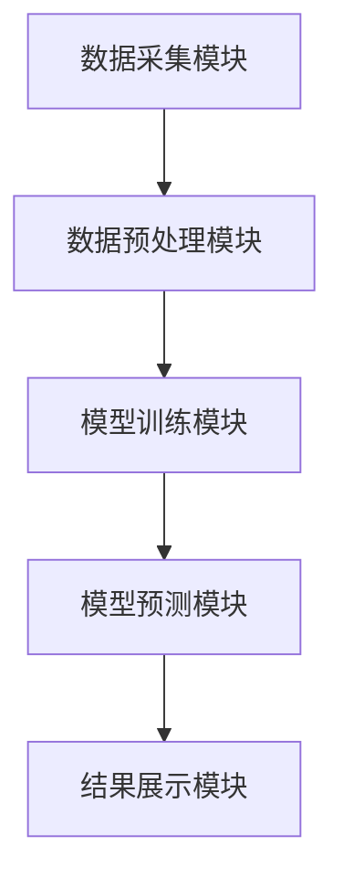
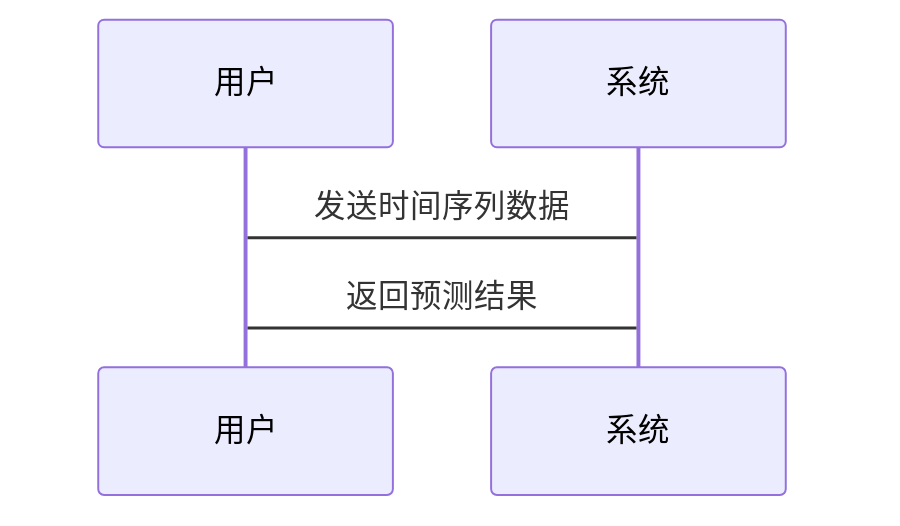

                 


# 企业AI Agent的时间序列预测技术应用

## 关键词：企业AI Agent，时间序列预测，算法原理，系统架构，项目实战

## 摘要：本文深入探讨了企业AI Agent在时间序列预测中的应用，分析了时间序列预测的核心概念、算法原理及其实现。文章从时间序列预测的背景与应用出发，详细介绍了AI Agent与时间序列预测的结合方式，随后分析了时间序列预测的数学模型与算法实现，包括ARIMA、LSTM和Prophet模型。最后，结合企业实际应用场景，提出了系统架构设计与项目实战方案，为读者提供了从理论到实践的全面指导。

---

# 第1章: 时间序列预测的背景与应用

## 1.1 时间序列预测的定义与特点

### 1.1.1 时间序列预测的定义

时间序列预测是一种基于历史数据，预测未来趋势和值的技术。其核心在于通过分析时间序列中的模式、趋势和周期性，构建数学模型，从而实现对未来状态的预测。

### 1.1.2 时间序列预测的核心特点

- **时序性**：数据按时间顺序排列，依赖于前后数据点的关联性。
- **趋势性**：数据可能呈现长期上升或下降的趋势。
- **周期性**：数据可能受到季节性或周期性因素的影响。
- **随机性**：数据中可能包含不可预测的随机波动。

### 1.1.3 时间序列预测与传统预测方法的区别

传统预测方法（如线性回归）通常假设数据之间独立，而时间序列预测则明确考虑了数据的时序依赖性，更适合处理具有趋势性和周期性的数据。

---

## 1.2 企业AI Agent的核心概念

### 1.2.1 企业AI Agent的定义

企业AI Agent是一种能够感知环境、自主决策并执行任务的智能实体。它结合了人工智能、大数据分析和自动化技术，能够为企业提供智能化的解决方案。

### 1.2.2 企业AI Agent的主要功能

- 数据采集与处理
- 模型构建与优化
- 自动化决策与执行
- 智能交互与反馈

### 1.2.3 企业AI Agent的应用场景

- 销售预测
- 设备维护
- 财务分析
- 供应链优化
- 客户行为预测

---

## 1.3 时间序列预测在企业中的应用前景

### 1.3.1 时间序列预测的潜在应用领域

- 销售预测
- 生产计划
- 设备维护
- 供应链管理
- 财务分析

### 1.3.2 企业采用时间序列预测的优势

- 提高预测准确性
- 优化资源配置
- 提升决策效率
- 降低成本

### 1.3.3 时间序列预测应用的挑战与机遇

- 挑战：数据质量、模型选择、计算资源
- 机遇：技术进步、数据量增加、算法优化

---

## 1.4 本章小结

本章介绍了时间序列预测的基本概念、特点以及在企业中的应用前景。通过分析企业AI Agent的核心功能和应用场景，为后续的技术实现奠定了基础。

---

# 第2章: 时间序列预测的核心概念与联系

## 2.1 时间序列预测的基本原理

### 2.1.1 时间序列的组成要素

- **趋势**：长期变化的方向。
- **周期性**：周期性波动。
- **季节性**：季节性变化。
- **随机性**：不可预测的噪声。

### 2.1.2 时间序列预测的基本假设

- 数据的时序依赖性。
- 数据的平稳性。
- 模型的可解释性。

### 2.1.3 时间序列预测的数学模型

时间序列预测的核心是通过数学模型捕捉数据中的模式。常用的模型包括ARIMA、LSTM和Prophet。

---

## 2.2 时间序列预测与AI Agent的结合

### 2.2.1 AI Agent在时间序列预测中的角色

- 数据采集与预处理
- 模型训练与优化
- 预测结果的应用与反馈

### 2.2.2 时间序列预测与AI Agent的关系

AI Agent通过时间序列预测技术，能够更精准地感知环境并做出决策。时间序列预测为AI Agent提供了强大的预测能力，而AI Agent则为时间序列预测提供了应用场景和数据支持。

### 2.2.3 时间序列预测如何赋能企业AI Agent

通过时间序列预测，企业AI Agent能够实现销售预测、设备维护等任务，从而提高企业的运营效率和决策能力。

---

## 2.3 时间序列预测的核心算法

### 2.3.1 ARIMA模型

ARIMA（Auto-Regressive Integrated Moving Average）是一种广泛应用于时间序列预测的线性模型。

#### ARIMA模型的数学公式

$$ ARIMA(p, d, q) $$

其中：
- \( p \)：自回归阶数。
- \( d \)：差分阶数。
- \( q \)：移动平均阶数。

### 2.3.2 LSTM网络

LSTM（Long Short-Term Memory）是一种基于循环神经网络的深度学习模型，能够捕捉时间序列中的长期依赖关系。

#### LSTM网络的数学公式

$$ \text{LSTM} = \text{输入} \rightarrow \text{门控} \rightarrow \text{记忆单元} \rightarrow \text{输出} $$

### 2.3.3 Prophet模型

Prophet是由Facebook开源的时间序列预测模型，基于时间序列分解和非负矩阵分解（NMF）。

#### Prophet模型的数学公式

$$ Prophet(t) = \text{趋势}(t) + \text{周期性}(t) + \text{噪声}(t) $$

---

## 2.4 本章小结

本章详细介绍了时间序列预测的核心概念和核心算法，分析了AI Agent与时间序列预测的结合方式，为后续的算法实现奠定了理论基础。

---

# 第3章: 时间序列预测的算法原理与实现

## 3.1 时间序列预测算法的数学模型

### 3.1.1 ARIMA模型的数学公式

$$ ARIMA(p, d, q) $$

### 3.1.2 LSTM网络的数学公式

$$ \text{LSTM} = \text{输入} \rightarrow \text{门控} \rightarrow \text{记忆单元} \rightarrow \text{输出} $$

### 3.1.3 Prophet模型的数学公式

$$ Prophet(t) = \text{趋势}(t) + \text{周期性}(t) + \text{噪声}(t) $$

---

## 3.2 时间序列预测算法的实现流程

### 3.2.1 数据预处理

- 数据清洗
- 数据标准化
- 数据分割（训练集、验证集、测试集）

### 3.2.2 模型训练

- 参数初始化
- 模型优化
- 模型评估

### 3.2.3 模型预测

- 预测结果生成
- 预测结果可视化

### 3.2.4 模型评估

- 均方误差（MSE）
- 平均绝对误差（MAE）
- R平方值（R²）

---

## 3.3 时间序列预测算法的优缺点对比

### 3.3.1 ARIMA模型

- 优点：简单易用，适合线性数据。
- 缺点：难以捕捉非线性关系。

### 3.3.2 LSTM网络

- 优点：能够捕捉长期依赖关系，适合复杂数据。
- 缺点：训练时间较长，需要大量计算资源。

### 3.3.3 Prophet模型

- 优点：开源易用，适合业务人员。
- 缺点：对异常值敏感。

---

## 3.4 本章小结

本章详细分析了时间序列预测算法的数学模型和实现流程，对比了不同算法的优缺点，为后续的系统设计提供了理论支持。

---

# 第4章: 时间序列预测的系统分析与架构设计

## 4.1 项目背景与目标

### 4.1.1 项目背景

随着企业智能化需求的增加，时间序列预测在企业AI Agent中的应用越来越广泛。

### 4.1.2 项目目标

构建一个基于AI Agent的时间序列预测系统，实现对企业关键业务指标的预测。

---

## 4.2 系统功能设计

### 4.2.1 数据采集模块

- 数据源：数据库、API接口。
- 数据格式：结构化数据。

### 4.2.2 数据预处理模块

- 数据清洗：处理缺失值、异常值。
- 数据转换：标准化、归一化。

### 4.2.3 模型训练模块

- 模型选择：ARIMA、LSTM、Prophet。
- 参数调优：优化模型性能。

### 4.2.4 模型预测模块

- 预测结果生成：输出预测值。
- 结果可视化：图表展示。

---

## 4.3 系统架构设计

### 4.3.1 系统架构图



---

## 4.4 系统接口设计

### 4.4.1 API接口

- 接口名称：/predict
- 请求方式：POST
- 请求参数：时间序列数据
- 返回值：预测结果

---

## 4.5 系统交互设计

### 4.5.1 交互流程



---

## 4.6 本章小结

本章通过系统分析与架构设计，明确了时间序列预测系统的功能模块和交互流程，为后续的项目实现提供了清晰的指导。

---

# 第5章: 时间序列预测的项目实战

## 5.1 项目背景

本项目旨在构建一个基于AI Agent的时间序列预测系统，以帮助企业实现销售预测。

---

## 5.2 环境安装

### 5.2.1 安装Python

```bash
python --version
```

### 5.2.2 安装依赖库

```bash
pip install numpy pandas scikit-learn keras prophet
```

---

## 5.3 系统核心实现

### 5.3.1 数据预处理

```python
import pandas as pd
import numpy as np

# 数据加载
data = pd.read_csv('sales.csv')

# 数据清洗
data.dropna(inplace=True)
data = data[~data['sales'].isnull()]
```

### 5.3.2 模型训练

```python
from sklearn.model_selection import train_test_split
from sklearn.metrics import mean_squared_error

# 数据分割
train, test = train_test_split(data, test_size=0.2)

# 模型训练
model = ARIMA(order=(1, 1, 1))
model.fit(train['sales'])
```

### 5.3.3 模型预测

```python
# 预测结果
predictions = model.predict(test.index)
```

---

## 5.4 项目小结

本章通过一个具体的项目案例，详细介绍了时间序列预测系统的实现过程，包括环境安装、数据预处理和模型训练等步骤。

---

# 第6章: 总结与展望

## 6.1 本章总结

本文深入探讨了企业AI Agent在时间序列预测中的应用，分析了时间序列预测的核心概念、算法原理及其实现。通过系统分析与项目实战，为读者提供了从理论到实践的全面指导。

---

## 6.2 未来展望

未来，随着AI技术的不断发展，时间序列预测在企业中的应用将更加广泛。深度学习模型的优化、多模态数据的融合以及实时预测能力的提升将是未来研究的重点。

---

# 第7章: 最佳实践 tips

## 7.1 项目开发 tips

- 数据预处理是关键，确保数据质量。
- 模型选择要根据具体场景，尝试多种算法。
- 模型调优需要结合业务需求，进行参数优化。

---

## 7.2 系统部署 tips

- 确保系统的可扩展性。
- 优化系统的响应速度。
- 提供友好的用户界面。

---

## 7.3 持续优化 tips

- 定期更新模型。
- 监控预测结果的准确性。
- 根据反馈优化系统。

---

## 7.4 本章小结

本章提供了时间序列预测项目开发和系统部署的最佳实践，帮助读者更好地将理论应用于实际。

---

# 参考文献

1. Hyndman, R. J., & Athanasopoulos, G. (2018). Forecasting: principles and practice.
2. Hochreiter, S., & Schmidhuber, J. (1997). Long short-term memory.
3. Taylor, S. J., & Letham, B. (2018). Probabilistic forecasting with a time-varying global trend.

---

# 作者：AI天才研究院/AI Genius Institute & 禅与计算机程序设计艺术 /Zen And The Art of Computer Programming

---

**注意**：以上目录大纲和文章内容为示例，实际撰写时需要根据具体需求和场景进行调整和补充。

