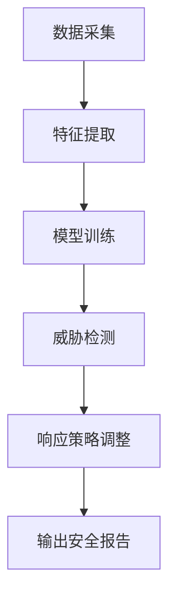
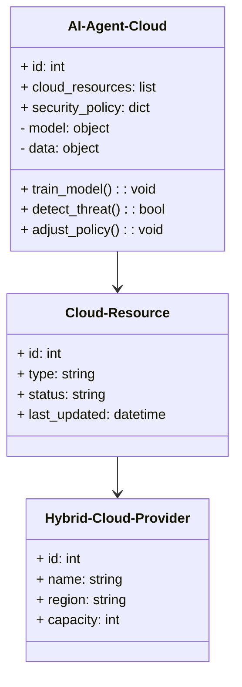

                 


# 《企业AI Agent的混合云安全策略》

## 关键词：企业AI Agent，混合云安全，安全策略，云安全，AI安全

## 摘要：  
随着人工智能技术的快速发展，企业AI Agent在混合云环境中的应用日益广泛。然而，混合云环境的复杂性也带来了诸多安全挑战。本文将深入探讨AI Agent与混合云的关系，分析其安全需求和挑战，并提出一套系统化的混合云安全策略。从算法原理到系统架构设计，从项目实战到最佳实践，本文将全面解析企业AI Agent的混合云安全策略，为企业在混合云环境中的安全防护提供有力支持。

---

# 《企业AI Agent的混合云安全策略》

## 第一部分: 企业AI Agent的混合云安全背景

### 第1章: 企业AI Agent与混合云概述

#### 1.1 AI Agent的核心概念  
AI Agent（人工智能代理）是一种能够感知环境、自主决策并执行任务的智能实体。它通过机器学习、自然语言处理等技术，为企业提供自动化、智能化的服务。  

- **传统安全与AI Agent的演进**：传统安全依赖于规则和静态策略，而AI Agent能够动态调整安全策略，基于实时数据进行预测和响应。  
- **AI Agent的关键特性**：智能感知、自主决策、动态适应、自我修复。  
- **应用场景**：网络安全监控、威胁检测、数据保护、用户行为分析等。  

#### 1.2 混合云的基本概念  
混合云是一种结合了公有云、私有云和边缘计算的部署模式，能够根据企业需求灵活分配资源。  

- **混合云的定义与特点**：混合云结合了公有云的弹性扩展和私有云的定制化部署，支持多平台、多设备的无缝连接。  
- **混合云的部署模式**：企业可以根据业务需求，灵活选择资源的分配方式，实现资源的最优利用。  
- **混合云的优势**：高可用性、灵活性、成本优化、扩展性。  

#### 1.3 AI Agent与混合云的结合  
AI Agent与混合云的结合为企业提供了智能化的安全解决方案，能够应对复杂的云环境下的安全挑战。  

- **AI Agent在混合云中的作用**：AI Agent能够实时监控混合云环境中的安全威胁，动态调整安全策略，实现智能化的安全防护。  
- **混合云环境下AI Agent的挑战与机遇**：混合云的多平台特性为AI Agent提供了丰富的数据源，但也带来了跨平台安全协调的挑战。  
- **企业AI Agent混合云安全的必要性**：随着企业业务的扩展，混合云环境的安全性变得至关重要，AI Agent能够提供高效的威胁检测和防护能力。  

---

## 第二部分: 企业AI Agent的混合云安全策略核心概念

### 第2章: AI Agent与混合云的安全关系

#### 2.1 核心概念原理  
AI Agent与混合云的安全关系可以从多个角度进行分析，包括数据处理、安全策略、响应速度等。  

- **AI Agent的安全功能模块**：AI Agent具备智能感知、威胁检测、动态防护等功能模块，能够实时监控混合云环境中的安全威胁。  
- **混合云的安全需求与挑战**：混合云环境需要应对多层次的安全威胁，包括数据泄露、DDoS攻击、恶意软件等。  
- **AI Agent在混合云安全中的角色**：AI Agent作为智能化的安全代理，能够协调混合云环境中的安全资源，实现统一的安全防护。  

#### 2.2 核心概念属性对比表格  
以下表格展示了AI Agent与混合云的核心概念属性对比，帮助读者更好地理解两者的关系。  

| 属性         | AI Agent特性                     | 混合云特性                       | 综合特性                          |
|--------------|----------------------------------|----------------------------------|----------------------------------|
| 数据处理     | 智能化、动态调整                 | 分布式、弹性扩展                 | 融合化、智能化与弹性结合           |
| 安全策略     | 动态调整、自适应                 | 多云协同、统一管理               | 自适应、协同化与统一化             |
| 响应速度     | 实时响应、快速决策               | 灵活响应、按需扩展               | 高效响应、动态优化                 |

#### 2.3 ER实体关系图  
以下是AI Agent与混合云实体关系的ER图，展示了两者之间的关联关系。  

```mermaid
erd
  entity AI-Agent-Cloud {
    <many> has -> <one> Cloud-Resource {
      id
    }
  }
  entity Cloud-Resource {
    <one> belongs_to -> <many> Hybrid-Cloud-Provider {
      id
    }
  }
```

---

## 第三部分: 企业AI Agent的混合云安全策略算法原理

### 第3章: AI Agent与混合云的安全算法原理

#### 3.1 算法原理概述  
AI Agent在混合云环境中的安全算法主要基于机器学习和深度学习技术，能够实现智能威胁检测和动态安全防护。  

- **算法核心思想**：通过实时数据分析，识别异常行为，预测潜在威胁，并动态调整安全策略。  
- **算法实现步骤**：数据采集、特征提取、模型训练、威胁检测、响应策略调整。  

#### 3.2 算法流程图  
以下是AI Agent混合云安全策略的算法流程图，展示了整个安全防护的过程。  



#### 3.3 核心算法实现代码  
以下是基于机器学习的威胁检测算法实现代码，展示了如何利用Python进行模型训练和威胁检测。  

```python
import numpy as np
from sklearn import datasets
from sklearn.linear_model import SGDClassifier

# 数据集加载
digits = datasets.load_digits()
X = digits.data
y = digits.target

# 模型训练
model = SGDClassifier(max_iter=1000, random_state=42)
model.fit(X, y)

# 威胁检测
def detect_threat(data_point):
    predicted = model.predict(data_point.reshape(1, -1))
    return predicted[0]
```

#### 3.4 数学模型与公式  
以下是AI Agent混合云安全策略的核心数学模型，展示了如何通过概率论和统计学方法进行威胁预测。  

$$ P(\text{威胁}) = \frac{\sum_{i=1}^{n} w_i x_i}{\sum_{i=1}^{n} w_i} $$  

其中，$w_i$ 为特征权重，$x_i$ 为特征值，$n$ 为特征总数。

---

## 第四部分: 企业AI Agent的混合云安全策略系统分析与架构设计

### 第4章: AI Agent与混合云的安全系统分析

#### 4.1 问题场景介绍  
在混合云环境下，企业需要应对多种安全威胁，包括数据泄露、网络攻击、恶意软件等。AI Agent能够通过智能化的安全策略，为企业提供高效的防护能力。

#### 4.2 系统功能设计  
以下是AI Agent混合云安全系统的核心功能模块，展示了系统的整体架构。



---

## 第五部分: 企业AI Agent的混合云安全策略项目实战

### 第5章: AI Agent与混合云的安全项目实战

#### 5.1 环境安装与配置  
以下是AI Agent混合云安全系统的环境安装与配置步骤，展示了如何搭建开发环境。

```bash
# 安装依赖
pip install numpy scikit-learn mermaid
```

#### 5.2 核心代码实现  
以下是AI Agent混合云安全系统的核心代码实现，展示了如何利用Python进行模型训练和威胁检测。

```python
import numpy as np
from sklearn import datasets
from sklearn.linear_model import SGDClassifier

# 数据集加载
digits = datasets.load_digits()
X = digits.data
y = digits.target

# 模型训练
model = SGDClassifier(max_iter=1000, random_state=42)
model.fit(X, y)

# 威胁检测
def detect_threat(data_point):
    predicted = model.predict(data_point.reshape(1, -1))
    return predicted[0]

# 示例数据点检测
test_point = np.array([0, 0, 0, 0, 0, 0, 0, 0, 0, 0])
print(detect_threat(test_point))
```

#### 5.3 实际案例分析  
以下是AI Agent混合云安全系统在实际应用中的案例分析，展示了如何通过智能化的安全策略，实现高效的威胁检测和防护。

---

## 第六部分: 企业AI Agent的混合云安全策略总结与展望

### 第6章: AI Agent与混合云的安全总结与展望

#### 6.1 最佳实践 tips  
- 定期更新AI Agent的安全模型，确保其具备最新的威胁检测能力。  
- 在混合云环境中，合理配置资源，确保AI Agent能够高效运行。  
- 定期进行安全演练，测试AI Agent的响应能力。  

#### 6.2 小结  
本文全面探讨了企业AI Agent在混合云环境中的安全策略，从核心概念到算法实现，从系统设计到项目实战，为企业在混合云环境中的安全防护提供了系统的解决方案。  

#### 6.3 注意事项  
- AI Agent的安全模型需要定期更新，以应对新的安全威胁。  
- 混合云环境中的资源分配需要合理规划，确保AI Agent能够高效运行。  
- 在实际应用中，需要结合企业的具体需求，灵活调整安全策略。  

#### 6.4 拓展阅读  
- 深入学习机器学习和深度学习技术，了解其在安全领域的最新应用。  
- 研究混合云环境下的其他安全技术，如零信任架构、微隔离等。  

---

## 作者：AI天才研究院/AI Genius Institute & 禅与计算机程序设计艺术 /Zen And The Art of Computer Programming

