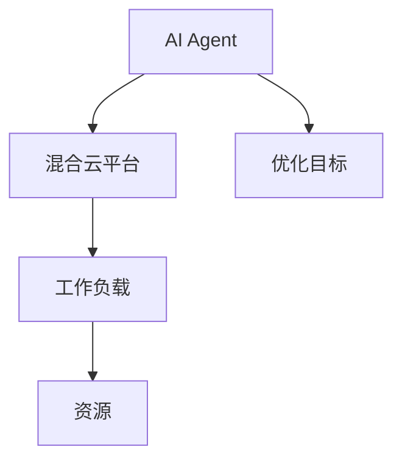
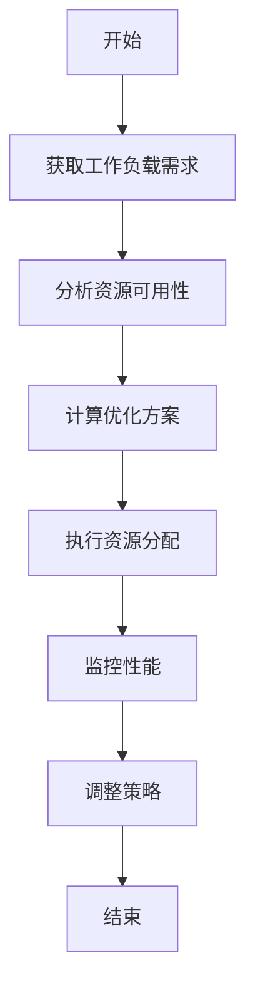
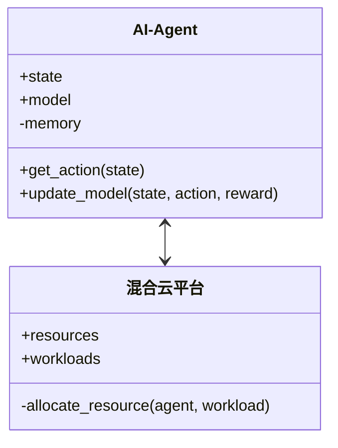
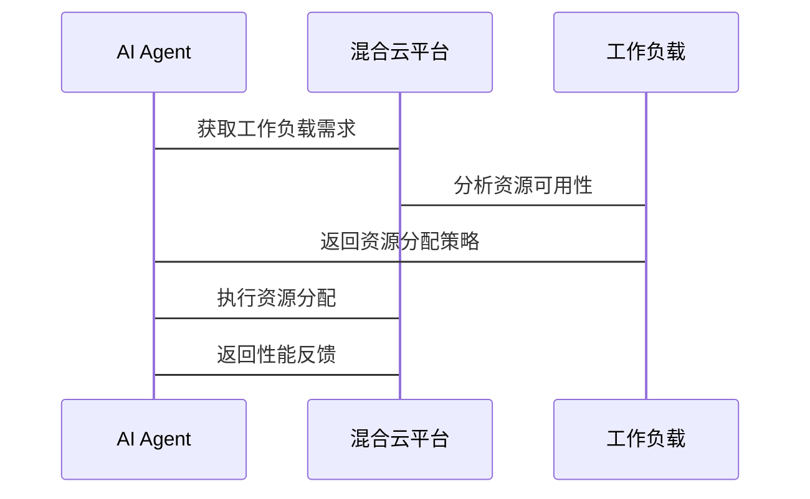

                 


# 《企业AI Agent的混合云工作负载优化》

---

## 关键词：
- 企业AI Agent
- 混合云
- 工作负载优化
- 强化学习
- 系统架构
- 分布式计算

---

## 摘要：
随着企业对混合云架构的需求不断增加，优化工作负载以提高性能和降低成本成为关键挑战。AI Agent在这一过程中扮演了重要角色，通过智能决策和自适应优化算法，实现混合云资源的高效分配。本文将从背景介绍、核心概念、算法原理、系统架构、项目实战等多个方面，全面探讨企业AI Agent在混合云工作负载优化中的应用，帮助读者理解如何利用AI技术解决实际问题。

---

## 第一部分: 企业AI Agent的混合云工作负载优化概述

### 第1章: 背景介绍

#### 1.1 问题背景
混合云作为一种灵活的云架构，允许企业在公有云、私有云和边缘计算之间动态分配资源。然而，随着工作负载的复杂性和多样性的增加，传统的手动优化方法已难以满足需求。AI Agent通过智能决策和自动化优化，为企业提供了更高效的解决方案。

#### 1.2 问题描述
混合云环境中的工作负载优化涉及多个方面，包括资源分配的动态性、成本与性能的平衡，以及多租户环境下的资源隔离。传统的方法依赖于静态规则和手动调整，难以应对快速变化的工作负载需求。

#### 1.3 问题解决
AI Agent通过强化学习、分布式计算和动态资源分配算法，能够实时感知工作负载需求，动态调整资源分配策略，从而实现高效的优化。

#### 1.4 边界与外延
混合云的定义包括公有云、私有云和边缘计算的组合，而AI Agent的边界在于其智能决策能力。本文将重点讨论AI Agent在混合云中的优化作用，不涉及其他领域。

#### 1.5 概念结构与核心要素
- **混合云工作负载优化**：通过AI Agent实现资源的动态分配和优化。
- **AI Agent**：具备智能决策和自适应优化能力。
- **资源分配**：包括计算、存储和网络资源的分配。

---

## 第二部分: 核心概念与联系

### 第2章: AI Agent与混合云的关系

#### 2.1 AI Agent的核心原理
AI Agent通过强化学习机制，学习最优的资源分配策略。其核心包括智能感知、决策推理和执行反馈三个阶段。

#### 2.2 混合云工作负载的特点
- **资源异构性**：不同云服务提供商的资源性能和价格差异显著。
- **服务多样性**：支持多种类型的工作负载，如计算密集型和I/O密集型。
- **成本敏感性**：需要在性能和成本之间找到平衡点。

#### 2.3 核心概念对比分析
| 概念       | 描述                                                                 |
|------------|----------------------------------------------------------------------|
| AI Agent   | 具备智能决策和优化能力的代理系统                                             |
| 混合云      | 结合公有云、私有云和边缘计算的多态云架构                                     |
| 工作负载优化 | 通过动态调整资源分配策略，提高性能并降低成本                               |

#### 2.4 ER实体关系图


---

## 第三部分: 算法原理讲解

### 第3章: 混合云工作负载优化算法

#### 3.1 算法原理
AI Agent通过强化学习算法，动态调整资源分配策略。其核心包括状态感知、动作选择和奖励机制。

#### 3.2 算法流程图


#### 3.3 算法实现代码
```python
import numpy as np
from keras import models, layers

# 定义强化学习模型
class AI-Agent:
    def __init__(self, state_size, action_size):
        self.model = self.build_model(state_size, action_size)
    
    def build_model(self, state_size, action_size):
        model = models.Sequential()
        model.add(layers.Dense(64, activation='relu', input_dim=state_size))
        model.add(layers.Dense(action_size, activation='linear'))
        model.compile(optimizer='adam', loss='mse')
        return model
    
    def get_action(self, state):
        state = np.array([state])
        prediction = self.model.predict(state)
        action = np.argmax(prediction[0])
        return action
    
    def update_model(self, state, action, reward):
        # 简化版的训练逻辑，实际应用中需要完整的强化学习算法
        self.model.fit(np.array([state]), np.array([reward]), epochs=1, verbose=0)
```

#### 3.4 数学公式
优化目标是最小化成本函数：
$$ \text{Cost} = \sum_{i=1}^{n} c_i \cdot x_i $$
其中，$c_i$是资源$R_i$的成本，$x_i$是分配的资源数量。

资源分配约束：
$$ \sum_{i=1}^{n} x_i \leq \text{Total Resources} $$
$$ x_i \geq 0 $$

---

## 第四部分: 系统分析与架构设计

### 第4章: 系统分析与架构设计

#### 4.1 系统功能设计
- **工作负载感知**：实时监控工作负载需求。
- **资源分配**：基于强化学习算法动态分配资源。
- **性能优化**：通过反馈机制不断优化资源分配策略。

#### 4.2 领域模型类图


#### 4.3 系统架构设计


#### 4.4 接口设计
- AI Agent与混合云平台之间的通信接口。
- 工作负载监控接口。

#### 4.5 交互序列图


---

## 第五部分: 项目实战

### 第5章: 项目实战

#### 5.1 环境安装
- 安装Python、TensorFlow和Kubernetes。

#### 5.2 核心实现代码
```python
def optimize_workload(agent, workload):
    current_state = get_current_state(workload)
    action = agent.get_action(current_state)
    reward = calculate_reward(workload, action)
    agent.update_model(current_state, action, reward)
    return action
```

#### 5.3 案例分析
- 某企业混合云环境中的工作负载优化案例。
- 分析优化前后的性能和成本变化。

#### 5.4 代码应用解读
详细解读代码实现，包括AI Agent的训练、资源分配策略的执行等。

---

## 第六部分: 优化策略与未来趋势

### 第6章: 优化策略

#### 6.1 最佳实践
- 定期更新AI Agent的训练数据。
- 监控系统性能，及时调整优化策略。

#### 6.2 小结
通过AI Agent实现混合云工作负载优化，能够显著提高资源利用率并降低成本。

#### 6.3 注意事项
- 数据隐私和安全问题。
- 系统的可扩展性和容错性。

#### 6.4 拓展阅读
- 深度学习与强化学习的结合。
- 分布式系统优化的前沿技术。

---

## 第七部分: 未来趋势

### 第7章: 未来趋势

#### 7.1 技术发展
- 更高效的强化学习算法。
- 更智能的自适应优化系统。

#### 7.2 研究方向
- 多目标优化。
- 高可用性与容错性。

---

## 附录

### 附录A: 代码实现

```python
# AI Agent类实现
class AI-Agent:
    def __init__(self):
        self.model = self.build_model()
    
    def build_model(self):
        # 模型构建代码
        pass
    
    def get_action(self, state):
        # 动作选择代码
        pass
    
    def update_model(self, state, action, reward):
        # 模型更新代码
        pass
```

### 附录B: 图表


---

## 作者

作者：AI天才研究院/AI Genius Institute & 禅与计算机程序设计艺术 /Zen And The Art of Computer Programming

