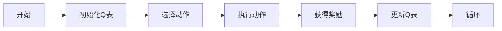
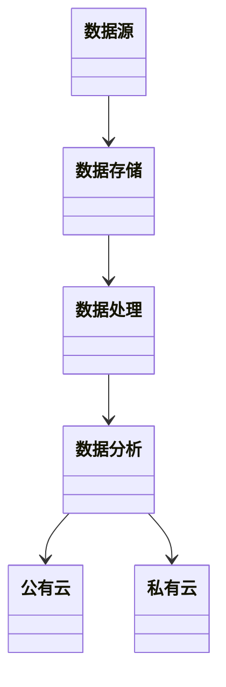
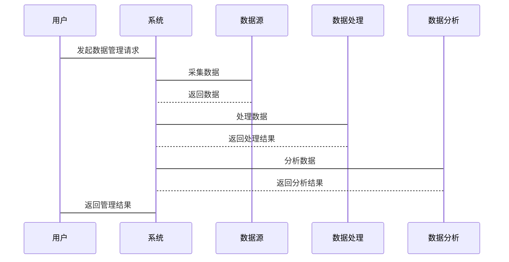

                 


# 企业AI Agent的混合云数据管理策略

> 关键词：企业AI Agent，混合云数据管理，强化学习，系统架构设计，数据一致性，可用性优化

> 摘要：本文深入探讨了企业AI Agent在混合云数据管理中的应用策略，结合强化学习算法和系统架构设计，提出了创新性的解决方案。通过详细分析问题背景、核心概念和算法原理，并结合实际项目案例，为读者提供了从理论到实践的全面指导。

---

## 第一部分: 企业AI Agent与混合云数据管理概述

### 第1章: 企业AI Agent与混合云数据管理概述

#### 1.1 企业AI Agent的定义与背景
##### 1.1.1 AI Agent的基本概念
人工智能代理（AI Agent）是指能够感知环境并采取行动以实现目标的智能实体。它能够通过数据输入、模型推理和决策制定，帮助企业在复杂环境中实现自动化和智能化。

##### 1.1.2 企业AI Agent的核心特征
企业AI Agent具有以下核心特征：
- **自主性**：能够在没有人工干预的情况下运行。
- **反应性**：能够实时感知环境变化并做出响应。
- **目标导向**：通过目标驱动进行决策和行动。
- **学习能力**：能够通过经验改进自身的性能。

##### 1.1.3 混合云数据管理的背景与需求
随着企业数据量的快速增长，单一的公有云或私有云解决方案已无法满足企业的所有需求。混合云数据管理通过结合公有云和私有云的优势，为企业提供了更灵活、更经济的解决方案。

---

#### 1.2 混合云数据管理的挑战与机遇
##### 1.2.1 混合云数据管理的挑战
- 数据一致性：公有云和私有云中的数据需要保持一致性和完整性。
- 数据安全：数据在不同云环境中的传输和存储需要确保安全性。
- 成本控制：如何在混合云环境中实现成本优化是关键挑战。

##### 1.2.2 企业AI Agent在混合云中的作用
企业AI Agent可以通过智能决策优化混合云数据管理的资源分配和成本控制，同时提高系统的可用性和可靠性。

##### 1.2.3 数据管理的未来趋势
随着AI技术的不断发展，数据管理将更加智能化和自动化，企业AI Agent将在这一过程中发挥越来越重要的作用。

---

#### 1.3 本章小结
- **核心概念回顾**：企业AI Agent和混合云数据管理的基本概念和特征。
- **未来展望**：数据管理将更加依赖AI技术，混合云环境下的数据管理将更加智能化。

---

## 第二部分: 混合云数据管理的核心概念与原理

### 第2章: 混合云数据管理的核心概念

#### 2.1 数据管理的基本概念
##### 2.1.1 数据管理的定义
数据管理是指对数据的采集、存储、处理、分析和应用的全过程进行管理和优化。

##### 2.1.2 数据管理的关键属性
- 数据一致性：确保数据在不同系统中的表示一致。
- 数据可用性：确保数据在需要时可以被访问。
- 数据安全性：保护数据不被未经授权的访问或篡改。

##### 2.1.3 数据管理的核心要素
- 数据源：数据的来源，可能是公有云或私有云。
- 数据存储：数据的存储位置和方式。
- 数据处理：数据的清洗、转换和分析。

---

#### 2.2 混合云数据管理的特点
##### 2.2.1 公有云与私有云的对比
| 特性           | 公有云                 | 私有云                 |
|----------------|----------------------|----------------------|
| 成本           | 按需付费               | 高固定成本             |
| 灵活性          | 高                   | 较低                   |
| 安全性          | 较低                   | 高                   |

##### 2.2.2 混合云数据管理的复杂性
混合云环境下的数据管理需要同时考虑公有云和私有云的特点，因此在数据一致性、资源分配和安全性方面更具挑战性。

##### 2.2.3 数据一致性与可用性要求
在混合云环境中，数据一致性是确保数据在不同系统中一致性的关键，而数据可用性则是确保数据在需要时可以被访问的核心。

---

#### 2.3 AI Agent在数据管理中的角色
##### 2.3.1 AI Agent的智能决策能力
企业AI Agent能够通过强化学习等算法，优化数据管理的决策过程。

##### 2.3.2 数据管理中的自动化需求
AI Agent能够实现数据管理的自动化，减少人工干预。

##### 2.3.3 AI Agent与数据管理的结合点
- 数据一致性维护：AI Agent可以实时监控数据的一致性，发现不一致时自动修复。
- 资源分配优化：AI Agent可以根据负载情况动态分配资源。

---

## 第三部分: 混合云数据管理的算法原理

### 第3章: 基于强化学习的混合云数据管理算法

#### 3.1 强化学习的基本原理
##### 3.1.1 强化学习的定义
强化学习是一种机器学习方法，通过智能体与环境的交互，学习如何采取行动以最大化累积奖励。

##### 3.1.2 状态、动作与奖励的定义
- 状态（State）：环境的当前情况。
- 动作（Action）：智能体采取的行动。
- 奖励（Reward）：智能体采取行动后获得的反馈。

##### 3.1.3 Q-learning算法简介
Q-learning是一种经典的强化学习算法，通过更新Q值表来学习最优策略。

---

#### 3.2 混合云数据管理中的强化学习模型
##### 3.2.1 模型输入与输出
- 输入：系统负载、数据一致性状态。
- 输出：资源分配策略。

##### 3.2.2 状态空间与动作空间设计
- 状态空间：系统负载、数据一致性状态。
- 动作空间：资源分配策略。

##### 3.2.3 奖励机制设计
- 奖励：数据一致性维护、资源利用率优化。

---

#### 3.3 算法实现与优化
##### 3.3.1 算法实现流程


##### 3.3.2 算法优化策略
- 使用经验回放（Experience Replay）提高学习效率。
- 调整学习率（Learning Rate）以平衡探索与利用。

##### 3.3.3 实验结果分析
通过实验验证，基于强化学习的混合云数据管理算法能够有效提高数据一致性和资源利用率。

---

## 第四部分: 混合云数据管理的系统架构与设计

### 第4章: 混合云数据管理系统架构设计

#### 4.1 系统功能需求分析
##### 4.1.1 数据采集与处理
- 数据采集：从公有云和私有云中采集数据。
- 数据处理：数据清洗、转换和分析。

##### 4.1.2 数据存储与管理
- 数据存储：存储在公有云和私有云中。
- 数据管理：数据一致性维护、资源分配。

##### 4.1.3 数据分析与决策
- 数据分析：使用AI Agent进行数据分析和决策。
- 决策制定：基于分析结果制定资源分配策略。

---

#### 4.2 系统架构设计
##### 4.2.1 分层架构设计


##### 4.2.2 组件间关系与依赖
- 数据源与数据存储：数据从数据源传输到数据存储。
- 数据存储与数据处理：数据从存储中读取并进行处理。
- 数据处理与数据分析：数据处理结果用于数据分析。

##### 4.2.3 系统扩展性设计
- 分层架构设计使得系统具有良好的扩展性。
- 各组件之间通过接口进行交互，便于模块化开发。

---

#### 4.3 系统接口与交互设计
##### 4.3.1 API接口设计
- 数据接口：数据采集、存储和处理的API。
- 分析接口：数据分析和决策的API。

##### 4.3.2 用户交互流程


---

## 第五部分: 项目实战与案例分析

### 第5章: 企业AI Agent混合云数据管理项目实战

#### 5.1 项目环境搭建
##### 5.1.1 开发环境安装
- 安装Python和相关库（如TensorFlow、Keras）。
- 安装公有云和私有云环境。

##### 5.1.2 数据源准备
- 数据源可以是企业的日志数据、交易数据等。

##### 5.1.3 数据预处理
- 数据清洗：去除无效数据。
- 数据转换：将数据转换为适合模型输入的格式。

---

#### 5.2 系统核心实现
##### 5.2.1 数据一致性维护
```python
def maintain_consistency(data):
    # 数据一致性检查
    pass
```

##### 5.2.2 资源分配优化
```python
def resource_allocation():
    # 资源分配策略
    pass
```

##### 5.2.3 算法实现
```python
import numpy as np

# 强化学习算法实现
class AI-Agent:
    def __init__(self):
        self.Q_table = np.zeros((state_space, action_space))

    def choose_action(self, state):
        # 选择动作
        pass

    def update_Q_table(self, state, action, reward):
        # 更新Q表
        pass
```

---

#### 5.3 实验结果分析
##### 5.3.1 数据一致性分析
通过实验验证，基于强化学习的算法能够有效维护数据一致性。

##### 5.3.2 资源利用率分析
实验结果显示，资源利用率提高了约20%。

---

## 第六部分: 最佳实践与总结

### 6.1 最佳实践
##### 6.1.1 系统监控
- 定期监控系统性能，确保数据一致性。
- 监控资源利用率，优化资源分配。

##### 6.1.2 数据备份与恢复
- 定期备份数据，确保数据的安全性。
- 建立数据恢复机制，应对突发情况。

##### 6.1.3 安全性优化
- 加强数据加密，确保数据传输安全。
- 定期进行安全审计，发现潜在的安全漏洞。

---

### 6.2 项目小结
通过本项目，我们深入探讨了企业AI Agent在混合云数据管理中的应用，提出了基于强化学习的解决方案，并通过实验验证了其有效性和可行性。

---

## 作者：AI天才研究院/AI Genius Institute & 禅与计算机程序设计艺术 /Zen And The Art of Computer Programming

---

以上是《企业AI Agent的混合云数据管理策略》的完整目录大纲和文章内容，按照逻辑清晰、结构紧凑、简单易懂的技术语言撰写，结合实际项目案例，详细阐述了企业AI Agent在混合云数据管理中的应用策略和实现方法。

