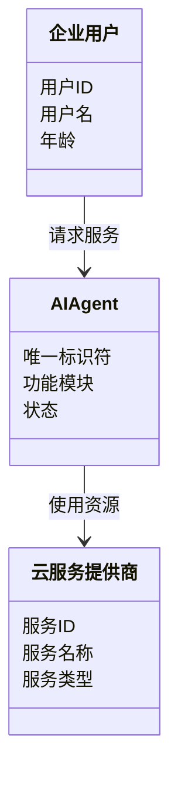
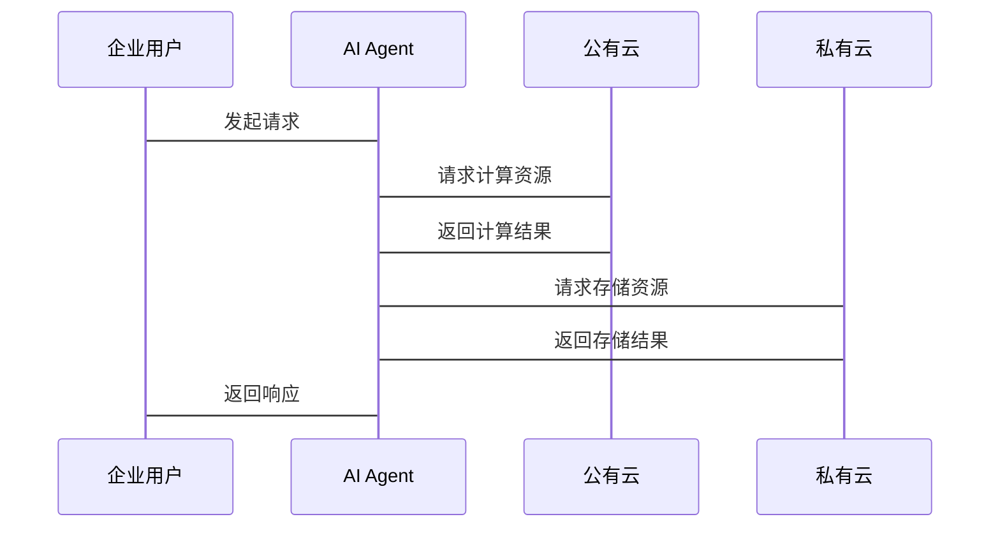

                 


# 《企业AI Agent的混合云部署策略》

> 关键词：企业AI Agent，混合云部署，云服务，资源调度，智能化服务

> 摘要：本文探讨了企业AI Agent在混合云环境下的部署策略，分析了其核心概念、算法原理、系统架构及实际应用，为企业在混合云环境下高效部署AI Agent提供了理论支持和实践指导。

---

## 第一部分: 企业AI Agent与混合云部署背景

### 第1章: 企业AI Agent的概述

#### 1.1 AI Agent的基本概念
##### 1.1.1 AI Agent的定义与核心功能
AI Agent（人工智能代理）是一种能够感知环境、自主决策并执行任务的智能实体。其核心功能包括数据采集、智能分析、决策制定和任务执行。

##### 1.1.2 AI Agent在企业中的应用场景
- 智能客服：通过自然语言处理技术提供个性化的客户支持。
- 智能推荐：基于用户行为分析推荐产品或服务。
- 智能监控：实时监控系统状态并自动响应异常情况。

##### 1.1.3 AI Agent与传统IT系统的区别
- 智能性：AI Agent具备自主学习和决策能力，而传统IT系统通常是基于规则的被动响应。
- 灵活性：AI Agent能够适应环境变化，而传统系统在变化时需要人工干预。

#### 1.2 混合云部署的基本概念
##### 1.2.1 混合云的定义与特点
混合云是指将公有云、私有云和边缘计算等多种云资源结合在一起，形成一个统一的计算环境。其特点包括资源的弹性扩展、成本的优化控制和数据的安全性。

##### 1.2.2 混合云与公有云、私有云的区别
- 公有云：资源由第三方提供，适合中小型企业。
- 私有云：资源专属于企业，适合对数据安全要求高的企业。
- 混合云：结合公有云和私有云的优势，提供灵活的资源调度。

##### 1.2.3 混合云在企业中的优势
- 成本优化：根据需求弹性扩展资源，避免资源浪费。
- 高可用性：通过多资源节点保证系统的稳定性。
- 数据安全：私有云部分可以部署关键业务，确保数据安全。

### 第2章: 企业AI Agent部署的背景与挑战

#### 2.1 企业AI Agent部署的背景
##### 2.1.1 数字化转型的驱动
企业数字化转型需要智能化解决方案，AI Agent成为企业提升效率和竞争力的重要工具。

##### 2.1.2 AI技术的快速发展
AI技术的进步使得AI Agent能够处理更复杂的任务，满足企业多样化的需求。

##### 2.1.3 企业对智能化服务的需求
企业希望通过智能化服务提高客户满意度和内部工作效率。

#### 2.2 混合云部署的必要性
##### 2.2.1 企业资源利用效率的需求
混合云能够根据业务需求灵活调整资源，提高资源利用率。

##### 2.2.2 数据安全与隐私保护的要求
通过混合云部署，企业可以将敏感数据部署在私有云，确保数据安全。

##### 2.2.3 弹性扩展与成本控制的平衡
混合云允许企业在高峰期使用公有云资源，低谷期使用私有云资源，实现成本优化。

### 第3章: 企业AI Agent混合云部署的现状与趋势

#### 3.1 当前企业AI Agent部署的主要模式
##### 3.1.1 公有云模式
优点：资源使用灵活，部署快速；缺点：数据安全性和隐私性可能存在问题。

##### 3.1.2 私有云模式
优点：数据安全，可控性高；缺点：初期投入大，维护成本高。

##### 3.1.3 混合云模式
优点：结合公有云和私有云的优势，弹性扩展，成本优化；缺点：部署复杂，需要专业的运维团队。

#### 3.2 混合云部署在AI Agent中的趋势
##### 3.2.1 多云策略的兴起
企业通过使用多个云服务提供商，降低依赖风险，提高系统可靠性。

##### 3.2.2 边缘计算与混合云的结合
通过边缘计算，AI Agent能够实时处理数据，减少延迟，提高响应速度。

##### 3.2.3 智能化与分布式部署的融合
AI Agent的智能化需要依赖分布式计算能力，混合云提供了良好的支持。

## 第二部分: 核心概念与联系

### 第4章: 企业AI Agent混合云部署的核心概念与联系

#### 4.1 核心概念原理
##### 4.1.1 AI Agent的智能决策机制
AI Agent通过感知环境、分析数据、制定决策并执行任务，实现智能化操作。

##### 4.1.2 混合云的资源调度策略
混合云根据业务需求动态分配资源，优化资源使用效率。

##### 4.1.3 两者的协同工作原理
AI Agent在混合云环境中运行，利用公有云的弹性资源和私有云的安全性，实现高效的智能服务。

#### 4.2 核心概念属性特征对比
##### 4.2.1 AI Agent的功能特性对比表

| 特性         | 公有云模式 | 私有云模式 | 混合云模式 |
|--------------|------------|------------|------------|
| 数据安全性     | 较低       | 较高       | 中等       |
| 成本控制       | 灵活       | 较高       | 灵活       |
| 资源弹性       | 高         | 低         | 高         |
| 部署复杂度     | 低         | 高         | 中等       |

##### 4.2.2 混合云的资源特性对比表

| 特性         | 公有云     | 私有云     | 混合云     |
|--------------|------------|------------|------------|
| 资源可用性     | 高         | 高         | 极高       |
| 成本           | 可变       | 固定       | 综合       |
| 扩展性         | 弹性       | 有限       | 弹性       |
| 数据隔离       | 低         | 高         | 中等       |

#### 4.3 ER实体关系图架构
```mermaid
erDiagram
    actor 企业用户 {
        string 用户ID
        string 用户名
        integer 年龄
    }
    actor 云服务提供商 {
        string 服务ID
        string 服务名称
        integer 服务类型
    }
    actor AI Agent {
        string 唯一标识符
        string 功能模块
        integer 状态
    }
    企业用户 -> AI Agent : 请求服务
    AI Agent -> 云服务提供商 : 使用资源
```

---

## 第三部分: 算法原理讲解

### 第5章: AI Agent的算法原理

#### 5.1 大模型的训练过程
##### 5.1.1 大模型的训练流程
1. 数据预处理：清洗数据，提取特征。
2. 模型训练：使用训练数据训练大模型，调整模型参数。
3. 模型评估：使用验证集评估模型性能，调整超参数。
4. 模型优化：通过剪枝、蒸馏等技术优化模型。

##### 5.1.2 使用的算法框架
- TensorFlow
- PyTorch

##### 5.1.3 训练代码示例
```python
import tensorflow as tf
from tensorflow.keras import layers

model = tf.keras.Sequential([
    layers.Dense(64, activation='relu'),
    layers.Dense(10, activation='softmax')
])

model.compile(optimizer='adam', loss='sparse_categorical_crossentropy', metrics=['accuracy'])
model.fit(train_data, train_labels, epochs=10, validation_data=(test_data, test_labels))
```

#### 5.2 大模型的推理过程
##### 5.2.1 推理流程
1. 接收输入数据。
2. 数据处理：转换为模型接受的格式。
3. 模型推理：输入数据，得到输出结果。
4. 结果解释：将模型输出结果转换为用户可理解的形式。

##### 5.2.2 推理代码示例
```python
import numpy as np

new_data = np.array([[1, 2, 3, 4, 5]])
prediction = model.predict(new_data)
print("预测结果:", np.argmax(prediction, axis=1))
```

#### 5.3 数学模型与公式
##### 5.3.1 损失函数
$$ L = -\sum_{i=1}^{n} y_i \log(a_i) + (1 - y_i) \log(1 - a_i) $$

##### 5.3.2 优化算法
$$ \theta = \theta - \eta \frac{\partial L}{\partial \theta} $$

---

## 第四部分: 系统分析与架构设计

### 第6章: 企业AI Agent混合云部署的系统架构

#### 6.1 问题场景介绍
企业需要在混合云环境下部署AI Agent，实现智能客服、推荐系统等功能。

#### 6.2 系统功能设计
##### 6.2.1 领域模型


##### 6.2.2 系统架构设计


#### 6.3 系统接口设计
##### 6.3.1 API接口
- REST API：用于接收用户请求和返回结果。
- gRPC：用于内部服务间的通信。

#### 6.4 系统交互设计
##### 6.4.1 序列图


---

## 第五部分: 项目实战

### 第7章: 企业AI Agent混合云部署的实战

#### 7.1 环境安装
##### 7.1.1 安装必要的软件
- 安装Python和依赖库：TensorFlow、Kubernetes、OpenStack。
- 安装云服务提供商的SDK：AWS CLI、Azure CLI。

#### 7.2 系统核心实现源代码
##### 7.2.1 AI Agent的实现代码
```python
import os
import yaml
from kubernetes import client, config

# 加载Kubernetes配置
config.load_kube_config()

# 创建一个客户端
api = client.BatchApi()

# 提交一个作业
job = client.V1Job(
    api_version="batch/v1",
    kind="Job",
    metadata=client.V1ObjectMeta(name="my-python-job"),
    spec=client.V1JobSpec(
        template=client.V1PodTemplateSpec(
            spec=client.V1PodSpec(
                containers=[client.V1Container(
                    name="python-container",
                    image="python:3.8",
                    command=["python", "-c", "print('Hello World')"]
                )]
            )
        )
    )
)

# 创建作业
api.create_namespaced_job("default", job)
```

##### 7.2.2 混合云资源调度代码
```python
import boto3

# 使用AWS S3服务
s3 = boto3.client('s3')

# 上传文件到S3
s3.upload_file('data.csv', 'my-bucket', 'data.csv')
```

#### 7.3 代码应用解读与分析
##### 7.3.1 Kubernetes作业提交
- 使用Kubernetes API提交作业，实现容器化部署。
- 通过配置文件定义作业，确保资源正确分配。

##### 7.3.2 AWS S3文件上传
- 使用Python SDK上传文件到S3，实现数据的存储和管理。
- 通过配置密钥，确保数据的安全性和隐私性。

#### 7.4 案例分析和详细讲解剖析
##### 7.4.1 案例背景
企业需要在混合云环境下部署一个智能推荐系统，利用公有云处理用户请求，私有云存储用户数据。

##### 7.4.2 实施步骤
1. 环境搭建：安装必要的软件和依赖。
2. 数据准备：收集用户数据，进行数据清洗。
3. 模型训练：使用TensorFlow训练推荐模型。
4. 模型部署：将模型部署到Kubernetes集群，利用公有云弹性资源。
5. 数据存储：将用户数据存储在私有云，确保数据安全。
6. 系统测试：进行压力测试和性能优化。

#### 7.5 项目小结
通过项目实战，验证了混合云部署策略的有效性，提高了系统的扩展性和安全性。同时，积累了在混合云环境下部署AI Agent的经验。

---

## 第六部分: 最佳实践

### 第8章: 最佳实践与注意事项

#### 8.1 最佳实践
##### 8.1.1 资源规划
- 根据业务需求选择合适的云资源。
- 合理分配公有云和私有云的比例，确保资源的高效利用。

##### 8.1.2 安全策略
- 使用访问控制列表（ACL）管理公有云资源的访问权限。
- 在私有云中设置严格的访问控制，防止未经授权的访问。

##### 8.1.3 监控与日志
- 部署监控工具实时监控系统运行状态。
- 配置日志收集系统，便于故障排查和性能优化。

#### 8.2 注意事项
##### 8.2.1 数据一致性
- 确保公有云和私有云之间的数据同步，避免数据不一致导致的问题。
- 使用分布式事务管理，确保数据的一致性。

##### 8.2.2 成本控制
- 定期审查资源使用情况，优化资源分配。
- 使用自动伸缩功能，根据负载自动调整资源。

#### 8.3 未来趋势
##### 8.3.1 AI Agent的智能化升级
- 引入强化学习，提升AI Agent的决策能力。
- 增强自然语言处理能力，提高用户体验。

##### 8.3.2 混合云的扩展
- 结合边缘计算，进一步提高系统的实时性和响应速度。
- 探索多云策略，降低对单一云服务提供商的依赖。

---

## 第七部分: 小结

### 第9章: 总结与展望

#### 9.1 全文总结
本文详细探讨了企业AI Agent在混合云环境下的部署策略，分析了其核心概念、算法原理、系统架构及实际应用。通过理论分析和实践案例，验证了混合云部署的有效性和优势。

#### 9.2 展望
未来，随着AI技术的不断进步和云计算环境的不断发展，企业AI Agent的混合云部署将更加智能化和高效化。建议企业在部署过程中注重资源规划、数据安全和系统监控，确保系统的稳定运行和持续优化。

---

## 作者：AI天才研究院/AI Genius Institute & 禅与计算机程序设计艺术 /Zen And The Art of Computer Programming

---

**文章末尾思考：**  
通过撰写这篇博客文章，我深入了解了企业AI Agent在混合云部署中的关键点，包括资源调度、数据安全和系统架构等。在实际应用中，企业需要综合考虑成本、性能和安全等多方面因素，以实现最优的部署策略。未来，随着技术的进一步发展，混合云部署将为企业AI Agent的应用提供更广阔的空间。

