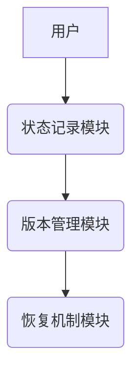

                 


# 《企业AI Agent的版本控制与回滚机制》

> 关键词：企业AI Agent，版本控制，回滚机制，系统架构，算法原理，项目实战

> 摘要：本文深入探讨了企业AI Agent的版本控制与回滚机制，从基本概念、核心原理、系统架构到实际项目实现，结合理论与实践，为企业智能化转型提供技术支持。

---

## 第一部分：企业AI Agent的背景与概述

### 第1章：AI Agent的基本概念与应用背景

#### 1.1 AI Agent的定义与特点

AI Agent（人工智能代理）是指能够感知环境并采取行动以实现目标的智能实体。其特点包括：

- **自主性**：无需外部干预，自主决策。
- **反应性**：实时感知环境并动态调整行为。
- **目标导向**：以明确的目标为导向，优化决策。
- **可扩展性**：能够处理复杂任务，并与其他系统集成。

AI Agent与传统软件的区别主要体现在智能化、自主决策和学习能力上。AI Agent能够通过数据学习和优化，实现自我改进，而传统软件依赖固定逻辑。

#### 1.2 企业AI Agent的应用场景

在企业环境中，AI Agent的应用场景广泛，包括：

- **智能客服**：通过自然语言处理提供个性化的客户支持。
- **流程自动化**：优化企业内部流程，提高效率。
- **风险管理**：实时监控企业运行状态，识别潜在风险。
- **决策支持**：基于数据分析，提供决策支持。

企业智能化转型的需求推动了AI Agent的应用，通过智能化工具提升竞争力。AI Agent在企业中的应用不仅提高了效率，还增强了企业的灵活性和响应能力。

#### 1.3 本章小结

本章介绍了AI Agent的基本概念和特点，并分析了其在企业中的应用场景。通过实例说明，读者可以理解AI Agent在企业智能化转型中的重要性。

---

## 第二部分：版本控制与回滚机制的核心概念

### 第2章：版本控制与回滚机制的基本原理

#### 2.1 版本控制的概念与作用

版本控制是指对系统状态进行记录和管理，确保在出现问题时能够快速恢复到稳定状态。其作用包括：

- **状态记录**：记录系统在不同时间点的状态，以便追溯和恢复。
- **变更管理**：管理系统的变更历史，确保可追溯性。
- **风险控制**：通过版本控制降低系统故障的风险。

版本控制在企业AI Agent中的作用不可忽视，它能够帮助企业在复杂环境中保持稳定运行。

#### 2.2 回滚机制的定义与实现方式

回滚机制是指在系统出现故障时，将系统状态恢复到之前的一个稳定版本。其实现方式包括：

- **基于版本的回滚**：通过版本控制记录，选择合适的历史版本进行恢复。
- **实时状态恢复**：动态地恢复系统状态，无需依赖版本记录。

回滚机制的实现依赖于版本控制的完善性，两者相辅相成，确保系统在出现问题时能够快速恢复。

#### 2.3 本章小结

本章详细讲解了版本控制和回滚机制的基本原理，分析了它们在企业AI Agent中的作用和实现方式。通过理解这些概念，读者可以更好地设计和实现相关机制。

---

## 第三部分：版本控制与回滚机制的算法原理

### 第3章：版本跟踪算法

#### 3.1 状态跟踪算法

状态跟踪算法用于记录系统在不同时间点的状态，常见的算法包括：

- **哈希跟踪算法**：通过哈希值记录状态，确保数据的唯一性和完整性。
- **时间戳跟踪算法**：根据时间戳记录状态，便于排序和回溯。

状态跟踪算法的选择影响系统的稳定性和恢复能力，需要根据实际需求进行优化。

#### 3.2 版本树构建算法

版本树构建算法用于管理系统的版本历史，常见的算法包括：

- **基于树的版本控制**：通过树结构记录版本关系，便于管理和恢复。
- **基于图的版本控制**：通过图结构记录版本关系，支持复杂的版本依赖。

版本树的构建算法需要考虑系统的扩展性和恢复效率，选择合适的结构和算法至关重要。

#### 3.3 本章小结

本章深入探讨了版本跟踪算法和版本树构建算法，分析了它们在企业AI Agent中的应用。通过合理选择和优化算法，可以提高系统的稳定性和恢复能力。

---

## 第四部分：系统架构与实现

### 第4章：系统架构设计

#### 4.1 系统功能设计

系统功能设计包括：

- **状态记录模块**：负责记录系统状态，确保数据的完整性和可追溯性。
- **版本管理模块**：管理版本历史，支持版本的创建、查询和回滚。
- **恢复机制模块**：在出现问题时，快速恢复到指定版本。

系统的功能设计需要结合实际需求，确保各模块协同工作，提高系统的稳定性和可用性。

#### 4.2 系统架构图

以下是系统架构的Mermaid图：



系统架构设计清晰，各模块分工明确，确保系统的高效运行。

---

## 第五部分：项目实战

### 第5章：项目实战

#### 5.1 环境安装

项目实战需要安装以下环境：

- **Python 3.8+**
- **Git**
- **Mermaid**

安装完成后，可以开始项目的开发和测试。

#### 5.2 核心代码实现

以下是核心代码实现：

```python
class VersionControl:
    def __init__(self):
        self.states = {}
        self.current_version = 0

    def record_state(self):
        self.current_version += 1
        self.states[self.current_version] = self.get_current_state()

    def get_current_state(self):
        # 返回当前系统状态
        return ...

    def rollback(self, version):
        if version in self.states:
            self.states = {version: self.states[version]}
            self.current_version = version
```

代码实现版本控制的基本功能，包括状态记录和回滚操作。

#### 5.3 实际应用分析

通过实际案例分析，可以验证版本控制与回滚机制的有效性。例如，在智能客服系统中，当出现故障时，可以通过回滚机制快速恢复到稳定状态，确保服务的连续性。

---

## 第六部分：最佳实践

### 第6章：最佳实践

#### 6.1 小结

版本控制与回滚机制在企业AI Agent中的应用至关重要，能够确保系统的稳定性和可靠性。通过合理设计和优化，可以提高系统的可用性和恢复能力。

#### 6.2 注意事项

在实际应用中，需要注意以下几点：

- **数据备份**：确保数据的安全性和完整性。
- **版本管理**：合理管理版本历史，避免数据混乱。
- **测试与验证**：在实施回滚机制前，进行充分的测试和验证。

#### 6.3 拓展阅读

推荐阅读相关书籍和文献，深入了解版本控制与回滚机制的最新技术和应用案例。

---

## 作者：AI天才研究院 & 禅与计算机程序设计艺术

通过本文的详细讲解，读者可以深入了解企业AI Agent的版本控制与回滚机制，并将其应用于实际项目中。希望本文能够为企业的智能化转型提供有力的技术支持。

