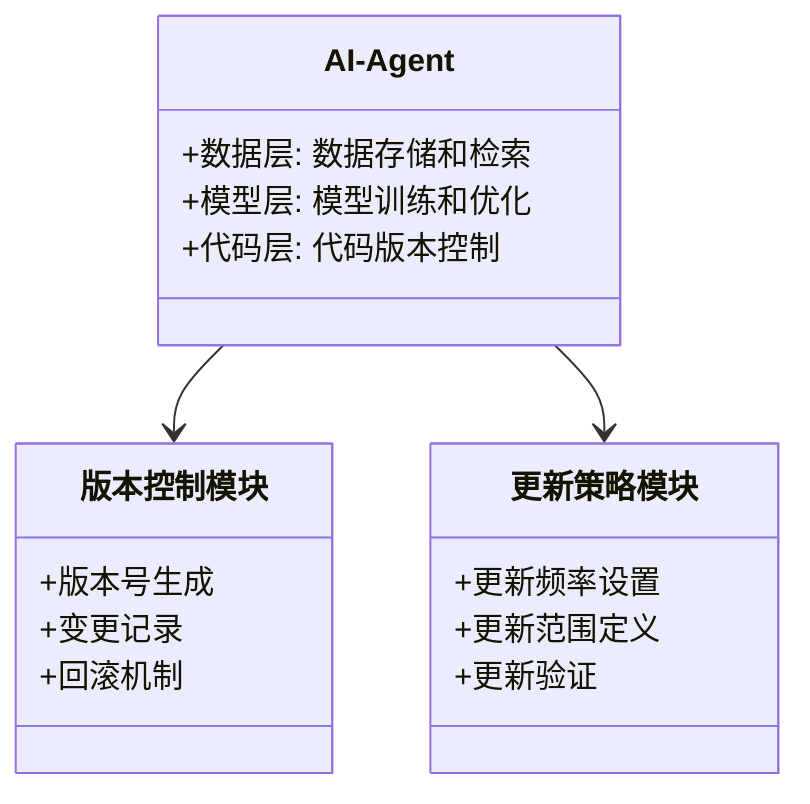
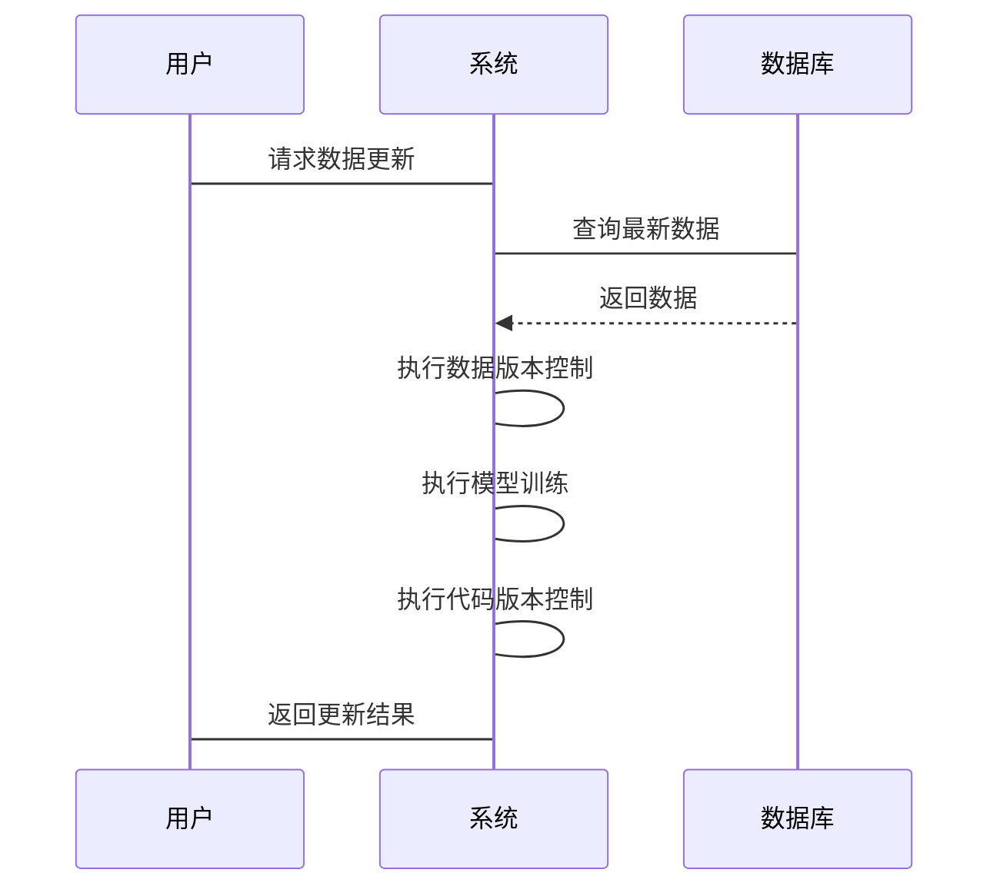

                 


# 企业AI Agent的版本控制与更新策略

## 关键词：企业AI Agent，版本控制，更新策略，系统架构，项目实战，最佳实践

## 摘要：企业AI Agent的版本控制与更新策略是企业智能化转型中的关键问题。本文从AI Agent的基本概念出发，深入探讨版本控制的核心要素和更新策略的实现机制，结合系统架构设计和项目实战，为企业提供可操作的解决方案和最佳实践。

---

# 第一部分: 企业AI Agent的背景与核心概念

## 第1章: 企业AI Agent的概述

### 1.1 AI Agent的基本概念

#### 1.1.1 什么是AI Agent
AI Agent（人工智能代理）是一种能够感知环境、自主决策并执行任务的智能实体。它通过传感器获取信息，利用推理能力分析数据，并通过执行器采取行动，以实现特定目标。

#### 1.1.2 AI Agent的核心特征
- **自主性**：无需外部干预，自主决策。
- **反应性**：实时感知环境变化并做出反应。
- **目标导向**：以实现特定目标为导向。
- **学习能力**：通过数据和经验不断优化自身性能。

#### 1.1.3 企业AI Agent的独特性
企业AI Agent在设计上需要考虑企业级的复杂性，包括数据安全、系统稳定性、可扩展性等，同时需要与企业现有系统无缝集成。

---

### 1.2 企业AI Agent的应用场景

#### 1.2.1 企业智能化转型的需求
企业智能化转型要求将AI技术融入业务流程，提升效率、降低成本，并增强决策的准确性。

#### 1.2.2 AI Agent在企业中的典型应用
- **智能客服**：通过自然语言处理提供24/7的客户支持。
- **自动化运维**：监控系统运行状态，自动处理故障。
- **智能供应链管理**：优化库存管理，预测需求变化。

#### 1.2.3 企业AI Agent的边界与外延
- **边界**：专注于特定业务领域，如客服或运维。
- **外延**：与其他企业系统（如ERP、CRM）集成，实现跨系统的协同工作。

---

## 第2章: 版本控制与更新策略的背景

### 2.1 软件版本控制的基本概念

#### 2.1.1 版本控制的定义
版本控制是一种管理文件或项目变化的系统，记录每个版本的状态，并允许回溯或恢复特定版本。

#### 2.1.2 版本控制的重要性
- **数据恢复**：在出现错误或故障时，可以回滚到之前的状态。
- **协作开发**：允许多人协作，避免代码冲突。
- **变更管理**：记录每次变更的原因和影响，便于后续分析。

#### 2.1.3 企业级版本控制的特点
- **高可用性**：确保关键业务系统的稳定性。
- **安全性**：防止数据泄露或恶意篡改。
- **可扩展性**：支持大规模数据和系统的版本控制。

---

### 2.2 AI Agent更新策略的必要性

#### 2.2.1 AI Agent的动态更新需求
- **模型更新**：随着数据变化，模型需要不断优化。
- **功能迭代**：根据用户反馈，逐步增加新功能。
- **安全更新**：修复漏洞，提升系统安全性。

#### 2.2.2 更新策略对企业的影响
- **提升用户体验**：及时修复问题，优化功能。
- **降低维护成本**：通过自动化更新减少人工干预。
- **增强竞争力**：快速迭代，保持技术领先。

#### 2.2.3 企业AI Agent版本控制的挑战
- **复杂性**：涉及数据、模型和代码的多方面版本控制。
- **实时性**：需要在不影响业务的情况下进行更新。
- **安全性**：确保更新过程的安全，防止数据丢失或损坏。

---

## 第3章: 企业AI Agent版本控制的核心要素

### 3.1 版本控制的关键组件

#### 3.1.1 数据版本控制
- **数据变更记录**：记录每次数据变更的历史。
- **数据恢复机制**：在需要时回滚到特定版本的数据。

#### 3.1.2 模型版本控制
- **模型训练历史**：记录每次模型训练的结果和参数。
- **模型评估机制**：评估新模型的性能，决定是否更新。

#### 3.1.3 代码版本控制
- **代码变更记录**：记录每次代码的变更，便于追溯。
- **代码审查流程**：确保代码变更符合规范。

---

### 3.2 更新策略的核心要素

#### 3.2.1 更新频率与时机
- **实时更新**：在运行时动态更新，不影响业务。
- **定期更新**：定期批量更新，集中处理问题。
- **条件触发**：当满足特定条件时自动更新。

#### 3.2.2 更新范围与粒度
- **全量更新**：替换所有代码和数据。
- **增量更新**：仅更新变化的部分，减少资源消耗。
- **按需更新**：根据需求选择更新范围。

#### 3.2.3 更新验证与回滚机制
- **自动化测试**：在更新前进行充分测试，确保稳定性。
- **回滚策略**：在更新失败时，能够快速回滚到之前的版本。

---

# 第二部分: 核心概念与联系

## 第4章: 核心概念与联系

### 4.1 核心概念原理

#### 4.1.1 AI Agent的版本控制机制
版本控制通过记录每个版本的状态，提供回滚和恢复功能，确保系统的稳定性和可追溯性。

#### 4.1.2 更新策略的实现原理
更新策略通过定义更新规则和流程，指导系统如何进行版本更新，确保更新的顺利进行。

#### 4.1.3 版本控制与更新策略的关系
版本控制为更新策略提供支持，而更新策略指导版本控制的执行，两者相辅相成。

---

### 4.2 核心概念对比表

| 比较维度 | 版本控制 | 更新策略 |
|----------|----------|----------|
| 定义     | 记录和管理系统的变更历史 | 定义如何进行系统更新的规则和流程 |
| 目标     | 确保系统的稳定性和可追溯性 | 确保系统的及时更新和优化 |
| 关键要素 | 变更记录、回滚机制 | 更新频率、范围、验证 |

---

## 第5章: 算法原理讲解

### 5.1 版本控制算法

#### 5.1.1 数据版本控制算法
- **版本号生成**：为每个版本生成唯一的标识符。
- **变更记录存储**：记录每次变更的具体内容和时间。

#### 5.1.2 模型版本控制算法
- **模型评估**：通过性能指标评估新模型的优劣。
- **版本选择**：选择最优模型进行部署。

#### 5.1.3 代码版本控制算法
- **差异计算**：计算代码变更的差异，生成变更日志。
- **合并处理**：处理不同分支的代码变更，避免冲突。

---

### 5.2 更新策略算法

#### 5.2.1 更新频率算法
- **实时更新**：基于时间触发，确保系统的及时性。
- **定期更新**：基于周期触发，减少资源消耗。
- **条件触发**：基于性能指标触发，确保更新的必要性。

#### 5.2.2 更新范围算法
- **全量更新**：适用于系统架构的重大调整。
- **增量更新**：适用于局部优化和功能迭代。
- **按需更新**：适用于特定问题的解决。

#### 5.2.3 更新验证算法
- **自动化测试**：通过预定义的测试用例验证更新的正确性。
- **回滚机制**：在测试失败时，回滚到之前的版本。

---

## 第6章: 系统分析与架构设计方案

### 6.1 问题场景介绍

#### 6.1.1 问题背景
企业AI Agent在运行过程中，需要处理大量的数据和模型更新，确保系统的稳定性和性能。

#### 6.1.2 系统功能需求
- **数据存储**：支持大规模数据的存储和检索。
- **模型训练**：支持机器学习模型的训练和优化。
- **版本控制**：实现数据、模型和代码的版本控制。
- **更新策略**：根据需求自动或手动进行系统更新。

---

### 6.2 系统架构设计

#### 6.2.1 领域模型设计


#### 6.2.2 系统架构设计
```mermaid
containerDiagram
    container 企业AI Agent系统 {
        component 数据存储层 {
            database 数据库
            service 数据服务
        }
        component 模型训练层 {
            service 模型服务
            service 训练服务
        }
        component 代码版本层 {
            service 版本控制服务
            service 更新策略服务
        }
    }
```

#### 6.2.3 系统接口设计


---

## 第7章: 项目实战

### 7.1 环境安装

#### 7.1.1 系统需求
- 操作系统：Linux/Windows/MacOS
- 开发工具：Python、Git、Docker
- 数据库：MySQL/PostgreSQL
- 模型框架：TensorFlow/PyTorch

#### 7.1.2 安装步骤
1. 安装Python和必要的库（如Git、Docker）。
2. 安装TensorFlow或PyTorch框架。
3. 配置版本控制系统（如Git）。
4. 配置数据库连接。

---

### 7.2 系统核心实现源代码

#### 7.2.1 版本控制模块
```python
def generate_version_id():
    import uuid
    return str(uuid.uuid4())
```

#### 7.2.2 更新策略模块
```python
def update_strategy(frequency, scope, validate):
    if frequency == 'real-time':
        perform_real_time_update(scope)
    elif frequency == 'periodic':
        perform_periodic_update(scope)
    elif frequency == 'conditional':
        if validate():
            perform_conditional_update(scope)
```

---

### 7.3 代码应用解读与分析

#### 7.3.1 代码结构
- `main.py`：主程序入口。
- `version_control.py`：版本控制模块。
- `update_strategy.py`：更新策略模块。
- `models/`：模型文件夹。
- `data/`：数据文件夹。

#### 7.3.2 核心代码实现
- `version_control.py`：
  ```python
  def save_version(version_id, data, model, code):
      # 实现版本数据的存储
  def rollback(version_id):
      # 实现版本回滚
  ```

- `update_strategy.py`：
  ```python
  def perform_update(scope):
      # 实现指定范围的更新
  ```

---

## 第8章: 最佳实践与小结

### 8.1 最佳实践

#### 8.1.1 版本控制策略
- 定期备份：确保数据的安全性。
- 权限管理：限制访问权限，防止数据泄露。
- 文档记录：详细记录每次版本变更的原因和影响。

#### 8.1.2 更新策略建议
- 分阶段更新：先进行小范围测试，再进行全面更新。
- 自动化测试：确保每次更新前都有充分的测试。
- 监控日志：实时监控系统运行状态，及时发现和解决问题。

---

### 8.2 小结

企业AI Agent的版本控制与更新策略是确保系统稳定性和可扩展性的关键。通过合理的版本控制和更新策略，企业可以实现系统的高效运行和持续优化。

---

## 结语

企业AI Agent的版本控制与更新策略是一个复杂但重要的课题。通过本文的详细讲解，读者可以全面了解版本控制的核心概念、更新策略的实现机制，并通过实际案例掌握如何在企业中应用这些策略。未来，随着AI技术的不断发展，版本控制与更新策略也将变得更加重要。

---

## 作者：AI天才研究院/AI Genius Institute & 禅与计算机程序设计艺术 /Zen And The Art of Computer Programming

