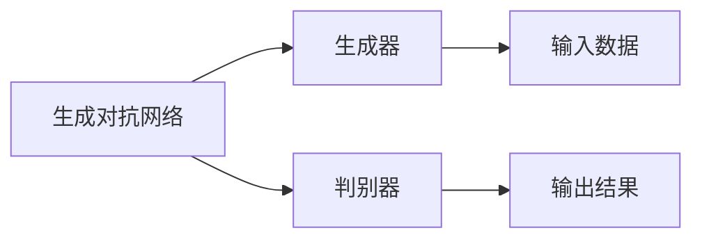
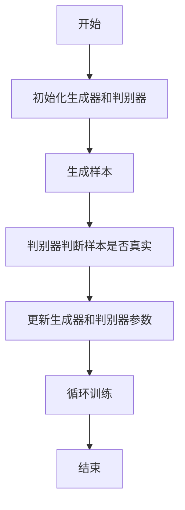
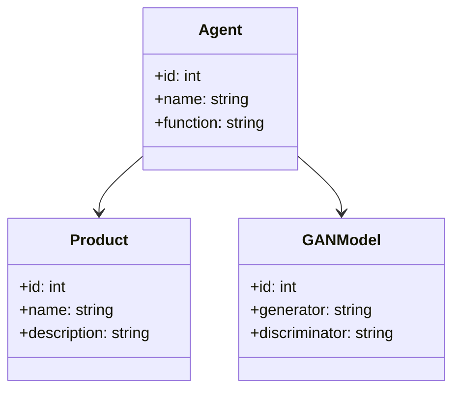
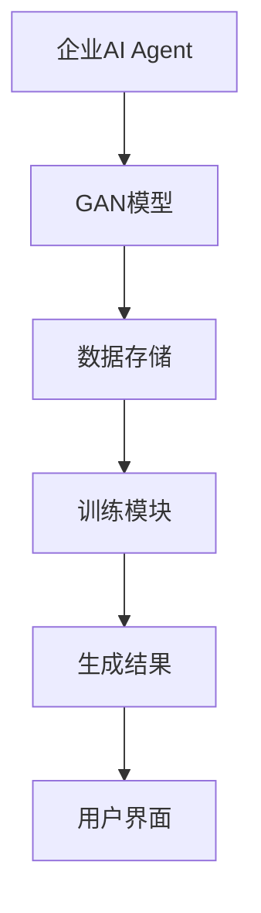
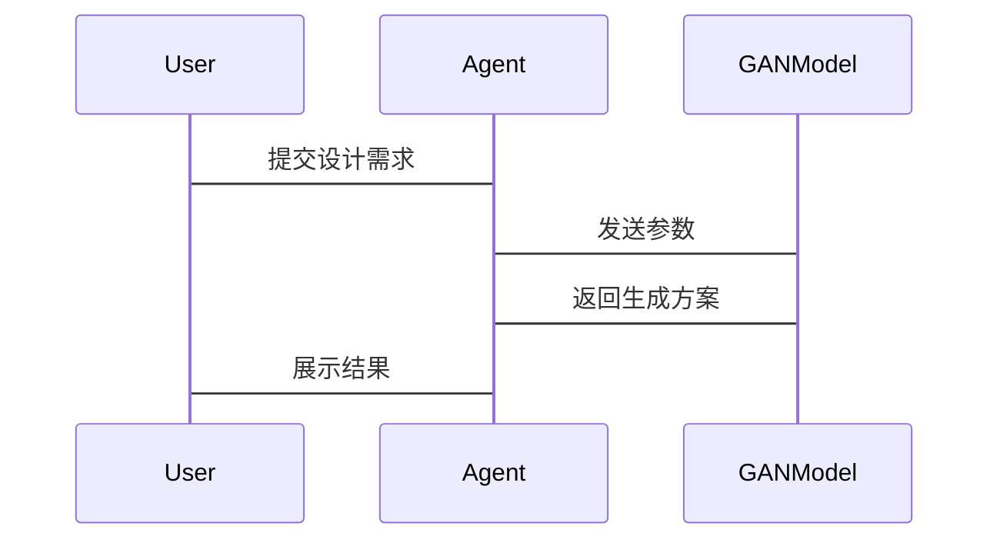

                 


# 企业AI Agent的生成对抗网络在产品设计创新中的应用

## 关键词：
生成对抗网络、企业AI Agent、产品设计创新、GAN算法、深度学习、AI技术、产品设计

## 摘要：
本文深入探讨了生成对抗网络（GAN）在企业AI Agent中的应用，特别是其在产品设计创新中的潜力。通过分析GAN的核心原理、系统架构设计以及实际项目案例，本文展示了如何利用GAN生成多样且创新的产品设计，优化企业产品开发流程。文章内容包括背景介绍、核心概念、算法原理、系统架构设计、项目实战和最佳实践，为读者提供了全面的技术指导。

---

## 第一部分：生成对抗网络（GAN）概述

### 第1章：生成对抗网络（GAN）基础

#### 1.1 生成对抗网络的定义与特点
- **生成对抗网络的核心概念**：GAN由生成器和判别器组成，通过对抗训练生成逼真的数据样本。
- **GAN与传统生成模型的对比**：传统生成模型依赖于固定的生成规则，而GAN通过对抗学习不断优化生成能力。
- **GAN在企业AI代理中的应用潜力**：GAN能够生成多样化的产品设计，帮助企业在产品创新中占据优势。

#### 1.2 企业AI Agent的定义与功能
- **企业AI Agent的基本概念**：企业AI Agent是一种智能系统，能够辅助企业进行决策、优化流程和创新产品。
- **企业AI Agent的核心功能**：包括数据处理、分析、生成创意设计和提供决策支持。
- **企业AI Agent与传统AI系统的区别**：企业AI Agent更注重与企业业务的深度融合，能够主动适应业务需求。

#### 1.3 GAN在产品设计创新中的应用背景
- **产品设计创新的挑战**：传统设计方法依赖设计师的经验，效率低且创新有限。
- **GAN在产品设计中的优势**：GAN能够快速生成大量多样化的设计方案，提供新的灵感和思路。
- **企业AI Agent与产品设计创新的结合**：通过AI Agent整合GAN技术，企业能够更高效地进行产品设计创新。

---

### 第2章：GAN的核心概念与原理

#### 2.1 GAN的数学模型与公式
- **GAN的损失函数**：判别器的损失函数衡量其区分真实数据和生成数据的能力，生成器的损失函数则基于判别器的判断结果进行优化。
  - 判别器的损失函数：$$L_D = -\mathbb{E}_{x \sim p_{\text{data}}}[ \log D(x)] - \mathbb{E}_{z \sim p_z}[ \log (1 - D(G(z)))]$$
  - 生成器的损失函数：$$L_G = -\mathbb{E}_{z \sim p_z}[ \log D(G(z))]$$

- **GAN的生成器和判别器**：生成器通过Wasserstein距离优化，判别器通过交叉熵损失函数进行训练。
  - Wasserstein GAN的损失函数：$$WGAN = \mathbb{E}_{x \sim p_{\text{data}}}[D(x)] - \mathbb{E}_{z \sim p_z}[D(G(z))]$$

- **GAN的训练过程**：生成器和判别器交替训练，逐步优化生成样本的质量。

#### 2.2 GAN的实体关系图


#### 2.3 GAN的算法流程


---

### 第3章：企业AI Agent的系统架构设计

#### 3.1 项目背景与目标
- **项目背景介绍**：随着市场竞争加剧，企业需要更快地推出创新产品。
- **项目目标与范围**：通过GAN技术，开发一个能够辅助产品设计的AI Agent系统。
- **项目的关键成功因素**：数据质量、模型训练效率和生成结果的可定制性。

#### 3.2 系统功能设计


#### 3.3 系统架构设计


#### 3.4 系统接口设计
- **输入接口**：接收用户需求和设计参数。
- **输出接口**：展示生成的设计方案和相关建议。

#### 3.5 系统交互设计


---

### 第4章：项目实战

#### 4.1 环境安装
- **安装Python和相关库**：如TensorFlow、Keras和numpy。
- **安装Docker和Kubernetes**：用于容器化部署和扩展。

#### 4.2 系统核心实现源代码
```python
import tensorflow as tf
from tensorflow import keras
import numpy as np

# 定义生成器
def build_generator(input_dim, output_dim):
    model = keras.Sequential()
    model.add(keras.layers.Dense(256, activation='relu', input_dim=input_dim))
    model.add(keras.layers.Dense(128, activation='relu'))
    model.add(keras.layers.Dense(output_dim, activation='sigmoid'))
    return model

# 定义判别器
def build_discriminator(output_dim):
    model = keras.Sequential()
    model.add(keras.layers.Dense(128, activation='relu', input_dim=output_dim))
    model.add(keras.layers.Dense(64, activation='relu'))
    model.add(keras.layers.Dense(1, activation='sigmoid'))
    return model

# 初始化GAN模型
generator = build_generator(100, output_dim)
discriminator = build_discriminator(output_dim)

# 定义损失函数
cross_entropy = keras.losses.BinaryCrossentropy()

# 编译模型
generator_optimizer = tf.keras.optimizers.Adam(0.0002)
discriminator_optimizer = tf.keras.optimizers.Adam(0.0002)

# 训练过程
@tf.function
def train_step(real_images, generator, discriminator, generator_optimizer, discriminator_optimizer):
    # 生成假数据
    noise = tf.random.normal([batch_size, 100])
    generated_images = generator(noise)

    # 判别器的梯度计算
    with tf.GradientTape() as t:
        real_output = discriminator(real_images)
        generated_output = discriminator(generated_images)
        d_loss = cross_entropy(tf.ones_like(real_output), real_output) + cross_entropy(tf.zeros_like(generated_output), generated_output)
    
    # 更新判别器参数
    d_gradients = t.gradient(d_loss, discriminator.trainable_weights)
    discriminator_optimizer.apply_gradients(zip(d_gradients, discriminator.trainable_weights))

    # 生成器的梯度计算
    with tf.GradientTape() as t:
        generated_output = discriminator(generated_images)
        g_loss = cross_entropy(tf.ones_like(generated_output), generated_output)
    
    # 更新生成器参数
    g_gradients = t.gradient(g_loss, generator.trainable_weights)
    generator_optimizer.apply_gradients(zip(g_gradients, generator.trainable_weights))
```

#### 4.3 实际案例分析
- **案例分析**：通过具体案例展示GAN生成的产品设计方案，分析其创新性和实用性。
- **结果展示**：展示生成的产品设计图，对比传统设计方法，突出GAN的优势。

#### 4.4 项目总结
- **项目成果**：成功开发了一个基于GAN的企业AI Agent系统，能够高效生成创新产品设计。
- **经验分享**：模型训练中的挑战与解决方案，数据质量和模型调参的重要性。

---

### 第5章：最佳实践与小结

#### 5.1 小结
- **总结内容**：回顾本文的主要内容，强调GAN在企业AI Agent和产品设计创新中的应用价值。
- **关键点回顾**：重点回顾生成对抗网络的核心原理和系统架构设计。

#### 5.2 注意事项
- **数据安全**：确保训练数据的安全性和隐私性。
- **模型优化**：通过超参数调整和架构优化提升生成效果。
- **团队协作**：在项目中注重跨学科合作，确保技术与业务的深度融合。

#### 5.3 拓展阅读
- **推荐书籍**：《生成对抗网络：深入理解和实践》。
- **推荐论文**：Goodfellow的《Generative Adversarial Nets》。
- **在线资源**：推荐相关技术博客和社区，如Kaggle和Medium上的GAN相关文章。

---

## 结语

企业AI Agent结合生成对抗网络（GAN）在产品设计创新中的应用，为企业提供了新的可能性。通过本文的详细分析和实战案例，读者可以深入了解GAN的核心原理和系统架构设计，掌握其在企业产品设计中的实际应用方法。未来，随着GAN技术的不断发展，其在企业AI Agent中的应用潜力将更加广阔。

---

## 作者信息

作者：AI天才研究院  
书籍：《禅与计算机程序设计艺术》

---

通过本文的系统介绍，读者不仅能够理解生成对抗网络的核心原理，还能掌握其在企业AI Agent中的实际应用，为企业的产品设计创新提供有力的技术支持。

