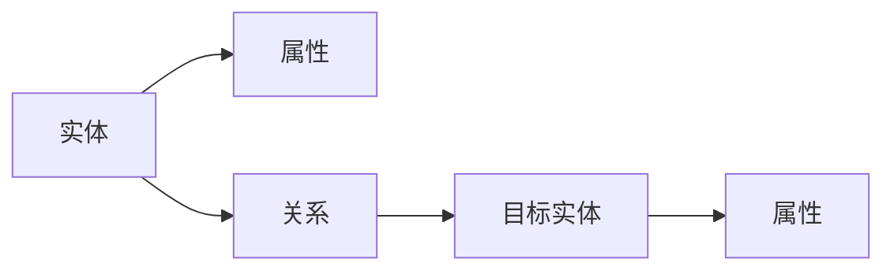
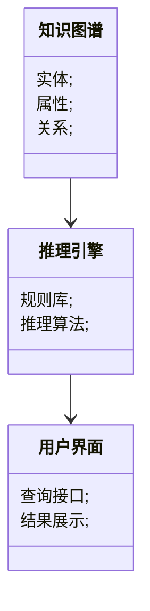
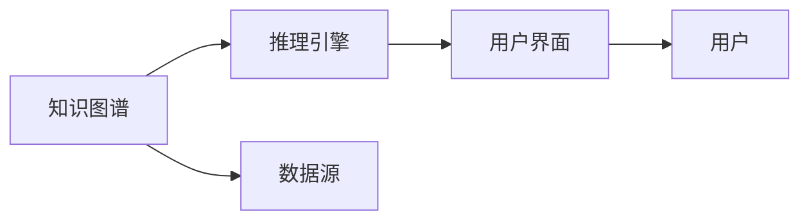

                 


# 企业AI Agent的知识图谱推理引擎

> 关键词：AI Agent, 知识图谱, 推理引擎, 图神经网络, 企业应用

> 摘要：本文深入探讨了企业AI Agent的知识图谱推理引擎的核心概念、算法原理、系统架构及项目实战。通过详细分析知识图谱的构建与表示、推理引擎的工作原理、算法的选择与优化，以及实际项目中的系统设计与实现，为企业AI Agent的应用提供了全面的技术指导。

---

# 第1章 企业AI Agent与知识图谱概述

## 1.1 企业AI Agent的定义与特点

### 1.1.1 AI Agent的基本概念
AI Agent（人工智能代理）是一种能够感知环境、自主决策并执行任务的智能体。在企业场景中，AI Agent通常用于自动化处理业务流程、辅助决策或提供智能服务。

### 1.1.2 企业AI Agent的核心特点
- **自主性**：能够独立决策和执行任务。
- **反应性**：实时感知环境变化并做出响应。
- **学习能力**：通过数据和经验不断优化自身行为。
- **可扩展性**：能够适应企业复杂业务需求。

### 1.1.3 企业AI Agent的应用场景
- 智能客服：通过自然语言处理为用户提供支持。
- 自动化运维：监控系统状态并自动修复问题。
- 智能供应链：优化库存管理和物流调度。

## 1.2 知识图谱的基本概念

### 1.2.1 知识图谱的定义
知识图谱是一种用于表示知识的结构化数据模型，通过实体（概念）和关系（属性）描述世界。

### 1.2.2 知识图谱的构建过程
1. **数据采集**：从结构化数据（如数据库）和非结构化数据（如文本）中提取信息。
2. **数据清洗**：去除噪声数据，确保数据质量。
3. **实体识别**：识别文本中的实体并建立映射关系。
4. **知识融合**：将多个数据源的信息整合到统一的知识图谱中。
5. **知识抽取**：从文本中提取实体和关系。

### 1.2.3 知识图谱的表示方法
- **RDF（资源描述框架）**：通过三元组（subject, predicate, object）表示知识。
- **图数据库**：使用图结构存储实体和关系，支持复杂的查询和推理。

## 1.3 推理引擎的基本原理

### 1.3.1 推理的定义与分类
- **推理**：基于已有的知识库，推导出新的事实或结论的过程。
- **分类**：
  - **基于规则的推理**：通过预定义的规则进行推理。
  - **基于概率的推理**：利用概率论计算事实的可信度。
  - **基于深度学习的推理**：通过神经网络学习推理模式。

### 1.3.2 知识图谱推理的关键技术
- **知识表示**：如何将知识表示为适合推理的结构。
- **推理算法**：选择合适的算法实现推理过程。
- **推理优化**：提高推理效率和准确性。

### 1.3.3 推理引擎的实现方式
- **规则引擎**：通过预定义规则进行推理。
- **逻辑推理引擎**：基于逻辑规则进行推理。
- **概率推理引擎**：利用概率模型进行推理。

## 1.4 本章小结
本章介绍了企业AI Agent的基本概念、知识图谱的构建与表示方法，以及推理引擎的工作原理。这些内容为后续章节奠定了基础。

---

# 第2章 知识图谱推理引擎的核心概念

## 2.1 知识图谱推理引擎的原理

### 2.1.1 知识表示与推理的关系
知识表示是推理的基础，推理是知识图谱的核心能力。通过推理引擎，AI Agent能够从知识图谱中获取新的知识。

### 2.1.2 推理引擎的输入输出
- **输入**：知识图谱和查询条件。
- **输出**：推理结果，通常是新的知识或结论。

### 2.1.3 推理引擎的逻辑结构
1. **知识存储**：存储知识图谱的数据结构。
2. **推理算法**：根据输入进行推理。
3. **结果解释**：将推理结果转换为可理解的形式。

## 2.2 知识图谱推理引擎的关键技术

### 2.2.1 知识抽取与融合
- **知识抽取**：从文本中提取实体和关系。
- **知识融合**：将多个数据源的信息整合到统一的知识图谱中。

### 2.2.2 知识存储与管理
- **存储技术**：使用图数据库（如Neo4j）存储知识图谱。
- **数据管理**：通过索引和查询优化提高存储效率。

### 2.2.3 推理算法的选择与优化
- **算法选择**：根据具体需求选择合适的推理算法。
- **算法优化**：通过优化推理过程提高效率。

## 2.3 知识图谱推理引擎的实体关系图



## 2.4 本章小结
本章详细讲解了知识图谱推理引擎的核心概念和技术，包括知识表示、推理原理和算法选择。通过实体关系图展示了知识图谱的结构。

---

# 第3章 知识图谱推理引擎的算法原理

## 3.1 基于规则的推理算法

### 3.1.1 规则的定义与表示
规则通常以“如果-那么”形式表示，例如：如果A是B的子类，那么A具有B的所有属性。

### 3.1.2 基于规则的推理过程
1. **匹配规则**：检查是否存在匹配的规则。
2. **应用规则**：根据匹配的规则推导新的知识。
3. **结果验证**：验证推理结果的正确性。

### 3.1.3 规则推理的优缺点
- **优点**：简单易懂，规则易于管理和维护。
- **缺点**：规则数量庞大，难以覆盖所有情况。

## 3.2 基于概率的推理算法

### 3.2.1 概率推理的基本原理
概率推理基于概率论计算事实的可信度，常用贝叶斯网络进行推理。

### 3.2.2 贝叶斯网络在推理中的应用
贝叶斯网络通过概率分布描述变量之间的关系，用于计算后验概率。

### 3.2.3 概率推理的实现方式
1. **构建贝叶斯网络**：定义变量和概率分布。
2. **计算后验概率**：通过贝叶斯公式进行推理。

## 3.3 基于深度学习的推理算法

### 3.3.1 深度学习在推理中的应用
深度学习通过神经网络学习推理模式，常用于复杂场景下的推理。

### 3.3.2 基于图神经网络的推理方法
图神经网络通过节点和边的信息进行推理，适用于复杂的知识图谱。

### 3.3.3 深度学习推理的优缺点
- **优点**：能够处理复杂场景，学习能力强。
- **缺点**：训练数据需求大，计算资源消耗高。

## 3.4 算法选择与优化策略

### 3.4.1 算法选择的依据
- **任务需求**：根据推理任务选择合适的算法。
- **数据规模**：大数据场景下选择深度学习算法。

### 3.4.2 算法优化的关键点
- **规则优化**：简化规则，减少冲突。
- **模型优化**：通过调参和剪枝提高推理效率。

### 3.4.3 算法性能的评估指标
- **准确率**：推理结果的正确性。
- **效率**：推理所需的时间。

## 3.5 本章小结
本章详细介绍了三种主要的推理算法，包括基于规则、概率和深度学习的推理方法，并讨论了算法选择和优化策略。

---

# 第4章 系统分析与架构设计

## 4.1 问题场景介绍

### 4.1.1 问题描述
企业AI Agent需要通过知识图谱推理引擎实现智能决策，面临知识表示、推理算法和系统架构的挑战。

### 4.1.2 边界与外延
知识图谱推理引擎的边界包括知识表示、推理算法和系统接口，外延涉及数据源和用户交互。

## 4.2 系统功能设计

### 4.2.1 领域模型设计


### 4.2.2 系统架构设计


### 4.2.3 系统接口设计
- **输入接口**：接收查询请求。
- **输出接口**：返回推理结果。

## 4.3 系统交互设计

### 4.3.1 交互流程
1. 用户提交查询请求。
2. 系统调用推理引擎进行推理。
3. 推理引擎返回结果。
4. 用户界面展示结果。

### 4.3.2 交互流程图
```mermaid
sequenceDiagram
    participant 用户
    participant 知识图谱
    participant 推理引擎
    participant 用户界面
    用户 -> 知识图谱: 查询请求
    知识图谱 -> 推理引擎: 推理请求
    推理引擎 -> 用户界面: 推理结果
    用户 <- 用户界面: 结果展示
```

## 4.4 本章小结
本章通过系统分析与架构设计，明确了知识图谱推理引擎的组成部分和交互流程，为后续的项目实现奠定了基础。

---

# 第5章 项目实战

## 5.1 环境安装

### 5.1.1 系统要求
- 操作系统：Windows/Mac/Linux
- 内存：4GB以上
- 硬盘：至少50GB可用空间

### 5.1.2 工具安装
- **Python**：安装最新版本的Python。
- **图数据库**：安装Neo4j。
- **推理框架**：安装TensorFlow或PyTorch。

## 5.2 系统核心实现

### 5.2.1 知识图谱构建
```python
# 示例代码：构建知识图谱
from neo4j import GraphDatabase

def create_knowledge_graph(neo4j_uri, neo4j_user, neo4j_password):
    driver = GraphDatabase.driver(neo4j_uri, auth=(neo4j_user, neo4j_password))
    session = driver.session()
    
    # 创建节点
    session.run("CREATE (a:Person {name: 'Alice'})")
    session.run("CREATE (b:Person {name: 'Bob'})")
    session.run("CREATE (c:Project {name: 'AI Project'})")
    
    # 创建关系
    session.run("MATCH (a:Person {name: 'Alice'}), (b:Person {name: 'Bob'}) CREATE (a)-[r:WORK_WITH]->(b)")
    session.run("MATCH (b:Person {name: 'Bob'}), (c:Project {name: 'AI Project'}) CREATE (b)-[r:PARTicipate]->(c)")
    
    session.close()

if __name__ == "__main__":
    create_knowledge_graph("bolt://localhost:7687", "neo4j", "password")
```

### 5.2.2 推理算法实现
```python
# 示例代码：基于规则的推理
def rule_based_reasoning(knowledge_graph, rules):
    for rule in rules:
        if rule.is_match(knowledge_graph):
            return rule.apply(knowledge_graph)
    return None

class Rule:
    def __init__(self, condition, action):
        self.condition = condition
        self.action = action
    
    def is_match(self, kg):
        # 实现条件匹配逻辑
        pass
    
    def apply(self, kg):
        # 实现规则应用逻辑
        pass
```

### 5.2.3 知识图谱推理引擎实现
```python
# 示例代码：知识图谱推理引擎
class KnowledgeGraphReasoner:
    def __init__(self, knowledge_graph):
        self.kg = knowledge_graph
    
    def infer(self, query):
        # 实现推理逻辑
        pass

# 使用示例
reasoner = KnowledgeGraphReasoner(kg)
result = reasoner.infer(query)
```

## 5.3 案例分析与详细解读

### 5.3.1 案例背景
假设企业需要通过知识图谱推理引擎优化供应链管理。

### 5.3.2 数据准备
- **实体**：供应商、产品、订单。
- **关系**：供应商提供产品，订单关联供应商和产品。

### 5.3.3 推理过程
1. 查询供应商A是否提供产品X。
2. 知识图谱推理引擎检查知识图谱。
3. 返回结果：是或否。

### 5.3.4 结果展示
- **结果1**：供应商A提供产品X。
- **结果2**：供应商B也提供产品X。

## 5.4 本章小结
本章通过实际项目案例，详细讲解了知识图谱推理引擎的实现过程，包括环境安装、核心代码实现和案例分析。

---

# 第6章 总结与展望

## 6.1 总结
本文系统地探讨了企业AI Agent的知识图谱推理引擎的核心概念、算法原理、系统架构及项目实战。通过详细分析和案例展示，为企业AI Agent的应用提供了全面的技术指导。

## 6.2 当前技术的不足
- **可扩展性**：大规模数据下的推理效率有待提高。
- **准确性**：复杂场景下的推理结果可能不够准确。
- **可解释性**：深度学习推理的可解释性较差。

## 6.3 未来发展方向
- **算法优化**：研究更高效的推理算法。
- **系统架构**：优化系统架构，提高可扩展性和可维护性。
- **应用拓展**：探索更多企业应用场景。

## 6.4 最佳实践Tips
1. **选择合适的算法**：根据具体需求选择推理算法。
2. **优化系统架构**：确保系统的可扩展性和可维护性。
3. **注重数据质量**：确保知识图谱的数据准确性和完整性。

## 6.5 本章小结
本章总结了全文内容，分析了当前技术的不足，并展望了未来的发展方向，为企业AI Agent的知识图谱推理引擎提供了进一步优化的方向。

---

# 作者：AI天才研究院/AI Genius Institute & 禅与计算机程序设计艺术 /Zen And The Art of Computer Programming

---

以上是《企业AI Agent的知识图谱推理引擎》的完整目录大纲和文章内容，涵盖了从基础概念到实际应用的各个方面，内容详实，结构清晰，适合技术人员和企业决策者阅读。

