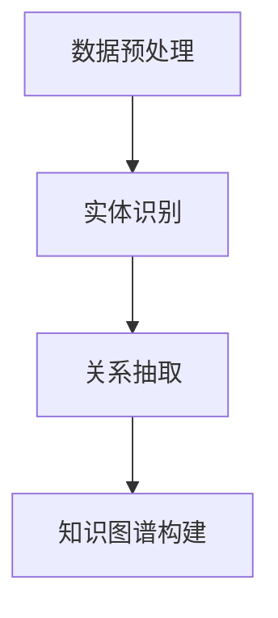
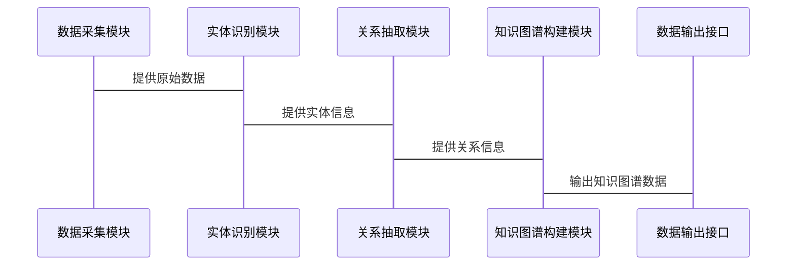

                 


# 企业AI Agent的知识图谱构建与应用

## 关键词：知识图谱，企业AI Agent，自然语言处理，机器学习，知识图谱构建，图神经网络

## 摘要：  
随着人工智能技术的快速发展，企业AI Agent（智能体）的应用越来越广泛。知识图谱作为AI Agent的核心技术之一，能够帮助AI Agent更好地理解和处理复杂的企业知识。本文从知识图谱的构建方法、算法原理、系统架构设计以及实际应用案例等方面，全面探讨企业AI Agent中知识图谱的构建与应用。通过详细的技术分析和实践案例，本文为读者提供一个清晰的知识图谱构建与应用的完整框架。

---

# 第1章: 企业AI Agent与知识图谱概述

## 1.1 知识图谱的定义与背景

### 1.1.1 知识图谱的定义
知识图谱是一种以图结构形式表示知识的语义网络，由实体（概念）和关系组成。知识图谱能够将分散在不同数据源中的信息通过语义关系连接起来，形成一个庞大的知识网络。

### 1.1.2 知识图谱的发展历程
知识图谱的概念起源于20世纪60年代的知识库技术，经历了从早期的手工构建到现代的自动构建的演变。近年来，随着自然语言处理和机器学习技术的进步，知识图谱的构建效率和准确性得到了显著提升。

### 1.1.3 企业AI Agent的定义与特点
企业AI Agent是一种能够感知环境、自主决策并执行任务的智能系统。它能够通过与用户的交互或外部系统的接口，为企业提供智能化的服务，如信息检索、决策支持和自动化操作。

## 1.2 知识图谱在企业AI Agent中的作用

### 1.2.1 知识图谱的核心价值
知识图谱为AI Agent提供了语义理解能力，使其能够更好地理解用户需求、推理问题，并提供更准确的解决方案。

### 1.2.2 知识图谱与企业AI Agent的关系
知识图谱是企业AI Agent的“知识库”，通过构建企业内部的知识网络，AI Agent能够快速获取相关信息，提高决策效率。

### 1.2.3 知识图谱在企业中的应用场景
- **信息检索**：通过知识图谱快速定位相关知识，提高信息检索的效率和准确性。
- **决策支持**：基于知识图谱的语义分析，为企业决策提供数据支持。
- **自动化流程**：利用知识图谱中的关系推理，实现业务流程的自动化。

## 1.3 本章小结  
本章介绍了知识图谱的定义、发展历程以及在企业AI Agent中的作用，为后续内容奠定了基础。

---

# 第2章: 知识图谱的核心概念与联系

## 2.1 知识图谱的构成要素

### 2.1.1 实体与概念
实体是知识图谱的基本构成单元，可以是具体的物体（如“苹果”）或抽象的概念（如“健康”）。概念是对实体的抽象描述，用于表示一类事物的共同特征。

### 2.1.2 关系与属性
关系描述了实体之间的关联方式（如“属于”、“包含”）。属性是描述实体特性的信息（如“颜色”、“形状”）。

### 2.1.3 知识图谱的结构特征
知识图谱通常以图结构形式表示，由节点（实体或概念）和边（关系）组成。知识图谱具有语义丰富、层次分明和可扩展性强的特点。

## 2.2 知识图谱的构建流程

### 2.2.1 数据采集与预处理
- 数据来源：企业内部文档、公开数据库、网络爬取等。
- 数据清洗：去除重复、噪声数据，确保数据质量。

### 2.2.2 实体识别与链接
- 实体识别：通过自然语言处理技术，从文本中提取实体。
- 实体链接：将实体与知识图谱中的节点进行匹配，建立关联。

### 2.2.3 关系抽取与构建
- 关系抽取：识别文本中的关系信息。
- 关系构建：将关系信息整合到知识图谱中，形成完整的知识网络。

## 2.3 知识图谱的表示方法

### 2.3.1 三元组表示法
三元组表示法将知识图谱中的知识表示为“实体-关系-实体”的形式，例如：“（人名，属于，部门）”。

### 2.3.2 图结构表示法
图结构表示法将知识图谱中的实体和关系以图的形式展示，便于直观理解。

### 2.3.3 知识图谱的可视化
知识图谱的可视化可以通过工具将复杂的知识网络以图表形式展示，便于用户理解和分析。

## 2.4 本章小结  
本章详细介绍了知识图谱的构成要素和构建流程，并通过实例展示了知识图谱的表示方法。

---

# 第3章: 知识图谱构建的算法原理

## 3.1 实体识别与链接算法

### 3.1.1 基于字符串匹配的实体识别
- 方法：通过字符串匹配技术，从文本中提取实体。
- 优点：简单易实现。
- 缺点：准确性较低，容易受到拼写错误的影响。

### 3.1.2 基于向量相似度的实体链接
- 方法：通过计算实体向量的相似度，进行实体链接。
- 优点：准确性较高，能够处理同义词和多种表达形式。
- 缺点：需要大量的训练数据。

### 3.1.3 实体识别的挑战与优化
- 挑战：实体歧义性、数据稀疏性。
- 优化：引入上下文信息，结合多种特征进行实体识别。

## 3.2 关系抽取算法

### 3.2.1 基于规则的关系抽取
- 方法：通过预定义的规则，从文本中提取关系。
- 优点：规则明确，易于解释。
- 缺点：难以处理复杂的关系和语义变化。

### 3.2.2 基于统计的关系抽取
- 方法：通过统计语言模型，从文本中提取关系。
- 优点：能够处理多种关系类型，准确性较高。
- 缺点：需要大量的训练数据。

### 3.2.3 基于深度学习的关系抽取
- 方法：使用深度学习模型（如LSTM、BERT）进行关系抽取。
- 优点：能够处理复杂的语义关系，准确性高。
- 缺点：需要大量的计算资源和训练数据。

## 3.3 知识图谱嵌入技术

### 3.3.1 Word2Vec模型
- 方法：将实体和关系映射到低维向量空间中，便于后续计算。
- 优点：计算效率高，适用于大规模数据。
- 缺点：无法直接处理复杂的语义关系。

### 3.3.2 TransE模型
- 方法：通过将关系表示为边的向量，进行知识图谱的嵌入。
- 优点：能够捕捉到实体之间的语义关系。
- 缺点：对噪声数据的鲁棒性较差。

### 3.3.3 KGAT模型
- 方法：使用图注意力机制，进行知识图谱的嵌入。
- 优点：能够捕捉到复杂的语义关系，准确性高。
- 缺点：计算复杂度较高。

## 3.4 算法流程图（使用 Mermaid）



## 3.5 本章小结  
本章介绍了知识图谱构建的主要算法，包括实体识别与链接算法、关系抽取算法以及知识图谱嵌入技术，并通过流程图展示了算法的整体流程。

---

# 第4章: 知识图谱构建的系统架构

## 4.1 系统功能设计

### 4.1.1 数据采集模块
- 功能：从多种数据源（如数据库、文本文件）中采集数据。
- 实现：使用Python的requests库进行网络爬取，或通过数据库连接获取数据。

### 4.1.2 实体识别模块
- 功能：从文本中提取实体。
- 实现：使用自然语言处理工具（如spaCy）进行实体识别。

### 4.1.3 关系抽取模块
- 功能：从文本中提取关系信息。
- 实现：使用深度学习模型（如BERT）进行关系抽取。

### 4.1.4 知识图谱构建模块
- 功能：将实体和关系整合到知识图谱中。
- 实现：使用图数据库（如Neo4j）进行知识图谱的存储和管理。

## 4.2 系统架构设计


## 4.3 系统接口设计

### 4.3.1 数据输入接口
- 接口描述：接收外部数据源的数据输入。
- 接口类型：RESTful API。

### 4.3.2 数据输出接口
- 接口描述：输出构建好的知识图谱数据。
- 接口类型：RESTful API。

## 4.4 系统交互流程



## 4.5 本章小结  
本章详细介绍了知识图谱构建系统的功能设计、架构设计以及接口设计，并通过序列图展示了系统的交互流程。

---

# 第5章: 知识图谱的数学模型与公式

## 5.1 Word2Vec模型

### 5.1.1 模型介绍
Word2Vec是一种用于词向量表示的模型，通过将词映射到低维向量空间，能够捕捉到词的语义信息。

### 5.1.2 模型公式
$$\text{score}(w_i, w_j) = \log P(w_j | w_i)$$

### 5.1.3 模型实现
- 实现方法：使用Skip-Gram模型或CBOW模型进行训练。
- 代码示例：
  ```python
  from gensim.models import Word2Vec
  model = Word2Vec(sentences, vector_size=100, window=5, min_count=1, workers=4)
  ```

## 5.2 TransE模型

### 5.2.1 模型介绍
TransE是一种基于翻译嵌入的模型，通过将实体和关系表示为向量，能够捕捉到实体之间的语义关系。

### 5.2.2 模型公式
$$\text{score}(e_i, r_j, e_k) = \| e_i + r_j - e_k \|_p$$

### 5.2.3 模型实现
- 实现方法：使用随机梯度下降进行训练。
- 代码示例：
  ```python
  import numpy as np
  def transE_loss(e_i, r_j, e_k):
      return np.linalg.norm(e_i + r_j - e_k)
  ```

## 5.3 KGAT模型

### 5.3.1 模型介绍
KGAT是一种基于图注意力机制的模型，通过注意力机制捕捉到复杂的语义关系。

### 5.3.2 模型公式
$$\text{score}(e_i, r_j, e_k) = \text{softmax}(\text{att}(e_i, r_j, e_k))$$

### 5.3.3 模型实现
- 实现方法：使用PyTorch框架进行模型训练。
- 代码示例：
  ```python
  import torch
  class KGAT(torch.nn.Module):
      def __init__(self):
          super(KGAT, self).__init__()
          self.attention = torch.nn.Linear(...)
      def forward(self, e_i, r_j, e_k):
          return self.attention(e_i, r_j, e_k)
  ```

## 5.4 本章小结  
本章介绍了知识图谱构建中常用的数学模型，包括Word2Vec、TransE和KGAT，并通过公式和代码示例展示了模型的具体实现。

---

# 第6章: 知识图谱的项目实战

## 6.1 环境配置

### 6.1.1 系统要求
- 操作系统：Linux/Windows/MacOS
- 内存：8GB以上
- 处理器：支持多线程的CPU或GPU

### 6.1.2 工具安装
- Python版本：3.6以上
- 需要安装的库：numpy、pandas、networkx、Neo4j驱动等。

## 6.2 核心代码实现

### 6.2.1 数据采集模块
```python
import requests
def fetch_data(url):
    response = requests.get(url)
    return response.text
```

### 6.2.2 实体识别模块
```python
from spacy.lang.zh import Chinese
import spacy
nlp = spacy.load("zh_core_web_sm")
def extract_entities(text):
    doc = nlp(text)
    entities = [ent.text for ent in doc.ents]
    return entities
```

### 6.2.3 关系抽取模块
```python
import torch
from transformers import BertModel, BertTokenizer
def extract_relations(text):
    model = BertModel.from_pretrained('bert-base-cased')
    tokenizer = BertTokenizer.from_pretrained('bert-base-cased')
    inputs = tokenizer(text, return_tensors='pt')
    outputs = model(**inputs)
    return outputs.last_hidden_state
```

### 6.2.4 知识图谱构建模块
```python
from neo4j import GraphDatabase
def build_kg_graph(neo4j_uri, entities, relations):
    driver = GraphDatabase.driver(neo4j_uri, auth=basic_auth('user', 'password'))
    with driver.session() as session:
        # 实体和关系的构建逻辑
        pass
```

## 6.3 案例分析与代码解读

### 6.3.1 案例背景
假设我们有一个企业员工信息管理系统，需要构建一个员工-部门的知识图谱。

### 6.3.2 代码实现
```python
# 数据采集模块
text = fetch_data('http://example.com/employees')
# 实体识别模块
entities = extract_entities(text)
# 关系抽取模块
relations = extract_relations(text)
# 知识图谱构建模块
build_kg_graph('bolt://localhost:7687', entities, relations)
```

## 6.4 项目总结

### 6.4.1 项目成果
成功构建了一个员工-部门的知识图谱，能够支持企业中的信息检索和决策支持。

### 6.4.2 项目经验
- 数据预处理是关键，需要确保数据的准确性和完整性。
- 实体识别和关系抽取的准确性直接影响知识图谱的质量。
- 知识图谱的可视化和查询工具的开发能够显著提高用户的使用体验。

## 6.5 本章小结  
本章通过一个实际案例，详细介绍了知识图谱构建项目的环境配置、核心代码实现以及案例分析，为读者提供了实践指导。

---

# 第7章: 知识图谱构建与应用的总结与展望

## 7.1 总结

### 7.1.1 核心内容回顾
- 知识图谱的定义、构建流程和应用场景。
- 知识图谱构建的算法原理和系统架构设计。
- 项目实战的经验总结。

### 7.1.2 本文的创新点
- 提出了适用于企业AI Agent的知识图谱构建方法。
- 结合实际案例，详细讲解了知识图谱的构建与应用。

## 7.2 展望

### 7.2.1 知识图谱构建技术的发展方向
- 更加智能化和自动化的构建方法。
- 基于大规模预训练模型的知识图谱构建。

### 7.2.2 企业AI Agent的未来趋势
- 知识图谱与图神经网络的结合。
- 多模态知识图谱的应用。

## 7.3 本章小结  
本章总结了全文的主要内容，并展望了知识图谱构建技术在未来的发展方向。

---

# 作者：AI天才研究院/AI Genius Institute & 禅与计算机程序设计艺术 /Zen And The Art of Computer Programming

---

感谢您的阅读！如果需要进一步的技术支持或合作，请随时联系我。

