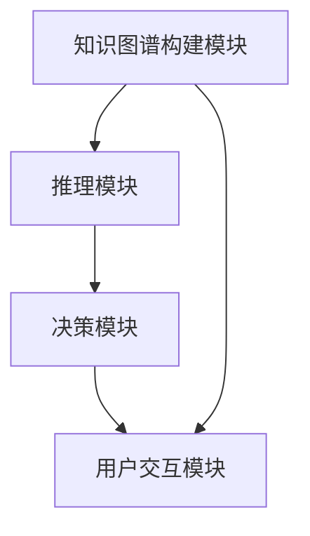

                 


# 企业AI Agent的知识图谱构建与推理系统

> 关键词：知识图谱，AI Agent，推理系统，企业应用，系统架构

> 摘要：本文详细探讨了企业AI Agent的知识图谱构建与推理系统的实现，从背景介绍到核心概念，从算法原理到系统架构，再到项目实战，全面解析了知识图谱如何赋能AI Agent，提升企业的智能化水平。

---

## 第1章 知识图谱与AI Agent的背景介绍

### 1.1 知识图谱的基本概念

知识图谱是一种结构化的数据表示形式，由实体（节点）和关系（边）组成，旨在描述现实世界中的概念及其相互关系。其核心目标是将分散在不同数据源中的信息整合成一个统一的知识网络。

#### 1.1.1 知识图谱的定义

知识图谱是一种基于图的语义网络，用于表示实体及其之间的关系。它通过结构化的数据形式，将分散的数据整合成一个可计算的知识库，为智能系统提供支持。

#### 1.1.2 知识图谱的核心要素

- 实体：知识图谱中的基本单位，表示现实世界中的事物，例如“苹果”是一个实体。
- 关系：描述实体之间的关联，例如“苹果”和“公司”之间的关系是“属于”。
- 属性：描述实体的特征，例如“苹果”有属性“颜色”和“形状”。

#### 1.1.3 知识图谱的构建目标

知识图谱的构建目标是通过整合多源数据，构建一个覆盖广泛领域、语义丰富且结构化的知识库，支持智能系统的语义理解和推理能力。

### 1.2 AI Agent的基本概念

AI Agent（人工智能代理）是一种能够感知环境、执行任务并做出决策的智能实体。它通过与用户或系统的交互，提供个性化的服务。

#### 1.2.1 AI Agent的定义

AI Agent是一种智能实体，能够感知环境、理解用户需求、执行任务并做出决策，为用户提供个性化的服务。

#### 1.2.2 AI Agent的核心功能

- 感知环境：通过传感器或用户输入获取信息。
- 理解需求：通过自然语言处理技术理解用户意图。
- 推理决策：基于知识图谱进行推理，生成最优决策。
- 执行任务：根据决策执行具体操作，例如搜索信息或调用API。

#### 1.2.3 AI Agent的应用场景

- 智能客服：通过理解用户需求，提供个性化的服务。
- 智能助手：帮助用户完成日常任务，例如日程管理或信息查询。
- 智能推荐：基于用户的偏好推荐相关内容。

### 1.3 知识图谱在AI Agent中的作用

知识图谱为AI Agent提供了丰富的知识库，支持其推理和决策能力，使其能够更好地理解和满足用户需求。

#### 1.3.1 知识图谱如何赋能AI Agent

知识图谱为AI Agent提供了语义理解、推理和决策所需的知识支持，使其能够理解上下文、推理因果关系，并做出合理的决策。

#### 1.3.2 知识图谱与AI Agent的结合方式

知识图谱作为AI Agent的知识库，通过语义理解技术将其与用户需求匹配，支持AI Agent的推理和决策过程。

#### 1.3.3 知识图谱在企业中的应用价值

知识图谱在企业中的应用价值主要体现在提升企业的智能化水平，优化业务流程，提高决策效率等方面。

---

## 第2章 知识图谱构建的核心概念与方法

### 2.1 知识图谱的构建流程

知识图谱的构建流程包括数据采集与预处理、实体识别与抽取、关系抽取与构建、知识融合与优化四个阶段。

#### 2.1.1 数据采集与预处理

数据采集是知识图谱构建的第一步，需要从多种数据源获取数据，并进行清洗和预处理，去除冗余和噪声数据。

- 数据源：结构化数据（如数据库）、半结构化数据（如网页）和非结构化数据（如文本）。
- 数据清洗：去除重复、噪声数据，确保数据的完整性和准确性。

#### 2.1.2 实体识别与抽取

实体识别是指从文本中识别出实体，并将其抽取出来。常用的方法包括基于规则的识别和基于深度学习的识别。

- 实体识别方法：
  - 基于规则的方法：通过预定义的规则和模式匹配进行实体识别。
  - 基于深度学习的方法：利用神经网络模型（如LSTM、BERT）进行实体识别。

- 实体抽取：从文本中提取实体并归类到知识图谱中。

#### 2.1.3 关系抽取与构建

关系抽取是从文本中识别出实体之间的关系，并将其构建为知识图谱中的边。

- 关系抽取方法：
  - 基于模式匹配：通过预定义的模板匹配文本中的关系。
  - 基于句法分析：通过分析句子的语法结构，识别实体之间的关系。
  - 基于语义理解：利用深度学习模型理解文本的语义，识别实体之间的关系。

- 关系构建：将抽取的关系表示为知识图谱中的边，连接两个实体。

#### 2.1.4 知识融合与优化

知识融合是指将多个数据源中的知识进行整合，消除冲突，并优化知识图谱的质量。

- 知识融合方法：
  - 数据清洗：去除重复和错误的知识。
  - 知识匹配：将不同数据源中的实体和关系进行匹配。
  - 知识合并：将匹配的知识进行合并，形成一致的知识图谱。

- 知识优化：通过分析知识图谱的结构，去除冗余的知识，优化知识图谱的存储和查询效率。

### 2.2 知识图谱的表示方法

知识图谱的表示方法包括实体表示、关系表示和知识图谱的存储与管理。

#### 2.2.1 实体表示

实体表示是指将实体表示为知识图谱中的节点，通常使用唯一标识符（如URI）进行标识。

- 实体标识符：例如，使用URI表示实体，如`<http://example.com/Entity1>`。

- 实体属性：例如，实体`<http://example.com/Entity1>`具有属性`<http://example.com/attr1>`，值为`"value1"`。

#### 2.2.2 关系表示

关系表示是指将实体之间的关系表示为知识图谱中的边，通常使用关系标识符（如URI）进行标识。

- 关系标识符：例如，使用URI表示关系，如`<http://example.com/Relation1>`。

- 关系方向：关系通常是有向的，例如，`<http://example.com/Entity1>`与`<http://example.com/Entity2>`通过关系`<http://example.com/Relation1>`连接。

#### 2.2.3 知识图谱的存储与管理

知识图谱的存储与管理需要考虑存储结构、查询效率和扩展性。

- 存储结构：知识图谱通常使用图数据库进行存储，如Neo4j、Sage等。
- 查询效率：通过优化查询语句和索引结构，提高知识图谱的查询效率。
- 扩展性：通过设计灵活的数据模型，支持知识图谱的扩展和更新。

### 2.3 知识图谱构建的工具与技术

知识图谱的构建需要借助多种工具和技术，包括数据采集工具、自然语言处理技术、知识融合工具等。

#### 2.3.1 常用工具介绍

- 数据采集工具：如BeautifulSoup、Scrapy等。
- 自然语言处理工具：如spaCy、NLTK、BERT等。
- 知识图谱构建工具：如Stanford Knowledge Graph、DBpedia等。

#### 2.3.2 自然语言处理技术

自然语言处理技术在知识图谱构建中的应用包括实体识别、关系抽取和语义理解。

- 实体识别：利用NLP技术从文本中识别实体。
- 关系抽取：利用NLP技术从文本中识别实体之间的关系。
- 语义理解：利用NLP技术理解文本的语义，支持知识图谱的构建。

#### 2.3.3 知识图谱构建的挑战与解决方案

知识图谱构建的挑战包括数据多样性、语义理解的复杂性和知识融合的困难。

- 数据多样性：不同数据源中的数据格式和语义可能不同，需要进行数据清洗和预处理。
- 语义理解的复杂性：文本中的语义关系可能复杂，需要借助深度学习模型进行理解。
- 知识融合的困难：不同数据源中的知识可能冲突，需要进行知识匹配和合并。

---

## 第3章 AI Agent的推理系统原理

### 3.1 推理系统的定义与分类

推理系统是指通过逻辑推理从已知事实中推导出新的结论的系统。它可以分为基于规则的推理、基于逻辑的推理和基于概率的推理。

#### 3.1.1 推理的定义

推理是指从已知事实中推导出新的结论的过程，是AI Agent的核心能力之一。

#### 3.1.2 推理的分类

- 基于规则的推理：通过预定义的规则进行推理，例如“如果A，则B”。
- 基于逻辑的推理：通过逻辑推理（如命题逻辑、谓词逻辑）进行推理。
- 基于概率的推理：通过概率论进行推理，例如贝叶斯推理。

#### 3.1.3 推理系统的应用

- 知识图谱推理：基于知识图谱中的实体和关系进行推理。
- 智能问答：通过推理系统回答用户的问题。
- 决策支持：通过推理系统支持决策过程。

### 3.2 基于知识图谱的推理方法

基于知识图谱的推理方法包括基于规则的推理、基于逻辑的推理和基于概率的推理。

#### 3.2.1 基于规则的推理

基于规则的推理通过预定义的规则进行推理，例如“如果A属于B，且B属于C，则A属于C”。

- 规则定义：规则通常由前提和结论组成，例如“如果A是苹果，且苹果属于水果，则A属于水果”。
- 规则匹配：在知识图谱中匹配规则的前提，推导出结论。

#### 3.2.2 基于逻辑的推理

基于逻辑的推理通过逻辑推理进行推理，例如命题逻辑和谓词逻辑。

- 命题逻辑：将知识表示为命题，通过逻辑推理进行推理。
- 谓词逻辑：将知识表示为谓词和变量，通过逻辑推理进行推理。

#### 3.2.3 基于概率的推理

基于概率的推理通过概率论进行推理，例如贝叶斯推理。

- 贝叶斯推理：通过贝叶斯定理计算条件概率，进行推理。
- 概率网络：构建概率网络，表示变量之间的概率关系，进行推理。

### 3.3 推理系统的优化与改进

推理系统的优化与改进包括提高推理效率、推理准确性和推理的可解释性。

#### 3.3.1 推理效率的提升

- 索引优化：通过索引优化查询效率。
- 并行计算：利用并行计算提高推理效率。
- 约束 satisfaction：通过约束 satisfaction 技术减少推理空间。

#### 3.3.2 推理准确性的提高

- 知识图谱优化：通过优化知识图谱的质量，提高推理准确性。
- 推理算法改进：改进推理算法，提高推理准确性。
- 上下文理解：通过上下文理解，提高推理准确性。

#### 3.3.3 推理系统的可解释性

- 可解释性定义：推理系统需要能够解释推理过程和结果，提高用户对推理结果的信任。
- 可解释性实现：通过可视化推理过程和提供推理步骤说明，提高推理系统的可解释性。

---

## 第4章 知识图谱与AI Agent的结合

### 4.1 知识图谱在AI Agent中的应用

知识图谱在AI Agent中的应用包括知识库构建、推理支持和决策支持。

#### 4.1.1 知识图谱作为AI Agent的知识库

知识图谱为AI Agent提供了一个结构化的知识库，支持其语义理解和推理能力。

- 知识库构建：通过知识图谱构建技术，构建AI Agent的知识库。
- 知识库查询：通过查询知识图谱，获取所需的知识。

#### 4.1.2 知识图谱支持AI Agent的推理能力

知识图谱为AI Agent提供了推理所需的知识，支持其进行逻辑推理和概率推理。

- 逻辑推理：基于知识图谱中的实体和关系进行逻辑推理。
- 概率推理：基于知识图谱中的概率关系进行概率推理。

#### 4.1.3 知识图谱提升AI Agent的决策能力

知识图谱为AI Agent提供了决策所需的知识，支持其进行决策支持和优化。

- 决策支持：基于知识图谱中的知识，提供决策建议。
- 决策优化：通过知识图谱优化决策过程，提高决策效率。

### 4.2 知识图谱与AI Agent的协同工作

知识图谱与AI Agent的协同工作包括知识图谱构建、推理和决策支持。

#### 4.2.1 知识图谱构建与AI Agent的结合

知识图谱构建与AI Agent的结合需要通过AI Agent的需求驱动知识图谱的构建。

- 需求驱动：根据AI Agent的需求，构建相关的知识图谱。
- 动态更新：根据AI Agent的使用反馈，动态更新知识图谱。

#### 4.2.2 知识图谱支持AI Agent的推理能力

知识图谱通过提供推理所需的知识，支持AI Agent的推理能力。

- 实体识别：通过知识图谱识别实体。
- 关系推理：通过知识图谱推理实体之间的关系。
- 语义理解：通过知识图谱理解语义。

#### 4.2.3 知识图谱提升AI Agent的决策能力

知识图谱通过提供决策所需的知识，支持AI Agent的决策能力。

- 决策支持：基于知识图谱提供决策建议。
- 决策优化：通过知识图谱优化决策过程。

### 4.3 知识图谱与AI Agent的协同设计

知识图谱与AI Agent的协同设计需要考虑知识图谱的构建、推理和决策支持。

#### 4.3.1 知识图谱的动态构建

知识图谱的动态构建需要根据AI Agent的需求，动态构建和更新知识图谱。

- 动态构建：根据AI Agent的需求，动态构建知识图谱。
- 动态更新：根据AI Agent的使用反馈，动态更新知识图谱。

#### 4.3.2 知识图谱的可扩展性设计

知识图谱的可扩展性设计需要考虑知识图谱的扩展性和灵活性。

- 知识扩展：支持知识图谱的扩展，增加新的实体和关系。
- 知识融合：支持知识图谱的融合，整合多源知识。

#### 4.3.3 知识图谱的可维护性设计

知识图谱的可维护性设计需要考虑知识图谱的维护和更新。

- 知识维护：定期维护知识图谱，确保其准确性和完整性。
- 知识更新：根据需求更新知识图谱，适应变化的环境。

---

## 第5章 知识图谱与AI Agent的系统架构设计

### 5.1 系统功能设计

知识图谱与AI Agent的系统功能设计需要考虑知识图谱的构建、推理和决策支持。

#### 5.1.1 知识图谱构建模块

知识图谱构建模块负责构建和管理知识图谱。

- 数据采集：从多种数据源采集数据。
- 数据预处理：清洗和预处理数据。
- 实体识别与抽取：识别和抽取实体。
- 关系抽取与构建：抽取和构建关系。
- 知识融合：融合多源知识，优化知识图谱。

#### 5.1.2 推理模块

推理模块负责基于知识图谱进行推理。

- 推理算法：选择合适的推理算法，例如基于规则的推理、逻辑推理和概率推理。
- 推理过程：执行推理过程，生成推理结果。
- 推理结果：输出推理结果，供决策模块使用。

#### 5.1.3 决策模块

决策模块负责基于推理结果进行决策。

- 决策规则：定义决策规则，例如“如果A，则B”。
- 决策过程：执行决策过程，生成决策结果。
- 决策结果：输出决策结果，供AI Agent使用。

### 5.2 系统架构设计

知识图谱与AI Agent的系统架构设计需要考虑系统的模块化和可扩展性。

#### 5.2.1 系统架构图

以下是系统的架构图，展示了各模块之间的关系：



- 知识图谱构建模块与推理模块相连，推理模块与决策模块相连，决策模块与用户交互模块相连。
- 知识图谱构建模块还与用户交互模块相连，用户可以通过用户交互模块与知识图谱构建模块进行交互。

#### 5.2.2 系统功能模块

系统功能模块包括知识图谱构建模块、推理模块、决策模块和用户交互模块。

- 知识图谱构建模块：负责构建和管理知识图谱。
- 推理模块：负责基于知识图谱进行推理。
- 决策模块：负责基于推理结果进行决策。
- 用户交互模块：负责与用户进行交互，获取用户需求并输出结果。

#### 5.2.3 系统接口设计

系统接口设计需要考虑模块之间的接口和数据格式。

- 接口定义：定义模块之间的接口，例如知识图谱构建模块与推理模块之间的接口。
- 数据格式：定义数据的格式，例如实体和关系的表示方式。

#### 5.2.4 系统交互流程

系统交互流程包括用户需求输入、知识图谱构建、推理、决策和结果输出。

- 用户需求输入：用户通过用户交互模块输入需求。
- 知识图谱构建：知识图谱构建模块根据需求构建知识图谱。
- 推理：推理模块基于知识图谱进行推理。
- 决策：决策模块基于推理结果进行决策。
- 结果输出：用户交互模块将结果输出给用户。

### 5.3 系统实现细节

知识图谱与AI Agent的系统实现细节需要考虑数据结构、算法实现和系统优化。

#### 5.3.1 数据结构设计

数据结构设计需要考虑知识图谱的存储和查询效率。

- 实体表示：使用节点表示实体，例如`Node{ID, Label, Properties}`。
- 关系表示：使用边表示关系，例如`Edge{StartNode, EndNode, Label, Properties}`。

#### 5.3.2 算法实现

算法实现需要考虑推理算法的实现和优化。

- 推理算法：实现基于规则的推理、逻辑推理和概率推理。
- 算法优化：优化推理算法，提高推理效率。

#### 5.3.3 系统优化

系统优化需要考虑系统的性能和可扩展性。

- 性能优化：优化系统的性能，提高系统的响应速度。
- 可扩展性优化：设计系统的可扩展性，支持系统的扩展和升级。

---

## 第6章 项目实战：构建企业AI Agent的知识图谱推理系统

### 6.1 项目背景

随着企业智能化需求的增加，构建企业AI Agent的知识图谱推理系统成为企业智能化转型的重要方向。

#### 6.1.1 项目目标

项目目标是构建一个基于知识图谱的企业AI Agent推理系统，支持企业的智能化需求。

#### 6.1.2 项目需求

- 知识图谱构建：构建企业相关的知识图谱。
- 推理系统开发：开发基于知识图谱的推理系统。
- AI Agent实现：实现企业AI Agent，支持企业的智能化需求。

### 6.2 项目环境搭建

项目环境搭建需要安装必要的工具和库，例如Python、Pip、Jupyter Notebook等。

#### 6.2.1 安装Python和Pip

安装Python和Pip：

```bash
# 在Linux系统中安装Python和Pip
sudo apt-get update
sudo apt-get install python3 python3-pip
```

#### 6.2.2 安装Jupyter Notebook

安装Jupyter Notebook：

```bash
pip install jupyter
jupyter notebook
```

#### 6.2.3 安装知识图谱相关库

安装知识图谱相关库，例如networkx、py2neo等：

```bash
pip install networkx py2neo
```

### 6.3 系统核心实现

系统核心实现包括知识图谱构建、推理模块实现和AI Agent实现。

#### 6.3.1 知识图谱构建实现

知识图谱构建实现包括数据采集、数据预处理、实体识别与抽取、关系抽取与构建和知识融合与优化。

- 数据采集：从企业数据库中采集数据。
- 数据预处理：清洗和预处理数据。
- 实体识别与抽取：使用自然语言处理技术识别和抽取实体。
- 关系抽取与构建：使用自然语言处理技术抽取和构建关系。
- 知识融合与优化：融合多源知识，优化知识图谱。

#### 6.3.2 推理模块实现

推理模块实现包括推理算法的选择和实现。

- 推理算法选择：选择基于规则的推理、逻辑推理或概率推理。
- 推理算法实现：实现选择的推理算法，例如基于规则的推理。

#### 6.3.3 AI Agent实现

AI Agent实现包括用户交互模块、推理模块和决策模块的实现。

- 用户交互模块：实现用户与AI Agent的交互，例如通过命令行或图形界面。
- 推理模块：调用推理模块进行推理。
- 决策模块：基于推理结果进行决策。

### 6.4 项目实战案例分析

项目实战案例分析包括案例背景、数据准备、知识图谱构建、推理实现和结果分析。

#### 6.4.1 案例背景

案例背景是构建一个企业AI Agent，支持企业的智能化需求。

#### 6.4.2 数据准备

数据准备包括收集企业相关的数据，例如企业的组织结构、业务流程和知识库。

#### 6.4.3 知识图谱构建

知识图谱构建包括数据采集、数据预处理、实体识别与抽取、关系抽取与构建和知识融合与优化。

#### 6.4.4 推理实现

推理实现包括选择和实现推理算法，例如基于规则的推理。

#### 6.4.5 结果分析

结果分析包括分析推理结果，优化推理算法，提高推理准确性。

### 6.5 项目小结

项目小结包括项目总结、经验分享和未来展望。

#### 6.5.1 项目总结

项目总结包括项目目标的实现情况、项目成果和项目不足。

#### 6.5.2 经验分享

经验分享包括项目中的经验和教训，例如数据预处理的重要性、算法选择的影响等。

#### 6.5.3 未来展望

未来展望包括未来的改进方向、新技术的应用和项目的扩展。

---

## 第7章 总结与展望

### 7.1 总结

知识图谱构建与AI Agent的结合为企业智能化提供了强有力的支持，通过构建知识图谱，AI Agent能够更好地理解和满足用户需求。

#### 7.1.1 知识图谱构建的核心价值

知识图谱构建的核心价值在于为AI Agent提供了一个结构化的知识库，支持其语义理解和推理能力。

#### 7.1.2 AI Agent推理系统的核心价值

AI Agent推理系统的核心价值在于通过推理系统，AI Agent能够基于知识图谱进行推理和决策，支持企业的智能化需求。

### 7.2 最佳实践

最佳实践包括知识图谱构建的最佳实践和AI Agent推理系统的最佳实践。

#### 7.2.1 知识图谱构建的最佳实践

- 数据预处理：数据预处理是知识图谱构建的关键步骤，确保数据的准确性和完整性。
- 实体识别与抽取：选择合适的实体识别和抽取技术，提高实体识别的准确率。
- 关系抽取与构建：选择合适的关系抽取和构建技术，提高关系抽取的准确率。
- 知识融合：通过知识融合技术，优化知识图谱的质量。

#### 7.2.2 AI Agent推理系统的最佳实践

- 推理算法选择：选择合适的推理算法，例如基于规则的推理适用于简单的推理场景，基于逻辑的推理适用于复杂的推理场景，基于概率的推理适用于不确定的推理场景。
- 推理系统优化：通过优化推理算法和系统架构，提高推理效率和准确性。
- 推理系统可解释性：通过可视化和解释性设计，提高推理系统的可解释性。

### 7.3 注意事项

注意事项包括知识图谱构建和AI Agent推理系统中的注意事项。

#### 7.3.1 知识图谱构建中的注意事项

- 数据多样性：不同数据源中的数据可能具有不同的格式和语义，需要进行数据清洗和预处理。
- 数据质量：数据质量直接影响知识图谱的质量，需要确保数据的准确性和完整性。
- 知识融合：知识融合需要考虑不同数据源中的知识冲突，需要进行知识匹配和合并。

#### 7.3.2 AI Agent推理系统中的注意事项

- 推理算法选择：选择合适的推理算法，避免选择不合适算法导致的推理错误。
- 推理系统优化：通过优化推理算法和系统架构，提高推理效率和准确性。
- 推理系统可解释性：通过可视化和解释性设计，提高推理系统的可解释性。

### 7.4 未来展望

未来展望包括知识图谱构建和AI Agent推理系统的未来发展趋势。

#### 7.4.1 知识图谱构建的未来发展趋势

- 自动化构建：随着AI技术的发展，知识图谱的自动化构建将成为可能，减少人工干预。
- 实时更新：知识图谱的实时更新将更加重要，支持动态变化的环境。
- 多模态知识图谱：多模态知识图谱将更加普及，支持多种数据类型的整合和分析。

#### 7.4.2 AI Agent推理系统的未来发展趋势

- 深度学习推理：深度学习推理将更加普及，支持更复杂的推理场景。
- 实时推理：实时推理将更加重要，支持快速决策和响应。
- 人机协作：人机协作将更加紧密，AI Agent将与人类协同工作，共同完成任务。

---

## 作者：AI天才研究院/AI Genius Institute & 禅与计算机程序设计艺术 /Zen And The Art of Computer Programming

---

**感谢您的阅读！如果对您有帮助，请点赞、收藏、分享！**

