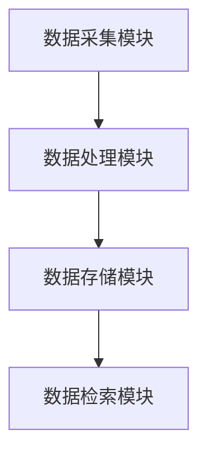

                 


# 企业AI Agent的知识库管理系统

> 关键词：企业AI Agent、知识库管理、向量数据库、知识图谱、机器学习、系统架构

> 摘要：企业AI Agent需要依赖高效的知识库管理系统来实现智能决策和自动化操作。本文详细探讨了知识库管理系统的构建与实现，涵盖了知识库管理系统的结构与核心概念、算法原理与技术实现、系统架构设计与优化、项目实战与案例分析等多个方面，为企业AI Agent的知识库管理提供了全面的解决方案。

---

# 第1章: 企业AI Agent与知识库管理概述

## 1.1 什么是企业AI Agent
企业AI Agent（Artificial Intelligence Agent）是指在企业环境中运行的智能代理，能够感知环境、自主决策并执行任务。企业AI Agent的核心目标是通过自动化技术提高企业的运营效率、降低成本，并增强决策的准确性。

### 1.1.1 AI Agent的基本概念
- **AI Agent**：智能代理，能够感知环境、自主决策并执行任务。
- **企业AI Agent**：在企业环境中运行的智能代理，通常用于优化企业流程、提高效率。

### 1.1.2 企业AI Agent的特点
- **自主性**：能够自主决策，无需人工干预。
- **反应性**：能够实时感知环境并做出响应。
- **目标导向性**：基于目标进行决策和行动。

### 1.1.3 企业AI Agent的应用场景
- **流程自动化**：自动化处理企业中的重复性任务。
- **智能决策支持**：基于数据和知识库提供决策支持。
- **客户互动**：通过聊天机器人与客户进行交互。

## 1.2 知识库管理系统的定义与作用
知识库管理系统是用于管理和维护知识库的系统，能够存储、组织和检索知识，为AI Agent提供支持。

### 1.2.1 知识库管理系统的定义
- **知识库**：存储结构化或非结构化知识的数据库。
- **知识库管理系统**：用于管理知识库的软件系统，支持知识的存储、组织和检索。

### 1.2.2 知识库管理系统的核心作用
- **数据存储**：将知识以结构化形式存储。
- **数据检索**：快速检索所需知识。
- **数据更新**：动态更新知识库内容。

### 1.2.3 知识库管理系统的分类
- **结构化知识库**：存储结构化数据，如关系型数据库。
- **半结构化知识库**：存储半结构化数据，如JSON格式。
- **非结构化知识库**：存储文本、图像等非结构化数据。

## 1.3 企业AI Agent与知识库管理的关系
企业AI Agent依赖知识库管理系统来获取知识和信息，从而实现智能决策和自动化操作。

### 1.3.1 知识库在AI Agent中的地位
- 知识库是AI Agent的核心知识来源。
- 知识库的质量直接影响AI Agent的性能。

### 1.3.2 企业AI Agent如何利用知识库管理系统
- **知识获取**：从知识库中获取所需知识。
- **知识更新**：动态更新知识库内容。
- **知识检索**：快速检索所需知识。

## 1.4 本章小结
企业AI Agent需要依赖高效的知识库管理系统来实现智能决策和自动化操作。知识库管理系统是企业AI Agent的核心支持系统，能够存储、组织和检索知识，为AI Agent提供必要的支持。

---

# 第2章: 知识库管理系统的核心概念与技术

## 2.1 知识库管理系统的结构与组成
知识库管理系统由多个模块组成，包括数据采集、数据处理、数据存储和数据检索模块。

### 2.1.1 知识库管理系统的组成模块
- **数据采集模块**：负责采集知识数据。
- **数据处理模块**：对采集的数据进行清洗和预处理。
- **数据存储模块**：将处理后的数据存储到知识库中。
- **数据检索模块**：根据查询条件检索知识库中的数据。

### 2.1.2 系统的输入输出关系
- **输入**：知识数据、查询请求。
- **输出**：处理后的知识数据、检索结果。

### 2.1.3 系统的核心功能模块
- **数据采集**：从多种数据源采集知识数据。
- **数据处理**：清洗、转换和增强数据。
- **数据存储**：将数据存储到知识库中。
- **数据检索**：根据查询条件检索知识库中的数据。

## 2.2 知识库管理系统的数据模型
知识库管理系统的数据模型是知识库管理系统的核心部分，决定了知识的存储和检索方式。

### 2.2.1 数据模型的定义
- **数据模型**：描述数据的结构和关系的模型。
- **知识库的数据结构**：知识的表示方式，如实体-关系模型。

### 2.2.2 知识库的数据结构
- **实体-关系模型**：描述实体之间的关系。
- **属性-值模型**：描述实体的属性和值。

### 2.2.3 数据模型的优缺点对比
- **实体-关系模型**：优点是清晰、易于理解，缺点是复杂性较高。
- **属性-值模型**：优点是简单、易于实现，缺点是灵活性较低。

## 2.3 知识库管理系统的功能特性
知识库管理系统的功能特性决定了系统的性能和能力。

### 2.3.1 数据存储与检索功能
- **数据存储**：将知识数据存储到知识库中。
- **数据检索**：根据查询条件检索知识库中的数据。

### 2.3.2 数据更新与维护功能
- **数据更新**：动态更新知识库内容。
- **数据维护**：定期清理和优化知识库。

### 2.3.3 数据安全与权限管理
- **数据安全**：保护知识库数据的安全性。
- **权限管理**：控制对知识库的访问权限。

## 2.4 本章小结
知识库管理系统的结构和功能特性决定了系统的性能和能力。本章详细介绍了知识库管理系统的组成模块、数据模型和功能特性，为后续的系统设计和实现奠定了基础。

---

# 第3章: 知识库管理系统的算法原理与实现

## 3.1 向量数据库与相似度计算
向量数据库是知识库管理系统的重要组成部分，用于存储和检索向量数据。

### 3.1.1 向量空间模型
- **向量空间模型**：将文本表示为向量，用于相似度计算。
- **向量相似度**：衡量两个向量的相似程度。

### 3.1.2 向量相似度计算方法
- **余弦相似度**：计算两个向量之间的余弦值。
- **欧氏距离**：计算两个向量之间的欧氏距离。

### 3.1.3 向量数据库的应用场景
- **文本检索**：基于向量相似度进行文本检索。
- **图像检索**：基于向量相似度进行图像检索。

## 3.2 知识库构建的算法原理
知识库构建是知识库管理系统的核心任务之一，涉及数据清洗、特征提取和向量编码。

### 3.2.1 分块与编码技术
- **分块**：将知识数据分成多个块。
- **编码**：将每个块编码为向量。

### 3.2.2 知识图谱构建算法
- **知识图谱**：描述实体之间的关系。
- **图谱构建**：基于向量相似度构建知识图谱。

### 3.2.3 知识库更新算法
- **增量更新**：逐步更新知识库内容。
- **批量更新**：批量更新知识库内容。

## 3.3 算法实现的代码示例
以下是一个向量相似度计算的代码示例：

```python
import numpy as np

def cosine_similarity(vec1, vec2):
    dot_product = np.dot(vec1, vec2)
    norm1 = np.linalg.norm(vec1)
    norm2 = np.linalg.norm(vec2)
    return dot_product / (norm1 * norm2)
```

## 3.4 本章小结
向量数据库和相似度计算是知识库管理系统的核心技术。本章详细介绍了向量空间模型、相似度计算方法和知识库构建算法，为后续的系统实现提供了理论基础。

---

# 第4章: 系统架构设计

## 4.1 系统功能模块划分
知识库管理系统的功能模块划分如下：

### 4.1.1 数据采集模块
- **数据采集**：从多种数据源采集知识数据。
- **数据预处理**：清洗和转换数据。

### 4.1.2 数据处理模块
- **特征提取**：提取数据的特征。
- **向量编码**：将特征编码为向量。

### 4.1.3 数据存储模块
- **向量存储**：将向量数据存储到数据库中。
- **知识图谱存储**：将知识图谱存储到数据库中。

### 4.1.4 数据检索模块
- **向量检索**：基于向量相似度检索数据。
- **知识图谱检索**：基于知识图谱进行检索。

## 4.2 系统架构设计图
以下是一个系统的架构设计图：



## 4.3 系统接口设计
系统接口设计包括数据接口规范、API接口设计和接口调用流程。

### 4.3.1 数据接口规范
- **输入格式**：JSON格式。
- **输出格式**：JSON格式。

### 4.3.2 API接口设计
- **GET /api/knowledge检索**：根据查询条件检索知识库数据。
- **POST /api/knowledge更新**：更新知识库数据。

### 4.3.3 接口调用流程
1. 发送查询请求到API接口。
2. 系统处理请求并返回结果。

## 4.4 本章小结
系统架构设计是知识库管理系统实现的关键。本章详细介绍了系统的功能模块划分、架构设计图和接口设计，为系统的实现提供了指导。

---

# 第5章: 项目实战与案例分析

## 5.1 项目背景与需求分析
本项目旨在开发一个企业级知识库管理系统，支持向量数据库和知识图谱的构建与检索。

### 5.1.1 项目背景
- **背景**：企业需要高效的知识库管理系统来支持AI Agent的运行。
- **目标**：开发一个高效、可扩展的知识库管理系统。

### 5.1.2 需求分析
- **功能需求**：支持向量数据库和知识图谱的构建与检索。
- **性能需求**：高并发、低延迟。

## 5.2 系统核心实现
### 5.2.1 环境搭建
- **编程语言**：Python 3.8+
- **框架**：Flask或Django。
- **数据库**：MongoDB或PostgreSQL。

### 5.2.2 核心代码实现
以下是一个向量数据库的实现示例：

```python
from flask import Flask
import numpy as np

app = Flask(__name__)

@app.route('/api/knowledge检索', methods=['GET'])
def search():
    vec = request.args.get('vec')
    # 将vec转换为向量
    vector = np.array(vec.split(',')).astype(float)
    # 检索相似向量
    similarities = cosine_similarity(vector, knowledge_base)
    # 返回相似度最高的结果
    return jsonify({'results': similarities})
```

### 5.2.3 代码应用解读与分析
- **向量转换**：将输入的向量转换为数值形式。
- **相似度计算**：使用余弦相似度计算向量之间的相似度。
- **结果返回**：返回相似度最高的结果。

## 5.3 项目小结
本项目通过向量数据库和知识图谱的构建与检索，实现了高效的知识库管理系统，为企业AI Agent提供了强有力的支持。

---

# 作者信息

作者：AI天才研究院/AI Genius Institute & 禅与计算机程序设计艺术 /Zen And The Art of Computer Programming

