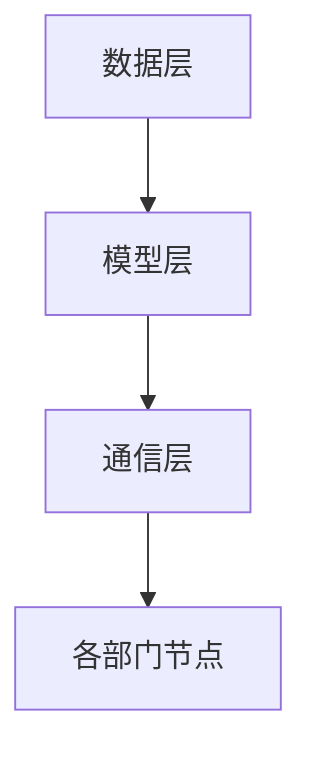
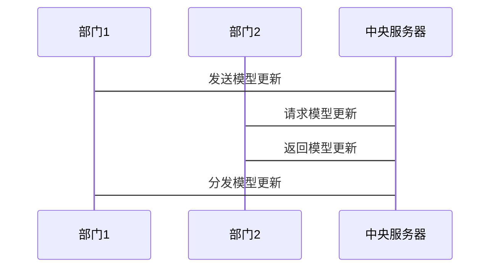
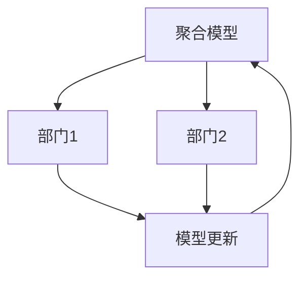

                 


# 企业AI Agent的联邦学习在跨部门数据协作中的实践

> 关键词：企业AI Agent，联邦学习，跨部门数据协作，数据隐私，AI系统架构

> 摘要：本文探讨了企业AI Agent如何利用联邦学习技术实现跨部门数据协作，解决数据孤岛问题，同时确保数据隐私与安全。通过详细分析联邦学习的原理、架构设计及实际案例，本文为读者提供了从理论到实践的全面指南。

---

## 第1章：企业AI Agent的基本概念

### 1.1 AI Agent的定义与特点

AI Agent是一种智能实体，能够感知环境并自主决策。其特点包括自主性、反应性、目标导向和社会能力。与传统AI不同，AI Agent能够主动与环境交互，适应动态变化。

#### 1.1.3 AI Agent与传统AI的区别

| 特性       | 传统AI                  | AI Agent              |
|------------|------------------------|-----------------------|
| 智能类型   | 觉知型AI                | 主动型AI              |
| 交互方式   | 单向输入输出            | 双向交互              |
| 应用场景   | 数据分析、预测          | 自动化决策、控制      |

### 1.2 企业AI Agent的作用与价值

企业AI Agent在跨部门协作中扮演重要角色，能够协调各部门数据，提高效率。应用场景包括供应链管理、客户服务和风险管理。其优势在于提升协作效率、增强数据隐私保护和实现智能化决策。

---

## 第2章：联邦学习的基本原理

### 2.1 联邦学习的定义与特点

联邦学习是一种分布式机器学习技术，允许多个参与方在不共享原始数据的情况下共同训练模型。其特点包括数据不出域、模型共训练和数据隐私保护。

#### 2.1.3 联邦学习与传统数据协作的区别

| 特性       | 传统数据协作           | 联邦学习             |
|------------|-----------------------|----------------------|
| 数据共享   | 共享原始数据           | 不共享原始数据       |
| 模型训练   | 集中训练               | 分布式训练           |
| 数据隐私   | 隐私风险较高           | 隐私保护增强         |

### 2.2 联邦学习的机制与流程

联邦学习通过数据不出域和模型共训练机制实现协作。流程包括数据预处理、模型初始化、局部训练和模型聚合。

#### 2.2.3 联邦学习的安全性与隐私保护

使用同态加密和差分隐私技术保护数据隐私，确保模型训练过程中的数据安全。

---

## 第3章：跨部门数据协作的挑战与解决方案

### 3.1 跨部門數據協作的挑戰

数据孤岛、隐私保护和效率低下是主要挑战。

#### 3.1.1 数据孤岛问题

部门间数据格式和存储方式不统一，导致无法有效协作。

### 3.2 联邦学习在跨部门数据协作中的解决方案

通过联邦学习机制解决数据孤岛、隐私保护和协作效率问题。

#### 3.2.1 联邦学习如何解决数据孤岛问题

通过分布式模型训练，各部门仅共享模型参数，避免数据泄露。

---

## 第4章：企业AI Agent的联邦学习架构设计

### 4.1 系统架构设计

系统架构包括数据层、模型层和通信层，确保数据安全和高效协作。

#### 4.1.1 系统架构图



### 4.2 通信机制设计

采用异步通信机制，确保各部门节点高效协作。

#### 4.2.1 通信机制图



---

## 第5章：算法原理与实现

### 5.1 联邦学习算法原理

#### 5.1.1 FedAvg算法

数学模型：

$$ W_{new} = \frac{1}{N}\sum_{i=1}^{N} W_i $$

其中，$W_i$是第i个部门的模型参数，$N$是部门总数。

#### 5.1.2 联邦学习流程图



### 5.2 算法实现

#### 5.2.1 Python代码示例

```python
import numpy as np

def fed_avg(models):
    return np.mean(models, axis=0)

# 示例
models = [np.array([1,2,3]), np.array([4,5,6]), np.array([7,8,9])]
avg_model = fed_avg(models)
print(avg_model)
```

---

## 第6章：项目实战

### 6.1 案例分析

#### 6.1.1 案例背景

某企业需要在不共享客户数据的情况下，跨部门预测客户购买行为。

### 6.2 环境安装

安装必要的库，如TensorFlow Federated和Flask。

### 6.3 核心代码实现

#### 6.3.1 联邦学习实现代码

```python
import tensorflow as tf
from tensorflow_federated import PythonDriver, Server, Client

# 定义模型
model = tf.keras.Sequential([
    tf.keras.layers.Dense(10, activation='relu'),
    tf.keras.layers.Dense(1, activation='sigmoid')
])

# 初始化服务器和客户端
server = Server(model)
client = Client(model)

# 联邦学习训练
driver = PythonDriver(server, client)
driver.train()
```

### 6.4 案例分析与解读

通过联邦学习，各部门在不共享数据的情况下，共同训练客户购买预测模型，提高了预测准确率。

---

## 第7章：最佳实践与未来展望

### 7.1 总结

企业AI Agent结合联邦学习，能够有效解决跨部门数据协作问题，同时保护数据隐私。

### 7.2 未来展望

未来，联邦学习将朝着多模态和智能化方向发展，AI Agent将更加智能化，提升协作效率。

---

## 附录

### 附录A：联邦学习框架

- TensorFlow Federated
- Federated Machine Learning Framework

### 附录B：数据隐私法规

- GDPR
- CCPA

### 附录C：相关论文

- "Communication-Efficient Learning of Deep Networks from Distributed...

