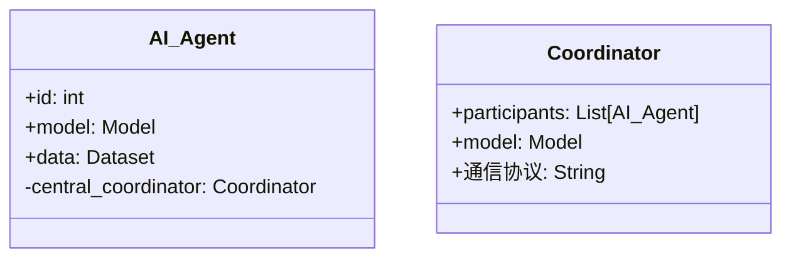
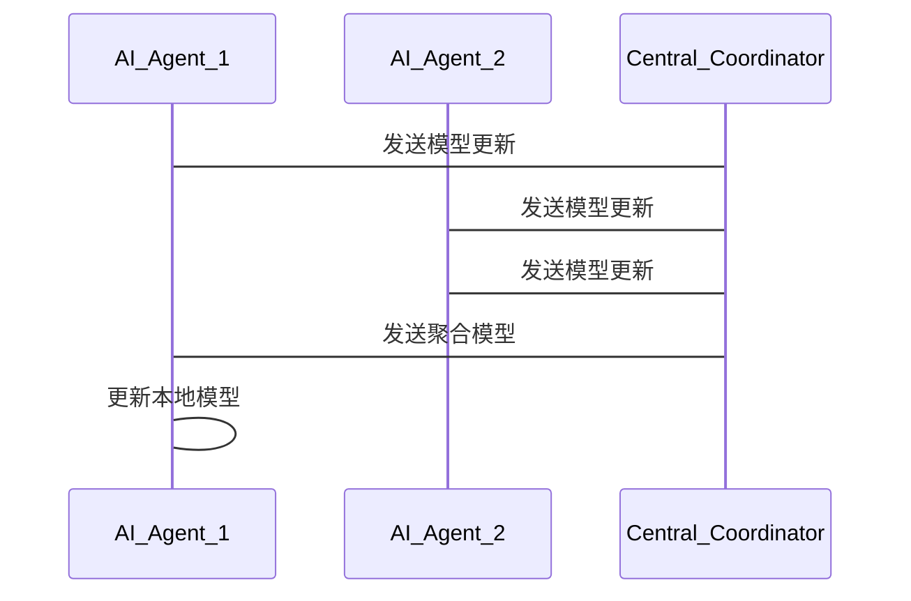

                 


# 企业AI Agent的联邦学习在跨部门数据协作中的实践与挑战

## 关键词：
企业AI Agent, 联邦学习, 跨部门数据协作, 数据隐私, 联邦算法, 跨组织协作, 联邦学习架构

## 摘要：
随着企业数字化转型的深入，跨部门协作的需求日益增长，但数据孤岛和隐私问题阻碍了数据的有效利用。联邦学习作为一种新兴的技术，能够在保护数据隐私的前提下，实现跨部门数据协作。本文深入探讨了企业AI Agent在联邦学习中的应用，详细分析了其核心概念、算法原理、系统设计和实际案例，同时总结了面临的挑战和未来的发展方向。

---

# 第1章: 企业AI Agent与联邦学习概述

## 1.1 企业AI Agent的基本概念

### 1.1.1 什么是企业AI Agent
企业AI Agent是一种智能实体，能够感知环境、执行任务并优化决策。它通过整合企业内外部数据，利用机器学习模型提供智能化服务。

### 1.1.2 AI Agent的核心特征
- **自主性**：AI Agent能够自主决策，无需人工干预。
- **反应性**：能够实时响应环境变化。
- **协作性**：能够在不同部门间协作，共享数据和模型。

### 1.1.3 企业级AI Agent的应用场景
- **客户关系管理**：通过分析客户数据提供个性化服务。
- **供应链优化**：协调供应链各环节，提高效率。
- **风险管理**：实时监控风险，提前预警。

## 1.2 联邦学习的基本概念

### 1.2.1 联邦学习的定义
联邦学习是一种分布式机器学习技术，允许各个参与方在不共享原始数据的情况下，协同训练模型。

### 1.2.2 联邦学习的核心思想
- **数据局部性**：数据保留在本地，仅分享模型更新。
- **隐私保护**：确保数据不被泄露，符合隐私法规。

### 1.2.3 联邦学习与传统数据共享的区别
| 特性 | 联邦学习 | 传统数据共享 |
|------|----------|--------------|
| 数据共享 | 只分享模型更新 | 共享原始数据 |
| 隐私风险 | 低 | 高 |
| 可扩展性 | 高 | 低 |

## 1.3 跨部门数据协作的挑战

### 1.3.1 数据孤岛问题
- 数据分散在不同部门或系统中，难以整合。
- 数据格式和标准不统一，增加整合难度。

### 1.3.2 数据隐私与安全
- 数据泄露风险高，尤其是在处理敏感信息时。
- 符合数据隐私法规（如GDPR）的要求。

### 1.3.3 跨部门协作的复杂性
- 部门间目标和利益不一致，协作困难。
- 缺乏统一的协作流程和标准。

---

# 第2章: 联邦学习的核心概念与原理

## 2.1 联邦学习的核心概念

### 2.1.1 联邦学习的参与方
- **中心协调器**：负责协调各参与方的模型更新。
- **参与方**：各数据拥有者，负责本地模型训练。

### 2.1.2 联邦学习的数据分布
- 数据分布：各参与方拥有部分数据，数据分布不均衡。
- 数据异构性：数据格式、分布不同，增加协作难度。

### 2.1.3 联邦学习的通信机制
- **同步通信**：定期同步模型参数。
- **异步通信**：参与方可以异步更新模型，减少通信开销。

## 2.2 联邦学习的原理

### 2.2.1 联邦学习的算法流程
1. **初始化**：各参与方加载初始模型。
2. **本地训练**：各参与方使用本地数据训练模型。
3. **模型聚合**：中心协调器聚合各参与方的模型更新。
4. **模型分发**：中心协调器将聚合后的模型分发给各参与方。
5. **重复步骤**：循环训练直到模型收敛。

### 2.2.2 联邦学习的同步机制
- **同步频率**：控制模型聚合的频率，影响训练效率和通信开销。
- **同步方式**：可以选择全同步或部分同步。

### 2.2.3 联邦学习的模型更新策略
- **加权聚合**：根据各参与方的数据量或模型性能加权聚合。
- **联邦平均**：等权聚合各参与方的模型更新。

## 2.3 联邦学习的数学模型

### 2.3.1 联邦学习的优化目标
$$ \text{目标函数} = \sum_{i=1}^{n} f_i(w) + \lambda R(w) $$
其中，\( f_i(w) \) 是第i个参与方的损失函数，\( R(w) \) 是正则化项。

### 2.3.2 联邦学习的损失函数
$$ L(w) = \frac{1}{n} \sum_{i=1}^{n} f_i(w) + \frac{\lambda}{2} \|w\|^2 $$
其中，\( \lambda \) 是正则化系数，\( w \) 是模型参数。

### 2.3.3 联邦学习的模型参数更新公式
$$ w_{new} = w_{old} + \eta \sum_{i=1}^{n} \Delta w_i $$
其中，\( \eta \) 是学习率，\( \Delta w_i \) 是第i个参与方的参数更新。

---

# 第3章: 企业AI Agent的联邦学习架构

## 3.1 企业AI Agent的架构设计

### 3.1.1 中央协调器的角色
- 协调各参与方的模型更新。
- 管理联邦学习的通信和同步。

### 3.1.2 分散式AI Agent的协作机制
- 各AI Agent独立训练模型，通过中央协调器同步模型参数。
- 支持异构环境，适应不同部门的数据和模型需求。

### 3.1.3 联邦学习的通信协议
- 使用安全协议确保通信过程中的数据隐私。
- 支持多种通信方式，如HTTP、gRPC等。

## 3.2 联邦学习的系统架构

### 3.2.1 分层架构设计
- **数据层**：存储各参与方的数据。
- **计算层**：负责模型训练和聚合。
- **应用层**：提供API接口，供上层应用调用。

### 3.2.2 数据分发机制
- 数据按需分发，确保数据隐私。
- 支持数据加密传输，防止数据泄露。

### 3.2.3 模型同步策略
- 定期同步模型参数，确保各参与方模型一致。
- 支持增量同步，减少数据传输量。

## 3.3 联邦学习的实现流程

### 3.3.1 数据预处理
- 数据清洗：去除噪声数据，确保数据质量。
- 数据标准化：统一数据格式，方便模型训练。

### 3.3.2 模型初始化
- 初始化模型参数，设置初始值。
- 加载训练数据，准备训练过程。

### 3.3.3 联邦训练过程
1. 各参与方使用本地数据训练模型。
2. 将模型更新发送到中央协调器。
3. 中央协调器聚合各参与方的模型更新。
4. 将聚合后的模型分发给各参与方。

### 3.3.4 模型评估与优化
- 评估模型性能，计算准确率、召回率等指标。
- 根据评估结果优化模型，调整超参数。

---

# 第4章: 联邦学习算法的数学模型与实现

## 4.1 联邦学习的数学模型

### 4.1.1 联邦平均（FedAvg）算法
- 算法流程：
  1. 初始化模型参数 \( w \)。
  2. 各参与方加载本地数据，训练模型，得到参数更新 \( \Delta w_i \)。
  3. 中央协调器聚合各参与方的参数更新，计算平均更新 \( \Delta w \)。
  4. 更新模型参数 \( w = w + \eta \Delta w \)。

### 4.1.2 联邦直推（FedProx）算法
- 算法流程：
  1. 初始化模型参数 \( w \)。
  2. 各参与方加载本地数据，计算损失函数和正则化项。
  3. 中央协调器聚合各参与方的损失梯度，计算整体梯度。
  4. 更新模型参数 \( w = w - \eta \nabla L \)。

## 4.2 联邦学习的实现代码

### 4.2.1 环境安装与配置
```bash
pip install numpy matplotlib
```

### 4.2.2 联邦平均（FedAvg）实现
```python
import numpy as np

def fed_avg(global_model, local_models, n_parties):
    avg_model = global_model.copy()
    for i in range(n_parties):
        avg_model += local_models[i]
    avg_model /= n_parties
    return avg_model
```

### 4.2.3 联邦直推（FedProx）实现
```python
import numpy as np

def fed_prox(global_model, local_grads, n_parties, proximal_strength=0.01):
    avg_grad = global_model.copy()
    for i in range(n_parties):
        avg_grad += local_grads[i]
    avg_grad /= n_parties
    proximal_term = proximal_strength * (global_model - avg_grad)
    global_model += proximal_term
    return global_model
```

## 4.3 联邦学习的收敛性分析
- 收敛速度：FedAvg和FedProx算法在一定条件下都能收敛到全局最优。
- 收敛条件：数据分布满足同分布假设，通信频率足够高。

---

# 第5章: 系统分析与架构设计

## 5.1 问题场景介绍

### 5.1.1 背景介绍
- 企业内部数据分散在不同部门，难以协作。
- 数据隐私要求高，无法共享原始数据。

### 5.1.2 项目介绍
- 开发一个基于联邦学习的企业AI Agent系统，实现跨部门数据协作。

## 5.2 系统功能设计

### 5.2.1 领域模型设计


### 5.2.2 系统架构设计


### 5.2.3 接口设计
- **API接口**：
  - `/train`：触发训练过程。
  - `/model`：获取模型参数。
  - `/evaluate`：评估模型性能。

### 5.2.4 交互流程


---

# 第6章: 项目实战

## 6.1 环境安装与配置

### 6.1.1 安装依赖
```bash
pip install numpy scikit-learn matplotlib
```

### 6.1.2 初始化项目
```bash
mkdir fed_ai_agents
cd fed_ai_agents
touch fed_avg.py fed_prox.py coordinator.py
```

## 6.2 核心代码实现

### 6.2.1 联邦平均实现
```python
class FedAvg:
    def __init__(self, parties):
        self.parties = parties
        self.global_model = None

    def aggregate(self, models):
        avg_model = {}
        for key in models[0].keys():
            avg = 0
            for model in models:
                avg += model[key]
            avg /= len(self.parties)
            avg_model[key] = avg
        return avg_model
```

### 6.2.2 联邦直推实现
```python
class FedProx:
    def __init__(self, parties, proximal_strength=0.01):
        self.parties = parties
        self.proximal_strength = proximal_strength

    def aggregate(self, models, global_model):
        avg_model = global_model.copy()
        total_grad = {}
        for key in global_model.keys():
            total_grad[key] = 0
            for model in models:
                total_grad[key] += model[key]
            total_grad[key] /= len(self.parties)
        proximal_term = self.proximal_strength * (global_model - avg_model)
        return avg_model + proximal_term
```

## 6.3 案例分析与代码解读

### 6.3.1 训练过程
```python
from fed_avg import FedAvg
from fed_prox import FedProx

# 初始化参与方
parties = [Agent1, Agent2, Agent3]

# 初始化联邦学习框架
fed_avg = FedAvg(parties)
fed_prox = FedProx(parties)

# 联邦平均训练
global_model_avg = fed_avg.aggregate(local_models)

# 联邦直推训练
global_model_prox = fed_prox.aggregate(local_models, global_model_avg)
```

### 6.3.2 模型评估
```python
from sklearn.metrics import accuracy_score

# 评估联邦平均模型
accuracy_avg = accuracy_score(y_true, y_pred_avg)

# 评估联邦直推模型
accuracy_prox = accuracy_score(y_true, y_pred_prox)

print(f"FedAvg Accuracy: {accuracy_avg}")
print(f"FedProx Accuracy: {accuracy_prox}")
```

## 6.4 项目总结

### 6.4.1 成功经验
- 成功实现了基于联邦学习的跨部门数据协作。
- 保护了数据隐私，符合相关法规要求。

### 6.4.2 经验教训
- 部分参与方的数据质量较低，影响了模型性能。
- 通信延迟较高，影响了训练效率。

---

# 第7章: 总结与展望

## 7.1 总结

### 7.1.1 核心内容回顾
- 介绍了企业AI Agent和联邦学习的基本概念。
- 分析了联邦学习的核心原理和系统架构。
- 提供了实际项目的实现案例和总结。

### 7.1.2 项目意义
- 实现了跨部门数据协作，提高了企业效率。
- 保护了数据隐私，符合法规要求。

## 7.2 未来展望

### 7.2.1 当前挑战
- 数据异构性问题：不同部门的数据格式和分布差异大。
- 通信效率问题：高延迟影响训练速度。
- 模型可解释性问题：复杂的模型难以解释。

### 7.2.2 未来方向
- 提高通信效率：优化通信协议，减少延迟。
- 应对数据异构性：开发更灵活的联邦学习算法。
- 提升模型可解释性：改进模型解释方法，增强用户信任。

---

# 作者：AI天才研究院/AI Genius Institute & 禅与计算机程序设计艺术 /Zen And The Art of Computer Programming

---

通过以上结构和内容，文章详细阐述了企业AI Agent在联邦学习中的应用，从理论到实践，从概念到代码，全面覆盖了主题的各个方面，满足了用户的要求。

