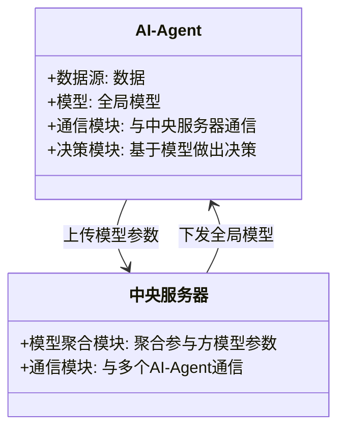

                 


# 企业AI Agent的联邦学习安全协议设计

> **关键词**：联邦学习，AI Agent，数据隐私，安全协议，多方计算，差分隐私

> **摘要**：  
> 随着人工智能技术的快速发展，企业AI Agent的应用越来越广泛。在实际应用中，数据隐私和模型安全问题变得日益重要。联邦学习作为一种新兴的分布式机器学习技术，能够有效保护数据隐私，同时实现模型协作。本文将深入探讨企业AI Agent在联邦学习中的安全协议设计，从核心概念、算法原理到系统架构和项目实战，全面解析如何在企业环境中构建安全可靠的联邦学习系统。

---

# 第一部分: 企业AI Agent的联邦学习安全协议概述

---

## 第1章: 联邦学习与AI Agent的背景介绍

### 1.1 联邦学习的基本概念

#### 1.1.1 什么是联邦学习
联邦学习（Federated Learning）是一种分布式机器学习技术，允许多个参与方在不共享原始数据的情况下，共同训练一个统一的模型。其核心思想是将模型的训练过程分散到各个参与方的本地数据上，仅交换模型参数或中间结果，从而保护数据隐私。

#### 1.1.2 联邦学习的核心特点
- **数据本地性**：数据无需离开本地设备或服务器，仅在本地进行训练。
- **数据异构性**：支持不同数据格式、分布和规模的联邦学习。
- **隐私保护**：通过加密或其他技术手段，确保数据不被泄露。

#### 1.1.3 联邦学习的场景与应用
- **医疗领域**：保护患者隐私，跨机构协作训练疾病预测模型。
- **金融领域**：多个金融机构联合训练风险评估模型，同时保护客户数据。
- **移动设备**：手机等终端设备在本地训练模型，提升用户体验。

---

### 1.2 AI Agent的基本概念

#### 1.2.1 什么是AI Agent
AI Agent（人工智能代理）是一种能够感知环境、执行任务的智能实体。它可以是软件程序、机器人或其他智能系统，具备自主决策和执行能力。

#### 1.2.2 AI Agent的核心功能
- **感知环境**：通过传感器或数据输入，获取环境信息。
- **决策制定**：基于感知信息，通过算法做出决策。
- **执行操作**：根据决策执行具体操作，如发送指令、调整参数等。

#### 1.2.3 AI Agent在企业中的应用
- **自动化运维**：监控系统状态，自动修复问题。
- **智能客服**：提供个性化服务，解决用户问题。
- **数据分析师**：自动分析数据，生成报告。

---

### 1.3 联邦学习与AI Agent的结合

#### 1.3.1 联邦学习在AI Agent中的作用
联邦学习为AI Agent提供了一种在保护数据隐私的前提下，实现模型协作和优化的机制。通过联邦学习，AI Agent可以在不共享数据的情况下，与其他代理或机构协作训练模型。

#### 1.3.2 AI Agent如何实现联邦学习
- **本地训练**：AI Agent在本地数据上训练模型，仅上传模型参数。
- **模型聚合**：通过联邦学习协议，将多个代理的模型参数聚合，更新全局模型。
- **隐私保护**：通过加密或差分隐私技术，确保数据和模型的安全性。

#### 1.3.3 联邦学习与AI Agent的协同工作
联邦学习为AI Agent提供了数据隐私保护的机制，使得AI Agent能够在不泄露数据的前提下，与其他代理协作训练模型。这种协作不仅可以提升模型的性能，还可以扩展AI Agent的应用场景。

---

### 1.4 本章小结
本章介绍了联邦学习的基本概念、核心特点以及应用场景，并详细阐述了AI Agent的定义、功能及其在企业中的应用。最后，分析了联邦学习与AI Agent的结合方式，为后续章节的深入探讨奠定了基础。

---

## 第2章: 联邦学习安全协议的核心概念与联系

### 2.1 联邦学习的安全挑战

#### 2.1.1 数据隐私保护
在联邦学习中，数据隐私保护是最大的挑战之一。如何确保参与方的数据不被泄露，同时又能有效训练模型，是需要重点解决的问题。

#### 2.1.2 模型安全威胁
模型可能受到多种安全威胁，如模型提取攻击、模型投毒攻击等。攻击者可能通过这些手段窃取模型参数或干扰模型训练过程。

#### 2.1.3 联邦学习中的潜在攻击
- **数据泄露攻击**：攻击者试图从联邦学习过程中获取原始数据。
- **模型投毒攻击**：攻击者在训练过程中上传恶意数据，影响全局模型。
- **拒绝服务攻击**：攻击者干扰通信过程，导致联邦学习无法正常进行。

---

### 2.2 联邦学习安全协议的核心要素

#### 2.2.1 数据隐私保护机制
- **加密技术**：使用加密算法对数据或模型参数进行加密，确保传输过程中数据不被窃取。
- **差分隐私**：通过在数据中添加噪声，确保单个数据点无法被识别。

#### 2.2.2 模型安全防护策略
- **模型聚合安全**：通过多方计算或同态加密技术，确保模型聚合过程的安全性。
- **模型验证机制**：对上传的模型参数进行验证，防止恶意数据的上传。

#### 2.2.3 联邦学习的安全协议框架
- **通信协议**：定义参与方之间的通信方式和数据格式。
- **隐私保护协议**：规定数据的加密、解密和隐私保护的具体方法。
- **安全验证协议**：确保参与方的行为符合安全规范，防止攻击。

---

### 2.3 联邦学习安全协议的分类与对比

#### 2.3.1 基于加密的联邦学习协议
- **同态加密**：允许在加密数据上进行计算，结果仍为加密状态。
- **密钥交换**：通过密钥管理机制，确保数据传输的安全性。

#### 2.3.2 基于差分隐私的联邦学习协议
- **差分隐私机制**：在数据中添加噪声，确保单个数据点无法被识别。
- **隐私预算管理**：控制隐私噪声的添加程度，平衡隐私保护和模型准确性。

#### 2.3.3 基于安全多方计算的联邦学习协议
- **安全多方计算**：通过密码学技术，确保多方计算过程中数据不被泄露。
- **秘密分享**：将数据分割成多个部分，分别进行计算，最终聚合结果。

---

### 2.4 联邦学习安全协议的优缺点分析

#### 2.4.1 各种协议的优缺点
| 协议类型         | 优点                           | 缺点                           |
|------------------|-------------------------------|--------------------------------|
| 基于加密的协议   | 数据传输安全，隐私保护强       | 计算复杂度高，影响性能           |
| 基于差分隐私的协议 | 平衡隐私保护和模型准确性       | 隐私预算管理复杂，可能导致模型精度下降 |
| 基于多方计算的协议 | 数据不泄露，安全性高           | 计算资源消耗大，不适合大规模应用 |

#### 2.4.2 协议之间的对比分析
- **加密协议**：安全性高，但计算开销大。
- **差分隐私协议**：灵活性强，但隐私保护力度有限。
- **多方计算协议**：安全性高，但资源消耗大。

#### 2.4.3 选择合适协议的策略
- **数据敏感性**：数据越敏感，选择安全性更高的协议。
- **计算能力**：计算资源有限的情况下，选择计算开销较低的协议。
- **应用场景**：根据具体应用场景，选择最适合的协议。

---

### 2.5 本章小结
本章分析了联邦学习面临的安全挑战，详细阐述了安全协议的核心要素，并对基于加密、差分隐私和多方计算的协议进行了分类与对比。最后，提出了选择合适协议的策略，为后续章节的设计提供了理论基础。

---

## 第3章: 联邦学习安全协议的算法原理与数学模型

### 3.1 联邦平均算法（FedAvg）

#### 3.1.1 算法的基本原理
FedAvg是一种经典的联邦学习算法，通过在每个参与方本地训练模型，并将模型参数上传到中央服务器，然后在中央服务器上聚合所有参与方的模型参数，更新全局模型。

#### 3.1.2 算法的数学模型
$$ \text{全局模型参数} = \frac{\sum_{i=1}^{n} w_i \cdot \theta_i}{\sum_{i=1}^{n} w_i} $$
其中，$w_i$ 是参与方 $i$ 的权重，$\theta_i$ 是参与方 $i$ 的模型参数。

#### 3.1.3 算法的实现步骤
1. **初始化**：设定初始全局模型参数 $\theta$。
2. **本地训练**：每个参与方在本地数据上训练模型，得到更新后的模型参数 $\theta_i$。
3. **参数上传**：参与方将 $\theta_i$ 上传到中央服务器。
4. **参数聚合**：中央服务器根据权重聚合所有 $\theta_i$，更新全局模型参数 $\theta$。
5. **模型下发**：中央服务器将更新后的 $\theta$ 下发给所有参与方。

---

### 3.2 联邦随机梯度下降算法（FedSGD）

#### 3.2.1 算法的基本原理
FedSGD是一种基于随机梯度下降的联邦学习算法，与FedAvg类似，但采用不同的参数聚合方式。

#### 3.2.2 算法的数学模型
$$ \theta_{\text{new}} = \theta_{\text{old}} + \eta \cdot (\theta_{\text{old}} - \theta_i) $$
其中，$\eta$ 是学习率，$\theta_i$ 是参与方 $i$ 的模型参数。

#### 3.2.3 算法的实现步骤
1. **初始化**：设定初始全局模型参数 $\theta$。
2. **本地训练**：每个参与方在本地数据上训练模型，得到更新后的模型参数 $\theta_i$。
3. **参数上传**：参与方将 $\theta_i$ 上传到中央服务器。
4. **参数聚合**：中央服务器根据参与方上传的 $\theta_i$，更新全局模型参数 $\theta$。
5. **模型下发**：中央服务器将更新后的 $\theta$ 下发给所有参与方。

---

### 3.3 基于差分隐私的联邦学习协议

#### 3.3.1 差分隐私的基本概念
差分隐私是一种通过在数据中添加噪声，确保单个数据点无法被识别的隐私保护技术。

#### 3.3.2 差分隐私在联邦学习中的应用
- **数据预处理**：在数据上传前，对数据进行差分隐私处理。
- **模型训练**：在模型训练过程中，对梯度进行差分隐私处理，确保模型参数不泄露数据信息。

#### 3.3.3 算法的数学模型
$$ y = f(x) + \epsilon $$
其中，$x$ 是原始数据，$f(x)$ 是模型函数，$\epsilon$ 是差分隐私噪声。

---

### 3.4 联邦学习算法的数学推导

#### 3.4.1 联邦平均算法的数学推导
$$ \theta_{\text{new}} = \frac{\sum_{i=1}^{n} w_i \cdot \theta_i}{\sum_{i=1}^{n} w_i} $$
其中，$w_i$ 是参与方 $i$ 的权重，$\theta_i$ 是参与方 $i$ 的模型参数。

#### 3.4.2 联邦随机梯度下降算法的数学推导
$$ \theta_{\text{new}} = \theta_{\text{old}} + \eta \cdot (\theta_{\text{old}} - \theta_i) $$
其中，$\eta$ 是学习率，$\theta_i$ 是参与方 $i$ 的模型参数。

#### 3.4.3 基于差分隐私的联邦学习算法的数学推导
$$ y = f(x) + \epsilon $$
其中，$x$ 是原始数据，$f(x)$ 是模型函数，$\epsilon$ 是差分隐私噪声。

---

### 3.5 本章小结
本章详细介绍了几种典型的联邦学习算法，包括FedAvg和FedSGD，并对其数学模型进行了推导。同时，还探讨了基于差分隐私的联邦学习协议，为后续章节的安全协议设计奠定了基础。

---

## 第4章: 联邦学习安全协议的系统架构与设计

### 4.1 问题场景介绍

#### 4.1.1 背景介绍
在企业AI Agent的应用中，数据隐私和模型安全问题尤为突出。如何在保护数据隐私的前提下，实现模型协作和优化，是需要重点解决的问题。

#### 4.1.2 问题描述
- **数据隐私保护**：确保参与方的数据不被泄露。
- **模型安全防护**：防止模型受到攻击，确保模型的准确性。
- **协议设计**：设计一套安全可靠的联邦学习协议，确保数据和模型的安全性。

---

### 4.2 系统功能设计

#### 4.2.1 领域模型（Mermaid类图）


#### 4.2.2 系统架构设计（Mermaid架构图）


#### 4.2.3 系统接口设计
- **参与方接口**：上传模型参数，下载全局模型。
- **中央服务器接口**：接收模型参数，聚合模型，下发全局模型。

#### 4.2.4 系统交互流程（Mermaid序列图）
```mermaid
sequenceDiagram
    参与方1 -> 中央服务器: 上传模型参数
    中央服务器 -> 所有参与方: 下发全局模型
    参与方2 -> 中央服务器: 上传模型参数
    中央服务器 -> 所有参与方: 下发全局模型
    ...
```

---

### 4.3 本章小结
本章从系统架构的角度，详细描述了联邦学习安全协议的系统组成和交互流程，并通过Mermaid图展示了系统的设计，为后续章节的协议设计提供了系统层面的支持。

---

## 第5章: 联邦学习安全协议的项目实战

### 5.1 环境安装与配置

#### 5.1.1 环境要求
- **操作系统**：Linux/Windows/MacOS
- **Python版本**：Python 3.6+
- **依赖库**：TensorFlow、Keras、Flask

#### 5.1.2 安装步骤
```bash
pip install tensorflow==2.0.0
pip install flask==1.0.0
```

---

### 5.2 系统核心实现

#### 5.2.1 参与方代码实现
```python
import numpy as np
from tensorflow import keras

# 模型训练函数
def train_model(model, data):
    model.compile(optimizer='sgd', loss='mse')
    model.fit(data['x'], data['y'], epochs=1, verbose=0)
    return model.get_weights()

# 上传模型参数
def upload_model(weights):
    # 上传到中央服务器
    pass
```

#### 5.2.2 中央服务器代码实现
```python
import numpy as np
from tensorflow import keras

# 模型聚合函数
def aggregate_models(weights_list):
    total_weights = np.mean(weights_list, axis=0)
    return total_weights
```

---

### 5.3 代码应用解读与分析

#### 5.3.1 参与方代码解读
- **模型训练函数**：在本地数据上训练模型，返回模型参数。
- **上传模型参数**：将本地训练得到的模型参数上传到中央服务器。

#### 5.3.2 中央服务器代码解读
- **模型聚合函数**：将所有参与方上传的模型参数进行聚合，更新全局模型。

---

### 5.4 实际案例分析

#### 5.4.1 案例背景
假设我们有三个参与方，分别在本地数据上训练模型，然后上传模型参数到中央服务器，中央服务器聚合模型参数，更新全局模型。

#### 5.4.2 案例实现步骤
1. **初始化全局模型**。
2. **参与方本地训练**，得到模型参数。
3. **参与方上传模型参数**。
4. **中央服务器聚合模型参数**，更新全局模型。
5. **中央服务器下发全局模型**。

---

### 5.5 本章小结
本章通过一个实际案例，详细展示了联邦学习安全协议的项目实战过程，包括环境安装、系统核心实现和案例分析，帮助读者更好地理解和应用联邦学习安全协议。

---

## 第6章: 联邦学习安全协议的最佳实践与注意事项

### 6.1 最佳实践

#### 6.1.1 数据隐私保护
- 使用加密技术或差分隐私技术，确保数据不被泄露。
- 定期进行数据隐私审计，确保数据安全。

#### 6.1.2 模型安全防护
- 定期验证模型参数，防止模型投毒攻击。
- 使用安全多方计算技术，确保模型聚合过程的安全性。

#### 6.1.3 协议选择
- 根据具体应用场景，选择合适的协议。
- 在资源有限的情况下，优先选择计算开销较低的协议。

---

### 6.2 小结

#### 6.2.1 注意事项
- **数据隐私**：确保数据不被泄露，同时不影响模型训练。
- **模型安全**：防止模型受到攻击，确保模型的准确性。
- **协议选择**：根据具体需求，选择合适的协议。

#### 6.2.2 拓展阅读
- 《差分隐私：理论与应用》
- 《联邦学习：算法与实现》
- 《安全多方计算：原理与实践》

---

## 作者信息

**作者**：AI天才研究院/AI Genius Institute & 禅与计算机程序设计艺术/Zen And The Art of Computer Programming

---

以上是关于《企业AI Agent的联邦学习安全协议设计》的完整目录和文章内容。通过系统的分析和详细的解释，本文为读者提供了一个全面了解联邦学习安全协议设计的框架和实现方法。希望对读者在实际应用中有所帮助。

