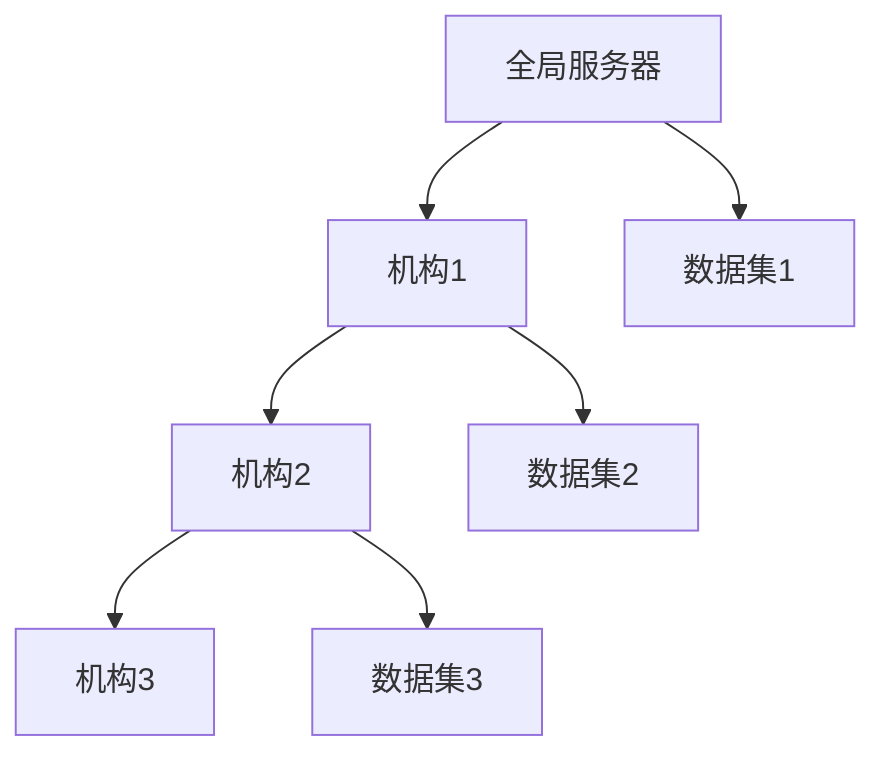

                 


# 企业AI Agent的联邦学习实践：保护数据隐私

---

## 关键词：  
企业AI Agent，联邦学习，数据隐私，分布式机器学习，隐私保护，数据安全

---

## 摘要：  
随着人工智能技术的快速发展，企业AI Agent在各个行业的应用日益广泛。然而，数据隐私问题成为制约其发展的关键因素。联邦学习作为一种新兴的技术，能够在保护数据隐私的前提下，实现跨机构的数据协作与模型训练。本文将详细探讨企业AI Agent与联邦学习的结合，分析其核心概念、算法原理、系统设计以及实际应用案例，为企业在数据隐私保护下的AI Agent实践提供理论与实践指导。

---

## 第一部分：企业AI Agent与联邦学习概述

### 第1章：企业AI Agent的基本概念

#### 1.1 AI Agent的定义与特点
- **定义**：AI Agent是一种智能体，能够感知环境、自主决策并执行任务。
- **特点**：
  - **自主性**：无需外部干预，自主完成任务。
  - **反应性**：能够实时感知环境变化并做出反应。
  - **目标导向**：基于目标驱动行动，优化决策过程。

#### 1.2 企业AI Agent的应用场景
- **客户服务**：通过自然语言处理提供智能客服。
- **智能推荐**：基于用户行为推荐个性化产品。
- **流程自动化**：优化企业内部流程，提高效率。

#### 1.3 企业AI Agent的核心要素
| 核心要素 | 描述 |
|----------|------|
| 感知能力 | 数据采集与分析能力 |
| 决策能力 | 基于数据的决策模型 |
| 执行能力 | 执行决策的能力 |
| 学习能力 | 自适应学习与优化能力 |

---

### 第2章：联邦学习的核心概念

#### 2.1 联邦学习的基本原理
- **数据分布**：数据分布在多个机构或设备中，不集中共享。
- **通信协议**：通过加密通信交换模型参数，而非数据本身。
- **隐私保护**：采用同态加密和差分隐私等技术保护数据隐私。

#### 2.2 联邦学习与传统数据共享的对比
| 对比维度 | 联邦学习 | 传统数据共享 |
|----------|----------|---------------|
| 数据共享 | 不共享数据，只共享模型参数 | 共享原始数据 |
| 隐私风险 | 低 | 高 |
| 资源消耗 | 较低 | 较高 |

#### 2.3 联邦学习的ER实体关系图
```mermaid
er
    entity(联邦学习系统) {
        用户
        机构
        数据
        模型
    }
    用户 --> 数据: 提供
    机构 --> 数据: 所有
    用户 <---> 模型: 训练
```

---

## 第二部分：联邦学习的算法原理

### 第3章：联邦学习的算法实现

#### 3.1 联邦平均算法（FedAvg）
- **基本思路**：每个机构在本地数据上训练模型，然后将模型参数上传到中心服务器，进行模型平均。
- **数学模型**：
  - 本地模型更新：$θ_i = θ_i + η \cdot \nabla L_i(θ_i)$
  - 参数聚合：$θ_{\text{new}} = \frac{1}{n} \sum_{i=1}^n θ_i$
- **算法步骤**：
  1. 初始化全局模型参数。
  2. 各机构下载全局模型，在本地数据上训练。
  3. 各机构上传本地模型参数，服务器计算模型平均。
  4. 更新全局模型，重复步骤2-3。



#### 3.2 联邦学习的数学模型与公式
- **联合优化**：目标函数为各机构损失函数的总和。
  $$ L = \sum_{i=1}^n L_i(θ) $$
- **模型更新**：使用随机梯度下降优化模型。
  $$ θ = θ - η \cdot \nabla L $$

---

## 第三部分：联邦学习的系统设计

### 第4章：系统分析与架构设计

#### 4.1 系统分析
- **问题场景**：跨机构数据协作，保护隐私。
- **系统功能**：
  - 数据预处理：清洗和标注数据。
  - 模型训练：分布式训练与聚合。
  - 结果部署：将模型应用于实际场景。

#### 4.2 系统架构设计


#### 4.3 系统接口设计
- **数据接口**：提供数据读取和写入接口。
- **模型接口**：提供模型训练和更新接口。
- **通信接口**：支持加密通信和参数交换。

---

## 第四部分：项目实战

### 第5章：跨机构客户画像构建

#### 5.1 环境搭建
- **工具安装**：安装Python、TensorFlow、Flask框架。
- **数据准备**：收集各机构客户数据，进行匿名化处理。

#### 5.2 模型训练
- **代码实现**：
  ```python
  def train_model():
      model = create_model()
      for epoch in range(num_epochs):
          for local_data in local_datasets:
              model.train_step(local_data)
              model.upload_weights(server)
          server.aggregate_weights()
          server.download_weights(model)
  ```
- **训练过程**：
  1. 初始化模型。
  2. 每个机构在本地数据上训练模型。
  3. 上传模型参数到中心服务器。
  4. 服务器聚合参数，更新全局模型。

#### 5.3 结果分析
- **模型表现**：评估模型准确率和召回率。
- **隐私保护**：确保数据未被泄露，仅模型参数被共享。

---

## 第五部分：总结与展望

### 第6章：最佳实践与小结

#### 6.1 总结
- 联邦学习能够在保护数据隐私的前提下，实现跨机构协作。
- 企业AI Agent与联邦学习的结合，为数据驱动的智能应用提供了新的可能。

#### 6.2 最佳实践
- **数据预处理**：确保数据匿名化，避免敏感信息泄露。
- **模型优化**：选择合适的算法和参数，提升模型性能。
- **通信安全**：采用加密通信和安全协议，保护数据传输。

#### 6.3 拓展阅读
- 推荐阅读《联邦学习：隐私保护下的分布式机器学习》和《企业AI Agent的设计与实现》。

---

## 作者：  
AI天才研究院 & 禅与计算机程序设计艺术

---

通过本文的详细讲解，读者可以全面了解企业AI Agent与联邦学习的结合，掌握其核心概念、算法原理和系统设计方法，为实际应用提供理论与实践指导。

