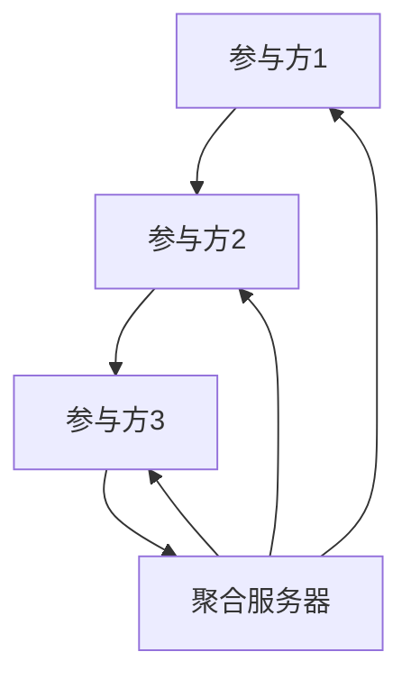
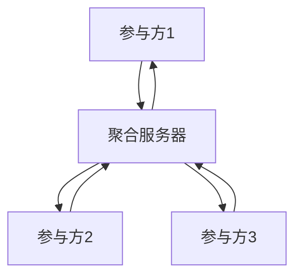
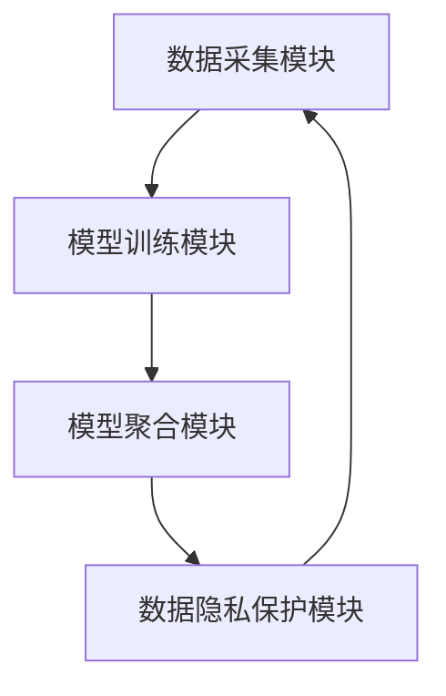

                 


# 《企业AI Agent的联邦学习平台设计》

> 关键词：企业AI Agent，联邦学习，数据隐私，机器学习，系统架构

> 摘要：本文将深入探讨企业AI Agent的联邦学习平台设计，从背景、核心概念、算法原理到系统架构、项目实战，全面解析如何在企业环境中构建高效、安全的联邦学习平台。

---

# 第1章: 联邦学习与企业AI Agent概述

## 1.1 联邦学习的基本概念

### 1.1.1 联邦学习的定义与特点

联邦学习（Federated Learning）是一种分布式机器学习技术，允许多个参与方在不共享原始数据的情况下共同训练模型。其特点包括数据隐私保护、去中心化、协作学习等。

$$\text{联邦学习的参与方} = \{1, 2, 3, \dots, n\}$$

### 1.1.2 联邦学习与传统机器学习的区别

| 特性 | 联邦学习 | 传统机器学习 |
|------|----------|--------------|
| 数据共享 | 不共享 | 共享 |
| 计算方式 | 分布式 | 集中式 |
| 隐私保护 | 强 | 弱 |

### 1.1.3 企业AI Agent的核心概念

企业AI Agent是一种智能实体，能够感知环境、自主决策并执行任务。其核心能力包括数据采集、分析、决策和执行。

## 1.2 联邦学习在企业中的应用背景

### 1.2.1 数据隐私与安全的挑战

企业AI Agent需要处理大量敏感数据，如何在不泄露数据的前提下进行模型训练是关键问题。

### 1.2.2 联邦学习解决的痛点

- 数据孤岛问题
- 数据隐私泄露风险
- 去中心化协作需求

### 1.2.3 企业AI Agent的典型应用场景

- 联邦推荐系统
- 联邦分类模型
- 联邦聚类分析

## 1.3 联邦学习平台的必要性与价值

### 1.3.1 联邦学习平台的定义

平台为多个参与方提供协作训练环境，同时保护数据隐私。

### 1.3.2 联邦学习平台的核心价值

- 数据隐私保护
- 去中心化协作
- 高效模型训练

### 1.3.3 企业AI Agent与联邦学习平台的关系

企业AI Agent依赖联邦学习平台实现跨机构协作。

## 1.4 本章小结

---

# 第2章: 联邦学习的核心概念与技术原理

## 2.1 联邦学习的基本原理

### 2.1.1 联邦学习的通信机制

参与方通过安全通道交换模型参数，而非数据。

### 2.1.2 联邦学习的同步与异步模型

同步联邦学习：所有参与方同时更新模型。

异步联邦学习：参与方按需更新模型。

### 2.1.3 联邦学习的聚合算法

$$\text{聚合函数} = \arg\min_{\theta} \sum_{i=1}^{n} f_i(\theta)$$

## 2.2 联邦学习中的数据安全与隐私保护

### 2.2.1 数据加密与隐私保护技术

- 加密联邦学习
- 差分隐私技术

### 2.2.2 联邦学习中的差分隐私技术

在模型更新过程中加入噪声，保护数据隐私。

### 2.2.3 数据共享的安全性评估

使用安全多方计算技术评估数据共享的安全性。

## 2.3 联邦学习的通信协议与计算模型

### 2.3.1 联邦学习的通信协议

- 基于HTTPS的通信
- 使用加密通道

### 2.3.2 联邦学习的计算模型

- 分布式计算模型
- 联合优化模型

## 2.4 本章小结

---

# 第3章: 联邦学习的算法原理与数学模型

## 3.1 联邦学习的同步算法

### 3.1.1 同步联邦学习的数学模型

$$\text{损失函数} = \sum_{i=1}^{n} \text{loss}_i(\theta)$$

### 3.1.2 同步联邦学习的聚合过程

1. 每个参与方计算局部梯度。
2. 聚合服务器汇总梯度并更新全局模型。
3. 参与方同步全局模型。

### 3.1.3 同步联邦学习的流程图



## 3.2 联邦学习的异步算法

### 3.2.1 异步联邦学习的数学模型

$$\text{损失函数} = \sum_{i=1}^{n} \text{loss}_i(\theta)$$

### 3.2.2 异步联邦学习的聚合过程

1. 参与方按需异步更新局部模型。
2. 聚合服务器按需汇总梯度并更新全局模型。
3. 参与方异步同步全局模型。

### 3.2.3 异步联邦学习的流程图



## 3.3 联邦学习的数学公式与代码实现

### 3.3.1 同步联邦学习的代码示例

```python
def federated_sync():
    global_theta = initial_theta()
    while True:
        for i in range(n_parties):
            local_theta = compute_local_model(global_theta, data_i)
            global_theta = aggregate(local_theta)
        update_global_model(global_theta)
```

### 3.3.2 异步联邦学习的代码示例

```python
def federated_async():
    global_theta = initial_theta()
    while True:
        for i in range(n_parties):
            local_theta = compute_local_model(global_theta, data_i)
            update_global_model(global_theta)
```

## 3.4 本章小结

---

# 第4章: 联邦学习的系统架构设计

## 4.1 系统功能设计

### 4.1.1 系统功能模块

- 数据采集模块
- 模型训练模块
- 模型聚合模块
- 数据隐私保护模块

### 4.1.2 功能模块的交互流程

1. 数据采集模块收集数据。
2. 模型训练模块进行局部训练。
3. 模型聚合模块汇总全局模型。
4. 数据隐私保护模块确保数据安全。

## 4.2 系统架构设计

### 4.2.1 系统架构图



### 4.2.2 接口设计

- 数据采集接口
- 模型训练接口
- 模型聚合接口
- 数据隐私保护接口

## 4.3 本章小结

---

# 第5章: 联邦学习的项目实战

## 5.1 环境安装与配置

### 5.1.1 安装依赖

```bash
pip install -r requirements.txt
```

### 5.1.2 配置环境变量

```bash
export FL_PATH=/path/to/fl
```

## 5.2 核心代码实现

### 5.2.1 联邦学习平台的代码实现

```python
class FederatedLearning:
    def __init__(self, n_parties):
        self.n_parties = n_parties
        self.global_model = initial_model()

    def train(self):
        while True:
            for i in range(self.n_parties):
                local_model = compute_local_model(self.global_model, data_i)
                self.global_model = aggregate(local_model)
            update_global_model(self.global_model)
```

### 5.2.2 代码解读与分析

- `FederatedLearning` 类初始化全局模型。
- `train` 方法进行联邦学习训练。

## 5.3 实际案例分析

### 5.3.1 案例背景

某企业希望在不共享数据的情况下训练推荐模型。

### 5.3.2 案例实现

使用同步联邦学习算法进行推荐模型训练。

### 5.3.3 案例分析

分析训练效果、数据隐私保护情况、系统性能。

## 5.4 本章小结

---

# 第6章: 联邦学习的优化与扩展

## 6.1 联邦学习的性能优化

### 6.1.1 数据预处理优化

- 数据清洗
- 数据增强

### 6.1.2 模型优化

- 优化算法选择
- 超参数调整

## 6.2 联邦学习的可扩展性设计

### 6.2.1 系统架构扩展

- 增加参与方
- 扩展计算能力

### 6.2.2 系统功能扩展

- 支持多种机器学习任务
- 支持多种数据类型

## 6.3 联邦学习与其他技术的结合

### 6.3.1 联邦学习与区块链的结合

- 数据溯源
- 模型验证

### 6.3.2 联邦学习与边缘计算的结合

- 边缘计算资源利用
- 模型部署优化

## 6.4 本章小结

---

# 第7章: 总结与展望

## 7.1 总结

本文详细探讨了企业AI Agent的联邦学习平台设计，涵盖了从背景到实现的各个方面。

## 7.2 未来展望

- 更先进的隐私保护技术
- 更高效的联邦学习算法
- 更广泛的应用场景

---

# 作者：AI天才研究院 & 禅与计算机程序设计艺术

--- 

本文通过系统化的分析与设计，为企业AI Agent的联邦学习平台提供了理论与实践的双重指导，帮助企业在保证数据隐私的前提下，实现高效协作与模型训练。

