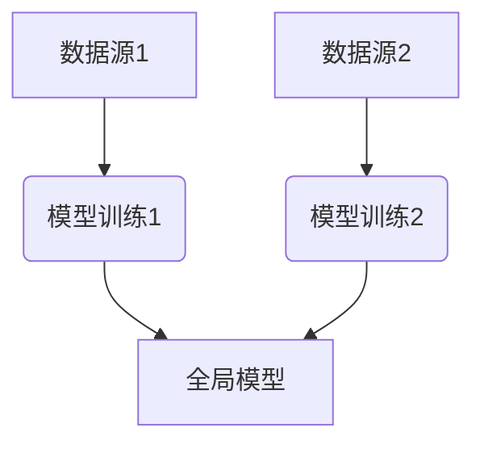
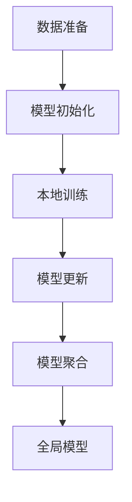
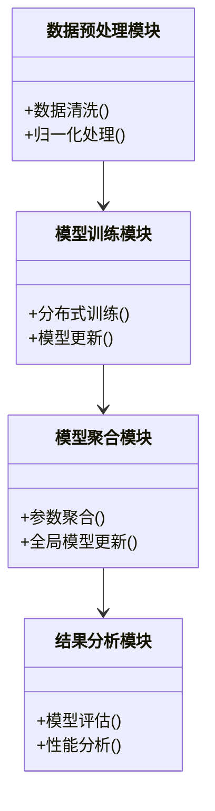
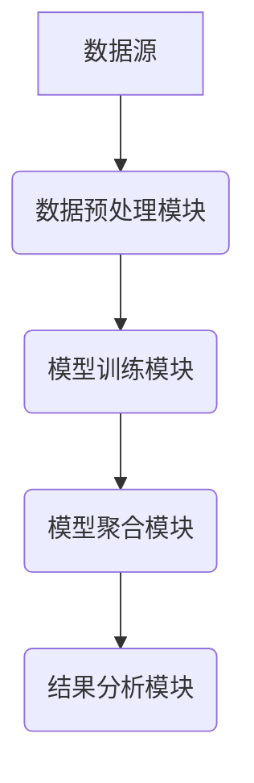

                 


```markdown
# 企业AI Agent的联邦学习应用：数据隐私保护

> 关键词：联邦学习，数据隐私，企业AI Agent，隐私保护，人工智能，机器学习

> 摘要：本文深入探讨了联邦学习在企业AI Agent中的应用，特别是在数据隐私保护方面。通过分析联邦学习的核心概念、算法原理、系统架构以及实际项目案例，本文展示了如何在保护数据隐私的前提下，实现企业AI Agent的高效协作与模型训练。文章还结合了数学公式、流程图和代码示例，帮助读者更好地理解联邦学习的技术细节和实际应用。

---

# 第一章: 联邦学习与企业AI Agent的背景介绍

## 1.1 联邦学习的定义与优势

### 1.1.1 联邦学习的定义
联邦学习（Federated Learning）是一种分布式机器学习技术，允许多个参与方在不共享原始数据的情况下，通过协作训练模型。其核心思想是“数据不动，模型动”，即数据保留在各自的本地服务器或设备上，只有模型参数在参与方之间传输。

### 1.1.2 联邦学习的核心优势
1. **数据隐私保护**：数据无需离开本地，有效防止数据泄露。
2. **数据孤岛问题**：通过联邦学习，多个数据孤岛可以协作训练全局模型。
3. **高效计算**：通过分布式计算，提升模型训练效率。

### 1.1.3 联邦学习与传统数据共享的区别
| 特性         | 联邦学习               | 传统数据共享          |
|--------------|-----------------------|----------------------|
| 数据传输     | 只传输模型参数         | 传输原始数据          |
| 数据隐私     | 高                     | 低                   |
| 计算效率     | 高                     | 低                   |

## 1.2 企业AI Agent的定义与特点

### 1.2.1 企业AI Agent的定义
企业AI Agent是一种智能代理系统，能够感知环境、自主决策并执行任务。它通常用于企业内部的自动化操作，如数据分析、流程优化、客户服务等。

### 1.2.2 企业AI Agent的核心特点
1. **自主性**：能够在没有人工干预的情况下完成任务。
2. **反应性**：能够实时感知环境变化并调整行为。
3. **协作性**：能够与其他系统或AI Agent协作完成复杂任务。

### 1.2.3 企业AI Agent与传统AI的区别
| 特性         | 企业AI Agent           | 传统AI               |
|--------------|-----------------------|----------------------|
| 自主性       | 高                     | 低                   |
| 反应性       | 高                     | 低                   |
| 协作性       | 高                     | 低                   |

## 1.3 联邦学习在企业AI Agent中的应用背景

### 1.3.1 数据隐私保护的重要性
随着数据量的增加，数据隐私问题日益重要。企业AI Agent需要处理大量敏感数据，如客户信息、交易记录等，数据泄露可能导致严重后果。

### 1.3.2 联邦学习在数据隐私保护中的作用
联邦学习通过分布式模型训练，避免了原始数据的共享，从而有效保护数据隐私。

### 1.3.3 企业AI Agent与联邦学习的结合
企业AI Agent可以通过联邦学习技术，在不共享原始数据的情况下，协作训练模型，提升智能决策能力。

## 1.4 本章小结
本章介绍了联邦学习的定义、优势以及与传统数据共享的区别，同时详细阐述了企业AI Agent的定义、特点及其与联邦学习的结合。通过这些内容，读者可以理解联邦学习在企业AI Agent中的重要性。

---

# 第二章: 联邦学习的核心概念与原理

## 2.1 联邦学习的基本原理

### 2.1.1 数据联邦的概念
数据联邦是一种基于联邦学习的分布式数据管理方法，允许多个数据源在不共享数据的情况下协作训练模型。

### 2.1.2 模型联邦的概念
模型联邦是通过多个参与方协作训练模型，模型参数在参与方之间同步，最终形成一个全局模型。

### 2.1.3 计算联邦的概念
计算联邦是一种分布式计算框架，允许多个计算节点协作完成任务，同时保护数据隐私。



## 2.2 联邦学习的类型与对比

### 2.2.1 横向联邦
横向联邦适用于数据样本相同但特征不同的场景，通常用于多个机构在同一数据集上协作训练。

### 2.2.2 纵向联邦
纵向联邦适用于数据特征相同但样本不同的场景，通常用于保护数据样本隐私。

### 2.2.3 混合联邦
混合联邦是横向联邦和纵向联邦的结合，适用于复杂场景。

| 类型         | 横向联邦 | 纵向联邦 | 混合联邦 |
|--------------|----------|----------|----------|
| 数据分布     | 样本相同，特征不同 | 样本不同，特征相同 | 样本和特征部分重叠 |
| 应用场景     | 机构间协作 | 保护样本隐私 | 复杂场景 |

## 2.3 联邦学习的核心要素

### 2.3.1 数据安全与隐私保护
联邦学习通过加密通信和差分隐私等技术保护数据安全。

### 2.3.2 模型更新与优化
通过异步或同步更新模型参数，确保模型收敛。

### 2.3.3 联邦节点间的通信机制
通过可靠的通信协议确保模型参数的安全传输。

## 2.4 联邦学习的数学模型与公式

### 2.4.1 损失函数的定义
损失函数用于衡量模型预测值与真实值之间的差异：

$$ L(y, \hat{y}) = \frac{1}{n}\sum_{i=1}^{n}(y_i - \hat{y}_i)^2 $$

### 2.4.2 模型优化器的原理
优化器通过最小化损失函数更新模型参数：

$$ \theta_{t+1} = \theta_t - \eta \frac{\partial L}{\partial \theta_t} $$

其中，$\eta$ 是学习率。

### 2.4.3 模型聚合器的实现
聚合器将多个参与方的模型参数进行加权平均：

$$ \theta_{\text{global}} = \sum_{i=1}^{k} w_i \theta_i $$

其中，$w_i$ 是参与方$i$的权重。

## 2.5 本章小结
本章详细讲解了联邦学习的基本原理、不同类型以及核心要素，并通过数学公式和流程图展示了联邦学习的实现过程。

---

# 第三章: 联邦学习的算法原理与实现

## 3.1 联邦学习的算法流程

### 3.1.1 数据准备阶段
- 数据预处理：清洗、归一化等。
- 数据分片：将数据划分为多个本地数据集。

### 3.1.2 模型训练阶段
- 初始化模型参数。
- 每个参与方在本地数据上训练模型，更新模型参数。

### 3.1.3 模型聚合阶段
- 将所有参与方的模型参数进行聚合，得到全局模型。



## 3.2 联邦学习的算法实现

### 3.2.1 联邦学习的数学模型

$$ \theta_{t+1} = \theta_t + \sum_{i=1}^{k} \nabla L_i(\theta_t) $$

其中，$\nabla L_i$ 是参与方$i$的梯度。

### 3.2.2 联邦学习的代码实现

```python
import numpy as np

def loss(y, y_pred):
    return np.mean((y - y_pred) ** 2)

def optimize(theta, gradient, learning_rate):
    return theta - learning_rate * gradient

def federated_learning(participants, learning_rate=0.1):
    theta = np.zeros_like(participants[0].theta)
    for _ in range(epochs):
        gradients = []
        for participant in participants:
            y_pred = participant.model.predict(theta)
            gradient = participant.model.grad(theta, loss(y, y_pred))
            gradients.append(gradient)
        avg_gradient = np.mean(gradients, axis=0)
        theta = optimize(theta, avg_gradient, learning_rate)
    return theta
```

## 3.3 本章小结
本章通过数学公式和代码实现，详细讲解了联邦学习的算法流程和实现细节。

---

# 第四章: 系统分析与架构设计

## 4.1 系统功能设计

### 4.1.1 数据预处理模块
- 数据清洗、归一化、特征选择等。

### 4.1.2 模型训练模块
- 分布式模型训练，支持多种算法。

### 4.1.3 模型聚合模块
- 模型参数聚合，全局模型更新。

### 4.1.4 结果分析模块
- 模型评估，性能分析。



## 4.2 系统架构设计

### 4.2.1 系统架构图



## 4.3 系统接口设计

### 4.3.1 接口定义
- 数据预处理接口：` preprocess(data: List) -> processed_data `
- 模型训练接口：` train(data: List, model: Model) -> updated_model `
- 模型聚合接口：` aggregate(models: List) -> global_model `
- 结果分析接口：` evaluate(model: Model, data: List) -> metrics `

## 4.4 本章小结
本章通过系统功能设计和架构图，详细描述了联邦学习系统的实现方案。

---

# 第五章: 项目实战

## 5.1 环境安装

```bash
pip install numpy pandas scikit-learn
```

## 5.2 核心代码实现

### 5.2.1 数据预处理

```python
import pandas as pd

def preprocess(data):
    # 数据清洗
    data = data.dropna()
    # 归一化处理
    from sklearn.preprocessing import StandardScaler
    scaler = StandardScaler()
    data_scaled = scaler.fit_transform(data)
    return data_scaled
```

### 5.2.2 模型训练

```python
from sklearn.linear_model import LinearRegression

def train(data, model):
    model.fit(data.X, data.y)
    return model
```

### 5.2.3 模型聚合

```python
def aggregate(models):
    avg_weights = np.mean([model.coef_ for model in models], axis=0)
    return LinearRegression(coef_=avg_weights)
```

### 5.2.4 结果分析

```python
from sklearn.metrics import mean_squared_error

def evaluate(model, data):
    y_pred = model.predict(data.X)
    mse = mean_squared_error(data.y, y_pred)
    return mse
```

## 5.3 项目总结
通过本章的实战项目，读者可以掌握联邦学习的实现过程，并能够将其应用于实际场景。

---

# 第六章: 最佳实践与小结

## 6.1 小结
联邦学习是一种高效的数据隐私保护技术，能够在不共享原始数据的情况下，协作训练模型。

## 6.2 注意事项
- 确保通信安全性。
- 定期验证模型性能。
- 处理数据偏见问题。

## 6.3 拓展阅读
- 《Differential Privacy》
- 《Federated Learning: Challenges, Methods, and Future Directions》

---

# 作者

作者：AI天才研究院/AI Genius Institute & 禅与计算机程序设计艺术 /Zen And The Art of Computer Programming
```

