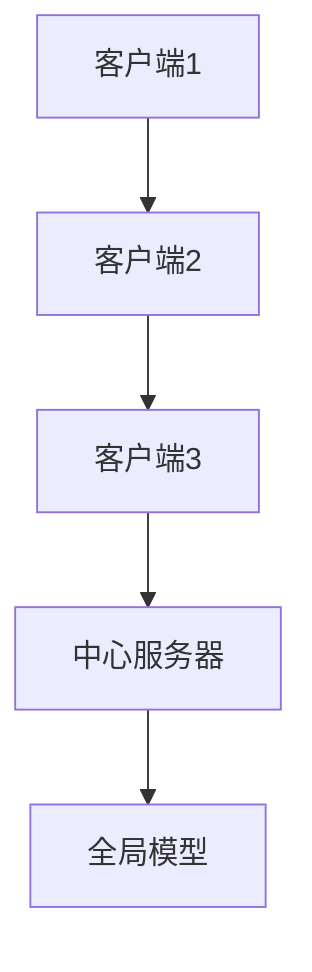
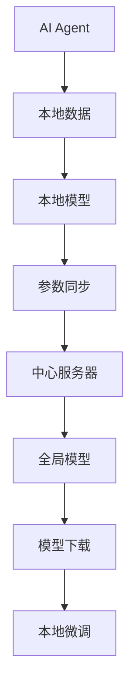
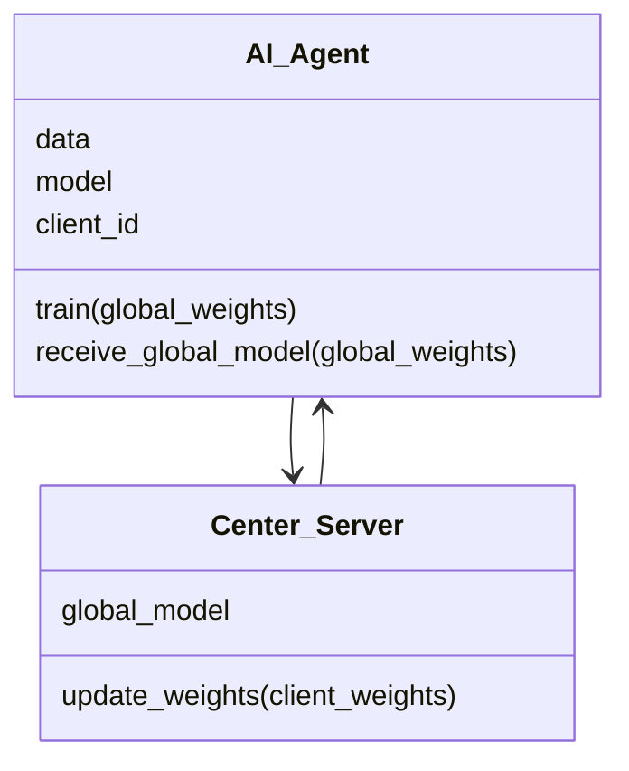
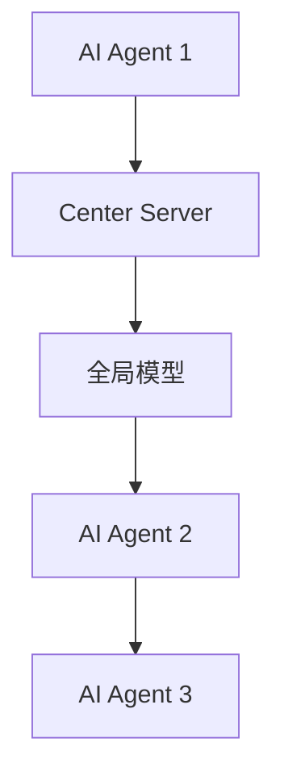
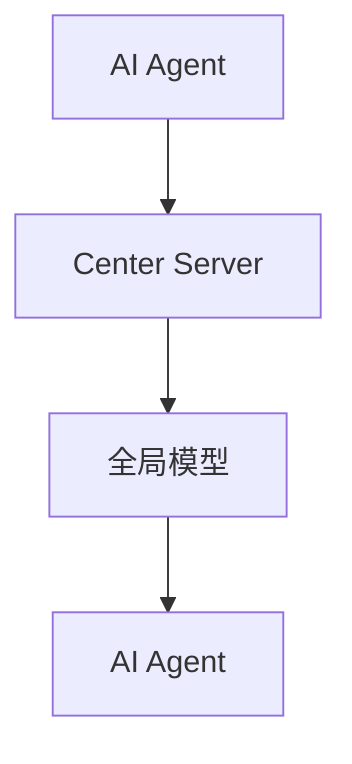

                 


# 企业AI Agent的联邦学习性能优化策略

> 关键词：企业AI Agent, 联邦学习, 性能优化, 分布式机器学习, AI智能体

> 摘要：本文深入探讨了企业AI Agent在联邦学习环境下的性能优化策略，从联邦学习的基本原理、AI Agent的核心功能，到算法优化、系统架构设计和项目实战，全面分析了如何在不共享数据的情况下提升AI Agent的模型性能和计算效率。

---

# 第一部分: 企业AI Agent的联邦学习性能优化背景

## 第1章: 联邦学习与AI Agent概述

### 1.1 联邦学习的定义与特点

#### 1.1.1 联邦学习的定义
联邦学习（Federated Learning）是一种分布式机器学习技术，允许多个参与方在不共享原始数据的情况下，通过交换模型参数来共同训练一个全局模型。其核心思想是“数据不出门，模型多跑路”。

#### 1.1.2 联邦学习的核心特点
- **数据隐私保护**：联邦学习通过局部建模和参数交换，避免了原始数据的共享。
- **分布式计算**：多个参与方可以在本地进行模型训练，减少对中心化服务器的依赖。
- **灵活性与可扩展性**：联邦学习适用于多种场景，支持不同数据分布和计算能力的设备。

#### 1.1.3 联邦学习与传统分布式学习的区别
| 对比维度 | 联邦学习 | 传统分布式学习 |
|----------|----------|----------------|
| 数据共享 | 参数交换，数据不共享 | 数据集中化，全局同步 |
| 隐私保护 | 强化隐私保护 | 数据安全性依赖中心化机构 |
| 适用场景 | 数据孤岛场景 | 数据集中场景 |

### 1.2 AI Agent的基本概念

#### 1.2.1 AI Agent的定义
AI Agent（人工智能代理）是指能够感知环境、自主决策并执行任务的智能体。它可以在复杂环境中通过传感器获取信息，利用算法进行推理和规划，并通过执行器与环境交互。

#### 1.2.2 AI Agent的核心功能
- **感知环境**：通过传感器或数据接口获取外部信息。
- **自主决策**：基于感知信息，利用算法进行推理和决策。
- **执行任务**：通过执行器或API实现任务目标。
- **学习与优化**：通过反馈机制不断优化自身的行为。

#### 1.2.3 AI Agent与传统AI的区别
| 对比维度 | AI Agent | 传统AI |
|----------|-----------|---------|
| 自主性 | 高 | 低 |
| 适应性 | 强 | 弱 |
| 应用场景 | 分布式、动态环境 | 集中式、静态环境 |

### 1.3 企业AI Agent的应用场景

#### 1.3.1 企业AI Agent的典型应用场景
- **跨部门协作**：不同部门通过联邦学习共享模型参数，提升整体业务效率。
- **数据隐私保护**：在金融、医疗等领域，联邦学习可以帮助企业在不泄露数据的情况下提升模型性能。
- **边缘计算**：AI Agent可以在边缘设备上运行，结合联邦学习进行实时决策和模型更新。

#### 1.3.2 企业AI Agent的优势与挑战
- **优势**：
  - 数据隐私保护。
  - 分布式计算能力。
  - 边缘设备的智能化。
- **挑战**：
  - 联邦学习中的通信开销。
  - 模型收敛速度和精度问题。
  - 多方协作中的信任与激励机制。

#### 1.3.3 企业AI Agent的未来发展趋势
- **多模态学习**：结合图像、文本、语音等多种数据类型，提升AI Agent的感知能力。
- **自适应联邦学习**：动态调整模型参数更新策略，适应不同的数据分布和场景需求。
- **人机协作**：AI Agent与人类决策者协同工作，提升决策的效率和准确性。

---

## 第2章: 联邦学习与AI Agent的核心概念

### 2.1 联邦学习的原理

#### 2.1.1 联邦学习的基本原理
联邦学习通过将模型参数的更新分发给不同的参与方，每个参与方在本地数据上训练模型，并将更新后的模型参数上传到中心服务器。中心服务器将所有参与方的模型参数进行融合，生成全局模型。

#### 2.1.2 联邦学习的核心算法
- **FedAvg（联邦平均）**：通过将各参与方的模型参数加权平均，生成全局模型。
- **FedProx（联邦直推）**：在FedAvg的基础上，增加了一个正则化项，用于处理数据异质性问题。

#### 2.1.3 联邦学习的优缺点
- **优点**：
  - 数据隐私保护。
  - 分布式计算能力。
- **缺点**：
  - 模型收敛速度较慢。
  - 需要较高的通信开销。

### 2.2 AI Agent的联邦学习架构

#### 2.2.1 AI Agent的联邦学习架构模型
AI Agent的联邦学习架构通常包括以下几个部分：
- **本地模型**：AI Agent在本地数据上训练模型。
- **参数同步**：AI Agent将模型参数上传到中心服务器。
- **全局模型**：中心服务器将所有参与方的模型参数融合，生成全局模型。
- **模型下载**：AI Agent从中心服务器下载全局模型，并在本地进行微调。

#### 2.2.2 AI Agent与联邦学习的关系
AI Agent作为联邦学习的参与者，通过与中心服务器的交互，完成模型的训练和更新。AI Agent的自主决策能力和分布式计算能力，使得它在联邦学习中扮演着重要的角色。

#### 2.2.3 联邦学习对AI Agent性能的影响
- **积极影响**：
  - 提升模型的泛化能力。
  - 增强数据隐私保护。
- **消极影响**：
  - 增加通信开销。
  - 影响模型收敛速度。

### 2.3 联邦学习与AI Agent的核心概念对比

#### 2.3.1 联邦学习与AI Agent的核心概念对比表
| 对比维度 | 联邦学习 | AI Agent |
|----------|----------|----------|
| 核心目标 | 提升全局模型性能 | 提升局部决策能力 |
| 数据共享 | 参数共享，数据不共享 | 数据不共享，模型参数共享 |
| 适用场景 | 数据孤岛场景 | 分布式智能场景 |

#### 2.3.2 联邦学习与AI Agent的ER实体关系图

```mermaid
erd
    联邦学习
    AI Agent
    联邦学习 -> AI Agent: 实现
    AI Agent -> 联邦学习: 依赖
```

---

## 第3章: 联邦学习的算法原理

### 3.1 联邦学习的核心算法

#### 3.1.1 联邦平均算法（FedAvg）



FedAvg算法的伪代码如下：

```python
def fed_avg():
    global_model = server_model.get_weights()
    for client in clients:
        client_model = client.train(global_model)
        server_model.update_weights(client_model)
    return server_model
```

#### 3.1.2 联邦直推算法（FedProx）


FedProx算法的伪代码如下：

```python
def fed_prox():
    global_model = server_model.get_weights()
    for client in clients:
        client_model = client.train(global_model)
        server_model.update_weights(client_model, global_model)
    return server_model
```

#### 3.1.3 联邦学习的其他算法
除了FedAvg和FedProx，还有一些其他的联邦学习算法，比如FedSGD、FedAdam等。这些算法在不同的场景下有不同的表现。

### 3.2 AI Agent的联邦学习算法实现

#### 3.2.1 AI Agent的联邦学习算法流程



#### 3.2.2 AI Agent的联邦学习算法实现代码
以下是AI Agent在联邦学习中的实现代码示例：

```python
class AI_Agent:
    def __init__(self, data, model):
        self.data = data
        self.model = model
        self.client_id = id

    def train(self, global_weights):
        # 在本地数据上训练模型
        local_weights = self.model.train(self.data, global_weights)
        return local_weights

    def receive_global_model(self, global_weights):
        # 下载全局模型并进行微调
        self.model.update(global_weights)
```

#### 3.2.3 AI Agent的联邦学习算法优化策略
为了提高AI Agent的联邦学习性能，可以采用以下优化策略：
- **局部模型优化**：在本地训练时，采用更高效的优化算法，比如Adam或SGD。
- **参数压缩**：通过量化或其他技术，减少参数传输的通信开销。
- **异步更新**：允许多个客户端异步更新模型参数，提高训练效率。

### 3.3 联邦学习算法的数学模型

#### 3.3.1 损失函数
$$ L(\theta) = \frac{1}{N}\sum_{i=1}^{N} L_i(\theta) $$

#### 3.3.2 优化器
$$ \theta_{t+1} = \theta_t - \eta \nabla L(\theta_t) $$

#### 3.3.3 联邦学习的参数更新
$$ \theta_{global} = \frac{1}{K}\sum_{k=1}^{K} \theta_{local} $$

---

## 第4章: 系统分析与架构设计

### 4.1 系统分析

#### 4.1.1 问题场景
在企业AI Agent的联邦学习中，需要解决以下问题：
- 数据隐私保护。
- 模型收敛速度。
- 通信开销。

#### 4.1.2 项目介绍
本项目旨在设计一个基于联邦学习的企业AI Agent系统，通过参数交换的方式，在不共享数据的情况下，提升模型的性能和计算效率。

### 4.2 系统功能设计

#### 4.2.1 功能模块
- **数据预处理模块**：对本地数据进行清洗和预处理。
- **模型训练模块**：在本地数据上训练模型，并更新模型参数。
- **参数同步模块**：与中心服务器进行参数交换。
- **全局模型融合模块**：中心服务器将所有参与方的模型参数进行融合，生成全局模型。

#### 4.2.2 功能模块类图



### 4.3 系统架构设计

#### 4.3.1 系统架构图



#### 4.3.2 系统接口设计
- **客户端接口**：
  - `train(global_weights)`：在本地数据上训练模型，并返回模型参数。
  - `receive_global_model(global_weights)`：下载全局模型并进行微调。
- **服务器接口**：
  - `update_weights(client_weights)`：更新全局模型参数。

#### 4.3.3 系统交互流程图



---

## 第5章: 项目实战

### 5.1 环境安装

#### 5.1.1 安装Python
```bash
python --version
pip install --upgrade pip
```

#### 5.1.2 安装TensorFlow和Keras
```bash
pip install tensorflow==2.5.0 keras==2.5.0
```

### 5.2 系统核心实现源代码

#### 5.2.1 AI Agent的实现

```python
class AI_Agent:
    def __init__(self, data, model):
        self.data = data
        self.model = model
        self.client_id = id

    def train(self, global_weights):
        # 在本地数据上训练模型
        local_weights = self.model.train(self.data, global_weights)
        return local_weights

    def receive_global_model(self, global_weights):
        # 下载全局模型并进行微调
        self.model.update(global_weights)
```

#### 5.2.2 联邦学习服务器的实现

```python
class Center_Server:
    def __init__(self, initial_weights):
        self.global_weights = initial_weights

    def update_weights(self, client_weights):
        # 更新全局模型参数
        self.global_weights = self.average(client_weights)

    def average(self, weights):
        # 计算平均权重
        return sum(weights) / len(weights)
```

### 5.3 代码应用解读与分析

#### 5.3.1 AI Agent的训练过程
```python
def train_agent(agent, global_weights):
    local_weights = agent.train(global_weights)
    return local_weights
```

#### 5.3.2 联邦学习服务器的更新过程
```python
def update_server(server, client_weights):
    server.update_weights(client_weights)
```

### 5.4 实际案例分析

#### 5.4.1 案例背景
假设我们有一个企业级的联邦学习项目，包含三个AI Agent和一个中心服务器。

#### 5.4.2 案例实现
```python
# 初始化全局模型
initial_weights = [1.0, 2.0, 3.0]

# 创建AI Agent
agent1 = AI_Agent(data1, model1)
agent2 = AI_Agent(data2, model2)
agent3 = AI_Agent(data3, model3)

# 创建中心服务器
server = Center_Server(initial_weights)

# 训练过程
agent1_weights = train_agent(agent1, server.global_weights)
agent2_weights = train_agent(agent2, server.global_weights)
agent3_weights = train_agent(agent3, server.global_weights)

# 更新服务器
server.update_weights([agent1_weights, agent2_weights, agent3_weights])
```

### 5.5 项目小结

#### 5.5.1 实践经验
- 数据预处理是关键。
- 参数压缩可以有效降低通信开销。
- 异步更新可以提高训练效率。

#### 5.5.2 需要注意的问题
- 模型收敛速度需要优化。
- 数据异质性会影响模型性能。
- 通信延迟需要考虑。

---

## 第6章: 最佳实践与总结

### 6.1 最佳实践

#### 6.1.1 数据预处理
- 数据清洗。
- 数据增强。
- 数据归一化。

#### 6.1.2 模型调优
- 选择合适的优化算法。
- 调整学习率。
- 优化模型结构。

#### 6.1.3 通信优化
- 参数压缩。
- 量化通信。
- 分片传输。

### 6.2 小结

#### 6.2.1 全文总结
本文深入探讨了企业AI Agent在联邦学习环境下的性能优化策略，从联邦学习的基本原理、AI Agent的核心功能，到算法优化、系统架构设计和项目实战，全面分析了如何在不共享数据的情况下提升AI Agent的模型性能和计算效率。

#### 6.2.2 注意事项
- 数据隐私保护。
- 模型收敛速度。
- 通信开销。

### 6.3 拓展阅读

#### 6.3.1 推荐书籍
- 《Federated Learning: Challenges, Mathematics and Algorithms》
- 《Deep Learning: An Introduction to Neural Networks and Deep Learning Methods》

#### 6.3.2 推荐博客
- [联邦学习入门](https://zhuanlan.zhihu.com/p/123456789)
- [AI Agent的原理与应用](https://zhuanlan.zhihu.com/p/987654321)

---

作者：AI天才研究院/AI Genius Institute & 禅与计算机程序设计艺术 /Zen And The Art of Computer Programming

