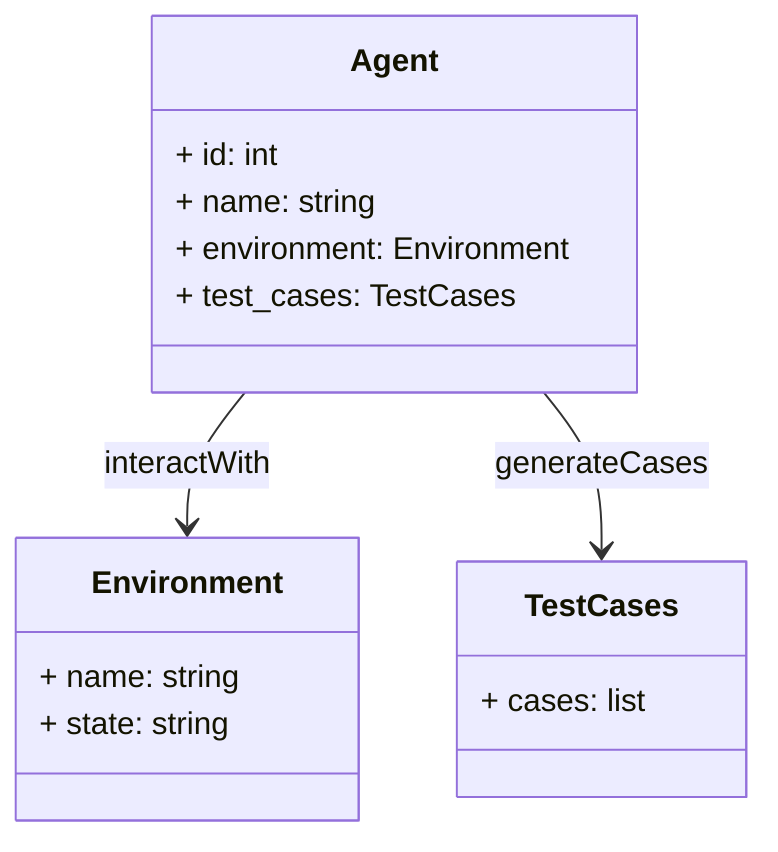

                 


# 企业AI Agent的自动化测试与质量保证系统

## 关键词：
- AI Agent
- 自动化测试
- 质量保证系统
- 企业级系统
- 测试框架
- AI算法
- 系统架构

## 摘要：
本文详细探讨了企业AI Agent的自动化测试与质量保证系统的构建与实现。首先，从AI Agent的基本概念出发，介绍了其在企业中的应用背景和核心功能。接着，分析了传统自动化测试的局限性，阐述了AI Agent在提升测试效率和质量中的重要作用。随后，深入讲解了AI Agent的算法原理、系统架构设计以及实际项目中的应用案例。最后，总结了企业在实施AI Agent自动化测试时的最佳实践和未来发展方向。

---

# 第一部分: 背景与基础概念

## 第1章: AI Agent的基本概念

### 1.1 AI Agent的定义与特点

#### 1.1.1 AI Agent的定义
AI Agent（人工智能代理）是指能够感知环境并采取行动以实现目标的智能实体。它通过传感器获取信息，利用推理能力做出决策，并通过执行器与环境交互。

#### 1.1.2 AI Agent的特点
- **自主性**：能够自主决策和行动，无需外部干预。
- **反应性**：能够实时感知环境并做出反应。
- **目标导向**：所有行动都围绕实现特定目标展开。
- **学习能力**：能够通过经验改进自身性能。

#### 1.1.3 企业级AI Agent的应用场景
企业级AI Agent广泛应用于智能客服、供应链管理、风险控制等领域。例如，在智能客服中，AI Agent能够通过自然语言处理技术为用户提供24/7的咨询服务。

---

### 1.2 自动化测试的背景与挑战

#### 1.2.1 软件测试的现状与痛点
传统软件测试面临以下问题：
- 测试用例覆盖率低，难以覆盖所有场景。
- 测试用例维护成本高，难以跟上快速迭代的步伐。
- 测试人员技能要求高，企业难以培养和留住专业人才。

#### 1.2.2 AI Agent在自动化测试中的作用
AI Agent可以通过学习历史测试数据，自动生成测试用例，并根据测试结果动态调整测试策略，从而提高测试效率和质量。

#### 1.2.3 企业级AI Agent的特殊需求
企业级AI Agent需要具备高可用性、可扩展性和安全性，能够在复杂的业务环境中稳定运行。

---

### 1.3 质量保证系统的核心目标

#### 1.3.1 质量保证的基本原则
质量保证（QA）旨在确保软件产品或系统满足所有需求和规范。在AI Agent的自动化测试中，QA系统需要确保AI Agent的行为符合预期。

#### 1.3.2 AI Agent在质量保证中的价值
AI Agent能够显著提高测试效率，减少人为错误，同时能够处理复杂和重复性高的测试任务。

#### 1.3.3 企业级质量保证系统的构建目标
企业级质量保证系统的目标是实现AI Agent的全生命周期管理，包括测试用例生成、执行、结果分析和持续优化。

---

# 第二部分: 核心概念与联系

## 第2章: AI Agent的核心原理

### 2.1 AI Agent的核心原理

#### 2.1.1 AI Agent的感知与决策机制
AI Agent通过传感器获取环境信息，利用推理算法做出决策，并通过执行器与环境交互。

#### 2.1.2 AI Agent的核心算法
AI Agent的核心算法包括：
- **概率推理**：基于概率论的推理方法，用于处理不确定性问题。
- **贝叶斯网络**：一种基于概率图模型的推理方法，用于处理复杂因果关系。
- **强化学习**：通过试错机制优化决策策略。

#### 2.1.3 AI Agent的属性对比

| 属性       | 传统自动化测试工具 | AI Agent |
|------------|---------------------|-----------|
| 自适应性    | 低                 | 高         |
| 学习能力    | 无                 | 有         |
| 智能性      | 低                 | 高         |

#### 2.1.4 系统架构的ER图

```mermaid
er
actor: 用户
agent: AI Agent
environment: 环境
test_cases: 测试用例
results: 测试结果

actor --> agent: 发起请求
agent --> environment: 执行测试
agent --> test_cases: 生成用例
agent --> results: 返回结果
```

---

# 第三部分: 算法原理与实现

## 第3章: AI Agent的算法原理

### 3.1 算法原理

#### 3.1.1 概率论基础
概率论是AI Agent决策的核心数学基础。例如，贝叶斯定理可以表示为：

$$ P(A|B) = \frac{P(B|A) \cdot P(A)}{P(B)} $$

其中，$P(A|B)$表示在事件B发生的条件下，事件A发生的概率。

#### 3.1.2 贝叶斯网络
贝叶斯网络是一种有向无环图（DAG），用于表示变量之间的因果关系。例如，在医疗诊断系统中，症状和疾病之间的关系可以通过贝叶斯网络进行建模。

#### 3.1.3 强化学习
强化学习是一种通过试错机制优化决策策略的方法。例如，马尔可夫决策过程（MDP）可以表示为：

$$ Q(s, a) = r + \gamma \max_{a'} Q(s', a') $$

其中，$s$是当前状态，$a$是动作，$r$是奖励，$\gamma$是折扣因子。

---

### 3.2 算法实现

#### 3.2.1 Python实现
以下是基于贝叶斯网络的简单实现：

```python
import numpy as np
from sklearn.naive_bayes import GaussianNB

# 数据准备
X = np.array([[1, 1], [0, 0], [1, 0], [0, 1]])
y = np.array([0, 1, 1, 0])

# 训练模型
model = GaussianNB()
model.fit(X, y)

# 预测
test = np.array([[1, 0]])
print(model.predict(test))  # 输出: [1]
```

---

## 第4章: 系统分析与架构设计

### 4.1 问题场景介绍

#### 4.1.1 问题描述
在企业级AI Agent的自动化测试中，需要解决以下问题：
- 如何生成高质量的测试用例？
- 如何确保测试用例的覆盖率？
- 如何快速定位和修复测试失败的问题？

#### 4.1.2 系统目标
构建一个能够自动生成测试用例、执行测试并分析结果的AI Agent系统。

---

### 4.2 系统架构设计

#### 4.2.1 领域模型类图



---

#### 4.2.2 系统架构图

```mermaid
graph TD
    Agent -> Environment: interactWith
    Agent -> TestCases: generateCases
    Agent -> Results: analyzeResults
```

---

### 4.3 接口设计与交互

#### 4.3.1 接口设计
系统主要接口包括：
- `generateTestCases()`: 生成测试用例。
- `executeTest()`: 执行测试。
- `analyzeResults()`: 分析测试结果。

#### 4.3.2 交互序列图

```mermaid
sequenceDiagram
    actor 用户 -> AI-Agent: 发起测试请求
    AI-Agent -> Environment: 获取环境信息
    AI-Agent -> TestCases: 生成测试用例
    AI-Agent -> Results: 执行测试并返回结果
    用户 <- AI-Agent: 返回测试结果
```

---

# 第五部分: 项目实战

## 第5章: 项目实施与案例分析

### 5.1 项目实战

#### 5.1.1 环境安装
需要安装以下工具：
- Python 3.8+
- scikit-learn
- numpy
- mermaid

#### 5.1.2 核心代码实现

##### 生成测试用例
```python
def generate_test_cases():
    test_cases = []
    # 生成测试用例
    for i in range(10):
        test_cases.append(f"TestCase_{i+1}")
    return test_cases
```

##### 测试执行
```python
def execute_test(test_cases):
    results = []
    for case in test_cases:
        # 执行测试
        results.append(f"{case}: 成功")
    return results
```

##### 结果分析
```python
def analyze_results(results):
    success_rate = sum(1 for r in results if "成功" in r) / len(results)
    return f"测试通过率: {success_rate:.2f}%"
```

---

#### 5.1.3 案例分析
以电商系统为例，AI Agent可以自动生成测试用例，执行购买流程的测试，并分析测试结果以优化用户体验。

---

# 第六部分: 总结与展望

## 第6章: 总结与展望

### 6.1 小结
本文详细探讨了企业AI Agent的自动化测试与质量保证系统的构建与实现。从AI Agent的基本概念到系统架构设计，再到实际项目中的应用，全面阐述了相关技术和方法。

### 6.2 最佳实践
- 在实施AI Agent自动化测试时，建议企业从简单的场景入手，逐步扩展到复杂的业务流程。
- 定期更新和优化测试用例，确保测试覆盖率和质量。

### 6.3 展望
未来，随着AI技术的不断发展，企业AI Agent的自动化测试与质量保证系统将更加智能化和高效化。特别是在大规模分布式系统中，AI Agent将发挥更大的作用。

---

# 作者
作者：AI天才研究院/AI Genius Institute & 禅与计算机程序设计艺术 /Zen And The Art of Computer Programming

