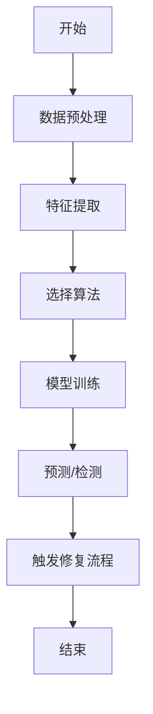

                 


```markdown
# 企业AI Agent的自动化运维与故障预测

> 关键词：企业AI Agent，自动化运维，故障预测，机器学习，系统架构

> 摘要：本文深入探讨了企业AI Agent在自动化运维与故障预测中的应用，从概念、原理到系统设计，再到项目实战，全面解析了企业AI Agent的核心技术与实际应用。

---

## 第一部分: 企业AI Agent的背景与基础

### 第1章: AI Agent的基本概念与技术背景

#### 1.1 AI Agent的定义与核心概念
- **1.1.1 AI Agent的定义**  
  AI Agent（人工智能代理）是一种能够感知环境、自主决策并执行任务的智能实体。它能够通过传感器获取信息，利用算法进行分析，并通过执行器完成目标。

- **1.1.2 AI Agent的核心要素**  
  - 感知能力：通过传感器或数据源获取环境信息。  
  - 决策能力：基于感知信息做出决策。  
  - 执行能力：通过执行器或系统接口完成决策任务。  
  - 学习能力：通过机器学习算法不断优化自身性能。  

- **1.1.3 AI Agent的分类与特点**  
  - 分类：基于任务类型（监控型、决策型、执行型）、智能水平（简单规则型、复杂学习型）、应用场景（企业级、个人助手）。  
  - 特点：自主性、反应性、目标导向、可扩展性。  

- **1.1.4 企业AI Agent的背景与意义**  
  随着企业系统复杂度的增加，传统运维方式效率低下，AI Agent通过自动化和智能化的方式，显著提升了运维效率和系统稳定性。

---

#### 1.2 企业自动化运维与故障预测的背景

- **1.2.1 企业运维的痛点与挑战**  
  - 系统复杂性增加，运维成本上升。  
  - 传统运维依赖人工经验，效率低下。  
  - 故障响应时间长，影响业务连续性。  

- **1.2.2 故障预测的重要性**  
  - 提前发现潜在问题，避免系统崩溃。  
  - 减少停机时间，提高系统可用性。  
  - 降低运维成本，优化资源分配。  

- **1.2.3 AI Agent在企业运维中的作用**  
  - 自动化监控：实时收集系统数据，进行异常检测。  
  - 智能预测：基于历史数据和机器学习模型，预测潜在故障。  
  - 自动修复：在检测到故障后，自动触发修复流程。  

---

### 第2章: 企业AI Agent的核心概念与联系

#### 2.1 核心概念原理

- **2.1.1 AI Agent的核心原理**  
  AI Agent通过感知环境、分析数据、做出决策并执行操作，实现自动化运维和故障预测。其核心在于数据处理、模型训练和决策执行的闭环流程。

- **2.1.2 企业AI Agent的系统架构**  
  企业AI Agent通常由数据采集模块、数据分析模块、决策模块和执行模块组成，各模块协同工作，完成从数据获取到问题解决的全过程。

- **2.1.3 数据流与信息处理流程**  
  数据从系统采集模块进入，经过预处理、特征提取、模型训练等步骤，最终生成预测结果并触发相应操作。

---

#### 2.2 核心概念属性特征对比表格

| 特性       | 传统运维 | AI Agent |
|------------|----------|----------|
| 数据处理   | 手动分析 | 自动化处理 |
| 故障预测   | 事后响应 | 事前预测   |
| 运维效率   | 低效     | 高效       |
| 可扩展性   | 有限     | 强         |

---

#### 2.3 ER实体关系图

```mermaid
er
  actor(Agent)
  actor(系统)
  actor(数据)
  actor(预测结果)
  actor(用户)
  actor(日志)
  actor(监控工具)
  actor(修复策略)
```

---

## 第三部分: 算法原理

### 第3章: 企业AI Agent的算法原理

#### 3.1 算法原理概述

- **3.1.1 监督学习在故障预测中的应用**  
  使用监督学习算法（如逻辑回归、随机森林）对历史故障数据进行训练，预测未来可能发生的故障。

- **3.1.2 无监督学习在异常检测中的应用**  
  使用聚类算法（如K-Means）或异常检测算法（如Isolation Forest）发现系统中的异常行为。

- **3.1.3 强化学习在自动化运维中的应用**  
  使用强化学习算法（如Q-Learning）优化运维流程，减少资源消耗。

---

#### 3.2 算法流程图



---

#### 3.3 算法实现代码示例

```python
import numpy as np
from sklearn.linear_model import LogisticRegression

# 示例：使用逻辑回归进行故障预测
def preprocess_data(data):
    # 数据预处理代码
    pass

def train_model(X, y):
    model = LogisticRegression()
    model.fit(X, y)
    return model

def predict_failure(model, new_data):
    return model.predict(new_data)

# 示例数据
X = np.array([[1, 2, 3], [4, 5, 6]])
y = np.array([0, 1])

model = train_model(X, y)
prediction = predict_failure(model, [[7, 8, 9]])
print(prediction)
```

---

#### 3.4 数学模型与公式

- **线性回归模型**  
  $$ y = \beta_0 + \beta_1 x_1 + \beta_2 x_2 + \dots + \beta_n x_n + \epsilon $$

- **逻辑回归损失函数**  
  $$ L(\theta) = -\frac{1}{m} \sum_{i=1}^{m} [y_i \ln h(x_i) + (1 - y_i) \ln (1 - h(x_i))] $$  
  其中，$$ h(x_i) = \sigma(\theta^T x_i) $$，$$ \sigma(a) = \frac{1}{1 + e^{-a}} $$

---

## 第四部分: 系统架构与设计

### 第4章: 企业AI Agent的系统架构与设计

#### 4.1 系统组成部分

- 数据采集模块：负责收集系统运行数据，包括日志、性能指标等。  
- 数据分析模块：对采集的数据进行预处理、特征提取和模型训练。  
- 决策模块：基于模型预测结果，生成修复策略或触发相应操作。  
- 执行模块：执行决策模块的指令，完成自动化修复或优化。

---

#### 4.2 系统架构设计


---

#### 4.3 系统接口设计

- 数据采集接口：与监控工具（如Prometheus、ELK）对接，获取实时数据。  
- 模型训练接口：接收训练数据，返回训练好的模型。  
- 决策接口：接收实时数据，返回预测结果或修复指令。  
- 执行接口：接收修复指令，执行相应操作。

---

## 第五部分: 项目实战

### 第5章: 企业AI Agent的项目实战

#### 5.1 环境搭建

- 安装必要的依赖：Python、Scikit-learn、TensorFlow、Prometheus等。  
- 配置数据采集工具：例如，使用Prometheus监控系统性能指标。  

---

#### 5.2 核心代码实现

```python
import requests
import pandas as pd
from sklearn.model_selection import train_test_split
from sklearn.metrics import accuracy_score

# 示例：基于Prometheus指标的故障预测
def fetch_data(endpoint):
    response = requests.get(endpoint)
    data = response.json()
    return data

def preprocess_data(data):
    df = pd.DataFrame(data)
    # 数据预处理代码
    return df

def train_model(X_train, y_train):
    model = LogisticRegression()
    model.fit(X_train, y_train)
    return model

# 示例数据
data = fetch_data("http://prometheus:8080/api/v1/metrics")
df = preprocess_data(data)
X_train, X_test, y_train, y_test = train_test_split(df.drop('label', axis=1), df['label'], test_size=0.2)
model = train_model(X_train, y_train)
prediction = model.predict(X_test)
print("Accuracy:", accuracy_score(y_test, prediction))
```

---

## 第六部分: 最佳实践与小结

### 第6章: 企业AI Agent的最佳实践

#### 6.1 总结

- 企业AI Agent通过自动化运维和故障预测，显著提升了系统的稳定性和运维效率。  
- 在实际应用中，需要结合具体业务场景，选择合适的算法和系统架构。  

#### 6.2 注意事项

- 数据质量是模型性能的关键，需确保数据的完整性和准确性。  
- 模型需要定期更新，以应对环境和系统变化。  
- 在生产环境中，需设计完善的容错机制和回滚策略，确保系统的稳定性。  

#### 6.3 拓展阅读

- 《机器学习实战》  
- 《深入浅出：企业系统架构设计》  
- 《自动化运维的艺术》  

---

## 作者：AI天才研究院/AI Genius Institute & 禅与计算机程序设计艺术 /Zen And The Art of Computer Programming
```

