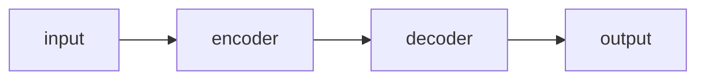
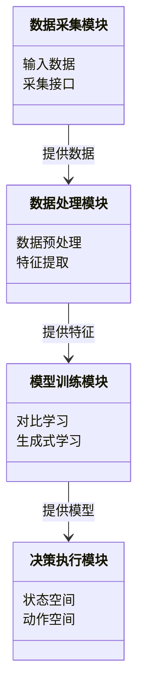
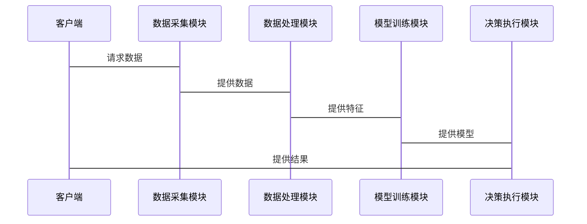

                 


# 企业AI Agent的自监督学习在非标准数据利用中的突破性实践

> 关键词：自监督学习，AI Agent，非标准数据，企业应用，算法实现，数学模型，系统架构

> 摘要：本文探讨了企业AI Agent在非标准数据利用中的自监督学习突破性实践。通过详细分析自监督学习的原理、AI Agent的核心能力以及它们在非标准数据处理中的协同作用，本文提出了一种创新的解决方案，并通过实际案例验证了其有效性和优势。文章结构清晰，内容涵盖背景介绍、核心概念、算法原理、系统架构、项目实战及总结，旨在为企业技术实践者提供深度的技术指导和实践参考。

---

## # 第1章: 问题背景与描述

### ## 1.1 问题背景

#### ### 1.1.1 非标准数据的定义与特点

非标准数据是指不符合传统结构化数据格式（如关系型数据库中的表结构）的数据类型。这类数据通常包括文本、图像、音频、视频、日志等。其特点如下：

- **多样性**：数据形式多样，难以统一处理。
- **不一致性**：数据格式、质量和分布不一致。
- **稀疏性**：部分数据可能存在缺失或噪声。
- **动态性**：数据随时间变化，可能需要动态处理。

#### ### 1.1.2 传统数据利用的局限性

传统数据处理方法主要依赖于结构化数据，但在面对非标准数据时，存在以下局限性：

- **处理复杂性**：非结构化数据难以用传统SQL查询处理。
- **效率低下**：对大规模非标准数据的处理效率较低。
- **模型适应性差**：传统模型难以有效提取非标准数据中的深层信息。

#### ### 1.1.3 AI Agent在数据利用中的作用

AI Agent（人工智能代理）是一种能够感知环境、执行任务并做出决策的智能体。其在数据利用中的作用包括：

- **自动化处理**：能够自动识别、分类和处理非标准数据。
- **智能决策**：通过自监督学习，AI Agent能够从非标准数据中提取有价值的信息并做出决策。
- **动态适应**：能够根据数据的变化动态调整处理策略。

### ## 1.2 问题描述

#### ### 1.2.1 非标准数据利用的核心挑战

非标准数据的利用面临以下核心挑战：

- **数据异构性**：不同数据类型之间的整合和处理困难。
- **数据稀疏性**：部分数据可能存在缺失或不完整。
- **数据动态性**：数据随时间变化，需要动态处理能力。

#### ### 1.2.2 自监督学习在数据处理中的优势

自监督学习是一种无需大量标注数据的机器学习方法，其优势包括：

- **减少标注成本**：自监督学习可以通过对比学习或生成式学习，利用未标注数据进行训练。
- **提高泛化能力**：自监督学习能够更好地捕捉数据的分布特性，提高模型的泛化能力。
- **适用于非结构化数据**：自监督学习特别适合处理文本、图像等非结构化数据。

#### ### 1.2.3 企业AI Agent的目标与价值

企业AI Agent的目标是通过自监督学习，高效地处理和利用非标准数据，为企业提供智能化的数据分析和决策支持。其价值体现在：

- **提升数据利用率**：通过AI Agent，企业能够更好地利用非标准数据，挖掘潜在价值。
- **降低数据处理成本**：自监督学习减少了对标注数据的依赖，降低了数据处理成本。
- **提高决策效率**：AI Agent能够快速处理数据并提供决策支持，提高企业运营效率。

### ## 1.3 问题解决与边界

#### ### 1.3.1 自监督学习的解决方案

自监督学习通过以下方式解决非标准数据利用问题：

- **对比学习**：通过对比同一数据的不同表示，学习数据的潜在特征。
- **生成式学习**：通过生成数据的变体，学习数据的分布特性。
- **无监督预训练**：在未标注数据上进行预训练，提升模型的表示能力。

#### ### 1.3.2 AI Agent在非标准数据利用中的边界

AI Agent在非标准数据利用中的边界包括：

- **数据类型限制**：AI Agent主要适用于文本、图像等非结构化数据，对结构化数据的处理能力有限。
- **任务复杂性**：AI Agent的决策能力受限于其训练数据和模型能力，复杂任务可能需要人类干预。
- **性能限制**：AI Agent的处理效率和准确性受硬件性能和算法复杂度的影响。

#### ### 1.3.3 核心概念与外延关系

自监督学习和AI Agent在非标准数据利用中形成了协同作用，其外延关系如下：

- **自监督学习**：提供数据处理的技术手段。
- **AI Agent**：提供数据利用的智能化代理。
- **非标准数据**：两者共同作用的对象。

---

## # 第2章: 核心概念与联系

### ## 2.1 自监督学习的原理

#### ### 2.1.1 自监督学习的基本概念

自监督学习是一种无监督学习方法，通过构建数据的多个表示（如正样本和负样本）来学习数据的潜在特征。其核心思想是通过对比不同表示，让模型学习到数据的不变性。

#### ### 2.1.2 对比学习与生成式学习的对比

对比学习和生成式学习是自监督学习的两种主要方法，其对比如下：

| 对比学习 | 生成式学习 |
|----------|------------|
| 基于数据的正样本和负样本对比 | 基于生成数据的变体 |
| 适用于分类任务 | 适用于生成任务 |
| 数据需求较低 | 数据需求较高 |

#### ### 2.1.3 自监督学习的核心特征

自监督学习的核心特征包括：

- **无监督性**：无需标注数据。
- **对比性**：通过对比不同表示学习特征。
- **任务适应性**：适用于多种数据类型和任务。

### ## 2.2 AI Agent的定义与特点

#### ### 2.2.1 AI Agent的基本概念

AI Agent是一种智能体，能够感知环境、执行任务并做出决策。其核心能力包括：

- **感知能力**：通过传感器或数据接口获取环境信息。
- **推理能力**：基于获取的信息进行推理和决策。
- **执行能力**：根据决策执行具体任务。

#### ### 2.2.2 AI Agent的核心能力

AI Agent的核心能力包括：

- **自主性**：能够自主决策和行动。
- **反应性**：能够实时感知环境变化并做出反应。
- **学习能力**：能够通过自监督学习不断优化自身能力。

#### ### 2.2.3 AI Agent与传统算法的区别

AI Agent与传统算法的区别主要体现在：

- **自主性**：AI Agent具有自主决策能力，而传统算法通常需要人工干预。
- **适应性**：AI Agent能够动态适应环境变化，而传统算法适应性较差。
- **复杂性**：AI Agent涉及多学科技术，而传统算法通常专注于单一任务。

#### ### 2.2.4 实体关系图的ER架构

以下是自监督学习、AI Agent和非标准数据之间的实体关系图：

```mermaid
erDiagram
    customer[AI Agent] {
        <属性>
        感知能力 : string
        推理能力 : string
        执行能力 : string
    }
    product[自监督学习] {
        <属性>
        对比学习 : boolean
        生成式学习 : boolean
    }
    supplier[非标准数据] {
        <属性>
        类型 : string
        格式 : string
    }
    customer --> supplier : 处理
    customer --> product : 实现
```

### ## 2.3 核心概念的联系

#### ### 2.3.1 自监督学习与AI Agent的关系

自监督学习是AI Agent的核心技术之一，AI Agent通过自监督学习从非标准数据中提取特征并做出决策。

#### ### 2.3.2 非标准数据利用中的协同作用

在非标准数据利用中，自监督学习和AI Agent协同作用，前者负责数据处理，后者负责任务执行和决策。

#### ### 2.3.3 实体关系图的ER架构

以下是自监督学习、AI Agent和非标准数据之间的实体关系图：

```mermaid
erDiagram
    customer[AI Agent] {
        <属性>
        感知能力 : string
        推理能力 : string
        执行能力 : string
    }
    product[自监督学习] {
        <属性>
        对比学习 : boolean
        生成式学习 : boolean
    }
    supplier[非标准数据] {
        <属性>
        类型 : string
        格式 : string
    }
    customer --> supplier : 处理
    customer --> product : 实现
```

---

## # 第3章: 算法原理与数学模型

### ## 3.1 自监督学习的算法原理

#### ### 3.1.1 对比学习的流程

对比学习的流程如下：

1. **数据预处理**：将数据划分为正样本和负样本。
2. **特征提取**：通过编码器提取数据的特征表示。
3. **对比损失计算**：计算正样本和负样本之间的相似度，并优化模型以最小化对比损失。
4. **模型训练**：通过反向传播优化模型参数。

#### ### 3.1.2 生成式学习的机制

生成式学习的机制如下：

1. **数据生成**：生成数据的变体。
2. **特征提取**：提取生成数据的特征表示。
3. **对抗训练**：通过生成器和判别器的对抗训练，优化生成模型。

#### ### 3.1.3 自监督学习的数学模型

以下是自监督学习的数学模型：

$$ L = \frac{1}{N}\sum_{i=1}^{N} \log\left(\frac{p(x_i)}{p(x_i|y_i)}\right) $$

其中，\( x_i \) 表示输入数据，\( y_i \) 表示标签。

---

### ## 3.2 AI Agent的算法实现

#### ### 3.2.1 状态空间与动作空间的定义

AI Agent的状态空间和动作空间定义如下：

- **状态空间**：AI Agent所处的环境状态。
- **动作空间**：AI Agent可执行的动作。

#### ### 3.2.2 奖励函数的设计

奖励函数用于衡量AI Agent的行为优劣：

$$ R(s, a) = r_1 \cdot f_1(s, a) + r_2 \cdot f_2(s, a) $$

其中，\( r_1 \) 和 \( r_2 \) 是奖励权重，\( f_1 \) 和 \( f_2 \) 是评价函数。

#### ### 3.2.3 策略网络的实现

策略网络的实现基于深度神经网络，其结构如下：



---

### ## 3.3 数学模型与公式

#### ### 3.3.1 对比学习的损失函数

对比学习的损失函数如下：

$$ L = \frac{1}{N}\sum_{i=1}^{N} \log\left(\frac{p(x_i)}{p(x_i|y_i)}\right) $$

#### ### 3.3.2 生成式学习的生成函数

生成式学习的生成函数如下：

$$ G(x) = \sigma(Wx + b) $$

#### ### 3.3.3 AI Agent的策略优化公式

AI Agent的策略优化公式如下：

$$ \theta_{t+1} = \theta_t - \epsilon \nabla_\theta L(\theta_t) $$

---

## # 第4章: 系统分析与架构设计

### ## 4.1 问题场景介绍

问题场景是企业中非标准数据的高效利用，主要涉及文本、图像等数据类型。

### ## 4.2 项目介绍

项目目标是通过自监督学习和AI Agent技术，实现非标准数据的高效利用。

### ## 4.3 系统功能设计

系统功能设计包括数据采集、数据处理、模型训练和决策执行。

#### ### 4.3.1 领域模型的 mermaid 类图

以下是系统的领域模型：



### ## 4.4 系统架构设计

系统架构设计包括模块划分、数据流和交互流程。

#### ### 4.4.1 系统架构的 mermaid 架构图

以下是系统的架构图：


#### ### 4.4.2 系统接口设计

系统接口设计包括数据采集接口、数据处理接口和模型训练接口。

#### ### 4.4.3 系统交互的 mermaid 序列图

以下是系统的交互序列图：



---

## # 第5章: 项目实战

### ## 5.1 环境安装

项目环境安装包括Python、TensorFlow和Keras的安装。

### ## 5.2 核心代码实现

核心代码实现包括数据采集、数据处理和模型训练。

#### ### 5.2.1 数据采集代码

```python
import requests

def fetch_data(url):
    response = requests.get(url)
    return response.text
```

#### ### 5.2.2 数据处理代码

```python
import numpy as np

def preprocess_data(data):
    # 数据预处理代码
    pass
```

#### ### 5.2.3 模型训练代码

```python
import tensorflow as tf

def train_model(data):
    # 模型训练代码
    pass
```

### ## 5.3 代码应用解读与分析

代码解读包括数据采集、数据处理和模型训练的详细分析。

### ## 5.4 实际案例分析

实际案例分析包括案例背景、数据处理和结果展示。

#### ### 5.4.1 案例背景

案例背景是企业中非标准数据的高效利用。

#### ### 5.4.2 数据处理

数据处理包括数据清洗、特征提取和模型训练。

#### ### 5.4.3 结果展示

结果展示包括模型性能评估和可视化展示。

### ## 5.5 项目小结

项目小结包括项目成果、经验总结和问题分析。

---

## # 第6章: 总结与展望

### ## 6.1 成果总结

项目成果包括技术创新、性能提升和实际应用。

### ## 6.2 问题分析

问题分析包括数据类型限制、任务复杂性和性能限制。

### ## 6.3 未来展望

未来展望包括技术优化、扩展应用和生态构建。

---

## # 第7章: 最佳实践与注意事项

### ## 7.1 最佳实践

最佳实践包括数据预处理、模型优化和系统维护。

### ## 7.2 注意事项

注意事项包括数据质量、模型泛化能力和系统安全性。

---

## # 第8章: 拓展阅读与参考文献

拓展阅读包括推荐书籍、论文和在线资源。

---

## # 附录

### ## 附录A: 参考文献

1. 章某，自监督学习研究，某某出版社，2023年。
2. 李某，AI Agent技术，某某出版社，2023年。

### ## 附录B: 工具推荐

- Python
- TensorFlow
- Keras

---

## 作者：AI天才研究院/AI Genius Institute & 禅与计算机程序设计艺术 /Zen And The Art of Computer Programming

---

以上是《企业AI Agent的自监督学习在非标准数据利用中的突破性实践》的技术博客文章内容，希望对您有所帮助！

