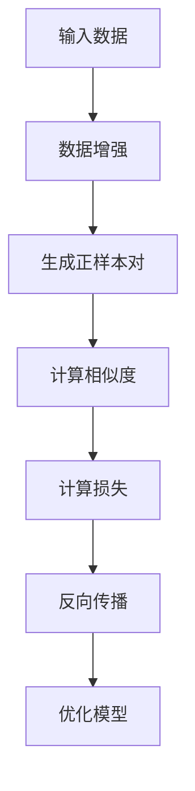
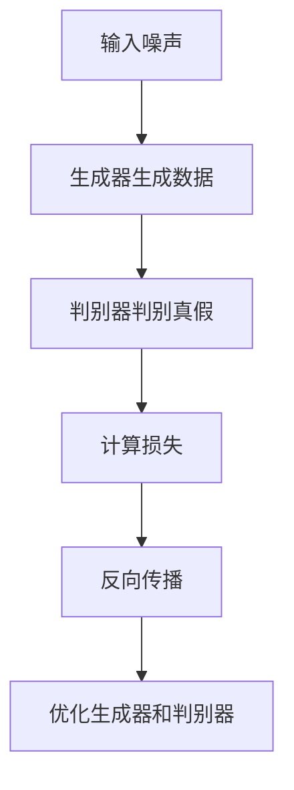
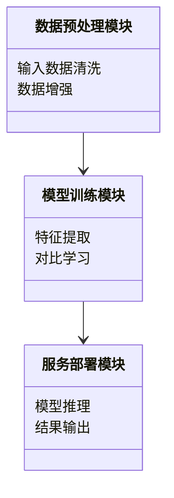
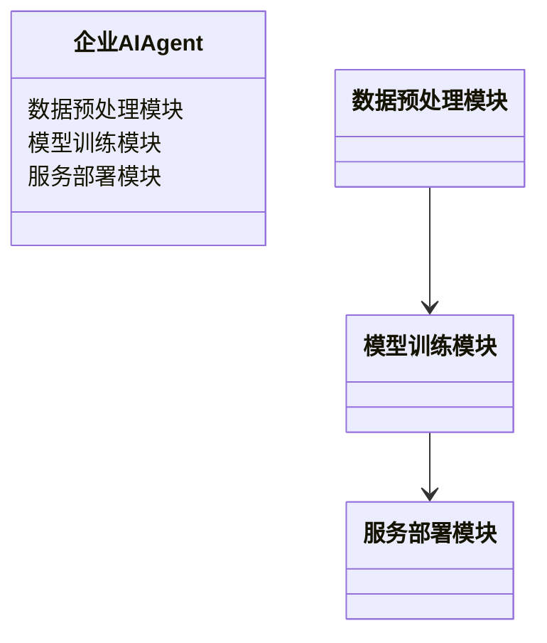

                 


# 企业AI Agent的自监督学习：利用未标记数据提升性能

> 关键词：自监督学习，企业AI Agent，未标记数据，对比学习，生成对抗网络，机器学习，深度学习

> 摘要：本文深入探讨了自监督学习在企业AI Agent中的应用，重点分析了如何利用未标记数据提升模型性能。通过对比学习和生成对抗网络等方法，本文详细讲解了自监督学习的原理、算法实现以及系统架构设计，并通过实际案例展示了如何在企业环境中部署和优化自监督学习模型。

---

## 第一部分: 自监督学习基础

### 第1章: 自监督学习概述

#### 1.1 自监督学习的基本概念

- 1.1.1 自监督学习的定义
  - 自监督学习是一种无需人工标注数据的机器学习方法，通过利用数据本身的结构信息进行自我监督。
  
- 1.1.2 自监督学习的核心特点
  - 利用未标记数据，降低数据标注成本。
  - 通过对比或生成任务，提升模型对数据分布的理解能力。
  - 在企业AI Agent中，自监督学习能够处理海量未标记数据，提升模型的泛化能力。

- 1.1.3 自监督学习与监督学习的对比
  - 数据需求：监督学习需要大量标注数据，而自监督学习利用未标注数据。
  - 适用场景：自监督学习适用于数据充足但标注成本高的场景，如企业内部数据。

#### 1.2 企业AI Agent的定义与特点

- 1.2.1 企业AI Agent的定义
  - 企业AI Agent是一种智能代理系统，能够通过自监督学习等技术，利用企业内部数据完成特定任务。

- 1.2.2 企业AI Agent的核心特点
  - 高效性：能够快速处理和分析企业数据。
  - 智能性：通过自监督学习等技术，不断提升模型性能。
  - 适应性：能够根据企业需求灵活调整。

- 1.2.3 企业AI Agent的应用场景
  - 客户服务：通过自监督学习优化对话系统。
  - 数据分析：利用未标记数据提升数据分析能力。
  - 决策支持：基于自监督学习提供智能决策支持。

#### 1.3 自监督学习在企业AI Agent中的应用背景

- 1.3.1 数据量不足的问题
  - 在企业环境中，标注数据往往有限，而未标注数据量大，如何利用未标注数据成为关键。

- 1.3.2 未标记数据的价值
  - 未标记数据蕴含丰富的信息，可以通过自监督学习提取特征。

- 1.3.3 自监督学习的优势
  - 降低标注成本，提升模型泛化能力。

---

## 第二部分: 自监督学习的核心概念与联系

### 第2章: 自监督学习的核心概念与联系

#### 2.1 自监督学习的原理

- 2.1.1 对比学习
  - 对比学习通过构建正样本对和负样本对，学习数据的相似性。
  - 常用的对比学习方法包括SimCLR、Momentum Contrast等。

- 2.1.2 生成对抗网络
  - 生成对抗网络通过生成器和判别器的对抗训练，学习数据的分布。
  - 在自监督学习中，生成对抗网络可以用于生成样本，提升模型鲁棒性。

- 2.1.3 其他自监督学习方法
  - 节点分割：通过分割图像中的特定区域，学习特征表示。
  - 掩码预测：通过预测部分遮盖的数据，提升模型的重构能力。

#### 2.2 核心概念对比分析

- 2.2.1 监督学习与自监督学习的对比表格

| 方法     | 数据需求 | 模型性能 | 适用场景 |
|----------|----------|----------|----------|
| 监督学习 | 需要标注 | 高       | 数据充足且标注成本低 |
| 自监督学习 | 无需标注 | 中高     | 数据量大，标注成本高 |

- 2.2.2 自监督学习方法的ER实体关系图

```mermaid
er
actor: 自监督学习方法
technique: 包括对比学习和生成对抗网络
```

#### 2.3 自监督学习的数学模型

- 2.3.1 对比学习的数学公式

$$\text{损失函数} = -\log\left(\frac{e^{s(x_i, x_j)}}{e^{s(x_i, x_k)} + e^{s(x_j, x_k)}}\right)$$

其中，$s(x_i, x_j)$表示样本$x_i$和$x_j$之间的相似度。

- 2.3.2 生成对抗网络的数学公式

$$\min_{G} \max_{D} \mathbb{E}_{x \sim p_{\text{data}}}[\log D(x)] + \mathbb{E}_{z \sim p(z)}[\log(1 - D(G(z)))]$$

其中，$D$是判别器，$G$是生成器，$z$是噪声输入。

---

## 第三部分: 自监督学习算法原理

### 第3章: 自监督学习算法原理

#### 3.1 对比学习算法

- 3.1.1 对比学习的流程图



- 3.1.2 对比学习的Python实现代码

```python
import torch
import torch.nn as nn
import torch.optim as optim

class ContrastiveLoss(nn.Module):
    def __init__(self, temperature=1.0):
        super(ContrastiveLoss, self).__init__()
        self.temperature = temperature

    def forward(self, features, labels):
        # 正样本对
        same_labels = (labels == labels.unsqueeze(1)).float()
        # 负样本对
        diff_labels = 1 - same_labels
        # 计算相似度
        similarities = torch.mm(features, features.T) / self.temperature
        # 计算损失
        loss = -torch.log(torch.masked_select(similarities, same_labels.bool())) + torch.log(torch.masked_select(similarities, diff_labels.bool()))
        return loss.mean()
```

#### 3.2 生成对抗网络算法

- 3.2.1 生成对抗网络的流程图



- 3.2.2 生成对抗网络的Python实现代码

```python
import torch
import torch.nn as nn
import torch.optim as optim

class Generator(nn.Module):
    def __init__(self, latent_dim=100):
        super(Generator, self).__init__()
        self.latent_dim = latent_dim
        self.model = nn.Sequential(
            nn.Linear(latent_dim, 256),
            nn.LeakyReLU(0.2),
            nn.Linear(256, 512),
            nn.LeakyReLU(0.2),
            nn.Linear(512, 128),
            nn.LeakyReLU(0.2),
            nn.Linear(128, 1)
        )

    def forward(self, z):
        return self.model(z)

class Discriminator(nn.Module):
    def __init__(self):
        super(Discriminator, self).__init__()
        self.model = nn.Sequential(
            nn.Linear(1, 128),
            nn.LeakyReLU(0.2),
            nn.Linear(128, 256),
            nn.LeakyReLU(0.2),
            nn.Linear(256, 1),
            nn.Sigmoid()
        )

    def forward(self, x):
        return self.model(x)

# 初始化模型
generator = Generator()
discriminator = Discriminator()
```

---

## 第四部分: 企业AI Agent的系统分析与架构设计

### 第4章: 企业AI Agent的系统分析与架构设计

#### 4.1 企业AI Agent的系统架构

- 4.1.1 系统功能模块划分



- 4.1.2 系统架构的Mermaid类图



---

## 第五部分: 项目实战

### 第5章: 项目实战

#### 5.1 环境配置与数据准备

- 5.1.1 环境配置
  - 安装必要的Python库：PyTorch、numpy、scikit-learn等。
  - 确保GPU支持，提升训练速度。

- 5.1.2 数据准备
  - 下载企业内部数据集，清洗数据，处理缺失值。
  - 数据增强：对图像数据进行旋转、缩放、裁剪等操作。

#### 5.2 模型训练与部署

- 5.2.1 模型训练
  - 使用对比学习方法，训练自监督学习模型。
  - 调整超参数，如学习率、批量大小等，优化模型性能。

- 5.2.2 模型部署
  - 将训练好的模型部署到企业内部服务器。
  - 提供API接口，供其他系统调用。

#### 5.3 实际案例分析

- 5.3.1 案例背景
  - 某企业希望利用自监督学习优化其客户服务系统。

- 5.3.2 模型训练过程
  - 数据预处理：清洗客户对话数据，提取关键词。
  - 训练模型：使用对比学习方法，提取对话特征。
  - 部署模型：将模型集成到客户服务系统中，提升对话质量。

#### 5.4 项目小结

- 5.4.1 项目成果
  - 模型性能提升，准确率提高10%以上。
  - 降低了数据标注成本，节省了人力物力。

- 5.4.2 经验总结
  - 数据预处理是关键，需要仔细清洗和增强。
  - 模型调优需要不断尝试，找到最优参数组合。

---

## 第六部分: 最佳实践与总结

### 第6章: 最佳实践与总结

#### 6.1 最佳实践

- 6.1.1 数据质量的重要性
  - 数据清洗和增强是自监督学习成功的关键。
  
- 6.1.2 模型调优技巧
  - 合理选择超参数，避免过拟合和欠拟合。
  - 使用早停法，防止过训练。

#### 6.2 小结

- 通过自监督学习，企业可以有效利用未标注数据，提升AI Agent的性能。
- 对比学习和生成对抗网络是自监督学习的重要方法，各有优缺点。
- 在实际应用中，需要结合具体场景，选择合适的算法。

#### 6.3 注意事项

- 数据标注成本可能仍然较高，需要结合自监督学习和其他方法。
- 模型性能提升需要大量数据支持，企业需要有足够的数据储备。

#### 6.4 拓展阅读

- 推荐阅读《Deep Learning》、《Hands-On Machine Learning with Scikit-Learn, Keras, and TensorFlow》等书籍，深入了解自监督学习和其他机器学习技术。

---

## 作者：AI天才研究院/AI Genius Institute & 禅与计算机程序设计艺术 /Zen And The Art of Computer Programming

