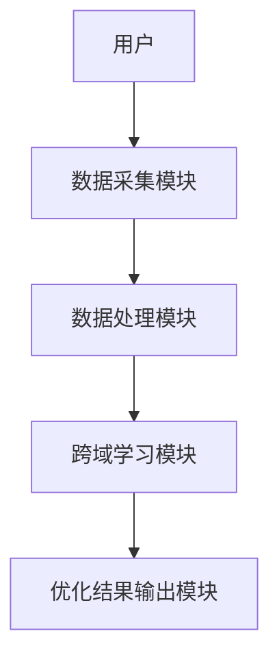

                 


# 企业AI Agent的跨域学习：打破数据孤岛，实现全局优化

## 关键词：
AI Agent、跨域学习、数据孤岛、全局优化、企业系统、机器学习、系统架构

## 摘要：
本文探讨企业AI Agent如何通过跨域学习打破数据孤岛，实现全局优化。从背景介绍到算法实现，详细解析AI Agent的核心概念、跨域学习的原理、系统架构设计及项目实战，帮助读者全面理解并应用这些技术。

---

# 企业AI Agent的跨域学习：打破数据孤岛，实现全局优化

## 第一部分：企业AI Agent的背景与概念

### 第1章：AI Agent的基本概念

#### 1.1 AI Agent的定义与特点
- **1.1.1 AI Agent的定义**  
  AI Agent是一种智能体，能够感知环境并采取行动以实现目标。它具备自主性、反应性、目标导向性和社会性等核心特点。

- **1.1.2 AI Agent的核心特点**  
  AI Agent能够自主决策，实时响应环境变化，并通过学习和优化提升性能。

- **1.1.3 AI Agent与传统AI的区别**  
  AI Agent不仅被动执行任务，还能主动感知环境并自适应调整策略。

#### 1.2 跨域学习的定义与应用场景
- **1.2.1 跨域学习的定义**  
  跨域学习是AI Agent在不同数据域之间迁移知识，解决数据孤岛问题的技术。

- **1.2.2 跨域学习的核心思想**  
  利用共享特征和领域特定特征，实现跨域知识迁移，提升模型泛化能力。

- **1.2.3 跨域学习在企业中的应用场景**  
  在企业中，跨域学习常用于客户行为预测、供应链优化和多部门协作等领域。

#### 1.3 数据孤岛与企业全局优化
- **1.3.1 数据孤岛的定义与成因**  
  数据孤岛指数据分散在不同系统中，无法有效整合，导致信息孤岛。其成因包括技术限制、管理问题和系统设计不合理等。

- **1.3.2 数据孤岛对企业的影响**  
  数据孤岛导致企业无法充分利用数据，影响决策效率和业务协同。

- **1.3.3 企业全局优化的目标与意义**  
  全局优化旨在打破数据孤岛，实现跨部门协同，提升整体效率和竞争力。

---

## 第二部分：AI Agent的跨域学习原理

### 第2章：跨域学习的核心原理

#### 2.1 跨域学习的理论基础
- **2.1.1 跨域学习的基本原理**  
  跨域学习通过共享特征和领域适应，实现不同数据域之间的知识迁移。

- **2.1.2 跨域学习的关键技术**  
  包括特征抽取、领域适配和模型优化等技术，确保跨域知识的有效迁移。

#### 2.2 跨域学习与数据孤岛的关系
- **2.2.1 数据孤岛如何阻碍企业优化**  
  数据孤岛限制了数据的共享和利用，影响企业整体优化。

- **2.2.2 跨域学习如何打破数据孤岛**  
  跨域学习通过跨域数据融合和知识共享，打破数据孤岛，实现全局优化。

#### 2.3 跨域学习的数学模型
- **2.3.1 跨域学习的数学表达**  
  跨域学习的数学模型涉及共享参数和领域特定参数，通过优化算法实现模型参数的协同更新。

- **2.3.2 跨域学习的优化算法**  
  使用分布式优化和对齐策略，确保不同数据域之间的模型一致性和性能提升。

---

## 第三部分：AI Agent的系统架构与设计

### 第3章：AI Agent的系统架构

#### 3.1 系统架构概述
- **3.1.1 系统架构的组成**  
  系统由数据采集模块、数据处理模块、跨域学习模块和优化结果输出模块组成。

- **3.1.2 系统架构的设计原则**  
  包括模块化设计、数据共享和动态适应原则，确保系统高效运行。

#### 3.2 跨域学习的系统设计
- **3.2.1 系统功能模块划分**  
  功能模块包括数据采集、数据预处理、模型训练和结果输出等。

- **3.2.2 系统功能模块的交互流程**  
  数据采集模块收集数据，预处理模块清洗数据，模型训练模块进行跨域学习，最终输出优化结果。

#### 3.3 系统架构的Mermaid图


---

## 第四部分：AI Agent的算法实现与实战

### 第4章：跨域学习算法的实现

#### 4.1 算法原理
- **4.1.1 算法原理概述**  
  跨域学习通过共享特征和领域适配，实现不同数据域之间的知识迁移。

- **4.1.2 算法实现步骤**  
  包括数据预处理、特征提取、模型训练和结果优化等步骤。

#### 4.2 算法实现代码
```python
# 跨域学习模型实现
class CrossDomainLearner:
    def __init__(self, domains):
        self.domains = domains
        self.shared_params = {}
        self.domain_params = {d: {} for d in domains}

    def train(self, data_loaders, optimizer, epochs):
        for epoch in range(epochs):
            for d in self.domains:
                loader = data_loaders[d]
                for batch in loader:
                    # 前向传播
                    outputs = self.forward(d)
                    # 计算损失
                    loss = self.criterion(outputs, labels)
                    # 反向传播和优化
                    optimizer.zero_grad()
                    loss.backward()
                    optimizer.step()
            # 跨域参数对齐
            self.align_domains()
```

#### 4.3 数学模型与公式
- **数学模型**  
  跨域学习模型通常涉及共享参数θ和领域特定参数φ，目标是最小化跨域损失函数：
  $$ L(\theta, \phi) = \sum_{d} L_d(\theta, \phi_d) $$
  
- **对齐策略**  
  使用对抗训练或一致性损失，确保不同领域特征的对齐：
  $$ \mathcal{L}_{align} = \mathbb{E}_{d}[ \text{adversarial loss}(x_d, y_d)] $$

---

## 第五部分：AI Agent的最佳实践与小结

### 第5章：最佳实践与小结

#### 5.1 小结
- 跨域学习是解决数据孤岛问题的有效方法，通过跨域知识迁移实现企业全局优化。

#### 5.2 注意事项
- 数据预处理和特征提取是关键步骤，需确保数据质量和一致性。
- 跨域学习模型的对齐策略需根据具体场景调整，避免过拟合。

#### 5.3 拓展阅读
- 《Domain Adaptation: A Survey from Theory to Practice》
- 《Cross-Domain Transfer Learning: A Comprehensive Survey》

---

作者：AI天才研究院/AI Genius Institute & 禅与计算机程序设计艺术 /Zen And The Art of Computer Programming

