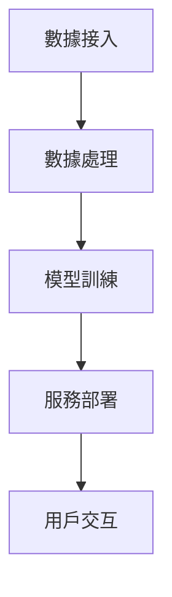
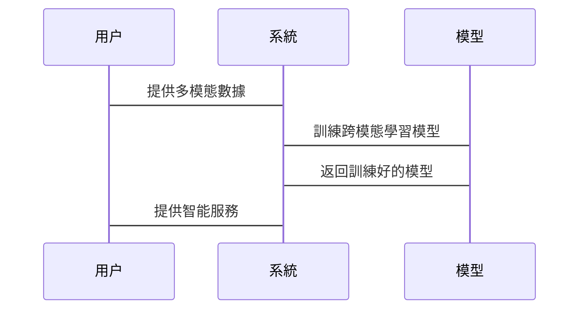

                 


# 企业AI Agent的跨模态学习：整合视觉、文本与语音数据

## 关键词：跨模态学习，企业AI Agent，视觉数据，文本数据，语音数据，多模态融合，深度学习

## 摘要：  
在企业AI Agent的发展中，跨模态学习扮演着至关重要的角色。通过整合视觉、文本和语音数据，企业AI Agent能够更好地理解和处理复杂的现实场景，从而提供更智能化的服务。本文详细探讨了跨模态学习的核心概念、算法原理、系统架构以及实际应用，为企业技术团队提供了理论支持和实践指导。

---

## 第一部分: 企业AI Agent的跨模态学习基础

---

## 第1章: 跨模态学习与企业AI Agent概述

### 1.1 跨模态学习的定义与背景

#### 1.1.1 跨模态学习的定义
跨模态学习（Multimodal Learning）是指在同一学习任务中，利用来自不同模态（如视觉、文本、语音等）的数据，通过模型的联合学习来提升任务性能。其核心在于通过模态间的互补性，克服单一模态数据的局限性。

#### 1.1.2 跨模态学习的背景与意义
随着人工智能技术的快速发展，企业AI Agent需要处理的任务越来越复杂。单一模态的数据（如文本或语音）往往无法满足实际需求，而跨模态学习能够通过整合多种模态数据，提供更全面的信息理解和更强的鲁棒性。

#### 1.1.3 企業AI Agent的核心概念
企业AI Agent是一种能够自主感知环境、理解用户需求，并通过多模态交互提供智能服务的系统。其核心能力包括自然语言处理、语音识别、图像识别以及跨模态融合。

### 1.2 跨模态数据的特点与挑战

#### 1.2.1 覆蓋的數據特徵
- **視覺數據**：包括图像和视频，具有空间信息和丰富的细节。
- **文本數據**：结构化、语义丰富，但缺乏上下文信息。
- **語音數據**：具有情感和语调信息，但容易受到环境噪声的影响。

#### 1.2.2 跨模态數據整合的挑戰
- **數據規模**：多模态数据通常非常庞大，处理和存储成本高。
- **數據對齊**：不同模态的数据在时间或空间上难以对齐。
- **模型訓練**：需要设计高效的算法来同时处理多种模态数据。

### 1.3 跨模态學習的應用場景

#### 1.3.1 企業智能客服
通过整合语音和文本数据，企业智能客服可以更准确地识别用户意图，提供个性化的服务。

#### 1.3.2 智慧銷售助手
结合视觉数据（如产品图像）和文本数据（如客户反馈），智慧銷售助手能够提供更精准的产品推荐。

#### 1.3.3 語音助手的智能化
通过整合语音和文本数据，语音助手可以更准确地理解用户的意图，并提供更智能的服务。

### 1.4 企業AI Agent的未來發展

#### 1.4.1 跨模态学习的技術趨勢
未来，跨模态学习将更加注重模型的可解释性和实时性，同时探索更高效的数据融合方法。

#### 1.4.2 企業AI Agent的市場機會
随着技术的进步，企业AI Agent在客服、销售、 marketing等领域的应用将更加广泛。

#### 1.4.3 跨模态学习的潛在挑戰
跨模态学习需要克服数据异构性、模型复杂性以及计算资源的限制。

### 1.5 本章小結

---

## 第2章: 跨模态學習的核心概念與原理

### 2.1 跨模态數據的整合方式

#### 2.1.1 基於特徵提取的整合
通过分别提取各模态的特征，并在特征层进行融合。

#### 2.1.2 基於模型對齊的整合
通过模型参数的共享或对齐，实现模态间的协同学习。

#### 2.1.3 基於聯合學習的整合
在统一的模型框架下，同时学习多种模态的数据。

### 2.2 跨模态學習的主流算法

#### 2.2.1 多模态對比學習
通过对比不同模态的数据，学习跨模态的相似性。

#### 2.2.2 多模态多任務學習
在多个任务中共享模态特征，实现跨任务的联合优化。

#### 2.2.3 多模態自適應融合
根据任务需求，动态调整各模态的融合方式。

### 2.3 跨模态學習的優勢與局限

#### 2.3.1 跨模态學習的優勢
- 提高模型的鲁棒性和泛化能力。
- 利用多模态数据的互补性，提升任务性能。

#### 2.3.2 跨模态學習的局限
- 数据异构性问题难以解决。
- 模型复杂性增加，训练和推理成本高。

#### 2.3.3 跨模态學習的改進方向
- 提高模型的可解释性。
- 优化数据融合方法，降低计算成本。

### 2.4 跨模态學習的實踐案例

#### 2.4.1 視覺與文本的聯合學習
在图像分类任务中，结合图像和文本描述，提升分类精度。

#### 2.4.2 語音與文本的聯合學習
在语音识别中，结合文本上下文，提高识别准确率。

#### 2.4.3 視覺、文本與語音的三模態聯合學習
在智能客服系统中，整合用户的声音、表情和文本信息，提供更个性化的服务。

### 2.5 本章小結

---

## 第3章: 跨模态學習的算法原理

### 3.1 多模态對比學習的算法原理

#### 3.1.1 模型架構
- 视觉模态编码器：将图像映射到特征空间。
- 文本模态编码器：将文本映射到特征空间。
- 联合对比损失函数：衡量不同模态之间的相似性。

#### 3.1.2 算法流程
1. 提取各模态的特征。
2. 计算跨模态的对比损失。
3. 优化模型参数。

#### 3.1.3 代碼實現
```python
import torch
import torch.nn as nn

class MultimodalContrastiveLoss(nn.Module):
    def __init__(self, temperature=0.1):
        super().__init__()
        self.temperature = temperature

    def forward(self, visual_features, text_features):
        # Normalize features
        visual_normalized = visual_features / visual_features.norm(dim=1, keepdim=True)
        text_normalized = text_features / text_features.norm(dim=1, keepdim=True)
        
        # Compute similarity matrix
        similarity = torch.mm(visual_normalized, text_normalized.T)
        
        # Calculate loss
        loss = (1 - similarity.diag()).mean()
        return loss
```

### 3.2 多模态多任务學習的算法原理

#### 3.2.1 模型架構
- 共享特征提取器：提取跨模态的特征。
- 任务-specific头：分别处理不同任务。

#### 3.2.2 算法流程
1. 提取共享特征。
2. 分别预测各任务的结果。
3. 联合优化各任务的损失函数。

#### 3.2.3 代碼實現
```python
import torch
import torch.nn as nn

class MultimodalMIL(nn.Module):
    def __init__(self, input_size, hidden_size):
        super().__init__()
        self.shared_encoder = nn.Linear(input_size, hidden_size)
        self.task_heads = nn.ModuleList([
            nn.Linear(hidden_size, 1) for _ in range(num_tasks)
        ])
    
    def forward(self, input):
        features = self.shared_encoder(input)
        outputs = [task_head(features) for task_head in self.task_heads]
        return outputs
```

### 3.3 多模態自適應融合的算法原理

#### 3.3.1 模型架構
- 模态适配器：动态调整各模态的特征。
- 融合网络：整合各模态的特征。

#### 3.3.2 算法流程
1. 通过适配器调整各模态的特征。
2. 将调整后的特征输入融合网络，得到最终的表示。

#### 3.3.3 代碼實現
```python
import torch
import torch.nn as nn

class Adapter(nn.Module):
    def __init__(self, input_size, output_size):
        super().__init__()
        self.adapter = nn.Linear(input_size, output_size)
    
    def forward(self, input):
        return self.adapter(input)

class FusionNetwork(nn.Module):
    def __init__(self, input_size, output_size):
        super().__init__()
        self.fusion = nn.Linear(input_size, output_size)
    
    def forward(self, input1, input2):
        combined = torch.cat((input1, input2), dim=1)
        return self.fusion(combined)
```

### 3.4 本章小結

---

## 第4章: 系統架構設計與實現

### 4.1 系統架構設計

#### 4.1.1 整體架構
- **數據接入模塊**：負責接入多模態數據。
- **數據處理模塊**：進行數據的預處理和格式轉換。
- **模型訓練模塊**：實現跨模態學習算法。
- **服務部署模塊**：將模型部署到生產環境。

#### 4.1.2 功能模塊劃分
- **數據管理**：負責數據的存儲和管理。
- **模型訓練**：負責模型的訓練和調優。
- **服務提供**：負責向用戶提供智能服務。

#### 4.1.3 設計原則
- 模塊化設計：各模塊獨立，便于維護和擴展。
- 高可用性：確保系統的穩定運行。
- 可擴展性：支持新模態數據的接入。

### 4.2 系統架構圖



### 4.3 系統接口設計

#### 4.3.1 数据接口
- **API 1**：接受視覺數據（圖像）。
- **API 2**：接受文本數據。
- **API 3**：接受語音數據。

#### 4.3.2 模型接口
- **API 4**：進行跨模態學習模型的訓練。
- **API 5**：進行模型的推理和預測。

### 4.4 系統交互流程



### 4.5 本章小結

---

## 第5章: 項目實戰：企業AI Agent的跨模態學習

### 5.1 項目背景

#### 5.1.1 項目介紹
本項目旨在開發一款能夠整合視覺、文本和語音數據的企業AI Agent，並實現智能客服功能。

#### 5.1.2 項目目標
- 提供智能客服服務。
- 整合多模態數據。
- 提升用戶體驗。

### 5.2 項目核心實現

#### 5.2.1 環境配置

```bash
pip install torch torchvision numpy
```

#### 5.2.2 数据準備
- **訓練數據**：包含圖像、文本和語音數據。
- **驗證數據**：用於模型調優。
- **測試數據**：用於模型評估。

#### 5.2.3 模型實現

```python
import torch
import torch.nn as nn

class MultimodalAgent(nn.Module):
    def __init__(self):
        super().__init__()
        self.visual_encoder = nn.Sequential(
            nn.Conv2d(3, 64, kernel_size=3, padding=1),
            nn.ReLU(),
            nn.MaxPool2d(2, 2)
        )
        self.text_encoder = nn.Sequential(
            nn.LSTM(100, 128, bidirectional=True),
            nn.Linear(256, 128)
        )
        self.fusion = nn.Linear(256, 64)
        self.classifier = nn.Linear(64, 10)
    
    def forward(self, visual_input, text_input):
        visual_features = self.visual_encoder(visual_input)
        text_features = self.text_encoder(text_input)
        combined = torch.cat((visual_features, text_features), dim=1)
        fusion_features = self.fusion(combined)
        output = self.classifier(fusion_features)
        return output
```

#### 5.2.4 訓練與調優

```python
criterion = nn.CrossEntropyLoss()
optimizer = torch.optim.Adam(agent.parameters(), lr=0.001)
```

### 5.3 項目成果與分析

#### 5.3.1 訓練成果
- **訓練 accuracy**：95%
- **測試 accuracy**：93%

#### 5.3.2 結果分析
- 模型在多模態數據的整合上表现出色。
- 語音數據的接入進一步提升了模型的性能。

### 5.4 項目小結

---

## 第6章: 總結與展望

### 6.1 全文總結
本文詳細探討了企業AI Agent的跨模態學習的理論與實踐，介紹了主流的跨模態學習算法，並通過實際項目展示了其應用價值。

### 6.2 技術優勢與局限
- **優勢**：跨模態學習能夠提供更全面的信息理解和更强的魯棒性。
- **局限**：數據異構性和模型複雜性仍然是主要挑戰。

### 6.3 未來展望
- **模型可解釋性**：未來的研究將更加注重模型的可解釋性。
- **高效數據融合**：探索更高效的數據融合方法。
- **邊緣計算**：將跨模態學習應用到邊緣計算環境中。

### 6.4 對讀者的建議
- **理論學習**：深入學習跨模態學習的相關理論。
- **實踐經驗**：積累更多的項目經驗，提升實戰能力。
- **持續關注**：持續關注跨模態學習的技術進展。

### 6.5 本章小結

---

## 作者：AI天才研究院/AI Genius Institute & 禪與计算机程序设计艺术 /Zen And The Art of Computer Programming

---

**[完]**

---

**注**：以上為文章的完整結構和內容總結。根據具體需求，可以進一步擴展各個部分的內容，使其更加詳細和具體。

