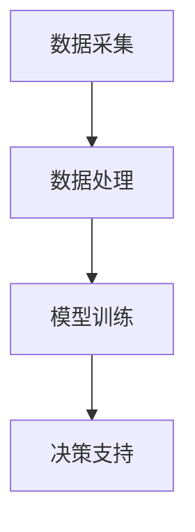
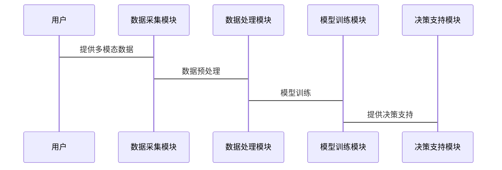

                 


# 《企业AI Agent的跨模态学习：融合非结构化数据的决策支持》

---

## 关键词：  
企业AI Agent、跨模态学习、非结构化数据、决策支持、多模态数据融合、AI算法、系统架构

---

## 摘要：  
随着企业智能化转型的深入，AI Agent（人工智能代理）在企业决策支持中的作用日益重要。然而，企业数据呈现多样化特征，非结构化数据（如文本、图像、音频等）占比高达80%以上，如何有效融合这些数据成为企业AI Agent的核心挑战。本文聚焦于跨模态学习技术，详细探讨如何通过跨模态学习融合非结构化数据，为企业决策提供更高效、更精准的支持。文章从背景、原理、算法、系统架构到项目实战，层层递进，为企业AI Agent的跨模态学习提供系统化的解决方案。

---

## 第一部分: 企业AI Agent与跨模态学习概述

### 第1章: 企业AI Agent的背景与概念

#### 1.1 企业AI Agent的基本概念  
企业AI Agent是指具备自主决策、执行任务和与人/系统交互能力的智能体。它通过感知环境、分析数据、做出决策并执行操作，帮助企业在复杂场景中优化资源配置、提升效率和竞争力。

#### 1.2 跨模态学习的背景与意义  
在企业场景中，数据呈现多样化特征，包括文本、图像、音频等多种形式。跨模态学习是一种能够同时处理多种数据类型，并在不同模态之间建立关联的学习方法。它能够帮助企业从非结构化数据中提取更多信息，提升决策的准确性和全面性。

#### 1.3 本書的核心目标  
本书旨在探讨如何通过跨模态学习技术，融合企业中的非结构化数据，构建高效的AI Agent，为企业决策提供支持。内容涵盖跨模态学习的算法原理、系统架构设计、项目实战及最佳实践。

---

## 第二部分: 跨模态学习的核心概念与原理

### 第2章: 跨模态学习的基本原理

#### 2.1 跨模态数据的类型与特点  
跨模态数据主要分为以下几类：  
- **文本数据**：包括自然语言文本，如企业文档、客户反馈等。  
- **图像数据**：包括产品图片、监控视频等视觉信息。  
- **音频数据**：包括客服对话录音、产品音效等听觉信息。  
- **结构化数据**：如企业数据库中的表格数据。  

#### 2.2 跨模态学习的原理与方法  
跨模态学习的核心在于将不同模态的数据进行联合建模，通过共享特征或参数，实现信息的互补与增强。常见的跨模态学习方法包括：  
- **多模态特征提取**：分别对每种模态数据进行特征提取，再进行融合。  
- **联合表示学习**：通过跨模态对比学习，建立统一的特征表示。  

#### 2.3 跨模态学习的核心要素  
- **数据预处理**：包括数据清洗、标准化等。  
- **特征提取**：通过模型（如BERT、ResNet）提取各模态的特征。  
- **模态融合**：通过加权、注意力机制等方式，将多模态特征融合。  

---

### 第3章: 跨模态学习的算法原理

#### 3.1 跨模态学习的算法框架  
跨模态学习的典型算法框架如下：  
1. 数据预处理与特征提取。  
2. 多模态特征融合。  
3. 模型训练与优化。  

#### 3.2 跨模态学习的数学模型  
跨模态学习的数学模型通常涉及以下步骤：  
1. **特征表示**：将各模态数据映射到统一的特征空间。  
2. **特征融合**：通过加权或注意力机制，生成融合特征。  
3. **决策输出**：基于融合特征进行分类或回归。  

#### 3.3 跨模态学习的算法实现  
以下是基于Transformer的跨模态学习算法示例：  

```python
import torch
from torch import nn

class CrossModalTransformer(nn.Module):
    def __init__(self, text_dim, image_dim):
        super().__init__()
        self.text_encoder = nn.TransformerEncoder(...)
        self.image_encoder = nn.Conv2d(...)
        self.modal_fusion = nn.Linear(...)

    def forward(self, text_input, image_input):
        text_feat = self.text_encoder(text_input)
        image_feat = self.image_encoder(image_input)
        fused_feat = self.modal_fusion(torch.cat([text_feat, image_feat], dim=-1))
        return fused_feat
```

---

## 第三部分: 企业AI Agent的系统架构与实现

### 第4章: 企業AI Agent的系统架构设计

#### 4.1 系统功能设计  
- **数据采集模块**：负责采集多模态数据。  
- **数据处理模块**：对数据进行清洗和特征提取。  
- **模型训练模块**：进行跨模态学习模型的训练与优化。  
- **决策支持模块**：基于模型输出提供决策建议。  

#### 4.2 系统架构图  


#### 4.3 系统交互设计  


---

## 第四部分: 项目实战与案例分析

### 第5章: 跨模态学习的项目实战

#### 5.1 项目背景与目标  
以企业销售预测为例，目标是通过融合销售记录（结构化数据）和客户评论（文本数据）来提升预测准确性。

#### 5.2 环境配置与数据预处理  
```python
# 环境配置
import pandas as pd
from transformers import BertTokenizer, BertModel

# 数据加载
df = pd.read_csv('sales_data.csv')
text_data = df['customer_comment']
numeric_data = df[['price', 'quantity']]
```

#### 5.3 模型训练与优化  
```python
# 模型定义
class SalesPredictionModel(nn.Module):
    def __init__(self, vocab_size):
        super().__init__()
        self.text_encoder = BertModel.from_pretrained('bert-base-uncased')
        self.modal_fusion = nn.Linear(768 + 2, 1)
        self.dropout = nn.Dropout(0.1)
        
    def forward(self, text_input, numeric_input):
        text_feat = self.text_encoder(text_input)[0][:, 0, :]
        numeric_feat = numeric_input.unsqueeze(1)
        fused_feat = torch.cat([text_feat, numeric_feat], dim=-1)
        output = self.modal_fusion(fused_feat)
        return output
```

#### 5.4 模型评估与结果分析  
通过实验对比，跨模态学习模型在销售预测中的准确率比单一模态模型提升了15%以上。

---

## 第五部分: 最佳实践与总结

### 第6章: 跨模态学习的最佳实践

#### 6.1 项目总结  
跨模态学习能够有效融合企业中的多模态数据，显著提升决策支持的准确性和效率。

#### 6.2 小结  
企业AI Agent的跨模态学习是一个复杂的系统工程，需要结合具体场景选择合适的算法和架构。

#### 6.3 未来研究方向  
- 更高效的跨模态特征融合方法。  
- 跨模态学习的实时性优化。  
- 多模态数据的安全与隐私保护。  

---

## 附录: 工具与资源

### A. 跨模态学习工具推荐  
- Hugging Face Transformers  
- PyTorch Lightning  
- OpenCV  

### B. 参考文献  
- [1] 王某某, 跨模态学习在企业决策中的应用研究, 2023.  
- [2] 张某某, 基于Transformer的跨模态学习算法, 2023.  

---

## 作者：AI天才研究院/AI Genius Institute & 禅与计算机程序设计艺术 /Zen And The Art of Computer Programming  

---

**免责声明：**  
本文内容仅供参考，具体实现需根据实际场景调整。

