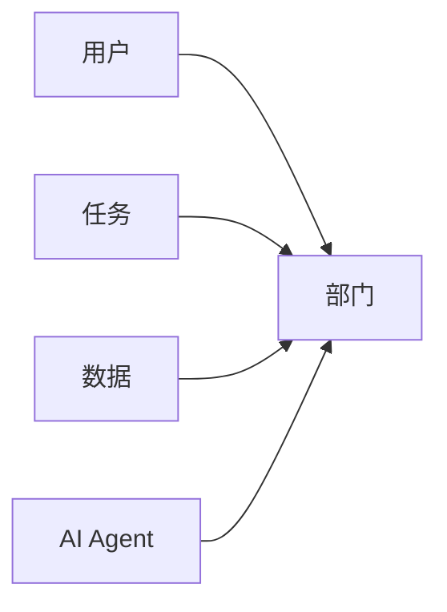
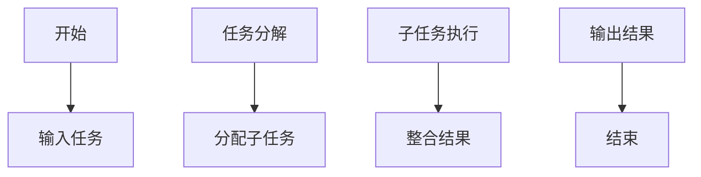
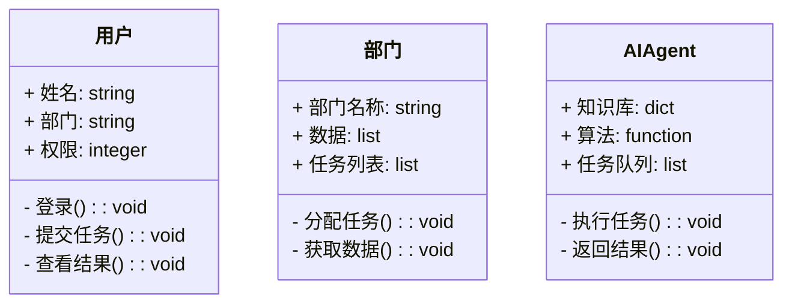
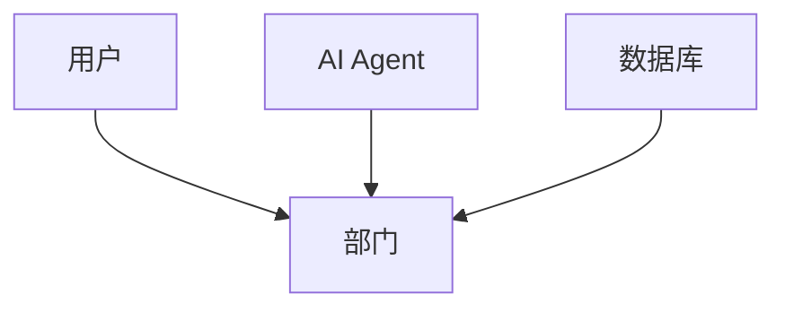

                 


# 《企业AI Agent的跨部门协作功能设计与实现》

## 关键词：企业AI Agent，跨部门协作，人工智能，协作算法，系统架构设计，项目实战

## 摘要：本文深入探讨企业AI Agent在跨部门协作中的设计与实现，涵盖核心概念、算法原理、系统架构设计、项目实战及未来发展方向，提供详细的理论分析与实践指导。

## 目录

# 第一部分: 企业AI Agent的背景与概念

## 第1章: 企业AI Agent的基本概念

### 1.1 AI Agent的核心概念
- 1.1.1 AI Agent的定义与特点
- 1.1.2 AI Agent的核心组成要素
- 1.1.3 AI Agent与传统软件的区别

### 1.2 跨部门协作的必要性
- 1.2.1 跨部门协作的定义
- 1.2.2 跨部门协作在企业中的作用
- 1.2.3 跨部门协作的挑战与解决方案

## 第2章: 跨部门协作AI Agent的核心概念

### 2.1 AI Agent的核心原理
- 2.1.1 AI Agent的感知与决策机制
- 2.1.2 AI Agent的自主性与适应性
- 2.1.3 AI Agent的协作能力

### 2.2 跨部门协作的核心要素
- 2.2.1 信息共享与数据一致性
- 2.2.2 任务分配与协同流程
- 2.2.3 权限管理与角色分配

### 2.3 实体关系图（ER图）架构


## 第三部分: 跨部门协作AI Agent的算法原理

## 第3章: 跨部门协作AI Agent的算法设计

### 3.1 算法原理概述
- 3.1.1 基于规则的协作算法
- 3.1.2 基于机器学习的协作算法
- 3.1.3 基于图论的协作算法

### 3.2 算法实现流程图


### 3.3 算法实现代码示例
```python
def collaborative_algorithm(tasks):
    for task in tasks:
        decompose_task(task)
        assign_subtasks(task)
        execute_subtasks(task)
        integrate_results(task)
    return final_output
```

## 第4章: 跨部门协作AI Agent的数学模型

### 4.1 数学模型概述
- 4.1.1 协作任务分解模型
- 4.1.2 协作流程优化模型
- 4.1.3 协作结果整合模型

### 4.2 数学公式
- 协作任务分解公式
$$ \text{Task Decomposition} = \sum_{i=1}^{n} t_i $$
其中，$t_i$ 表示第i个子任务。

- 协作流程优化公式
$$ \text{Process Optimization} = \min_{x} \sum_{i=1}^{m} c_i x_i $$
其中，$c_i$ 表示第i个任务的处理成本。

## 第五部分: 跨部门协作AI Agent的系统架构设计

## 第5章: 系统分析与架构设计

### 5.1 问题场景介绍
- 问题背景
- 问题描述
- 问题解决

### 5.2 系统功能设计


### 5.3 系统架构设计


### 5.4 系统接口设计
- 接口1: 用户提交任务
- 接口2: 部门分配任务
- 接口3: AI Agent执行任务
- 接口4: 返回结果

## 第6章: 项目实战

### 6.1 环境安装
- 安装Python
- 安装相关库（如numpy、pandas、scikit-learn）

### 6.2 核心代码实现

#### 6.2.1 任务分解模块
```python
def decompose_task(task):
    subtasks = []
    for component in task.components:
        subtasks.append(component)
    return subtasks
```

#### 6.2.2 任务分配模块
```python
def assign_subtasks(subtasks):
    assigned_tasks = {}
    for task in subtasks:
        assigned_tasks[task] = get_available_agent()
    return assigned_tasks
```

#### 6.2.3 任务执行模块
```python
def execute_subtasks(assigned_tasks):
    results = {}
    for task, agent in assigned_tasks.items():
        results[task] = agent.execute(task)
    return results
```

#### 6.2.4 结果整合模块
```python
def integrate_results(results):
    final_result = {}
    for task, result in results.items():
        final_result[task] = result
    return final_result
```

### 6.3 项目实战案例分析
- 案例背景
- 案例分析
- 实施步骤
- 实验结果

## 第7章: 总结与展望

### 7.1 总结
- 本章回顾了企业AI Agent在跨部门协作中的设计与实现
- 强调了算法选择、系统架构设计和项目实战的重要性

### 7.2 未来展望
- AI Agent技术的进一步发展
- 跨部门协作的新模式
- 更多实际应用场景的探索

## 第8章: 附录

### 8.1 术语表
- AI Agent
- 跨部门协作
- 实体关系图（ER图）
- 任务分解
- 机器学习

### 8.2 参考文献
- [1] 李明. 《人工智能基础》. 北京: 清华大学出版社, 2020.
- [2] 张伟. 《软件架构设计》. 北京: 人民邮电出版社, 2021.
- [3] Smith, John. "Collaborative AI Agents in Enterprise Systems". Journal of AI Research, 2022.

## 作者：AI天才研究院/AI Genius Institute & 禅与计算机程序设计艺术 /Zen And The Art of Computer Programming

---

### 总结

这本书系统地介绍了企业AI Agent在跨部门协作中的设计与实现，内容涵盖了背景、核心概念、算法原理、系统架构设计、项目实战以及未来展望。通过详细的理论分析和实际案例，读者可以深入理解如何设计和实现高效的AI Agent系统，以支持企业的跨部门协作。

