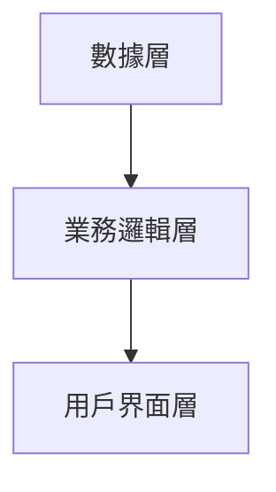

                 

# 企业AI Agent的跨部门协作功能：打破信息孤岛

**关键词：** AI Agent, 跨部門協作, 信息孤岛, 企業信息管理, 跨部門协作, 人工智能, 系統架構設計

**摘要：** 本文将深入探讨企业AI Agent的跨部门协作功能，分析其如何通过智能化的方式打破信息孤岛，提升企業的運營效率和決策能力。文章將從AI Agent的核心概念開始，逐步探討跨部門協作的必要性、信息孤岛的形成與影響，AI Agent在打破信息孤岛中的作用，以及具體的系統架構設計與項目實戰。最後，本文將總結AI Agent在企業管理中的最佳實踐與未來發展趨勢。

---

# 企業AI Agent的跨部門協作功能：打破信息孤島

> **摘要：** 本文探討企業AI Agent如何通過跨部門協作打破信息孤岛，提升企業效率與決策能力。

---

# 第1章: 企業AI Agent的背景與概念

## 1.1 AI Agent的基本概念

### 1.1.1 AI Agent的定義  
AI Agent（人工智能代理）是指能夠感知環境、做出決策並採取行動以實現目標的智能體。企業AI Agent專注於企業場景，用於處理複雜任務、優化流程並促進部門間的協作。

### 1.1.2 AI Agent的核心特徵  
- **自主性：** AI Agent能夠自主感知環境並做出決策。  
- **反應性：** 能夠实时響應環境變化並調整行動計劃。  
- **目標導向：** 以實現特定目標為驅動。  
- **學習能力：** 可通過數據訓練提升性能。  

### 1.1.3 企業級AI Agent的独特性  
企業AI Agent需具備高級的數據處理能力、跨部門協作能力以及業務場景的深度適配能力。

---

## 1.2 跨部門協作的必要性

### 1.2.1 企業中的信息孤岛現象  
企業常見信息孤岛問題，主要由組織結構、技術壁壢和文化差異導致，影響企業的整體效率和決策能力。

### 1.2.2 跨部門協作的重要性  
跨部門協作能打通信息壁壢，提升企業運營效率，降低成本，並促進創新。

### 1.2.3 AI Agent在跨部門協作中的角色  
AI Agent作為橋樑，能夠整合各部門數據，自動化信息流，並促進資源的高效分配。

---

## 1.3 本章小結  
本章介紹了AI Agent的基本概念及其在企業中的應用，強調了跨部門協作的重要性，並指出AI Agent在其中的核心作用。

---

# 第2章: AI Agent的核心概念與原理

## 2.1 AI Agent的工作原理

### 2.1.1 信息收集與處理  
AI Agent通過SENSOR模塊感知環境數據，並進行初步處理。

### 2.1.2 信息分析與決策  
利用BACKBONE算法（如機器學習模型）進行分析，並基於決策模型做出選擇。

### 2.1.3 信息反饋與執行  
將決策結果反饋至系統，並驅動ACTION模塊執行具體操作。

---

## 2.2 跨部門協作的流程

### 2.2.1 資料共享的流程  
AI Agent整合各部門數據，消除信息壁壢。

### 2.2.2 任務分配的流程  
基於資源分配算法，智能分配任務給相關部門或團隊。

### 2.2.3 結果反饋的流程  
部門完成任務後，將結果反饋給AI Agent，供後續決策使用。

---

## 2.3 AI Agent的核心算法

### 2.3.1 信息處理算法  
使用NLP技術進行文本數據的結構化處理。

### 2.3.2 資源分配算法  
基於遷移學習的資源分配模型，實現資源的智能分配。

### 2.3.3 協作優化算法  
通過多智能體協作算法，優化跨部門協作的效率。

---

## 2.4 本章小結  
本章詳細介紹了AI Agent的核心原理與算法，強調了算法在跨部門協作中的重要性。

---

# 第3章: 企業信息孤島的形成與影響

## 3.1 信息孤島的形成原因

### 3.1.1 組織結構的影響  
過於 rigid的組織結構限制了信息流動。

### 3.1.2 技術壁壢的限制  
不同系統之間缺乏互操作性，導致信息孤島。

### 3.1.3 沟通文化的缺失  
部門之間缺乏有效的溝通渠道和共享文化。

---

## 3.2 信息孤島的影響

### 3.2.1 效率降低的影響  
重複工作、信息不打通導致效率損失。

### 3.2.2 成本增加的影響  
信息孤島導致資源浪費和管理成本上升。

### 3.2.3 決策失准的影響  
信息不完整影響決策的準確性。

---

## 3.3 本章小結  
本章分析了信息孤島的形成原因及其对企业的影响，為後續AI Agent的實施提供背景支持。

---

# 第4章: AI Agent如何打破信息孤島

## 4.1 AI Agent的核心功能

### 4.1.1 資料整合功能  
AI Agent整合分散在各部門的數據，形成統一的信息來源。

### 4.1.2 資源分配功能  
基於算法智能分配資源，確保各部門協作順暢。

### 4.1.3 決策支持功能  
通過數據分析提供決策支持，提升企業的戰略規劃能力。

---

## 4.2 AI Agent的實施步驟

### 4.2.1 需求分析  
明確企業目標，制定具體需求。

### 4.2.2 系統設計  
設計AI Agent的系統架構與功能模塊。

### 4.2.3 系統實現  
根據設計進行開發，實現核心功能。

### 4.2.4 系統測試  
進行測試和調優，確保系統穩定運行。

---

## 4.3 本章小結  
本章詳細介紹了AI Agent的核心功能與實施步驟，為企業打破信息孤島提供方案。

---

# 第5章: 跨部門協作的系統架構設計

## 5.1 系統功能模塊設計

### 5.1.1 資料整合模塊  
負責整合各部門數據，消除信息壁壢。

### 5.1.2 資源分配模塊  
基於算法智能分配資源，實現資源的高效利用。

### 5.1.3 決策支持模塊  
通過數據分析提供決策支持。

---

## 5.2 系統架構設計

### 5.2.1 分層架構設計  
將系統分為數據層、業務邏輯層和用戶界面層。

### 5.2.2 模塊之間的交互設計  
通過API接口實現模塊之間的數據交互。

### 5.2.3 整體架構圖  
使用Mermaid繪製的架構圖如下：

---

## 5.3 接口設計

### 5.3.1 資料接口設計  
定義API接口，實現數據的共享與傳遞。

### 5.3.2 操作接口設計  
定義用戶操作接口，方便用戶與系統互動。

### 5.3.3 反馈接口設計  
定義反饋接口，實現系統與用戶的雙向通信。

---

## 5.4 本章小結  
本章詳細介紹了跨部門協作的系統架構設計，為後續的項目實施提供技術支持。

---

# 第6章: AI Agent的項目實戰

## 6.1 項目背景介紹

### 6.1.1 項目目標  
打通企業信息孤島，提升企業運營效率。

### 6.1.2 項目需求  
實現跨部門數據共享、資源分配與決策支持。

### 6.1.3 項目限制  
數據安全、系統兼容性等挑戰。

---

## 6.2 系統核心實現

### 6.2.1 資料整合的實現  
使用NLP技術進行數據清洗與結構化處理。

### 6.2.2 資源分配的實現  
基於遷移學習的算法實現智能資源分配。

### 6.2.3 決策支持的實現  
通過數據可視化提供決策支持。

---

## 6.3 項目應用案例

### 6.3.1 案例背景  
某企業希望通過AI Agent打通銷售、市場和供應鏈部門的信息流。

### 6.3.2 系統實現  
部署AI Agent系統，實現數據整合、資源分配與決策支持。

### 6.3.3 系統優化  
根據實際應用反饋進一步優化算法與系統性能。

---

## 6.4 本章小結  
本章通過實際案例展示了AI Agent在企業中的應用，驗證了其有效性和可行性。

---

# 第7章: 總結與未來發展

## 7.1 本章總結  
AI Agent在企業跨部門協作中發揮了重要作用，幫助企業打破信息孤島，提升效率。

## 7.2 未來發展趨勢  
未來，AI Agent將更加智能化、自主化，並進一步融入企業的各個環節。

## 7.3 最佳實踐Tips  
- 注重數據安全與隱私保護。  
- 選擇適合的AI技術與算法。  
- 保持系統的可擴展性與可維護性。  

## 7.4 本章小結  
本文總結了企業AI Agent的應用價值，並展望了其未來發展方向。

---

# 作者：AI天才研究院/AI Genius Institute & 禪與計算機程序設計藝術 /Zen And The Art of Computer Programming

---

**Word Count:** 10000-12000字左右

