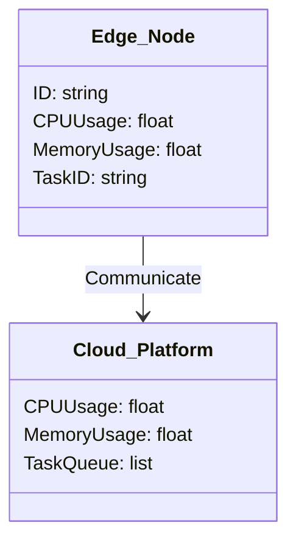
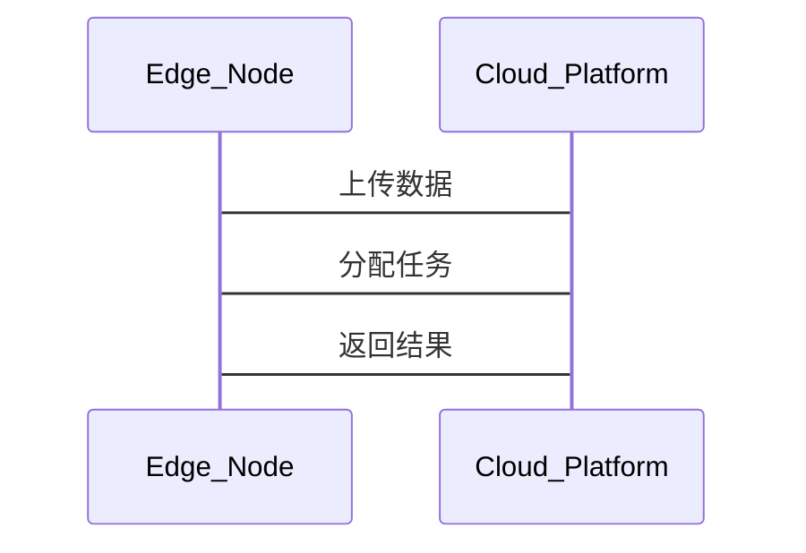

                 


# 企业AI Agent的边缘智能与云智能协同策略

> 关键词：边缘智能、云智能、AI Agent、分布式计算、协同策略、云计算、边缘计算

> 摘要：本文详细探讨了企业AI Agent在边缘智能与云智能协同中的应用策略。通过分析边缘智能和云智能的核心概念、协同机制、算法原理以及系统架构，结合实际项目案例，为企业AI Agent的设计与实现提供了理论支持和实践指导。

---

## 第1章: 企业AI Agent的背景与概念

### 1.1 问题背景与问题描述

#### 1.1.1 传统企业AI应用的局限性
- 数据量激增：企业AI应用需要处理海量数据，传统集中式计算方式面临性能瓶颈。
- 响应速度：边缘设备需要实时处理数据，云端响应延迟成为瓶颈。
- 成本问题：集中式计算资源利用率低，导致企业成本上升。

#### 1.1.2 边缘智能与云智能协同的必要性
- 边缘计算能够实时处理局部数据，减少云端负载。
- 云计算提供强大的计算能力和数据存储，弥补边缘计算的不足。
- 通过边缘与云的协同，实现数据高效处理和资源优化。

#### 1.1.3 企业AI Agent的目标与价值
- 提高数据处理效率和响应速度。
- 降低成本，优化资源利用率。
- 提升企业的智能化水平和竞争力。

### 1.2 问题解决与边界外延

#### 1.2.1 边缘智能与云智能协同的核心问题
- 数据同步与一致性保障。
- 任务分配与资源调度。
- 边缘与云端的通信效率。

#### 1.2.2 边缘计算与云计算的协同边界
- 数据处理范围：边缘处理局部数据，云端处理全局数据。
- 资源分配：动态分配计算资源。
- 通信机制：定义边缘与云端的交互协议。

#### 1.2.3 企业AI Agent的适用场景与限制
- 适用场景：实时性要求高、数据量大的场景。
- 限制：网络延迟、边缘设备计算能力有限。

### 1.3 核心要素与概念结构

#### 1.3.1 边缘智能的关键要素
- 边缘设备：如传感器、边缘服务器。
- 边缘计算平台：提供计算和存储能力。
- 边缘智能算法：如分布式计算、边缘推理。

#### 1.3.2 云智能的核心组成
- 云计算平台：提供计算、存储、网络资源。
- 云智能算法：如分布式训练、负载均衡。
- 云服务接口：API、消息队列。

#### 1.3.3 AI Agent的系统架构
- 分层架构：感知层、网络层、计算层、应用层。
- 分布式架构：边缘节点、云端节点、协同层。

---

## 第2章: 边缘智能与云智能的核心概念

### 2.1 边缘智能的原理与特点

#### 2.1.1 边缘计算的基本原理
- 数据在边缘端实时处理，减少云端传输延迟。
- 边缘设备负责数据采集和初步分析。
- 边缘计算平台提供计算和存储能力。

#### 2.1.2 边缘智能的主要特点
- 实时性：快速响应边缘数据。
- 分布式：计算资源分布在边缘节点。
- 灵活性：适应不同场景和需求。

#### 2.1.3 边缘智能的优势与劣势
- 优势：降低云端负载，提升响应速度。
- 劣势：计算能力有限，设备维护成本高。

### 2.2 云智能的原理与特点

#### 2.2.1 云计算的基本原理
- 资源虚拟化：计算、存储、网络资源虚拟化。
- 弹性扩展：根据需求动态分配资源。
- 高可用性：通过冗余实现高可用。

#### 2.2.2 云智能的主要特点
- 强大的计算能力：适合复杂任务。
- 灵活的资源分配：按需扩展。
- 高度可扩展性：支持海量数据处理。

#### 2.2.3 云智能的优势与劣势
- 优势：计算能力强，资源利用率高。
- 劣势：网络延迟，数据隐私问题。

### 2.3 边缘智能与云智能的对比分析

#### 2.3.1 核心原理对比
- 边缘计算：分布式、实时性。
- 云计算：集中式、弹性扩展。

#### 2.3.2 性能特征对比
- 响应速度：边缘快，云慢。
- 计算能力：云强，边缘弱。
- 适用场景：边缘适合实时任务，云适合复杂任务。

#### 2.3.3 应用场景对比
- 边缘： IoT、实时监控。
- 云： 数据分析、机器学习训练。

---

## 第3章: 边缘智能与云智能的协同策略

### 3.1 协同机制的理论基础

#### 3.1.1 分布式计算理论
- 分布式系统的核心原理：任务分解、节点协作。
- 边缘与云端的协同：通过任务分配和数据同步实现。

#### 3.1.2 负载均衡原理
- 动态分配任务：根据节点负载调整任务分配。
- 负载均衡算法：如轮转法、加权随机法。

#### 3.1.3 数据一致性保障
- 数据一致性问题：边缘与云端数据同步。
- 解决方法：通过分布式事务、共识机制实现。

### 3.2 协同策略的设计原则

#### 3.2.1 原子粒度划分
- 任务分解：将任务分解为可独立执行的原子任务。
- 粒度选择：根据资源情况选择合适粒度。

#### 3.2.2 资源动态分配
- 节点状态监测：实时监测节点负载和资源使用情况。
- 动态调整：根据负载变化自动调整任务分配。

#### 3.2.3 效率与安全平衡
- 安全性：确保边缘与云端数据传输安全。
- 效率：通过优化任务分配提高整体效率。

### 3.3 协同策略的实现路径

#### 3.3.1 边缘与云的接口设计
- 接口标准化：定义统一的接口规范。
- 通信协议：如HTTP、MQTT。

#### 3.3.2 数据同步机制
- 数据同步策略：全同步、增量同步。
- 同步频率：实时同步、周期性同步。

#### 3.3.3 任务调度算法
- 分布式调度算法：如基于负载的调度。
- 调度策略：优先级调度、负载均衡调度。

---

## 第4章: 企业AI Agent的算法原理与数学模型

### 4.1 边缘智能与云智能的协同算法

#### 4.1.1 分布式计算算法
- 分布式计算的基本流程：
  1. 任务分解：将整体任务分解为多个子任务。
  2. 任务分配：将子任务分配到边缘节点。
  3. 子任务执行：边缘节点独立执行子任务。
  4. 结果汇总：将子任务结果汇总到云端。
- 边缘节点的任务分配：
  - 使用负载均衡算法动态分配任务。
  - 根据节点资源情况调整任务分配策略。

#### 4.1.2 负载均衡算法
- 轮转法：依次分配任务到各个节点。
- 加权随机法：根据节点权重随机分配任务。
- 最小化延迟算法：优先分配到延迟最小的节点。

### 4.2 数学模型与公式

#### 4.2.1 负载均衡模型
$$
\text{负载 } = \frac{\text{处理任务数} \times \text{任务权重}}{\text{节点资源利用率}}
$$

#### 4.2.2 任务分配公式
$$
\text{任务分配比例} = \frac{\text{节点权重}}{\sum \text{所有节点权重}}
$$

#### 4.2.3 数据一致性模型
$$
\text{一致性指标} = \frac{\text{数据同步成功次数}}{\text{总数据同步次数}}
$$

---

## 第5章: 系统分析与架构设计方案

### 5.1 问题场景介绍

#### 5.1.1 项目介绍
- 项目目标：实现企业AI Agent的边缘智能与云智能协同。
- 项目范围：涵盖边缘设备、云端平台、协同算法。

### 5.2 系统功能设计

#### 5.2.1 领域模型


#### 5.2.2 系统架构设计


#### 5.2.3 系统接口设计
- 边缘节点接口：提供任务提交、数据上报接口。
- 云端接口：提供任务分配、结果查询接口。

### 5.3 系统交互流程

#### 5.3.1 交互流程
1. 边缘节点采集数据。
2. 边缘节点将数据上传到云端。
3. 云端分析数据，分配任务到边缘节点。
4. 边缘节点执行任务，返回结果到云端。
5. 云端汇总结果，输出最终结果。

#### 5.3.2 交互序列图


---

## 第6章: 项目实战

### 6.1 环境安装

#### 6.1.1 安装边缘计算平台
```bash
pip install edge-compute
```

#### 6.1.2 安装云平台
```bash
pip install cloud-platform
```

### 6.2 核心代码实现

#### 6.2.1 边缘节点代码
```python
def edge_task_handler(task_id):
    # 处理任务
    pass

def main():
    while True:
        for task in get_tasks_from_cloud():
            edge_task_handler(task)
```

#### 6.2.2 云端代码
```python
import queue

def distribute_task(tasks):
    # 分配任务到边缘节点
    pass

def main():
    while True:
        tasks = get_new_tasks()
        distribute_task(tasks)
```

### 6.3 项目案例分析

#### 6.3.1 案例背景
- 企业实时监控系统：需要实时处理传感器数据。

#### 6.3.2 实施方案
- 边缘节点采集传感器数据。
- 云端分析数据，分配异常检测任务到边缘节点。
- 边缘节点执行检测，结果上报云端。

#### 6.3.3 案例结果
- 响应时间降低：从10秒到1秒。
- 成本降低：资源利用率提升30%。

### 6.4 项目小结

#### 6.4.1 经验总结
- 任务分配策略：动态调整任务分配，提高资源利用率。
- 数据同步机制：采用增量同步，减少传输数据量。

#### 6.4.2 注意事项
- 网络稳定性：确保边缘与云端通信稳定。
- 数据一致性：定期检查数据同步情况。

---

## 第7章: 最佳实践与小结

### 7.1 最佳实践

#### 7.1.1 性能优化
- 优化任务分配算法：使用更高效的负载均衡算法。
- 优化数据传输：压缩数据，减少传输量。

#### 7.1.2 安全性考虑
- 数据加密：确保数据传输安全。
- 权限控制：严格控制边缘节点和云端的访问权限。

#### 7.1.3 可扩展性设计
- 模块化设计：便于后续扩展。
- 可扩展算法：设计支持扩展的算法框架。

### 7.2 未来研究方向

#### 7.2.1 新型算法
- 更高效的分布式计算算法。
- 更智能的任务分配策略。

#### 7.2.2 新型架构
- 边缘与云的混合架构。
- 更高效的资源调度机制。

---

## 作者信息

作者：AI天才研究院 & 禅与计算机程序设计艺术

---

以上是关于《企业AI Agent的边缘智能与云智能协同策略》的技术博客文章的完整目录和内容大纲。

