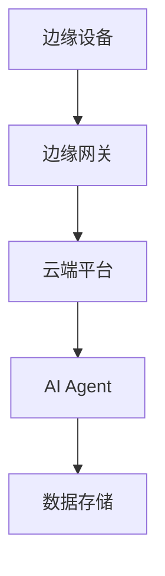

                 


# 企业AI Agent的边缘智能部署策略

---

## 关键词：企业AI Agent，边缘智能，边缘计算，AI代理，分布式系统，实时数据分析

---

## 摘要：  
随着人工智能和边缘计算技术的快速发展，企业AI Agent的边缘智能部署成为智能化转型的重要趋势。本文从AI Agent的核心概念、边缘智能的原理、部署策略、系统架构设计等方面展开分析，详细探讨了企业在边缘环境下部署AI Agent的技术挑战与解决方案。通过实际案例分析和最佳实践，为读者提供一套系统化的部署策略，帮助企业高效、安全地实现智能化应用。

---

## 第一部分：企业AI Agent的边缘智能部署背景与概述

---

### 第1章：AI Agent的基本概念与特点

#### 1.1 AI Agent的定义与核心特征

- **定义**：AI Agent是一种能够感知环境、自主决策并执行任务的智能实体，通常具备目标导向性和学习能力。
- **核心特征**：
  - **自主性**：无需外部干预，自主完成任务。
  - **反应性**：能够实时感知环境变化并做出响应。
  - **目标导向性**：基于目标驱动行为。
  - **学习能力**：通过数据反馈不断优化自身性能。

#### 1.2 AI Agent在企业中的应用场景

- **智能制造**：实时监控生产线，预测设备故障。
- **智能客服**：通过自然语言处理提供个性化服务。
- **智能物流**：优化配送路径，提高效率。

#### 1.3 边缘计算的定义与优势

- **定义**：在靠近数据源的位置进行数据处理和存储的技术。
- **优势**：
  - **低延迟**：减少数据传输到云端的时间。
  - **高实时性**：快速响应本地事件。
  - **安全性**：减少数据传输中的潜在风险。

---

### 第2章：AI Agent与边缘智能的结合

#### 2.1 AI Agent在边缘计算中的作用

- **实时数据处理**：在边缘设备上快速分析数据。
- **本地决策**：基于边缘数据做出实时决策。
- **减少云端依赖**：降低对中心化服务器的依赖。

#### 2.2 边缘智能部署的必要性

- **实时性要求**：在工业生产、智能安防等领域，实时响应至关重要。
- **数据隐私**：边缘部署可以减少数据传输到云端的风险。
- **网络带宽优化**：在边缘处理数据可以减少对带宽的需求。

---

## 第二部分：企业AI Agent边缘智能部署的核心技术与挑战

---

### 第3章：边缘智能的核心技术

#### 3.1 边缘计算的关键技术

- **边缘设备**：如边缘服务器、工业传感器等。
- **边缘网关**：用于连接边缘设备和云端。
- **边缘计算平台**：提供数据处理、存储和分析功能。

#### 3.2 AI Agent的边缘部署技术

- **轻量级AI算法**：适用于边缘设备的计算能力限制。
- **联邦学习**：在边缘设备上联合训练模型，保护数据隐私。
- **边缘计算与云计算协同**：结合边缘和云端资源，实现最优部署。

---

### 第4章：AI Agent边缘智能部署的挑战

#### 4.1 技术挑战

- **计算资源限制**：边缘设备的计算能力和存储空间有限。
- **数据安全性**：如何确保边缘数据的安全性和隐私性。
- **算法优化**：如何在边缘环境下优化AI算法的性能。

#### 4.2 业务挑战

- **业务流程整合**：AI Agent需要与企业现有的业务流程无缝集成。
- **成本控制**：边缘部署可能带来额外的成本投入。
- **运维管理**：如何高效管理和维护分布在各地的边缘设备。

---

## 第三部分：企业AI Agent边缘智能部署的系统架构设计

---

### 第5章：系统架构设计

#### 5.1 问题场景介绍

- **场景描述**：企业需要在多个边缘设备上部署AI Agent，实现数据实时分析和决策。
- **核心需求**：
  - **实时性**：快速响应本地事件。
  - **可靠性**：确保系统稳定运行。
  - **可扩展性**：支持未来业务扩展。

#### 5.2 系统功能设计

- **数据采集**：从边缘设备采集实时数据。
- **数据处理**：在边缘设备上进行数据清洗和初步分析。
- **模型训练**：在边缘设备或边缘网关上进行局部模型训练。
- **决策执行**：基于分析结果，执行相应操作。

#### 5.3 系统架构图



---

### 第6章：系统接口与交互设计

#### 6.1 系统接口设计

- **边缘设备接口**：提供数据采集和控制接口。
- **边缘网关接口**：负责与云端平台的数据交互。
- **云端平台接口**：提供全局协调和管理功能。

#### 6.2 交互设计

- **设备与网关交互**：边缘设备通过网关将数据上传到云端。
- **网关与云端交互**：网关接收云端指令并执行相应操作。
- **云端与AI Agent交互**：云端协调AI Agent的任务分配和结果反馈。

---

## 第四部分：企业AI Agent边缘智能部署的项目实战

---

### 第7章：项目实战

#### 7.1 环境安装

- **硬件环境**：选择适合的边缘设备（如树莓派、工业传感器等）。
- **软件环境**：安装边缘计算平台（如Kubernetes、Docker）和AI框架（如TensorFlow、PyTorch）。

#### 7.2 核心代码实现

- **数据采集代码**：
  ```python
  import serial

  ser = serial.Serial('COM3', 9600)
  data = ser.readline().decode()
  ```

- **模型训练代码**：
  ```python
  import numpy as np
  from sklearn.linear_model import LinearRegression

  X = np.array([1, 2, 3, 4]).reshape(-1, 1)
  y = np.array([2, 4, 6, 8])
  model = LinearRegression().fit(X, y)
  ```

- **决策执行代码**：
  ```python
  def execute_decision(data):
      prediction = model.predict(data)
      if prediction > threshold:
          return "采取行动"
      else:
          return "不做行动"
  ```

#### 7.3 案例分析

- **案例描述**：某制造企业在边缘设备上部署AI Agent，实时监控生产线设备状态。
- **数据处理**：通过边缘设备采集设备运行数据，进行故障预测。
- **结果分析**：AI Agent预测到设备可能出现故障，提前通知维护人员进行检查。

#### 7.4 项目小结

- **成果**：实现了设备状态的实时监控和故障预测，提高了生产效率。
- **经验**：边缘部署需要考虑设备的计算能力和网络条件，同时注重数据的安全性和隐私性。

---

## 第五部分：企业AI Agent边缘智能部署的最佳实践与总结

---

### 第8章：最佳实践

#### 8.1 技术建议

- **选择合适的硬件和软件**：根据需求选择适合的边缘设备和平台。
- **优化AI算法**：在边缘环境下优化模型的大小和计算效率。
- **数据安全与隐私保护**：采用加密技术和联邦学习等方法保护数据。

#### 8.2 运维建议

- **建立完善的监控体系**：实时监控边缘设备的运行状态。
- **制定应急方案**：针对可能出现的故障制定应急预案。
- **定期维护与更新**：定期检查设备和模型，确保系统运行稳定。

#### 8.3 成本控制建议

- **分阶段部署**：根据优先级分阶段实施，降低初始投入。
- **资源复用**：充分利用现有设备和资源，避免重复投资。

---

### 第9章：总结与展望

#### 9.1 小结

- **核心观点**：企业AI Agent的边缘智能部署能够显著提升企业的智能化水平和竞争力。
- **主要收获**：通过本文的分析和案例，读者可以掌握AI Agent在边缘环境下的部署策略和技术要点。

#### 9.2 展望

- **技术进步**：随着边缘计算和AI技术的不断进步，企业AI Agent的边缘智能部署将更加普及。
- **应用场景扩展**：未来将有更多行业和场景应用AI Agent的边缘智能部署技术。

---

## 作者

**作者：AI天才研究院/AI Genius Institute & 禅与计算机程序设计艺术 /Zen And The Art of Computer Programming**

---

通过本文的详细分析和实战指导，企业可以更好地理解和实施AI Agent的边缘智能部署策略，充分利用边缘计算的优势，推动智能化转型。

