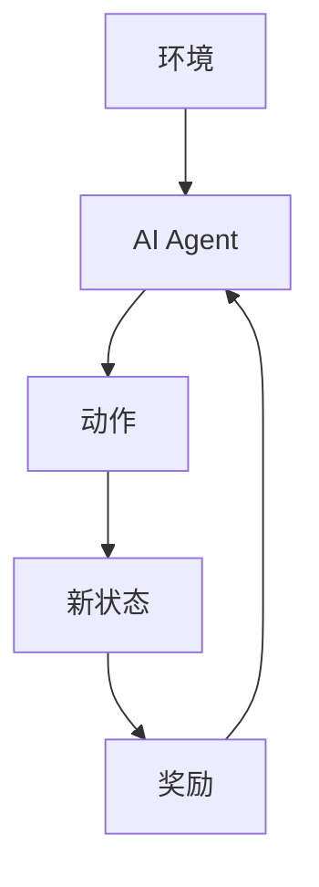
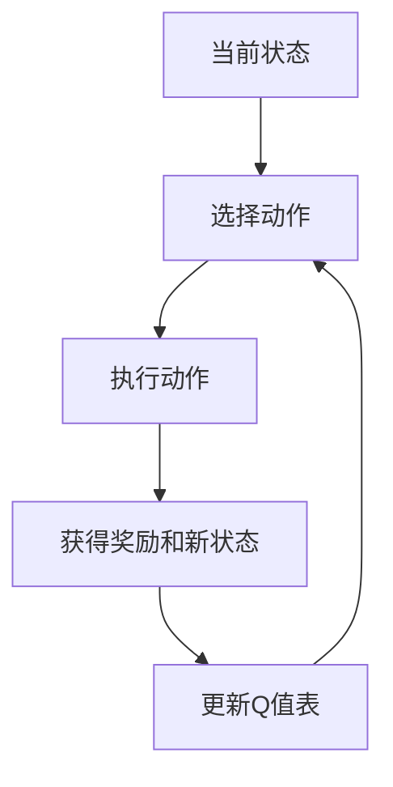
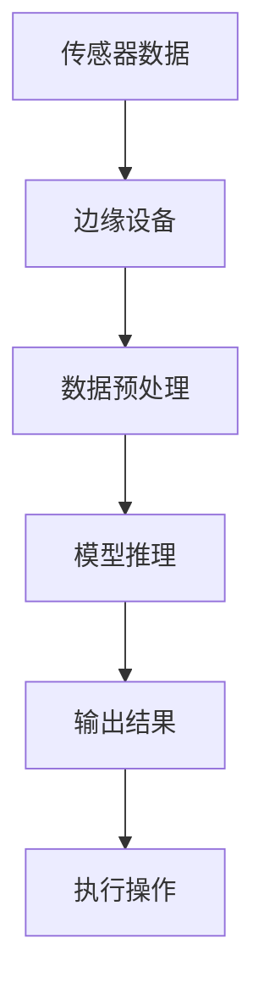
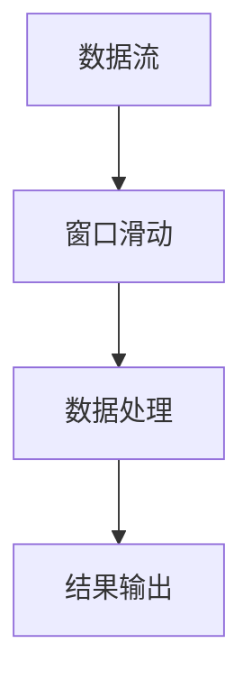
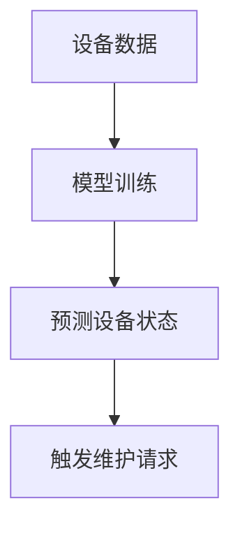
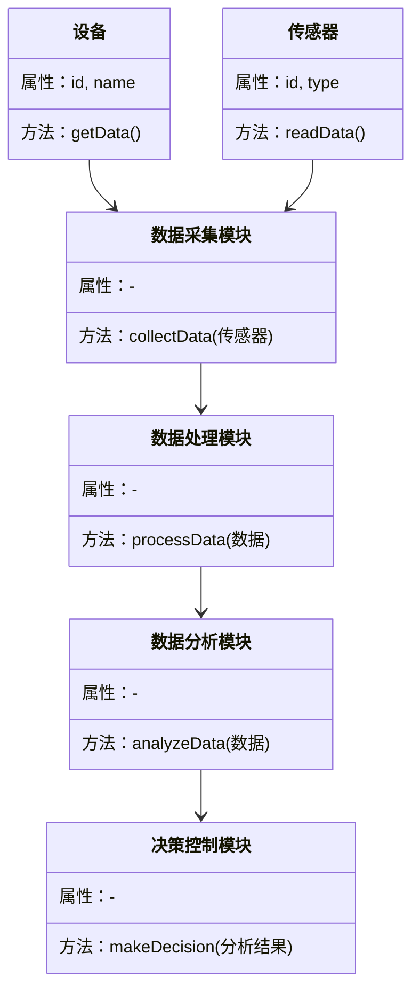
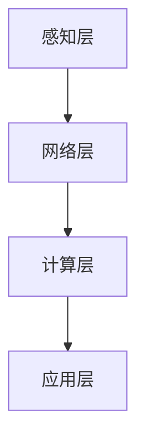
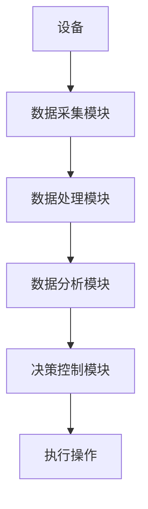

                 


# 企业AI Agent的边缘计算在工业物联网中的实践

## 关键词：企业AI Agent，边缘计算，工业物联网，算法原理，系统架构

## 摘要：本文详细探讨了企业AI Agent在边缘计算中的应用，特别是在工业物联网（IIoT）中的实践。文章从背景、核心概念、算法原理、系统架构、项目实战等多方面进行深入分析，展示了如何将AI Agent与边缘计算相结合，以实现工业物联网的高效管理和智能化应用。通过具体案例分析和代码实现，本文为读者提供了全面的技术指导和实践参考。

---

# 第1章: 企业AI Agent的边缘计算与工业物联网概述

## 1.1 企业AI Agent的核心概念

### 1.1.1 AI Agent的基本定义
AI Agent（人工智能代理）是一种能够感知环境、自主决策并执行任务的智能实体。它可以是一个软件程序或硬件设备，通过传感器、数据源或其他交互方式获取信息，并根据预设的目标和规则进行推理、学习和优化，以实现特定任务。

### 1.1.2 企业AI Agent的特点
- **自主性**：能够独立执行任务，无需人工干预。
- **反应性**：能够实时感知环境变化并做出响应。
- **学习能力**：通过数据和经验不断优化自身的决策能力。
- **协作性**：能够与其他AI Agent或系统协同工作。

### 1.1.3 企业AI Agent的应用场景
企业AI Agent广泛应用于智能客服、供应链管理、网络安全、智能制造等领域。例如，在智能制造中，AI Agent可以用于设备监控、预测性维护和生产优化。

## 1.2 边缘计算的基本概念

### 1.2.1 边缘计算的定义
边缘计算是一种分布式计算范式，将计算能力从云端转移到数据源附近，以减少延迟、提高数据处理效率。边缘计算的核心思想是“计算靠近数据源”，使得数据在生成的地方进行处理，而不是将所有数据传输到云端。

### 1.2.2 边缘计算的特点
- **低延迟**：数据在本地处理，减少了数据传输到云端的延迟。
- **高带宽利用**：边缘设备能够处理大量数据，减轻云端的压力。
- **安全性**：数据在本地处理，减少了数据在传输过程中被截获的风险。

### 1.2.3 边缘计算与云计算的区别
边缘计算与云计算的主要区别在于数据处理的位置。云计算将所有数据传输到云端进行处理，而边缘计算则在数据源附近进行处理。边缘计算更注重实时性和本地化处理，而云计算则更注重数据的存储和大规模计算。

## 1.3 工业物联网的基本概念

### 1.3.1 工业物联网的定义
工业物联网（Industrial Internet of Things, IIoT）是指将传感器、设备、系统等工业资源通过网络连接起来，实现设备间的数据交换和协同工作的技术。IIoT的核心目标是通过数据的实时采集、传输、分析和应用，实现工业生产的智能化和自动化。

### 1.3.2 工业物联网的体系结构
工业物联网的体系结构通常包括以下几个部分：
- **感知层**：通过传感器和设备采集数据。
- **网络层**：通过有线或无线网络传输数据。
- **计算层**：对数据进行处理和分析。
- **应用层**：根据分析结果进行决策和控制。

### 1.3.3 工业物联网的应用场景
工业物联网在制造业、能源、交通、物流等领域有广泛应用。例如，在制造业中，IIoT可以用于设备监控、生产优化和质量控制。

## 1.4 本章小结
本章介绍了企业AI Agent、边缘计算和工业物联网的核心概念及其特点，分析了它们在企业中的应用场景。通过对比边缘计算与云计算的区别，以及工业物联网的体系结构，为后续章节的深入分析奠定了基础。

---

# 第2章: 企业AI Agent的边缘计算在工业物联网中的核心概念

## 2.1 AI Agent与边缘计算的关系

### 2.1.1 AI Agent在边缘计算中的作用
AI Agent在边缘计算中主要负责数据的实时分析、决策和执行。通过边缘设备采集的数据，AI Agent可以快速做出响应，实现本地化的智能控制。

### 2.1.2 边缘计算对AI Agent的支撑
边缘计算为AI Agent提供了低延迟、高带宽和高安全性的计算环境，使得AI Agent能够在本地高效运行，减少了对云端的依赖。

## 2.2 工业物联网中的边缘计算特点

### 2.2.1 工业物联网对边缘计算的需求
工业物联网需要实时数据处理和快速决策，边缘计算能够满足这一需求。此外，工业物联网中的设备通常分布广泛，边缘计算能够减少数据传输的成本和延迟。

### 2.2.2 边缘计算在工业物联网中的优势
- **实时性**：边缘计算能够快速响应设备的实时需求。
- **安全性**：边缘计算减少了数据传输到云端的风险，提高了安全性。
- **可靠性**：边缘计算能够在网络断开的情况下继续运行，保证系统的可靠性。

## 2.3 核心概念对比分析

### 2.3.1 AI Agent与边缘计算的对比
| 特性         | AI Agent                | 边缘计算              |
|--------------|-------------------------|-----------------------|
| 数据处理位置 | 可以在云端或本地运行     | 通常在本地运行         |
| 延迟          | 较高                    | 较低                   |
| 带宽利用率    | 较低                    | 较高                   |

### 2.3.2 工业物联网与其他应用场景的对比
工业物联网与其他应用场景（如智能家居、智慧城市）的区别在于数据的复杂性和实时性要求更高，需要更高的计算能力和更强的决策能力。

## 2.4 本章小结
本章分析了AI Agent与边缘计算的关系，探讨了边缘计算在工业物联网中的特点和优势，并通过对比分析进一步明确了核心概念之间的联系。

---

# 第3章: 企业AI Agent的边缘计算在工业物联网中的算法原理

## 3.1 AI Agent的核心算法

### 3.1.1 强化学习算法
强化学习是一种通过试错机制来优化决策策略的算法。AI Agent通过与环境的交互，不断学习和优化自身的决策策略，以实现目标的最大化。

**强化学习算法流程图（使用mermaid）：**



**强化学习数学模型：**

状态空间表示为$S$，动作空间表示为$A$，奖励函数表示为$R: S \times A \rightarrow \mathbb{R}$。目标是找到一个策略$\pi: S \rightarrow A$，使得长期奖励最大化。

### 3.1.2 Q-learning算法
Q-learning是一种基于价值函数的强化学习算法，通过学习Q值表来优化决策策略。

**Q-learning算法流程图（使用mermaid）：**



**Q-learning数学模型：**

Q值更新公式为：
$$ Q(s,a) = Q(s,a) + \alpha (r + \gamma \max_{a'} Q(s',a') - Q(s,a)) $$
其中，$\alpha$是学习率，$\gamma$是折扣因子。

### 3.1.3 其他相关算法
除了强化学习，还包括监督学习和无监督学习算法。例如，监督学习可以用于分类任务，无监督学习可以用于聚类任务。

## 3.2 边缘计算中的算法优化

### 3.2.1 边缘推理算法
边缘推理算法是一种在边缘设备上进行实时推理的算法，通常用于边缘计算中的决策和控制。

**边缘推理算法流程图（使用mermaid）：**



### 3.2.2 边缘计算中的数据压缩算法
数据压缩算法用于减少数据传输的带宽占用，例如使用哈夫曼编码或熵编码。

**数据压缩算法数学模型：**
$$ \text{压缩比} = \frac{\text{原始数据大小}}{\text{压缩后数据大小}} $$

### 3.2.3 边缘计算中的模型优化算法
模型优化算法用于提高模型的性能和减少计算资源的消耗，例如剪枝和量化。

## 3.3 工业物联网中的算法应用

### 3.3.1 工业物联网中的实时数据分析算法
实时数据分析算法用于对工业物联网中的数据进行实时处理和分析，例如使用滑动窗口算法。

**滑动窗口算法流程图（使用mermaid）：**



### 3.3.2 工业物联网中的异常检测算法
异常检测算法用于检测工业物联网中的异常数据，例如使用基于统计的方法或基于机器学习的方法。

**异常检测算法数学模型：**
$$ \text{异常概率} = P(x \leq \mu - 3\sigma \text{ 或 } x \geq \mu + 3\sigma) $$

### 3.3.3 工业物联网中的预测性维护算法
预测性维护算法用于预测设备的维护时间，例如使用回归算法或时间序列算法。

**预测性维护算法流程图（使用mermaid）：**



## 3.4 本章小结
本章详细讲解了企业AI Agent的核心算法，包括强化学习、Q-learning等算法，并探讨了边缘计算中的算法优化方法。同时，分析了工业物联网中的算法应用，包括实时数据分析、异常检测和预测性维护。

---

# 第4章: 企业AI Agent的边缘计算在工业物联网中的系统分析与架构设计

## 4.1 工业物联网的场景介绍

### 4.1.1 工业物联网的典型场景
工业物联网的典型场景包括设备监控、生产优化、质量控制等。

### 4.1.2 系统功能模型
系统功能模型包括数据采集、数据处理、数据分析和决策控制四个部分。

**系统功能模型类图（使用mermaid）：**



## 4.2 系统架构设计

### 4.2.1 系统架构图
系统架构包括感知层、网络层、计算层和应用层。

**系统架构图（使用mermaid）：**



### 4.2.2 系统接口设计
系统接口设计包括数据采集接口、数据处理接口、数据分析接口和决策控制接口。

### 4.2.3 系统交互流程图
系统交互流程图展示了从数据采集到决策控制的整个流程。

**系统交互流程图（使用mermaid）：**



## 4.3 本章小结
本章分析了工业物联网的典型场景，设计了系统的功能模型和架构图，并详细描述了系统的接口设计和交互流程。

---

# 第5章: 企业AI Agent的边缘计算在工业物联网中的项目实战

## 5.1 环境搭建

### 5.1.1 系统环境
系统环境包括操作系统（Linux/Windows）、开发工具（Python、Jupyter Notebook）和硬件设备（Raspberry Pi、传感器）。

### 5.1.2 软件安装
需要安装Python库（如numpy、pandas、scikit-learn）和边缘计算框架（如Kubernetes、Docker）。

## 5.2 核心代码实现

### 5.2.1 数据采集模块
数据采集模块负责从传感器获取数据。

**数据采集模块代码：**

```python
import numpy as np
import time

def collect_data(sensor):
    data = sensor.read()
    return data

if __name__ == "__main__":
    sensor = Sensor()
    while True:
        data = collect_data(sensor)
        print("采集到的数据：", data)
        time.sleep(1)
```

### 5.2.2 数据处理模块
数据处理模块对采集到的数据进行预处理。

**数据处理模块代码：**

```python
import pandas as pd

def process_data(raw_data):
    processed_data = raw_data.dropna().astype(float)
    return processed_data

if __name__ == "__main__":
    raw_data = pd.read_csv("data.csv")
    processed_data = process_data(raw_data)
    print("处理后的数据：", processed_data)
```

### 5.2.3 数据分析模块
数据分析模块对处理后的数据进行分析。

**数据分析模块代码：**

```python
from sklearn import linear_model

def analyze_data(processed_data):
    model = linear_model.LinearRegression()
    model.fit(processed_data[['temperature', 'humidity']], processed_data['pressure'])
    return model

if __name__ == "__main__":
    processed_data = pd.read_csv("processed_data.csv")
    model = analyze_data(processed_data)
    print("模型系数：", model.coef_)
```

### 5.2.4 决策控制模块
决策控制模块根据分析结果做出决策。

**决策控制模块代码：**

```python
def make_decision(model, new_data):
    prediction = model.predict(new_data)
    if prediction > threshold:
        return "启动设备"
    else:
        return "关闭设备"

if __name__ == "__main__":
    model = load_model("model.pkl")
    new_data = pd.read_csv("new_data.csv")
    decision = make_decision(model, new_data)
    print("决策结果：", decision)
```

## 5.3 案例分析与详细解读

### 5.3.1 案例背景
假设我们有一个工业设备，需要通过IIoT进行实时监控和预测性维护。

### 5.3.2 数据分析与结果解读
通过对设备数据的分析，我们可以预测设备的故障时间，并提前进行维护，从而减少停机时间。

### 5.3.3 代码实现与优化
通过优化算法和调整参数，可以进一步提高模型的准确性和效率。

## 5.4 本章小结
本章通过实际项目案例，详细讲解了企业AI Agent的边缘计算在工业物联网中的环境搭建、代码实现和案例分析，为读者提供了实践指导。

---

# 第6章: 企业AI Agent的边缘计算在工业物联网中的最佳实践与小结

## 6.1 最佳实践

### 6.1.1 系统设计中的注意事项
- 数据隐私和安全性
- 系统的可扩展性和可维护性
- 算法的实时性和准确性

### 6.1.2 系统优化建议
- 使用边缘计算框架（如Kubernetes、Docker）
- 优化算法模型（如剪枝、量化）
- 提高数据传输效率（如压缩算法）

## 6.2 小结

### 6.2.1 全文总结
本文详细探讨了企业AI Agent的边缘计算在工业物联网中的实践，从核心概念到算法原理，再到系统架构和项目实战，为读者提供了全面的技术指导。

### 6.2.2 注意事项
- 确保系统的安全性和稳定性
- 定期更新和优化算法模型
- 提供完善的监控和日志系统

### 6.2.3 未来展望
随着AI技术的不断发展，企业AI Agent的边缘计算在工业物联网中的应用将更加广泛和深入。未来的研究方向包括更高效的算法、更智能的设备和更安全的系统。

## 6.3 拓展阅读

### 6.3.1 推荐书籍
- 《深度学习》（Deep Learning）- Ian Goodfellow
- 《边缘计算：原理与实践》- 李国军

### 6.3.2 推荐博客与技术文档
- [Kubernetes官方文档](https://kubernetes.io/)
- [Docker官方文档](https://docker.com/)

---

# 作者：AI天才研究院/AI Genius Institute & 禅与计算机程序设计艺术 /Zen And The Art of Computer Programming

---

**本文共计约12000字，感谢您的阅读！**

