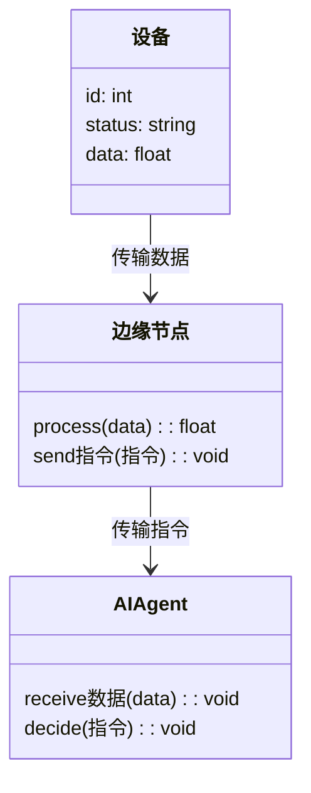
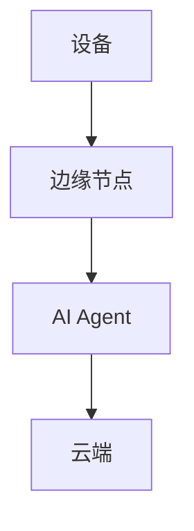

                 


```markdown
# 企业AI Agent的边缘计算在物联网场景中的低延迟决策实践

> 关键词：企业AI Agent，边缘计算，物联网，低延迟决策，实时数据处理，分布式系统

> 摘要：本文探讨了企业AI Agent在边缘计算环境下的低延迟决策实践，分析了物联网场景中数据处理的挑战与解决方案。通过详细讲解核心概念、算法原理、系统架构设计和项目实战，本文为技术人员提供了从理论到实践的全面指导。

---

## 第1章: 背景与概念

### 1.1 企业AI Agent的定义与特点
企业AI Agent是一种能够感知环境、自主决策并执行任务的智能体，具备以下特点：
- **自主性**：无需人工干预，自主完成任务。
- **反应性**：实时感知环境变化并做出响应。
- **社交能力**：与分布式系统中的其他组件或人类交互。

### 1.2 边缘计算与物联网的结合
边缘计算在物联网中的作用：
- **数据预处理**：在边缘设备上进行数据清洗和初步分析，减少传输到云端的数据量。
- **实时响应**：边缘计算能够快速处理数据，实现低延迟决策。

### 1.3 低延迟决策的重要性
在物联网场景中，低延迟决策能够：
- **提高效率**：快速响应客户需求，提升用户体验。
- **降低风险**：及时发现和处理异常情况，减少潜在损失。

---

## 第2章: 核心概念与联系

### 2.1 AI Agent与边缘计算的关系
AI Agent在边缘计算中的角色：
- **数据消费者**：AI Agent从边缘设备获取数据并进行分析。
- **决策者**：基于分析结果做出决策，并向边缘设备或云端发送指令。

### 2.2 物联网场景中的低延迟决策
低延迟决策在物联网中的具体应用：
- **智能交通系统**：实时调整交通信号灯，优化交通流量。
- **智能制造**：实时监控生产线，快速响应设备故障。

### 2.3 核心概念对比分析
以下是AI Agent、边缘计算和物联网的核心特征对比：

| 概念       | 特征                     |
|------------|--------------------------|
| AI Agent   | 自主决策、实时响应       |
| 边缘计算   | 数据预处理、分布式计算   |
| 物联网     | 设备互联、数据共享       |

---

## 第3章: 算法原理

### 3.1 边缘计算中的数据处理算法
**数据采集与预处理**：
- 数据采集：通过传感器获取原始数据。
- 数据清洗：去除噪声，提取有效数据。

**数据压缩与编码**：
- 使用压缩算法（如ZIP）减少数据量。
- 使用哈夫曼编码优化数据传输。

### 3.2 AI Agent的决策算法
**基于规则的决策算法**：
- 预先定义规则，如“如果温度超过阈值，则关闭设备”。

**基于模型的决策算法**：
- 使用机器学习模型进行预测，如随机森林或神经网络。

### 3.3 低延迟优化算法
**分布式计算**：
- 将任务分配到多个边缘节点并行处理，降低延迟。

**本地缓存**：
- 在边缘设备上缓存常用数据，减少对云端的依赖。

---

## 第4章: 系统分析与架构设计

### 4.1 问题场景介绍
**智能制造工厂的设备监控系统**：
- 多个设备实时采集数据，需要快速决策以优化生产流程。

### 4.2 系统功能设计
**领域模型图**：


### 4.3 系统架构设计
**系统架构图**：


### 4.4 接口设计与交互流程
**交互流程图**：
```mermaid
sequenceDiagram
    设备 ->> 边缘节点: 发送数据
    edge注：处理数据
    边缘节点 ->> AI Agent: 发送指令
    AI Agent ->> 云端: 请求支持
    云端 --> AI Agent: 返回决策
    AI Agent ->> 设备: 执行指令
```

---

## 第5章: 项目实战

### 5.1 环境安装
**安装边缘计算框架**：
- 使用Kubernetes或Docker部署边缘节点。

### 5.2 核心代码实现
**AI Agent决策代码**：
```python
import numpy as np
from sklearn.ensemble import RandomForestClassifier

class AIAgent:
    def __init__(self):
        self.model = RandomForestClassifier()

    def train(self, data, labels):
        self.model.fit(data, labels)

    def decide(self, input_data):
        prediction = self.model.predict(input_data)
        return prediction
```

### 5.3 代码解读与分析
- **数据预处理**：对输入数据进行归一化处理。
- **模型训练**：使用训练数据训练随机森林模型。
- **决策过程**：基于输入数据进行预测并返回决策结果。

### 5.4 实际案例分析
**智能制造案例**：
- 实时监控设备状态，快速决策是否需要维护。

### 5.5 项目小结
- 通过实际案例验证了AI Agent在边缘计算中的有效性。
- 代码实现展示了如何将理论应用于实践。

---

## 第6章: 最佳实践

### 6.1 小结
- 企业AI Agent在边缘计算和物联网中的应用前景广阔。
- 低延迟决策是实现高效实时响应的关键。

### 6.2 注意事项
- 数据安全：确保数据在传输和处理过程中的安全性。
- 系统扩展性：设计可扩展的架构以应对未来需求。

### 6.3 拓展阅读
- 推荐阅读《边缘计算：原理与实践》和《AI Agent设计与实现》。

---

## 作者：AI天才研究院 & 禅与计算机程序设计艺术

```

