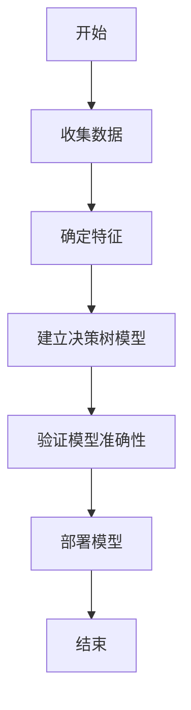
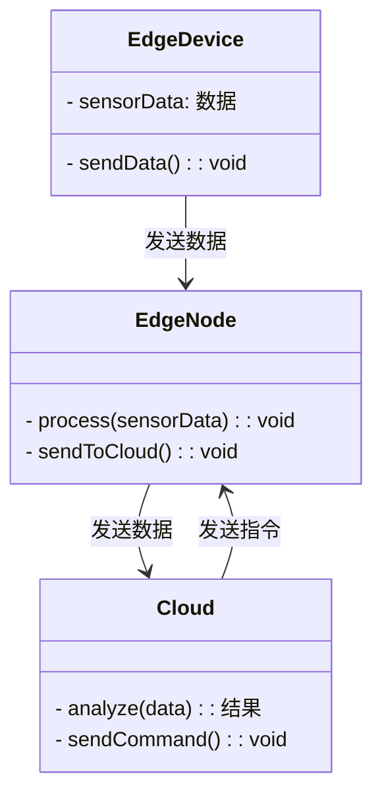
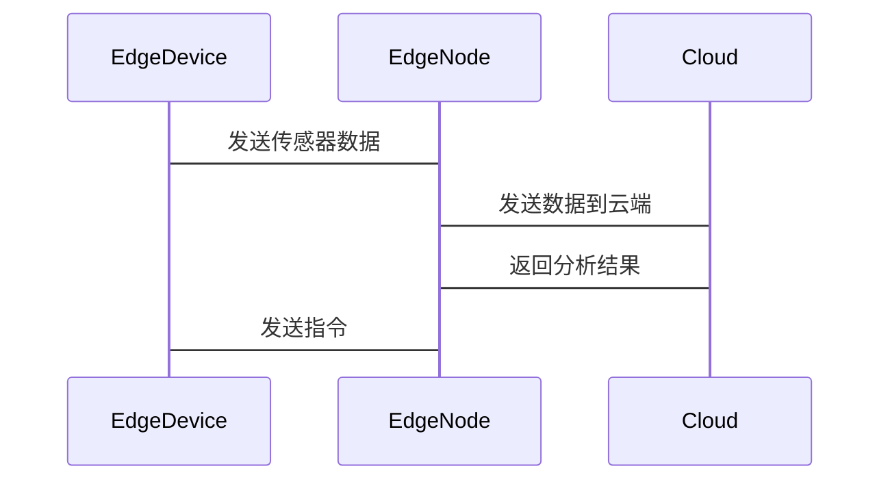

                 


# 企业AI Agent的边缘计算在物联网场景中的实践

## 关键词：AI Agent，边缘计算，物联网，算法原理，系统架构设计，项目实战

## 摘要：本文详细探讨了企业AI Agent与边缘计算在物联网场景中的结合与应用。通过分析AI Agent的决策机制、边缘计算的特点，结合具体案例，阐述了在物联网环境下的系统架构设计、算法实现及项目实战。本文旨在为技术从业者提供理论支持和实践指导，助力企业在物联网场景中高效应用AI Agent与边缘计算技术。

---

## 第一部分：企业AI Agent与边缘计算的背景与概述

### 1.1 AI Agent的基本概念

#### 1.1.1 AI Agent的定义与特点

AI Agent（人工智能代理）是一种能够感知环境、自主决策并执行任务的智能实体。它具备以下特点：

- **自主性**：能够在没有外部干预的情况下独立运作。
- **反应性**：能够实时感知环境变化并做出响应。
- **目标导向性**：通过设定目标，优化决策过程以实现目标。
- **学习能力**：能够通过数据学习和优化自身行为。

AI Agent在物联网中的应用广泛，例如智能家居中的智能音箱、工业物联网中的设备监控系统等。

---

### 1.2 边缘计算的概念与特点

边缘计算是指在靠近数据源的地方进行数据处理和分析，而非将所有数据上传到云端。其特点包括：

- **低延迟**：由于数据处理在边缘进行，减少了数据传输到云端的时间。
- **高实时性**：能够快速响应实时事件。
- **数据隐私性**：边缘计算可以在本地处理数据，减少数据外泄的风险。
- **分布式架构**：边缘设备可以独立运行，同时与其他设备协作。

边缘计算在物联网中的应用场景包括智能工厂、智慧城市、智能医疗等。

---

### 1.3 物联网场景中的AI Agent与边缘计算

在物联网场景中，AI Agent与边缘计算的结合能够实现更加高效和智能的设备管理。通过边缘计算，AI Agent可以在本地处理数据，快速做出决策，从而减少对云端的依赖。这种结合在工业物联网（IIoT）中尤为重要，例如预测性维护、设备故障检测等场景。

---

## 第二部分：AI Agent与边缘计算的核心概念与原理

### 2.1 AI Agent的原理

#### 2.1.1 决策树算法

决策树是一种常用的AI Agent决策算法，通过构建树状结构来模拟决策过程。以下是一个简单的决策树示例：

- **根节点**：问题是什么？
  - 如果是温度过高，则进入“降温”分支。
  - 如果是温度过低，则进入“加热”分支。
  - 如果是正常温度，则继续监测。

决策树的构建过程如下：

1. 收集数据。
2. 确定特征。
3. 建立决策树模型。
4. 验证模型准确性。
5. 部署模型。

使用决策树算法的步骤可以用以下mermaid流程图表示：



---

### 2.2 边缘计算的原理

边缘计算的核心在于将数据处理能力推向数据源，减少数据传输和云端处理的负担。边缘计算的处理流程如下：

1. 数据采集：通过传感器或其他设备采集数据。
2. 数据预处理：对采集到的数据进行清洗和转换。
3. 数据分析：在边缘节点进行数据处理和分析。
4. 决策与反馈：根据分析结果做出决策，并将结果反馈给设备或系统。

---

### 2.3 核心概念对比与应用案例

以下是AI Agent与边缘计算在物联网中的对比：

| 特性       | AI Agent                          | 边缘计算                          |
|------------|-----------------------------------|-----------------------------------|
| 数据处理位置 | 中央或边缘                        | 边缘                              |
| 响应速度   | 较慢（依赖云端）                 | 较快（本地处理）                  |
| 适用场景   | 需要全局决策的场景                | 需要快速响应的场景                |

---

## 第三部分：AI Agent的算法原理与数学模型

### 3.1 算法原理

AI Agent的决策过程可以通过多种算法实现，其中贝叶斯网络是一种常用的概率推理方法。贝叶斯网络通过概率公式来计算事件发生的可能性。

#### 3.1.1 贝叶斯定理

贝叶斯定理的公式为：

$$ P(B|A) = \frac{P(A|B) \cdot P(B)}{P(A)} $$

其中：
- \( P(B|A) \)：在A发生的条件下，B发生的概率。
- \( P(A|B) \)：在B发生的条件下，A发生的概率。
- \( P(B) \)：B发生的先验概率。
- \( P(A) \)：A发生的先验概率。

---

### 3.2 数学模型与公式

AI Agent的决策过程可以通过以下数学模型表示：

$$ \text{决策} = \argmax_{i} P(\text{选择} = i | \text{输入数据}) $$

其中，\( P \) 表示概率，\( \argmax \) 表示选择概率最大的选项。

---

## 第四部分：系统架构与设计

### 4.1 系统架构设计

在物联网场景中，AI Agent与边缘计算的系统架构可以分为以下几个部分：

#### 4.1.1 类图设计

以下是系统架构的类图设计：



---

### 4.2 接口与交互设计

以下是系统交互的序列图：



---

## 第五部分：项目实战

### 5.1 环境安装与配置

在实际项目中，我们需要安装以下工具和库：

- Python 3.8+
- TensorFlow 2.0+
- scikit-learn 0.24+
- Flask 2.0+
- MQTT库（如paho-mqtt）

---

### 5.2 核心代码实现

以下是AI Agent的决策树算法实现代码：

```python
from sklearn.tree import DecisionTreeClassifier
from sklearn.datasets import make_classification
from sklearn.model_selection import train_test_split

# 创建数据集
X, y = make_classification(n_samples=100, n_features=2, n_classes=2, random_state=42)

# 划分训练集和测试集
X_train, X_test, y_train, y_test = train_test_split(X, y, test_size=0.2, random_state=42)

# 初始化模型
model = DecisionTreeClassifier()

# 训练模型
model.fit(X_train, y_train)

# 预测结果
y_pred = model.predict(X_test)

# 输出准确率
print(f"Accuracy: {model.score(X_test, y_test)}")
```

---

## 第六部分：总结与展望

### 6.1 总结

本文详细探讨了企业AI Agent与边缘计算在物联网场景中的结合与应用，通过理论分析和实际案例，展示了如何在物联网环境中高效部署和应用这些技术。

---

### 6.2 最佳实践与建议

- 在实际项目中，建议优先选择低延迟、高实时性的边缘计算方案。
- 定期对AI Agent进行模型更新，以保持其决策能力。
- 注意数据隐私和安全问题，确保数据在边缘处理时不被泄露。

---

### 6.3 未来发展趋势

随着5G和AI技术的不断发展，AI Agent与边缘计算在物联网中的应用将更加广泛。未来，可能会出现更智能的边缘设备和更高效的AI算法，进一步推动物联网技术的发展。

---

## 作者：AI天才研究院/AI Genius Institute & 禅与计算机程序设计艺术 /Zen And The Art of Computer Programming

---

本文通过系统化的分析和实践，深入探讨了企业AI Agent与边缘计算在物联网中的应用，旨在为企业技术从业者提供理论支持和实践指导。

