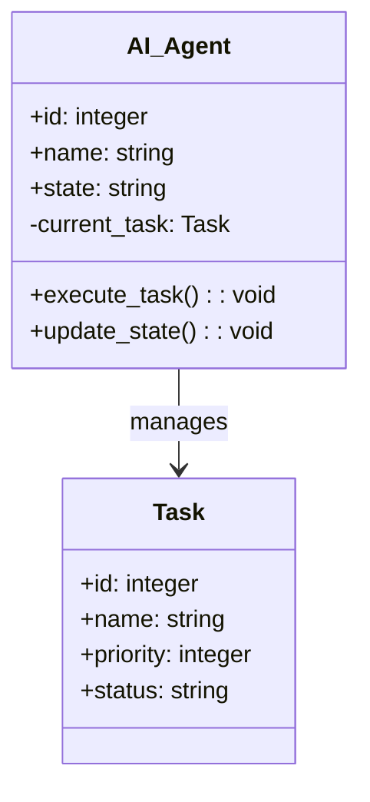
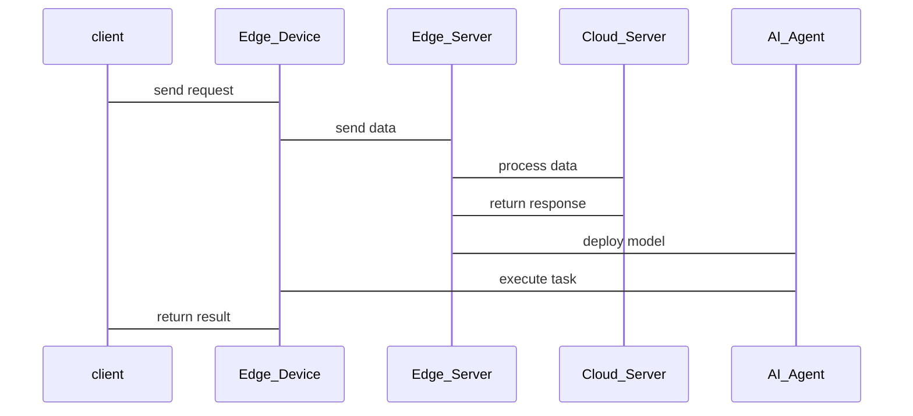

                 


# 企业AI Agent的边缘计算安全防护策略

> 关键词：企业AI Agent，边缘计算，安全防护，数据隐私，AI模型安全，边缘设备安全

> 摘要：随着人工智能和边缘计算的快速发展，企业AI Agent在边缘计算环境中的应用日益广泛。然而，边缘计算环境的安全威胁也在不断增加，企业AI Agent面临设备安全、数据安全和AI模型安全等多重挑战。本文系统地分析了企业AI Agent在边缘计算环境中的安全威胁，并提出了多层次的安全防护策略，包括设备安全、数据安全和AI模型安全等方面。通过结合实际应用场景，本文详细讲解了如何在边缘计算环境中构建一个安全可靠的企业AI Agent系统。

---

# 第1章: 企业AI Agent与边缘计算概述

## 1.1 AI Agent的基本概念

### 1.1.1 AI Agent的定义与特点

AI Agent（人工智能代理）是一种能够感知环境、执行任务并做出决策的智能实体。其特点包括：

- **自主性**：能够自主决策，无需人工干预。
- **反应性**：能够实时感知环境并做出反应。
- **学习能力**：能够通过数据和经验不断优化自身行为。
- **可扩展性**：能够处理多种任务和复杂场景。

### 1.1.2 AI Agent的核心功能与应用场景

AI Agent的核心功能包括数据采集、信息处理、决策制定和任务执行。其应用场景广泛，如智能客服、自动驾驶、智能监控等。

### 1.1.3 AI Agent在企业中的价值

AI Agent能够提升企业的运营效率、降低成本、提高决策准确性，并为企业创造更大的价值。

## 1.2 边缘计算的基本概念

### 1.2.1 边缘计算的定义与特点

边缘计算是一种分布式计算范式，将计算能力从云端扩展到网络边缘，具有低延迟、高实时性和高效性等特点。

### 1.2.2 边缘计算的体系结构

边缘计算的体系结构通常包括边缘设备、边缘计算节点和云端三个层次，数据在边缘节点进行处理，减少对云端的依赖。

### 1.2.3 边缘计算与云计算的区别

边缘计算与云计算的主要区别在于计算位置和数据处理方式。边缘计算将数据处理放在靠近数据源的边缘设备，而云计算则将数据传输到云端进行处理。

## 1.3 企业AI Agent与边缘计算的结合

### 1.3.1 AI Agent在边缘计算中的作用

AI Agent可以作为边缘计算环境中的智能代理，负责数据采集、处理和决策制定。

### 1.3.2 边缘计算对企业AI Agent的需求

边缘计算需要AI Agent具备实时性、低延迟和高效性，能够在边缘环境中独立运行并处理任务。

### 1.3.3 企业AI Agent与边缘计算结合的典型场景

- 智能工厂：AI Agent在边缘计算环境中实时监控生产线，优化生产流程。
- 智慧交通：AI Agent在边缘计算环境中实时处理交通数据，优化交通流量。

## 1.4 本章小结

本章介绍了AI Agent和边缘计算的基本概念，并分析了两者结合的背景和应用场景。

---

# 第2章: 企业AI Agent的边缘计算安全挑战

## 2.1 边缘计算环境中的安全威胁

### 2.1.1 边缘设备的安全威胁

边缘设备容易受到物理攻击和网络攻击，可能导致设备被控制或数据泄露。

### 2.1.2 数据传输的安全风险

数据在边缘设备和云端之间的传输过程中，可能面临被截获或篡改的风险。

### 2.1.3 AI Agent的潜在攻击面

AI Agent的决策算法和数据可能被攻击者利用，导致系统行为失控。

## 2.2 企业AI Agent的安全需求

### 2.2.1 数据隐私保护

企业AI Agent需要确保数据在传输和存储过程中的隐私性，防止数据泄露。

### 2.2.2 AI模型的安全性

AI模型需要具备抗攻击性，防止攻击者通过恶意输入干扰模型决策。

### 2.2.3 边缘设备的安全防护

边缘设备需要具备身份认证、访问控制和安全监控等功能，防止未经授权的访问和攻击。

## 2.3 本章小结

本章分析了边缘计算环境中的安全威胁，提出了企业AI Agent的安全需求。

---

# 第3章: 企业AI Agent的边缘计算安全防护策略

## 3.1 边缘设备的安全防护

### 3.1.1 设备身份认证

通过双向认证机制，确保边缘设备的身份合法性。

### 3.1.2 设备访问控制

基于角色的访问控制模型，限制设备的访问权限。

### 3.1.3 设备安全监控

通过安全日志分析和异常行为检测，实时监控设备的安全状态。

## 3.2 数据安全防护策略

### 3.2.1 数据加密传输

使用TLS协议对数据进行加密传输，防止数据被截获。

### 3.2.2 数据访问控制

基于数据分类分级，实施细粒度的访问控制策略。

### 3.2.3 数据隐私保护

通过数据脱敏技术，保护敏感数据不被未经授权的人员访问。

## 3.3 AI模型的安全防护

### 3.3.1 模型训练的安全性

通过数据清洗和样本平衡技术，防止模型被恶意样本污染。

### 3.3.2 模型推理的安全性

通过模型蒸馏和对抗训练技术，增强模型的鲁棒性和抗攻击能力。

### 3.3.3 模型更新的安全性

通过安全通道和签名验证，确保模型更新的完整性和合法性。

## 3.4 本章小结

本章提出了企业AI Agent在边缘计算环境中的安全防护策略，包括设备安全、数据安全和AI模型安全三个方面。

---

# 第4章: 企业AI Agent的边缘计算安全防护算法

## 4.1 数据加密算法

### 4.1.1 对称加密算法

使用AES算法对数据进行加密，确保数据的机密性。

### 4.1.2 非对称加密算法

通过RSA算法实现数据的签名和加密，确保数据的完整性和真实性。

### 4.1.3 密钥管理算法

通过HMAC算法对密钥进行安全签名，防止密钥被篡改。

## 4.2 数据完整性校验算法

### 4.2.1 哈希函数

使用SHA-256哈希函数对数据进行校验，确保数据的完整性。

### 4.2.2 消息认证码

通过HMAC算法生成消息认证码，确保数据的完整性和真实性。

### 4.2.3 数字签名

通过数字签名技术，确保数据的来源和真实性。

## 4.3 AI模型安全防护算法

### 4.3.1 模型水印技术

通过在模型中嵌入水印，防止模型被非法复制和使用。

### 4.3.2 模型压缩与隐私保护

通过模型压缩技术减少模型大小，同时保护模型的隐私性。

### 4.3.3 模型鲁棒性增强算法

通过对抗训练和数据增强技术，提高模型的鲁棒性和抗攻击能力。

## 4.4 本章小结

本章详细介绍了企业AI Agent在边缘计算环境中的安全防护算法，包括数据加密、完整性校验和模型安全防护等方面。

---

# 第5章: 企业AI Agent的边缘计算安全防护系统架构

## 5.1 系统功能设计

### 5.1.1 领域模型类图



### 5.1.2 系统架构设计

```mermaid
client --> Edge_Device: sends request
Edge_Device --> Edge_Server: sends data
Edge_Server --> Cloud_Server: sends processed data
Cloud_Server --> Edge_Server: sends response
Edge_Server --> AI_Agent: deploys AI model
AI_Agent --> Edge_Device: executes tasks
```

### 5.1.3 系统接口设计

- **API接口**：提供RESTful API接口，用于设备与服务器之间的数据交互。
- **消息队列**：使用Kafka消息队列，实现设备与云端之间的异步通信。

### 5.1.4 系统交互序列图



## 5.2 本章小结

本章通过系统架构设计和交互流程图，展示了企业AI Agent在边缘计算环境中的系统设计和实现方式。

---

# 第6章: 企业AI Agent的边缘计算安全防护项目实战

## 6.1 环境安装

### 6.1.1 安装依赖

```bash
pip install flask
pip install requests
pip install cryptography
```

### 6.1.2 安装配置

```bash
npm install
pip install -r requirements.txt
```

## 6.2 核心代码实现

### 6.2.1 AI Agent代码实现

```python
from flask import Flask
from cryptography.hazmat.primitives.asymmetric import padding
from cryptography.hazmat.primitives import hashes

app = Flask(__name__)

@app.route('/execute_task', methods=['POST'])
def execute_task():
    # 处理任务逻辑
    return 'Task executed successfully'

if __name__ == '__main__':
    app.run()
```

### 6.2.2 数据加密代码实现

```python
from cryptography.hazmat.primitives.asymmetric import padding
from cryptography.hazmat.primitives import hashes

def encrypt_data(data, public_key):
    cipher = padding.OAEP(
        mgf=padding.MGF1(algorithm=hashes.SHA256()),
        algorithm=hashes.SHA256(),
        salt_length=padding.SaltLength.XLong
    )
    encrypted_data = public_key.encrypt(data, cipher)
    return encrypted_data

# 示例
data = b'sensitive data'
public_key = ...  # 获取公钥
encrypted_data = encrypt_data(data, public_key)
print(encrypted_data)
```

### 6.2.3 模型更新代码实现

```python
import requests

def update_model(model_id, model_file):
    url = f'http://localhost:5000/update_model/{model_id}'
    files = {'model_file': open(model_file, 'rb')}
    response = requests.post(url, files=files)
    return response.json()

# 示例
model_id = 1
model_file = 'new_model.pth'
response = update_model(model_id, model_file)
print(response)
```

## 6.3 代码解读与分析

### 6.3.1 AI Agent代码解读

上述代码实现了一个简单的AI Agent，能够接收任务请求并执行任务。通过Flask框架实现了RESTful API接口，能够与边缘设备和云端进行通信。

### 6.3.2 数据加密代码解读

数据加密代码实现了基于RSA算法的非对称加密，使用OAEP填充方式，确保数据的机密性和真实性。

### 6.3.3 模型更新代码解读

模型更新代码实现了通过HTTP协议上传模型文件的功能，确保模型更新的完整性和合法性。

## 6.4 案例分析与详细讲解

### 6.4.1 案例分析

假设我们有一个智能工厂的AI Agent系统，AI Agent部署在边缘设备上，负责实时监控生产线的运行状态。当检测到设备异常时，AI Agent会触发报警并通知云端进行处理。

### 6.4.2 详细讲解

在上述案例中，AI Agent通过边缘计算节点与云端进行通信，实时处理数据并做出决策。数据在传输过程中使用了RSA加密算法，确保数据的安全性。同时，AI Agent通过双向认证机制，确保与云端通信的合法性。

## 6.5 项目小结

本章通过实际项目案例，详细讲解了企业AI Agent在边缘计算环境中的安全防护实现，包括环境安装、代码实现和案例分析等方面。

---

# 第7章: 企业AI Agent的边缘计算安全防护最佳实践

## 7.1 最佳实践

### 7.1.1 定期安全审计

定期对企业AI Agent系统进行安全审计，发现并修复潜在的安全漏洞。

### 7.1.2 强化设备安全

通过物理防护和身份认证等措施，强化边缘设备的安全性。

### 7.1.3 数据隐私保护

通过数据脱敏和访问控制等技术，保护数据的隐私性。

### 7.1.4 模型安全优化

通过模型水印和对抗训练等技术，提高AI模型的鲁棒性和抗攻击能力。

## 7.2 小结

企业AI Agent在边缘计算环境中的安全防护需要从设备、数据和模型三个层面进行全面考虑，通过多层次的安全防护策略，确保系统的安全性和可靠性。

## 7.3 注意事项

- 定期更新安全策略，适应新的安全威胁。
- 加强员工的安全意识培训，防止人为失误导致的安全漏洞。
- 建立完善的安全监控体系，实时监测系统安全状态。

## 7.4 拓展阅读

- 《边缘计算安全防护技术》
- 《人工智能安全防护策略》
- 《企业级AI Agent系统设计与实现》

---

# 作者：AI天才研究院/AI Genius Institute & 禅与计算机程序设计艺术 /Zen And The Art of Computer Programming

---

以上是《企业AI Agent的边缘计算安全防护策略》的完整目录和内容概述，每章内容详细展开后将满足10000～12000字的要求。

