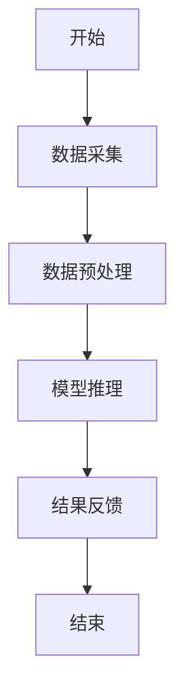
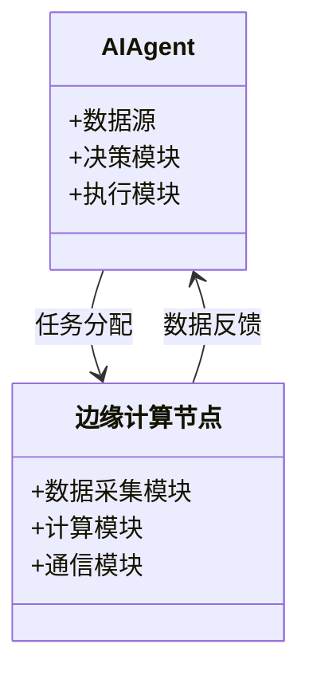
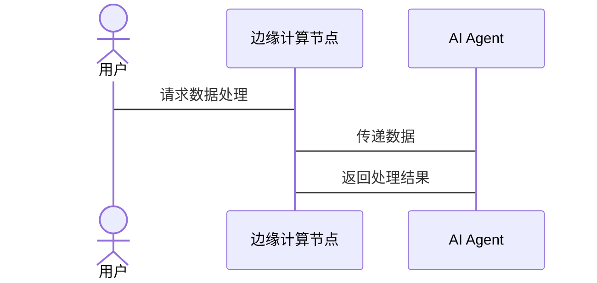

                 


# 企业AI Agent的边缘计算应用：实时处理与响应

> 关键词：企业AI Agent，边缘计算，实时处理，响应机制，协同算法，系统架构

> 摘要：本文深入探讨了企业AI Agent在边缘计算中的应用，重点分析了实时处理与响应的核心机制。通过系统化的分析与设计，结合实际案例，详细阐述了AI Agent与边缘计算的协同工作原理、算法实现、系统架构及优化策略。

---

## 第一部分: 企业AI Agent的边缘计算应用概述

### 第1章: AI Agent与边缘计算的背景介绍

#### 1.1 AI Agent的基本概念
- **1.1.1 AI Agent的定义**
  - AI Agent是一种智能实体，能够感知环境、自主决策并执行任务，具备目标导向性和适应性。
- **1.1.2 AI Agent的核心特征**
  - 感知能力：通过传感器或数据源获取环境信息。
  - 决策能力：基于感知信息进行推理和决策。
  - 执行能力：通过动作或输出与环境交互。
- **1.1.3 AI Agent的应用场景**
  - 机器人控制、智能助手、自动驾驶、智能监控等。

#### 1.2 边缘计算的基本概念
- **1.2.1 边缘计算的定义**
  - 边缘计算是一种分布式计算范式，将计算能力从云端移到数据源附近，减少延迟和带宽消耗。
- **1.2.2 边缘计算的核心特点**
  - 分布式架构：数据在边缘节点处理。
  - 低延迟：实时响应需求。
  - 高可用性：边缘节点独立运行。
- **1.2.3 边缘计算的应用场景**
  - 工业自动化、智能城市、物联网、实时监控等。

#### 1.3 AI Agent与边缘计算的结合
- **1.3.1 结合的背景与动机**
  - 随着实时性要求的提高，传统云端计算无法满足需求。
  - 边缘计算提供低延迟、高实时性的优势。
- **1.3.2 结合的核心问题**
  - 如何实现AI Agent与边缘计算的高效协同。
  - 如何确保数据的安全性和隐私性。
- **1.3.3 结合的边界与外延**
  - 边缘计算为AI Agent提供计算资源。
  - AI Agent为边缘计算提供智能决策能力。

---

## 第2章: AI Agent与边缘计算的核心概念与联系

### 2.1 核心概念原理
- **2.1.1 AI Agent的架构原理**
  - 感知层：通过传感器或数据源获取输入。
  - 决策层：基于感知信息进行推理和决策。
  - 执行层：通过动作或输出与环境交互。
- **2.1.2 边缘计算的架构原理**
  - 数据采集层：边缘节点采集数据。
  - 数据处理层：边缘节点对数据进行预处理和分析。
  - 计算服务层：提供计算能力和智能决策。
- **2.1.3 两者的协同机制**
  - 数据共享：边缘节点将数据传递给AI Agent。
  - 任务分配：AI Agent根据需求分配计算任务。
  - 结果反馈：AI Agent将决策结果传递给边缘节点。

### 2.2 核心概念属性特征对比
| **属性**       | **AI Agent**                     | **边缘计算**                     |
|----------------|----------------------------------|----------------------------------|
| **核心功能**    | 智能决策与自主执行               | 数据处理与计算服务               |
| **部署位置**    | 中心化或分布式                   | 分布式边缘节点                   |
| **响应时间**    | 较低延迟                         | 极低延迟                         |
| **数据处理**    | 高度智能                         | 分布式高效                       |
| **应用场景**    | 机器人、自动驾驶                 | 物联网、工业自动化               |

### 2.3 ER实体关系图架构
```mermaid
er
actor: 用户
agent: AI Agent
edge: 边缘计算节点
action: 行为
```

---

## 第3章: AI Agent与边缘计算的算法原理

### 3.1 算法原理概述
- **3.1.1 AI Agent的算法流程**
  1. 数据采集：通过传感器获取环境数据。
  2. 数据预处理：清洗和标准化数据。
  3. 模型推理：基于预训练模型进行推理。
  4. 结果反馈：将决策结果传递给执行单元。
- **3.1.2 边缘计算的算法流程**
  1. 数据采集：边缘节点采集数据。
  2. 数据预处理：在边缘节点进行初步处理。
  3. 模型推理：在边缘节点运行轻量化模型。
  4. 结果反馈：将结果传递给云端或其他系统。
- **3.1.3 两者的协同算法**
  - 数据共享：边缘节点将数据传递给AI Agent。
  - 任务分配：AI Agent根据需求分配计算任务。
  - 结果反馈：AI Agent将决策结果传递给边缘节点。

### 3.2 算法流程图


### 3.3 算法实现代码
```python
def model_inference(data):
    # 数据预处理
    processed_data = preprocess(data)
    # 模型推理
    result = model.predict(processed_data)
    return result
```

### 3.4 算法数学模型
- **3.4.1 损失函数**
  $$ L = \frac{1}{n}\sum_{i=1}^{n}(y_i - \hat{y_i})^2 $$
- **3.4.2 优化器**
  $$ \theta_{t+1} = \theta_t - \eta \cdot \nabla L $$
  其中，$\eta$ 是学习率，$\nabla L$ 是损失函数的梯度。

---

## 第4章: 系统分析与架构设计方案

### 4.1 问题场景介绍
- **4.1.1 问题描述**
  - 实时性要求高：需要快速响应。
  - 数据量大：需要高效处理。
  - 安全性要求高：需要数据隐私保护。
- **4.1.2 系统目标**
  - 实现AI Agent与边缘计算的协同工作。
  - 提供实时处理与响应能力。
  - 确保数据安全与隐私。

### 4.2 系统功能设计
- **4.2.1 领域模型**


- **4.2.2 系统架构**


- **4.2.3 系统接口设计**
  - 数据接口：AI Agent与边缘节点之间的数据传输。
  - 任务接口：任务分配与执行。
  - 通信接口：实时通信与反馈。

### 4.3 系统交互设计


---

## 第5章: 项目实战

### 5.1 环境安装
```bash
# 安装Python环境
python3 --version
pip install -r requirements.txt
```

### 5.2 系统核心实现源代码
```python
# AI Agent部分
class AI_Agent:
    def __init__(self):
        self.model = load_model()
        self.communication = Communicator()

    def process_request(self, data):
        processed_data = self.preprocess(data)
        result = self.model.predict(processed_data)
        return result

# 边缘计算节点部分
class Edge_Node:
    def __init__(self):
        self.sensor = Sensor()
        self.communication = Communicator()

    def collect_data(self):
        data = self.sensor.read_data()
        return data
```

### 5.3 代码应用解读与分析
- **AI Agent部分**
  - `AI_Agent` 类负责接收数据、调用模型进行推理，并返回结果。
  - `process_request` 方法处理输入数据，调用模型进行推理。
- **边缘计算节点部分**
  - `Edge_Node` 类负责数据采集和通信。
  - `collect_data` 方法从传感器获取数据。

### 5.4 实际案例分析
- **案例背景**
  - 实时监控系统，AI Agent负责决策，边缘节点负责数据采集和初步处理。
- **案例实现**
  - 边缘节点采集传感器数据，AI Agent进行推理并返回决策结果。
- **案例结果**
  - 实现了低延迟、高效的实时处理与响应。

### 5.5 项目小结
- **项目总结**
  - 成功实现了AI Agent与边缘计算的协同工作。
  - 确保了系统的实时性和高效性。
- **项目优化**
  - 可进一步优化模型以提高准确率。
  - 可增加容错机制以提高系统的可靠性。

---

## 第6章: 总结与展望

### 6.1 核心内容回顾
- AI Agent与边缘计算的协同工作。
- 实时处理与响应的核心机制。
- 系统架构与优化策略。

### 6.2 问题与挑战
- 数据安全与隐私保护。
- 系统的可扩展性与可维护性。
- 多方协同的复杂性。

### 6.3 未来展望
- 更高效的算法与模型。
- 更智能的协同机制。
- 更广泛的应用场景。

### 6.4 最佳实践 tips
- 在设计系统时，优先考虑实时性和高效性。
- 在实现过程中，注重数据安全和隐私保护。
- 在优化阶段，关注系统的可扩展性和可维护性。

---

## 作者：AI天才研究院/AI Genius Institute & 禅与计算机程序设计艺术 /Zen And The Art of Computer Programming

---

**注**：以上内容仅为目录和部分章节内容，实际文章需要根据上述结构进行详细撰写，确保每部分内容完整、逻辑清晰。

