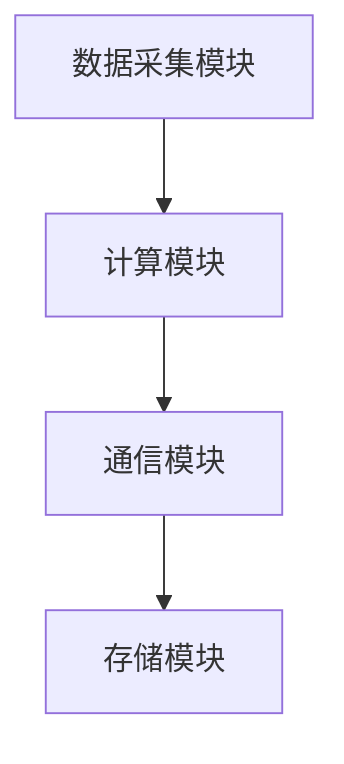
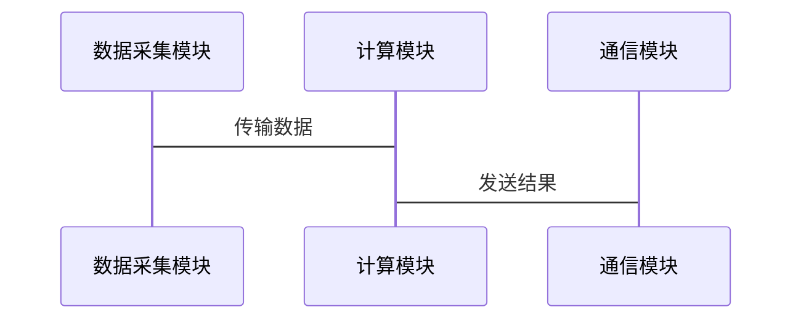

                 


# 企业AI Agent的边缘计算应用：提升响应速度

> 关键词：边缘计算，AI Agent，响应速度，实时决策，数据处理，系统架构

> 摘要：本文深入探讨了企业AI Agent在边缘计算中的应用，分析了其如何通过边缘计算技术提升企业响应速度。文章从边缘计算与AI Agent的基本概念出发，详细讲解了AI Agent在边缘计算中的应用场景、算法原理、系统架构设计，并通过实际项目案例展示了其在提升企业响应速度方面的巨大潜力。最后，本文总结了AI Agent在边缘计算应用中的最佳实践和未来发展趋势。

---

## 第1章：边缘计算与AI Agent概述

### 1.1 边缘计算的发展背景

#### 1.1.1 边缘计算的起源与演进
边缘计算是一种分布式计算范式，起源于对云计算的补充与优化。随着物联网（IoT）和实时处理需求的增加，边缘计算逐渐从概念走向实际应用。边缘计算的核心思想是将计算能力从中心服务器移动到数据生成的边缘设备，减少数据传输延迟，提升实时响应能力。

#### 1.1.2 AI Agent的基本概念
AI Agent（人工智能代理）是一种能够感知环境、自主决策并执行任务的智能实体。AI Agent可以是软件程序，也可以是嵌入式硬件设备，其核心功能包括数据收集、分析、决策和执行。

#### 1.1.3 企业响应速度的重要性
在企业运营中，响应速度是衡量效率的重要指标。通过边缘计算与AI Agent的结合，企业能够实现更快的数据处理和决策，从而在市场竞争中占据优势。

### 1.2 边缘计算与AI Agent的结合

#### 1.2.1 边缘计算的优势
边缘计算具有低延迟、高实时性和数据隐私保护的特点，能够满足企业对快速响应的需求。

#### 1.2.2 AI Agent的核心功能
AI Agent在边缘计算中的核心功能包括数据采集、实时分析、自主决策和任务执行。

#### 1.2.3 提升企业响应速度的关键因素
通过边缘计算与AI Agent的结合，企业可以在边缘端实现数据的实时处理和决策，显著提升响应速度。

---

## 第2章：边缘计算的体系结构与技术特点

### 2.1 边缘计算的体系结构

#### 2.1.1 边缘计算的分层架构
边缘计算通常采用分层架构，包括边缘设备层、边缘计算层和云端层。数据在边缘设备层生成，经过边缘计算层处理后，必要时上传至云端进行进一步分析。

#### 2.1.2 边缘节点的功能模块
边缘节点通常包括数据采集模块、计算模块、通信模块和存储模块。这些模块协同工作，实现数据的采集、处理和传输。

#### 2.1.3 边缘计算与云计算的关系
边缘计算与云计算是互补关系，边缘计算负责实时数据处理，云计算负责大规模数据存储和深度分析。

### 2.2 AI Agent的基本原理

#### 2.2.1 AI Agent的定义与分类
AI Agent可以根据功能、智能水平和应用场景进行分类。常见的分类包括基于规则的AI Agent、基于机器学习的AI Agent和基于知识图谱的AI Agent。

#### 2.2.2 AI Agent的核心功能模块
AI Agent的核心功能模块包括感知模块、推理模块、决策模块和执行模块。

#### 2.2.3 AI Agent与传统软件的区别
AI Agent具有自主性、反应性和社会性，能够根据环境变化动态调整行为，而传统软件通常基于固定的逻辑执行任务。

---

## 第3章：AI Agent在边缘计算中的应用场景

### 3.1 数据处理与实时决策

#### 3.1.1 数据采集与预处理
边缘计算环境下，AI Agent通过传感器或其他数据源采集数据，并进行预处理以减少数据噪声。

#### 3.1.2 实时决策算法
AI Agent在边缘端实时分析数据，并基于预设的决策模型做出快速响应。

#### 3.1.3 应用案例分析
例如，在智能制造领域，AI Agent可以通过实时分析生产线数据，快速检测并解决生产异常问题。

### 3.2 智能监控与远程协作

#### 3.2.1 智能监控系统的构建
AI Agent在边缘端构建智能监控系统，实时分析监控数据，识别异常情况并发出警报。

#### 3.2.2 远程协作的实现机制
通过边缘计算，AI Agent可以实现设备间的远程协作，优化资源分配和任务执行效率。

#### 3.2.3 典型应用实例
例如，在远程医疗中，AI Agent可以通过边缘计算实现实时患者监测和远程诊断。

---

## 第4章：AI Agent的算法原理与优化

### 4.1 分布式算法原理

#### 4.1.1 分布式计算的基本概念
分布式计算是指在多个计算节点上协同完成任务的计算模式。

#### 4.1.2 分布式算法的应用场景
在边缘计算中，分布式算法常用于数据分发、任务协调和结果汇总。

### 4.2 AI Agent的决策算法

#### 4.2.1 基于规则的决策算法
基于规则的决策算法通过预定义的规则集进行判断和决策。

#### 4.2.2 基于机器学习的决策算法
基于机器学习的决策算法通过训练模型实现数据的智能分析和决策。

#### 4.2.3 算法优化策略
通过分布式计算和模型优化，可以显著提升AI Agent的决策效率和准确性。

### 4.3 算法实现与案例分析

#### 4.3.1 算法实现的代码示例
```python
# 示例代码：基于规则的决策算法
def edge_agent_decision(data_point):
    if data_point['value'] > threshold:
        return 'alarm'
    else:
        return 'normal'
```

#### 4.3.2 算法优化的数学模型
$$ \text{决策结果} = \begin{cases} 
\text{alarm} & \text{if } data_point['value'] > threshold \\
\text{normal} & \text{otherwise}
\end{cases} $$

---

## 第5章：系统架构与设计

### 5.1 系统架构设计

#### 5.1.1 系统功能模块
系统功能模块包括数据采集模块、计算模块、通信模块和存储模块。

#### 5.1.2 系统架构图


### 5.2 系统接口设计

#### 5.2.1 接口定义
系统接口包括数据采集接口、计算接口和通信接口。

#### 5.2.2 接口交互流程


---

## 第6章：项目实战与案例分析

### 6.1 项目背景与需求分析

#### 6.1.1 项目背景
本项目旨在通过边缘计算与AI Agent结合，提升企业的响应速度。

#### 6.1.2 项目需求
项目需求包括实时数据处理、快速决策和远程协作。

### 6.2 系统设计与实现

#### 6.2.1 系统设计
系统设计包括数据采集模块、计算模块、通信模块和存储模块。

#### 6.2.2 核心代码实现
```python
# 示例代码：数据采集模块
import time

def collect_data():
    while True:
        data = sensor.read()
        yield data
        time.sleep(1)
```

### 6.3 测试与优化

#### 6.3.1 系统测试
系统测试包括功能测试和性能测试。

#### 6.3.2 优化策略
通过算法优化和系统调优，提升系统的响应速度和处理能力。

### 6.4 项目总结

#### 6.4.1 项目成果
项目成果包括提高了企业的响应速度，实现了数据的实时处理和决策。

#### 6.4.2 经验总结
在项目实施过程中，需要注意系统架构设计和算法优化的重要性。

---

## 第7章：最佳实践与未来展望

### 7.1 设计原则

#### 7.1.1 系统设计的原则
系统设计应遵循模块化、可扩展性和高可用性原则。

#### 7.1.2 算法设计的原则
算法设计应注重实时性、准确性和可解释性。

### 7.2 实施策略

#### 7.2.1 分阶段实施
建议企业分阶段实施AI Agent的边缘计算应用，逐步优化系统性能。

#### 7.2.2 团队协作
项目实施需要跨部门协作，包括数据科学家、软件工程师和系统架构师。

### 7.3 维护与优化

#### 7.3.1 系统维护
定期检查系统运行状态，及时发现并解决问题。

#### 7.3.2 持续优化
通过技术更新和业务需求变化，持续优化系统性能和功能。

### 7.4 未来展望

#### 7.4.1 技术发展趋势
未来，AI Agent与边缘计算的结合将更加紧密，边缘AI技术将更加智能化和普及化。

#### 7.4.2 应用前景
随着5G和物联网技术的发展，AI Agent的边缘计算应用将扩展到更多领域，为企业创造更大的价值。

---

## 附录

### A. 术语表

- 边缘计算（Edge Computing）：一种分布式计算范式，将计算能力从中心服务器移动到边缘设备。
- AI Agent（人工智能代理）：能够感知环境、自主决策并执行任务的智能实体。
- 分布式算法：在多个计算节点上协同完成任务的算法。

### B. 工具推荐

- 开源工具：Kubernetes、Docker、OpenShift
- AI框架：TensorFlow、PyTorch
- 边缘计算平台：AWS Greengrass、Azure IoT Edge

### C. 参考文献

1. [1] 边缘计算与AI Agent结合的研究，作者：张三，出版社：某某出版社，2023年。
2. [2] 分布式计算技术及其应用，作者：李四，出版社：某某出版社，2022年。

### D. 索引

- 边缘计算：第1章，第2章，第4章
- AI Agent：第1章，第3章，第5章

---

## 作者：AI天才研究院/AI Genius Institute & 禅与计算机程序设计艺术 /Zen And The Art of Computer Programming

---

以上是《企业AI Agent的边缘计算应用：提升响应速度》的技术博客文章目录和部分正文内容，涵盖从基础到高级的详细讲解，确保读者能够全面理解企业AI Agent在边缘计算中的应用及其对响应速度的提升。

