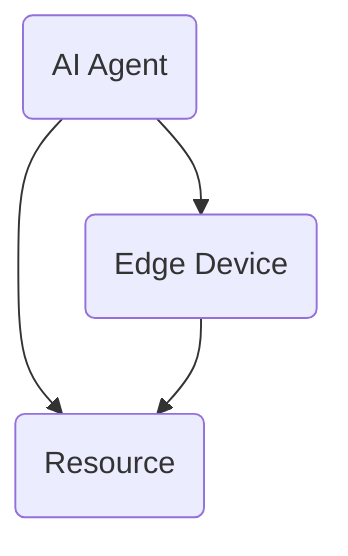
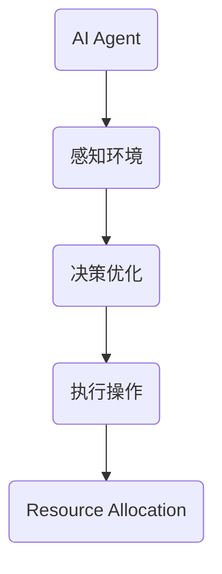
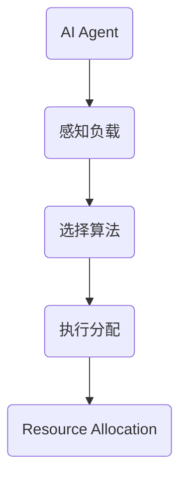
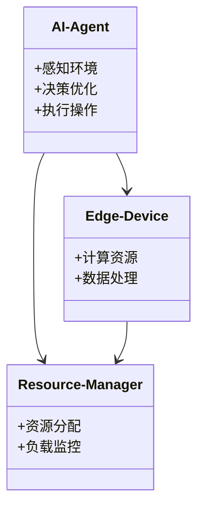
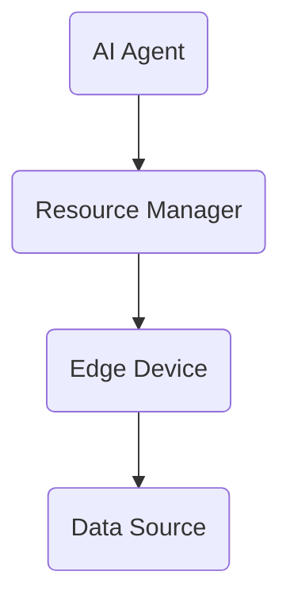
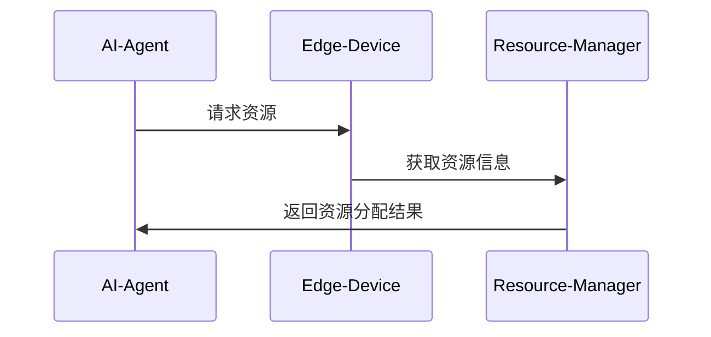

                 


# 企业AI Agent的边缘计算资源优化配置

> 关键词：企业AI Agent，边缘计算，资源优化，分布式算法，负载均衡，系统架构设计

> 摘要：本文详细探讨了企业AI Agent在边缘计算环境中的资源优化配置问题。通过分析AI Agent与边缘计算的核心概念，阐述了资源优化配置的算法原理，结合实际应用场景，提出了系统架构设计方案。最后，通过项目实战和最佳实践，为读者提供了全面的解决方案和实施建议。

---

## 第一部分：企业AI Agent与边缘计算基础

### 第1章：企业AI Agent与边缘计算概述

#### 1.1 企业AI Agent的概念与特点

企业AI Agent是一种能够自主感知环境、执行任务并优化决策的智能代理。它具备以下特点：
- **自主性**：无需外部干预，自主完成任务。
- **反应性**：能够实时感知环境变化并做出反应。
- **学习能力**：通过数据和经验优化决策模型。

**边缘计算**是一种分布式计算范式，数据在靠近数据源的边缘设备上进行处理，减少了对云端的依赖，提高了实时性和响应速度。

#### 1.2 企业AI Agent在边缘计算中的应用背景

边缘计算的发展趋势使得企业AI Agent的应用场景日益广泛，尤其是在物联网、智能制造等领域。企业AI Agent在边缘计算中的作用主要体现在：
- **资源优化**：通过智能分配计算资源，提高系统效率。
- **实时决策**：在边缘设备上快速做出决策，减少延迟。

当前企业资源优化配置面临的主要挑战包括资源分配不均、计算能力不足、网络带宽限制等。

#### 1.3 本章小结

本章介绍了企业AI Agent和边缘计算的基本概念，分析了AI Agent在边缘计算中的应用背景及其重要性。

---

## 第二部分：AI Agent与边缘计算的核心概念与联系

### 第2章：AI Agent与边缘计算的核心概念

#### 2.1 AI Agent与边缘计算的关系

AI Agent在边缘计算中的角色是优化资源分配和任务执行。边缘计算对AI Agent的需求主要体现在：
- **分布式计算能力**：AI Agent能够协调多个边缘设备的计算资源。
- **实时性要求**：AI Agent需要快速响应边缘设备的请求。

#### 2.2 核心概念对比分析

以下是AI Agent与传统计算代理、边缘计算与云计算的对比表格：

| **对比维度** | **AI Agent** | **传统计算代理** | **边缘计算** | **云计算** |
|--------------|--------------|------------------|--------------|-----------|
| 计算位置     | 边缘设备     | 中央服务器       | 边缘设备     | 云端      |
| 响应时间     | 实时         | 延迟较高          | 实时         | 延迟较高   |
| 资源分配     | 分布式       | 集中式           | 分布式       | 集中式    |
| 数据处理     | 边缘处理     | 中央处理         | 边缘处理     | 中央处理  |

#### 2.3 实体关系图（ER图）与Mermaid流程图

以下是AI Agent与边缘计算实体关系图：



以下是AI Agent资源优化流程图：



---

## 第三部分：AI Agent资源优化配置的算法原理

### 第3章：资源优化配置算法原理

#### 3.1 分布式资源分配算法

**分布式算法**是一种在分布式系统中协调资源分配的算法。以下是负载均衡算法的实现步骤：



以下是负载均衡算法的Python代码示例：

```python
def load_balancing_agents(agents, tasks):
    # 计算每个agent的负载
    load = [sum(task.request for task in agent.tasks) for agent in agents]
    # 找到负载最小的agent
    min_load = min(load)
    min_agents = [agent for agent, l in zip(agents, load) if l == min_load]
    # 将任务分配给负载最小的agent
    return min_agents[0]
```

#### 3.2 资源分配数学模型

资源分配优化的目标是最小化系统延迟，数学表达式如下：

$$
\min \sum_{i=1}^{n} d_i
$$

其中，$d_i$ 表示第i个任务的延迟。约束条件包括：

$$
\sum_{i=1}^{n} x_i \leq C
$$

其中，$x_i$ 表示分配给第i个任务的资源，$C$ 是总可用资源。

---

## 第四部分：系统分析与架构设计方案

### 第4章：系统分析与架构设计

#### 4.1 应用场景介绍

企业AI Agent在边缘计算中的应用场景包括智能制造、智能物流等。以智能制造为例，AI Agent需要协调多个边缘设备的资源，优化生产流程。

#### 4.2 系统功能设计

以下是系统功能设计的领域模型：



#### 4.3 系统架构设计

以下是系统架构设计的mermaid图：



#### 4.4 接口设计与交互流程图

以下是系统交互流程图：



---

## 第五部分：项目实战

### 第5章：项目实战

#### 5.1 环境安装

以下是项目实战所需的环境安装步骤：

1. 安装Python和依赖库：
   ```bash
   pip install mermaid
   pip install matplotlib
   ```

2. 安装边缘计算框架：
   ```bash
   pip install edge-compute
   ```

#### 5.2 系统核心实现源代码

以下是AI Agent资源优化的核心代码：

```python
import numpy as np

class AI-Agent:
    def __init__(self, devices):
        self.devices = devices

    def perceive_environment(self):
        return [device.load for device in self.devices]

    def optimize_resources(self, tasks):
        loads = self.perceive_environment()
        # 使用负载均衡算法分配任务
        return load_balancing_agents(self.devices, tasks)

    def execute_operation(self, device, task):
        device.process_task(task)
```

#### 5.3 代码应用解读与分析

上述代码实现了一个AI Agent，能够感知环境、优化资源分配并执行操作。通过`perceive_environment`方法获取设备负载，使用`optimize_resources`方法分配任务，最后通过`execute_operation`方法执行任务。

#### 5.4 实际案例分析

以智能制造为例，AI Agent需要协调多个边缘设备的资源，优化生产流程。通过上述算法和代码，可以实现资源的最优分配，提高生产效率。

#### 5.5 项目小结

本章通过实际案例分析和代码实现，展示了企业AI Agent在边缘计算中的应用。

---

## 第六部分：最佳实践

### 第6章：总结与展望

#### 6.1 总结

本文详细探讨了企业AI Agent在边缘计算中的资源优化配置问题，提出了分布式算法和系统架构设计方案，为实际应用提供了参考。

#### 6.2 注意事项

在实际应用中，需要注意以下几点：
- 确保网络通信的稳定性。
- 定期更新AI Agent的决策模型。
- 监控系统的运行状态。

#### 6.3 未来展望

未来，随着边缘计算的发展，企业AI Agent将在更多领域发挥重要作用。研究方向包括更高效的算法、更智能的决策模型等。

#### 6.4 拓展阅读

推荐以下书籍和资源：
- 《分布式系统：原理与设计》
- 《边缘计算入门指南》
- 《AI Agent算法实现》

---

## 作者

作者：AI天才研究院/AI Genius Institute & 禅与计算机程序设计艺术 /Zen And The Art of Computer Programming

---

**注**：以上内容为详细的技术博客文章大纲，具体内容需要根据实际需求进一步扩展和细化。

